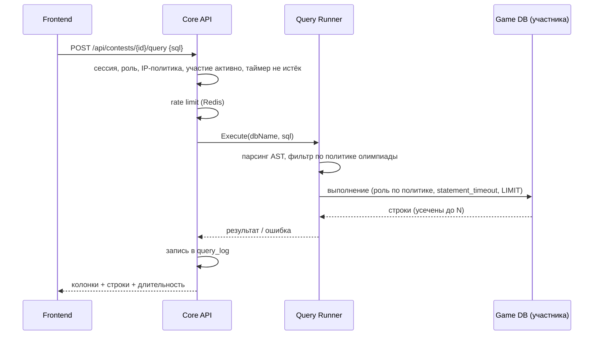
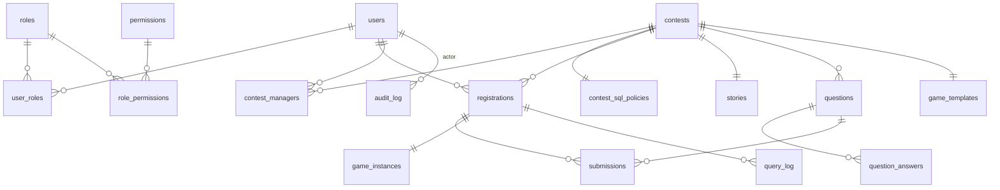

# DB Contest — архитектурный план

Платформа для проведения университетских SQL-олимпиад формата «Детектив»: студенты получают историю преступления и доступ к игровой базе данных, пишут SQL-запросы через веб-интерфейс, отвечают на вопросы и находят преступника.

Документ — основа для имплементации. Все ключевые решения зафиксированы с альтернативами и обоснованием.


## 1. Архитектурный стиль

### Рассмотренные варианты

| Вариант | Плюсы | Минусы |
|---|---|---|
| **Классический монолит** | Просто деплоить и отлаживать | Выполнение студенческих SQL внутри того же процесса — риск: тяжёлый запрос или уязвимость влияет на всё приложение |
| **Микросервисы** (auth, contest, query, reporting…) | Независимое масштабирование | Для университетской системы (сотни участников, одна команда разработки) — избыточная операционная сложность: service discovery, распределённые транзакции, версионирование API |
| **Serverless** | Нулевая инфраструктура в простое | Система локальная (on-premise), долгоживущие SQL-сессии и провижининг БД плохо ложатся на FaaS |

### Решение: модульный монолит + выделенный Query Runner

Основной бэкенд — **один Go-процесс с жёсткими модульными границами** (auth, contests, submissions, reporting, audit). Единственный компонент, вынесенный в **отдельный сервис** — **Query Runner**, который выполняет студенческие SQL-запросы.

Почему именно так:

1. **Изоляция отказов там, где она реально нужна.** Единственный источник непредсказуемой нагрузки — студенческий SQL. Вынос Query Runner в отдельный процесс означает, что даже при его деградации (OOM, зависшие соединения) авторизация, таймер и приём ответов продолжают работать.

   Точнее, чем «деградация»: Runner линкует **настоящий парсер PostgreSQL через cgo**, чтобы проверить запрос до выполнения. Это код на C, разбирающий текст, который выбирает атакующий, — а падение там не паника Go, которую ловит `recover`, а конец процесса. Внутри Core API подобранный запрос стал бы **воспроизводимым способом уронить вход, таймер и приём ответов**; и ломать консоль — это буквально содержание олимпиады. Вероятность низкая, последствие полное, ввод состязательный по построению.

   Сюда же — **сборка**. Остальные бинари собираются с `CGO_ENABLED=0` и живут на `distroless/static`, без libc вообще. Runner требует cgo и libc в рантайме. Будь он частью бинаря Core API, cgo, компилятор в сборке и libc в рантайме достались бы заодно API, миграциям и bootstrap — расширение поверхности атаки всех троих ради одного компонента. Поэтому у Runner'а свой образ (`db-contest-queryrunner`) на `distroless/base`.

2. **Учётные данные игрового кластера держит только он.** В одном процессе с Core API любая ошибка в любом обработчике API оказывалась бы в досягаемости от баз участников. Конфигурация разделена так, что структура настроек Core API физически не может назвать игровой кластер.
3. **Масштабирование по месту** — довод настоящий, но в вашем масштабе почти не работает: на одной on-premise машине с сотнями участников никто это реплицировать не будет. Он остаётся как «не мешать в будущем», а не как обоснование.
3. **Минимальная операционная цена.** Два сервиса вместо десяти — деплой остаётся простым (Docker Compose), но граница безопасности проведена там, где нужно.
4. **Путь к росту.** Модульные границы внутри монолита позволяют позже вынести reporting или provisioning в отдельные сервисы без переписывания.


## 2. Компоненты системы и их взаимодействие


### 2.1 Frontend (Next.js)

Одно приложение, два раздела с разграничением по ролям:

- **Студенческий UI**: список доступных олимпиад с кнопкой «Участвовать» для открытых (раздел 7.1), страница олимпиады (история преступления, таймер, вопросы), SQL-консоль (редактор с подсветкой, таблица результатов, история запросов), профиль с прогрессом и результатами.
- **Админский UI**: управление пользователями и ролями (только админ системы), конструктор олимпиад (история, вопросы, эталонные ответы, загрузка игровой схемы, тип записи и IP-ограничения — раздел 7.1), управление участниками (добавление поштучно и импортом CSV для `invite_only`), настройка политики SQL-доступа олимпиады, назначение менеджеров олимпиады, мониторинг хода олимпиады в реальном времени и наблюдение за каждым участником — что он делал, вживую и после (раздел 9.4), панель журнала запросов с live-режимом и экспортом (раздел 9.1), отчёты. Видимость разделов определяется ролью: админ системы видит всё, owner/manager олимпиады — только свои олимпиады (раздел 7).

**SQL-консоль подробнее.** Ключевой инвариант: всё, что студент делает в консоли, — это либо чтение кеша, либо запрос через единый конвейер queryproxy → Query Runner (разделы 4.3, 5). Привилегированных «обходных» путей к БД у UI нет, поэтому никакая кнопка интерфейса не может нагрузить кластер сильнее, чем разрешает admission control, и не влияет на других участников.

- **Результат запроса** — таблица с именами и типами колонок, явным отображением `NULL`, счётчиком строк и временем выполнения; при усечении — баннер «показаны первые 1000 строк, уточните запрос». Ошибка СУБД показывается с привязкой к месту в тексте (PostgreSQL возвращает позицию ошибки — редактор подсвечивает её), отклонение валидатором — человекочитаемой причиной («функция X не поддерживается»). Полученный результат можно скачать в CSV — из уже переданных строк, без повторного похода в БД.
- **История запросов** — собственные запросы участника (из `query_log`) со статусами и временем; клик восстанавливает запрос в редакторе. Это же «сохранённые наработки»: вернуться к удачному запросу после серии неудачных.
- **Заметки и вкладки редактора** — рабочее место участника, хранящееся на сервере и переживающее перезагрузку и смену компьютера; подробности и пределы — раздел 6.4. Оно не личное: организатор олимпиады видит его вместе с историей правок, и экран говорит об этом участнику (раздел 9.4).
- **Обзор схемы («полазить по базе»)** — постоянная левая панель консоли: дерево таблиц и колонок с типами и FK-связями плюс автогенерируемая ER-диаграмма игровой схемы. Источник — **кешированное описание схемы**, построенное один раз при сборке шаблона: клики по дереву не создают ни одного запроса к инстансам и не тратят rate limit студента. Кнопка «посмотреть данные» у таблицы — обычный сгенерированный `SELECT * FROM t LIMIT 50`, который идёт через общий конвейер на общих правах и лимитах (и виден в query_log, как любой запрос).

Рендеринг: App Router; публичные страницы — SSR, игровая консоль — клиентский компонент. Все запросы к данным идут в Core API; у Next.js нет прямого доступа к БД.

### 2.2 Core API (Go, модульный монолит)

| Модуль | Ответственность |
|---|---|
| `auth` | Логин/пароль, сессии, RBAC-middleware |
| `users` | Профили, управление пользователями (админ) |
| `contests` | CRUD олимпиад, историй, вопросов, эталонных ответов; политика SQL-доступа олимпиады; назначение менеджеров олимпиады; жизненный цикл (draft → published → running → finished); таймер |
| `registrations` | Запись участников (самозапись для `open`, добавление менеджером для `invite_only`), старт/финиш участия |
| `submissions` | Приём ответов, автоматическая проверка, подсчёт баллов |
| `provisioner` | Создание/удаление игровых БД участников из шаблона: очередь с воркерами + резервный пул (раздел 4.2) |
| `queryproxy` | Тонкий фасад: принимает SQL от фронтенда, применяет rate limit, передаёт в Query Runner, пишет query log |
| `reporting` | Статистика, лидерборды, экспорт |
| `audit` | Append-only журнал действий |
| `monitor` | Наблюдение за участником: сигналы браузера и сервера, история заметок и вкладок, отпечаток запроса; чтение для организатора — таблица участников с отметками, общая лента, запросы, ответы, рабочее место, CSV (раздел 9.4) |

Модули общаются только через Go-интерфейсы (никаких прямых обращений к чужим таблицам) — это и есть «швы» для будущего разрезания на сервисы.

### 2.3 Query Runner (Go, отдельный сервис)

Stateless-сервис с единственной задачей: безопасно выполнить один SQL-запрос студента в его игровой БД и вернуть результат. Подробности в разделе 5. Общение с Core API — по gRPC внутри приватной сети; из внешней сети недоступен.

### 2.4 Потоки данных (ключевые сценарии)

**Выполнение SQL-запроса студентом:**



**Старт олимпиады для участника:** запись на олимпиаду → provisioner ставит создание БД `game_c{contest}_u{user}` в очередь (или мгновенно привязывает копию из резервного пула — раздел 4.2) → статус в `game_instances` = `ready` → в момент старта студенту открывается консоль. После финиша + грейс-период БД удаляются.

## 3. Технологический стек

| Слой | Выбор | Обоснование |
|---|---|---|
| Backend | **Go 1.23+**, роутер **chi**, **pgx/v5** + **sqlc** | Требование ТЗ; chi — минималистичный и совместим со stdlib; sqlc даёт типобезопасный SQL без ORM-магии |
| Парсинг студенческого SQL | **pg_query_go** (обёртка над парсером PostgreSQL) | Валидация по настоящему AST, а не по regex — regex-фильтры SQL обходятся |
| RPC между сервисами | **gRPC** | Строгий контракт Core API ↔ Query Runner. Решение пересматривалось: HTTP+JSON дал бы меньше механики (обвязка `platform/httpx` и контракт кодов ошибок уже есть), и оно держится на одном — на возможности однажды отдавать результат потоком. Пока результат ≤1000 строк и ≤5 МБ, это единственный аргумент, и его стоит помнить как условие, а не как данность |
| Frontend | **Next.js 15** (App Router, TypeScript), **TanStack Query**, **CodeMirror 6** (SQL-редактор), **Tailwind CSS** | Требование ТЗ; CodeMirror — лёгкий редактор с подсветкой SQL |
| Основная БД | **PostgreSQL 16** | Реляционная модель идеальна для сущностей системы; один движок для core и game упрощает эксплуатацию |
| Игровой кластер | **Отдельный инстанс PostgreSQL 16** | Физическая изоляция от core. PgBouncer убран осознанно: его пулы привязаны к паре «БД + роль», а БД у каждого участника своя — мультиплексирования не получилось бы. Соединениями управляет Query Runner (раздел 4.3) |
| Кеш / сессии / rate limit | **Redis 7** (опционально) | Сессии, окна rate limit, кеш таймера, лидерборд. За интерфейсом `Cache`: без Redis работает встроенное хранилище в памяти — см. раздел 3.1 |
| Миграции | **golang-migrate** | Версионируемые SQL-миграции core-БД |
| Логи | **slog** (JSON) → stdout → **Promtail → Loki** | Стандартная библиотека, структурные логи; Loki дешевле ELK и достаточен |
| Метрики | **Prometheus + Grafana** (опционально) | Дашборды нагрузки и алерты. За интерфейсом `Recorder`: бэкенд переключается на лог-дайджест или отключается — см. раздел 3.1 |
| Деплой | **Docker Compose** (on-premise) | Система локальная; путь миграции в k8s описан в разделе 10 |

Пароли — **argon2id**. Аутентификация — **серверные сессии** (httpOnly cookie + Redis), не JWT: сессию можно мгновенно отозвать (дисквалификация участника, компрометация), нет проблемы «живого» токена.

## 3.1 Обязательные и опциональные зависимости

Не все зависимости равноценны, и система различает их явно: одна её часть без внешнего компонента бессмысленна, другая — просто работает хуже. Каждая опциональная зависимость спрятана за интерфейсом, у каждой есть встроенная замена, и выбор замены — всегда громкий, никогда молчаливый.

| Зависимость | Класс | Без неё | Поведение при старте |
|---|---|---|---|
| **PostgreSQL (core)** | обязательная | нет пользователей, олимпиад и ответов — сервису нечего обслуживать | отказ с внятной ошибкой |
| **PostgreSQL (игровой кластер)** | обязательная для игры | нельзя выполнять студенческий SQL | админка и отчёты работают, консоль недоступна |
| **Redis** | опциональная | сессии, rate limit и кеш уходят в память процесса | старт с предупреждением |
| **Prometheus** | опциональная | метрики уходят в лог-поток или выключаются | старт по настройке `METRICS_BACKEND` |
| **Loki / Grafana** | опциональная | логи остаются в stdout контейнера | никак не влияет на сервис |

### Кеш: Redis или память

`Cache` — интерфейс (`Get`/`Set`/`Delete`/`Incr`/`Ping`) с двумя реализациями. Пустой `REDIS_ADDR` выбирает **встроенное хранилище в памяти**: LRU с ограничением по числу записей и TTL на каждую запись. Ограничение по размеру обязательно — ключи строятся из пользовательского ввода (идентификаторы сессий, субъекты rate limit), и неограниченная карта была бы способом расти до убийства процесса.

Замена **не эквивалентна**, и разница не косметическая: память не разделяется между репликами (сессии и лимиты разъезжаются по инстансам) и теряется при рестарте. Поэтому:

- режим годится **только для одного инстанса** — это записано в предупреждении при старте, в `.env.example` и в README;
- активный режим отдаётся в `/readyz` полем `cache`, чтобы деградация была видна снаружи, а не только в логе первых секунд;
- если `REDIS_ADDR` **задан**, но сервер не отвечает — это **ошибка старта**, а не повод подставить память. Оператор указал конкретный адрес; тихо использовать другое хранилище значило бы скрыть сломанный деплой и — при нескольких репликах — незаметно сломать общие сессии.

Контракт для вызывающего кода: ошибка `Get` — это промах для read-through кеша, но **fail closed** для всего, что касается безопасности: нечитаемая сессия означает «не аутентифицирован», а не «аутентифицирован».

### Метрики: сменный бэкенд

Prometheus не может «упасть» для приложения — он сам ходит за `/metrics`. Задача другая: не делать его обязательной зависимостью. `Recorder` — интерфейс с одним методом наблюдения и тремя реализациями, выбираемыми через `METRICS_BACKEND`:

| Значение | Поведение |
|---|---|
| `prometheus` (по умолчанию) | приватный registry + эндпоинт `/metrics` на внутреннем порту |
| `log` | агрегация в памяти и периодический дайджест в лог-поток (счётчики, среднее и максимум по `метод + маршрут + статус`) |
| `none` | наблюдения отбрасываются |

Два следствия зафиксированы в коде тестами: инструментирование **одинаково** для всех бэкендов (смена бэкенда меняет только адресата, но не то, что измеряется), и `/metrics` регистрируется **только** если бэкенд его отдаёт — пустая страница сказала бы скраперу, что сервис инструментирован, тогда как его числа лежат в другом месте. Неизвестное значение `METRICS_BACKEND` — ошибка старта: опечатка должна ловиться при загрузке, а не обнаруживаться после олимпиады как «мы ничего не записали».

Общий принцип: **метрики — диагностика**. Ни одна ветка их кода не имеет права влиять на обслуживание запроса.

## 3.2 Смена СУБД: где проходит шов

Честная оценка, а не декларация переносимости.

**Игровой кластер сменить нельзя, и это осознанно.** На PostgreSQL завязана суть продукта: `CREATE DATABASE … TEMPLATE` для провижининга, парсер `pg_query_go` для AST-валидации студенческого SQL, роли с `statement_timeout`, `temp_file_limit` и `CONNECTION LIMIT` на базу, поведение `EXPLAIN`. Сам предмет олимпиады — «студенты пишут SQL к PostgreSQL». Абстракция здесь дала бы иллюзию выбора и стоила бы дорого.

**Core-БД сменить можно, и шов проведён на уровне репозиториев, а не драйвера.** Абстрагировать `Query`/`Exec` бессмысленно: такая обёртка протекает типами драйвера и не даёт переносимости. Вместо этого каждый доменный модуль объявляет интерфейс, который ему нужен, в своих терминах:

```go
// Интерфейс объявляет потребитель, а не реализация (идиома Go).
type ContestRepository interface {
    ByID(ctx context.Context, id uuid.UUID) (Contest, error)
    Save(ctx context.Context, c Contest) error
}
```

Реализация живёт в отдельном пакете (`postgres`), SQL не покидает его, а handlers и бизнес-логика знают только интерфейс. Смена СУБД — это новый пакет-реализация, без единой правки в доменном коде. Побочная выгода важнее гипотетической миграции: бизнес-логика тестируется без базы вообще.

**Транзакции — часть того же шва.** Архитектура требует атомарности разнородных записей (принятый ответ обновляет счёт и добавляет запись аудита — либо всё, либо ничего). Для этого есть `UnitOfWork`:

```go
type UnitOfWork interface {
    Do(ctx context.Context, fn func(ctx context.Context) error) error
}
```

Транзакция передаётся через контекст, а репозитории берут её оттуда (`storage.QuerierFrom(ctx, pool)`) — поэтому один и тот же метод репозитория работает и сам по себе, и внутри чужой транзакции, а handler'ы вообще не держат объект транзакции. Вложенный вызов присоединяется к внешней транзакции, а не открывает вторую: независимых вложенных транзакций в PostgreSQL нет, и молча открыть новую значило бы сломать ту атомарность, ради которой вызывающий код и обернул работу.

## 4. Изоляция игровых баз данных

Ключевое требование ТЗ (п. 5): каждый участник работает со **своей копией** игровой БД и не может положить систему.

### Варианты

| Вариант | Плюсы | Минусы |
|---|---|---|
| **A. Одна общая игровая БД на всех** | Дёшево | Один тяжёлый запрос деградирует всех; нет изоляции |
| **B. Схема на участника** (search_path) | Легковесно, тысячи схем в одной БД | Изоляция логическая: ошибка в правах — и участник видит чужую схему; общие shared_buffers |
| **C. БД на участника в общем игровом кластере** ✅ | Жёсткая граница видимости (нельзя сделать cross-database запрос), быстрый провижининг из шаблона, простое удаление | Больше накладных расходов, чем у схем — приемлемо до ~1–2 тыс. участников |
| **D. Контейнер PostgreSQL на участника** | Максимальная изоляция (CPU/RAM-квоты) | Тяжело: сотни контейнеров, оркестрация; не оправдано при нагрузке, управляемой admission control (раздел 4.3) |

### Решение: вариант C

- Админ загружает игровую схему как SQL-скрипт (DDL + данные) → provisioner создаёт **БД-шаблон** `game_tpl_c{contest}` и валидирует её.
- Инстанс участника создаётся командой `CREATE DATABASE game_c{id}_u{id} TEMPLATE game_tpl_c{id}`. У операции есть жёсткие ограничения (к шаблону в момент копирования не должно быть подключений; массовое создание сотен БД упирается в диск и WAL), поэтому базы **никогда не создаются «всем потоком в момент старта»** — только заранее, через очередь с резервным пулом (раздел 4.2).
- Доступ к игровым БД имеет **только Query Runner**, под одной из двух ролей — какая используется, определяет политика SQL-доступа олимпиады (раздел 4.1):

```sql
-- Базовая роль: только чтение (режим по умолчанию)
CREATE ROLE game_reader LOGIN CONNECTION LIMIT 60;
ALTER ROLE game_reader SET default_transaction_read_only = on;
ALTER ROLE game_reader SET statement_timeout = '5s';
ALTER ROLE game_reader SET idle_in_transaction_session_timeout = '5s';
ALTER ROLE game_reader SET work_mem = '16MB';
ALTER ROLE game_reader SET temp_file_limit = '64MB';
GRANT SELECT ON ALL TABLES IN SCHEMA public TO game_reader; -- в шаблоне

-- Расширенная роль: для олимпиад с записью / CREATE VIEW
CREATE ROLE game_writer LOGIN CONNECTION LIMIT 60;
ALTER ROLE game_writer SET statement_timeout = '5s';
ALTER ROLE game_writer SET idle_in_transaction_session_timeout = '5s';
ALTER ROLE game_writer SET work_mem = '16MB';
ALTER ROLE game_writer SET temp_file_limit = '64MB';
-- Точечные GRANT'ы выдаются при сборке шаблона по политике олимпиады:
--   GRANT INSERT, UPDATE, DELETE ON <разрешённые таблицы> TO game_writer;
--   GRANT CREATE ON SCHEMA work TO game_writer;  -- для VIEW и своих таблиц

-- CONNECTION LIMIT ролей — последний рубеж: реальное ограничение
-- одновременных выполнений — семафор Query Runner (раздел 4.3).
-- Дополнительно на каждом инстансе: ALTER DATABASE <db> CONNECTION LIMIT 2;
-- в шаблоне отозваны чувствительные каталоги (раздел 5):
--   REVOKE SELECT ON pg_catalog.pg_database, pg_catalog.pg_stat_activity,
--                   pg_catalog.pg_roles, pg_catalog.pg_settings FROM PUBLIC;
```

**Что из перечисленного является границей, а что — умолчанием.** Проверено на живом кластере, а не выведено из документации, потому что разница не видна в самом SQL:

| Механизм | Держит против SQL, который прошёл мимо валидатора? |
|---|---|
| Привилегии (`GRANT`/их отсутствие) | **Да.** Роль без `INSERT` не вставит; сессия на это повлиять не может. Именно это останавливает **любую** запись |
| `REVOKE` чувствительных каталогов | **Да.** И наследуется при `CREATE DATABASE … TEMPLATE` — иначе бы не доехало до участника вовсе |
| `temp_file_limit` | **Да.** Параметр не `USERSET`, сессия его поднять не может |
| `statement_timeout` | **Нет.** `USERSET` — `SET statement_timeout = 0` снимает его одной строкой |
| `default_transaction_read_only` | **Нет.** `USERSET` — снимается так же |

Отсюда важное уточнение: `default_transaction_read_only` — не то, что запрещает запись. Запись запрещают отсутствующие `GRANT`'ы; настройка лишь даёт понятную ошибку раньше. А время выполнения против необработанного SQL ограничивает **не** роль, а собственный дедлайн Query Runner'а с отменой запроса — до него SQL не дотягивается (раздел 4.3). Настройки роли остаются: они ограничивают обычный случай, то есть все запросы, если что-то другое ещё не сломалось.

- Игровой кластер — **отдельный PostgreSQL-инстанс** (отдельный контейнер/хост с собственными лимитами памяти). Даже полная деградация игрового кластера не затрагивает core-БД: авторизация, ответы и таймер живут.
- Студент **никогда не получает прямого сетевого доступа к БД** — только через интерфейс (SQL-консоль → Core API → Query Runner). Порт игрового кластера не публикуется наружу.

### 4.1 Политика SQL-доступа олимпиады

Не все олимпиады одинаковы: базовый «Детектив» — чистое чтение, но продвинутый сценарий может требовать от студента вести собственные заметки в таблице, помечать улики или строить `VIEW` для промежуточных выводов. Уровень доступа — **настройка олимпиады**, которую задаёт админ системы или менеджер олимпиады через админский UI (форма, не сырой SQL):

| Параметр политики | Значения | По умолчанию |
|---|---|---|
| `mode` | `read_only` \| `read_write` | `read_only` |
| `writable_tables` | список таблиц игровой схемы, куда разрешён INSERT/UPDATE/DELETE | пусто |
| `allow_create_view` | студент может создавать/удалять **свои** VIEW | `false` |
| `allow_own_tables` | студент может создавать **свои** таблицы (для заметок/расчётов) | `false` |
| `allow_temp_tables` | разрешены временные таблицы | `false` |

Как это работает:

- **Игровые данные и студенческие объекты разделены схемами.** Данные олимпиады живут в схеме `public` (или `game`); для студенческих объектов при сборке шаблона создаётся пустая схема **`work`** — только на неё `game_writer` получает право `CREATE`. VIEW и собственные таблицы студента создаются в `work`, шаблонные таблицы он изменить структурно не может (никаких `ALTER`/`DROP` на `public` — прав нет). Запись в игровые таблицы — только точечные `GRANT INSERT/UPDATE/DELETE` на таблицы из `writable_tables`.
- **Политика применяется дважды** (эшелонирование, как и везде): Query Runner фильтрует statements по AST согласно политике (раздел 5), а GRANT'ы в шаблоне гарантируют то же самое на уровне СУБД, даже если валидатор ошибётся.
- **Изоляция делает запись безопасной.** Поскольку у каждого участника своя БД, его INSERT/UPDATE/DELETE и VIEW видны только ему — целостность чужих игровых данных не затрагивается по построению.
- **Кнопка «Сбросить мою базу».** В режимах с записью студент может испортить себе данные — в UI доступен сброс: provisioner пересоздаёт его инстанс из шаблона (секунды), факт сброса пишется в аудит и query_log. Сброс и удаление выполняются через `DROP DATABASE … WITH (FORCE)` (PostgreSQL 13+): активные сессии терминируются автоматически, зависшее выполнение не заблокирует пересоздание.
- **Дисковые квоты.** Запись открывает вектор DoS «залить диск». Три уровня: (1) перед каждым DML Query Runner синхронно проверяет размер инстанса по кешу, обновляемому после каждого DML, — при превышении квоты (например, 5× размера шаблона, настраивается в политике) запрос не допускается; (2) фоновый монитор `pg_database_size()` как страховка переводит перелимиченный инстанс в read-only (`ALTER DATABASE … SET default_transaction_read_only = on`) с понятным сообщением студенту. Гонку внутри **одного** statement (`INSERT … SELECT`, успевающий превысить квоту до следующей проверки) полностью убрать нельзя — но перелёт ограничен объёмом, записываемым за `statement_timeout` (5 с), и (3) диск кластера планируется с запасом на этот worst case × число одновременных DML (ограничено семафором 4.3). `temp_file_limit` дополнительно ограничивает временные файлы.
- **Смена политики после публикации** запрещена при `running` (иначе участники в неравных условиях); до старта — можно, изменение попадает в audit_log и требует пересборки шаблона (GRANT'ы).

### 4.2 Провижининг без пиков

`CREATE DATABASE … TEMPLATE` — не бесплатная операция, и провижининг спроектирован так, чтобы она никогда не выполнялась массово в критический момент:

- **Очередь с ограниченной параллельностью.** Все создания идут через очередь provisioner'а (2–4 воркера): база создаётся при регистрации/добавлении участника и размазывается по времени до старта, а не залпом в момент старта. Глубина очереди — метрика с алертом (раздел 9).
- **Резервный пул.** Для каждой опубликованной олимпиады provisioner заранее держит K запасных копий (`game_pool_c{id}_NNN`). K — не число из конфига, а ответ ростера: все, у кого копии ещё нет, плюс запас `GAME_POOL_DEPTH` на тех, кто запишется следующим (`provisioning.Service.RosterDepth`). Урезается двумя разными ограничениями. `GAME_POOL_MAX` — сколько копий вправе запросить одна олимпиада; само по себе это не ограничение диска, потому что 500 копий — это 10 ГиБ при шаблоне в 20 МиБ и терабайт при шаблоне в 2 ГиБ. `GAME_CLUSTER_MAX_BYTES` — сколько байт вправе занимать весь кластер вместе: провижнер спрашивает `DatabaseSize` шаблона (сколько стоит одна копия) и `ClusterBytes` (сколько уже занято) и выдаёт ровно столько копий, сколько влезает. Бюджет общий на кластер, а не на олимпиаду: пер-олимпиадная квота, умноженная на число живых олимпиад, диск не ограничивает. Когда любое из двух сработало, тик пишет предупреждение с обеими цифрами — пул, тихо переставший расти, хуже пула, который сказал почему. Привязка копии к участнику — запись имени в `game_instances`, мгновенная операция. Пул пополняется фоном: обычный тик — раз в минуту для опубликованных и идущих олимпиад (для остальных чаще не нужно — записи на них не идёт), а регистрация участника, импорт списка и переход олимпиады в `running` вдобавок **сразу же будят** тендер, а не ждут минуту вслепую — будильник (`provisioning.Tender`) схлопывает любое число будильников, поданных до того, как тендер успел прочитать канал, в один внеочередной проход: неважно, сколько заявок пришло разом, тик всё равно один и обходит все живые олимпиады, а не только ту, что его разбудила. Разбудить может только уже закоммиченное изменение — заявка, откаченная вместе со своей транзакцией, тендер не поднимает.
- **Поздняя запись (open-олимпиады).** Записавшийся перед самым стартом получает базу из пула; если пул исчерпан — статус «готовим вашу базу», консоль открывается по SSE-событию готовности (обычно десятки секунд). Опционально — дедлайн записи (например, за 10 минут до старта). `GAME_CLUSTER_MAX_BYTES` действует и здесь, а не только в фоновом тендере: `provisioning.Service.Ensure` считает ту же арифметику (`roomForOneCopy`) перед `CREATE DATABASE` и отказывает сентинелом `ErrClusterFull` — на клиенте это `503 game_cluster_full`. Без этой проверки бюджет ограничивал только пул: при шаблоне в 3 ГБ и дефолтных 64 ГиБ пул честно останавливался копий на двадцати, а все остальные участники создавали копии мимо бюджета, пока не кончалась файловая система хоста — и тогда PostgreSQL вставал у всех, а не у опоздавших. Пересборка уже существующей копии под тем же именем бюджетом не ограничивается: `CreateInstance` сначала дропает старую, кластер не растёт.
- **Размер шаблона читается раз на версию.** Квота участника — кратное размеру шаблона (`Service.Quota`), и раньше каждый запрос участника стоил `SELECT pg_database_size(...)` по десятиконнектному обслуживающему пулу, который в этот же момент минутами держат `CREATE DATABASE … TEMPLATE` и уборщик. Шаблон неизменен, пока его не пересобрали, а пересборка поднимает версию — значит версия и есть правило инвалидации (`provisioning.templateSizes`).
- **Инвалидация при пересборке шаблона.** Любая пересборка (новая игровая схема, смена SQL-политики до старта) инкрементирует `game_templates.version`. Provisioner после этого дропает **все свободные копии пула и все уже созданные инстансы** со старой версией и пересоздаёт их через очередь — участник не может получить БД со старыми GRANT'ами или данными. `game_instances.template_version` делает рассинхрон обнаружимым; проверка «все инстансы на актуальной версии» — обязательное условие перехода олимпиады в `running`.
- **Дисциплина шаблона.** На время `CREATE DATABASE` к шаблону не должно быть подключений: роль-строитель отключается сразу после сборки, «предпросмотр» игровой схемы админом выполняется на отдельной копии, не на шаблоне.
- **Стратегия копирования** (PostgreSQL 15+): `WAL_LOG` (по умолчанию; без чекпоинтов, но весь объём проходит через WAL) против `FILE_COPY` (быстрее для крупных шаблонов, но два чекпоинта на операцию). Выбор — конфигурация provisioner'а, по замеру на целевом размере шаблона в пилоте.
- **План Б.** Интерфейс provisioner'а не привязан к модели «БД на участника»: если пилот покажет, что провижининг — узкое место на целевых размерах, вариант B (схема на участника) подключается как альтернативная реализация за тем же Query Runner'ом — с осознанной потерей жёсткости изоляции.

### 4.3 Изоляция производительности (admission control)

Честная формулировка: вариант C полностью изолирует **видимость данных**, но CPU, диск и память инстанса — общие. `statement_timeout` ограничивает один запрос, но не совокупную нагрузку: 200 участников × тяжёлый запрос уронят инстанс и с таймаутом. Совокупной нагрузкой управляет **admission control в Query Runner**:

- **Дедлайн держит клиент, а не роль.** `statement_timeout` — параметр уровня `USERSET`: запрос, дошедший до БД без проверки, снимает его одной строкой. Поэтому Query Runner ведёт собственный дедлайн на контекст соединения и отменяет запрос сам; настройка роли остаётся вторым эшелоном для обычного случая. Это разница между «ограничено» и «ограничено тем, кого ограничивают».
- **1 одновременный запрос на участника** + **глобальный семафор** на N одновременных выполнений на инстанс (N — от числа ядер, порядка 2–3 × CPU). Сверх N — короткая FIFO-очередь; при её переполнении — мгновенный ответ «система занята, повторите через пару секунд», а не зависание.
- **Соединение после чтения держится до следующего запроса:** установка соединения (TCP, SCRAM-SHA-256, fork бэкенда) на тестовом кластере стоит ~5 мс CPU сервера — столько же, сколько типичный JOIN участника. Поэтому Query Runner держит не более одного простаивающего соединения на БД участника (`queryrunner` pool, `QUERY_CONN_IDLE_TIMEOUT`, по умолчанию 30 с) и сбрасывает сессию `DISCARD ALL` перед тем, как оставить его. Оставляется только соединение чтения, завершившегося без ошибки и без отмены; запись, ошибка, отмена и дедлайн закрывают соединение, как раньше. Все соединения Runner-а — занятые и простаивающие — укладываются в `QUERY_CONCURRENT`: на границе закрывается самое давно не использованное простаивающее, так что расчёт памяти кластера не меняется. Страховка на уровне СУБД: `CONNECTION LIMIT 2` на каждый инстанс-БД и общий лимит роли — оба срабатывают, только если семафор сломан.
- **Границы контейнера:** игровой кластер живёт в контейнере с cgroup-лимитами CPU/IO/памяти — даже полная деградация не выходит за выделенные ресурсы; core-БД на отдельном инстансе не затрагивается.
- **Память одного бэкенда ограничена отдельно от памяти контейнера.** Лимит контейнера (`GAME_DB_MEMORY_BYTES`) останавливает кластер целиком, если его превысить, — OOM killer заканчивает работу postmaster вместе со всеми участниками разом. Предел на процесс (`ulimits.data` в `docker-compose.yml`, значение берётся из `GAME_DB_PROCESS_MEMORY_BYTES`, по умолчанию 256 МиБ) переводит переполнение из общего краха в `ERROR: out of memory` внутри того самого бэкенда, который переполнился, — остальные сессии продолжают работать как ни в чём не бывало. Легитимная нагрузка (сборка индекса, `CREATE DATABASE … TEMPLATE`, `VACUUM`, параллельный запрос) остаётся далеко под пределом, измеренным с запасом. Параллельные воркеры делят между собой разделяемую память, на которую этот предел не действует, поэтому у роли участника они дополнительно ограничены числом (`max_parallel_workers_per_gather=1` в session defaults) — граница по памяти держит сам предел процесса, а не эта настройка.
- **Раннер откажется стартовать с арифметикой, которую кластер не выдержит.** `QUERY_CONCURRENT` (раздел выше) считает не только длину очереди, но и память: каждый одновременный запрос — лишний процесс у предела. Формула, которую раннер проверяет при старте: `(QUERY_CONCURRENT + воркеры параллельного запроса кластера + одновременные сборки шаблона) × предел_процесса + резерв ⩽ GAME_DB_MEMORY_BYTES`, где резерв покрывает `shared_buffers`, разделяемую память параллельных воркеров, сам postmaster и autovacuum. Деплой (`cmd/gamedb`) сверяет то же равенство ещё раз против настоящего кластера, а не только декларации в переменных: свежеподготовленный инстанс подтверждает собственный предел процесса (читая `/proc/self/limits` изнутри самого кластера), число воркеров и сборок, с которыми считалась арифметика, и лимит памяти контейнера — из его же cgroup, — и отказывается закончить подготовку кластера, если хоть одно из этого не совпадает с тем, что заявлено в переменных окружения.
- **Оставленный клиентом запрос не продолжает исполняться бесконечно.** Раннер сам отменяет запрос, когда истёк его собственный дедлайн или вызывающий явно отменил RPC — сигналом `CancelRequest` серверу, а не просто разрывом соединения, которого исполняющий запрос бэкенд не заметил бы. Отдельная страховка на случай, когда ни дедлайн, ни отмена не пришли вовсе (раннер упал, сеть пропала без TCP-разрыва) — параметр роли `client_connection_check_interval` (250 мс): бэкенд периодически проверяет, что клиент всё ещё на связи, и завершает себя сам, если это не так. Без неё такой бэкенд оставался бы активным неограниченно долго — не занятым никем, но вычитаемым из числа процессов, на которое рассчитана арифметика выше.
- **Опционально (флаг политики):** pre-flight `EXPLAIN` с порогом стоимости плана — отсекает заведомо взрывные запросы (декартовы произведения на больших таблицах) до выполнения. Эвристика, не гарантия; по умолчанию выключено.
- **Рост** — шардирование участников по нескольким игровым инстансам (раздел 12); admission control действует на каждый инстанс отдельно.

## 5. Безопасное выполнение студенческого SQL

Здесь классическая защита от SQL-инъекций неприменима — SQL и есть пользовательский ввод. Модель угроз: DoS тяжёлыми запросами, попытки записи/DDL, выход за пределы своей БД, извлечение служебной информации. Защита — эшелонированная:

1. **Аутентификация и контекст.** Запрос принимается только от участника с активной регистрацией в идущей олимпиаде. Имя целевой БД берётся из `game_instances` на сервере — клиент его не передаёт. Раннер, со своей стороны, подчиняется только Core API: каждый gRPC-вызов (обычный и потоковый) несёт общий секрет `QUERY_RUNNER_TOKEN` в метаданных, сверяемый константным по времени сравнением их SHA-256, а не самих байт — иначе, кто угодно, дозвонившийся до раннера, выбирал бы базу и политику вместо Core API. Слушает раннер по умолчанию только loopback (`127.0.0.1:9100`, приватная сеть compose держит его отдельно); вне `ENV=development` оба процесса откажутся стартовать без валидного токена, а не разрешат вызов без него.
2. **Rate limiting и admission control.** Скользящее окно в Redis (например, 30 запросов/мин на участника), 1 конкурентный запрос на участника и глобальный семафор одновременных выполнений на инстанс (раздел 4.3). Превышение — HTTP 429 с человекочитаемым сообщением.
3. **Валидация AST по принципу белого списка** (pg_query_go, в Query Runner; политика — из раздела 4.1, передаётся Core API вместе с запросом). Валидатор **разрешает только то, что знает**; всё неопознанное отклоняется. Чёрных списков нет — чёрный список всегда неполон:
   - ровно **одно** statement;
   - допустимые корневые узлы: `SELECT` / `WITH … SELECT` / `EXPLAIN`; при соответствующей политике — `INSERT`/`UPDATE`/`DELETE` (только таблицы из `writable_tables`), `CREATE [OR REPLACE] VIEW` / `DROP VIEW` и `CREATE/DROP TABLE` (только в схеме `work`), `CREATE TEMP TABLE`;
   - обход дерева: каждый узел обязан принадлежать известному набору безопасных типов (выражения, join'ы, подзапросы, агрегаты, оконные функции, CTE…); любой другой тип узла (`COPY`, `SET`, `DO`, DDL вне политики и всё, чего валидатор не знает) — отказ «конструкция не поддерживается»;
   - вызовы функций — по **allowlist** стандартных функций PostgreSQL (математика, строки, даты, агрегаты, окна…); функций вида `pg_sleep`, `pg_read_file`, `dblink`, `lo_*` в нём просто нет. Ложные отказы — ожидаемая эксплуатационная цена allowlist'а, поэтому вокруг него процесс: список живёт в конфигурации (пополняется без релиза, изменения аудируются), отказ логируется с именем функции («функция X не поддерживается»), панель журнала (9.1) агрегирует такие отказы, и по итогам пилота список пополняется — это явный пункт этапа 7 плана;
   - функции, которые из маленького аргумента строят большое значение или длинную серию строк (`repeat`, `lpad`, `rpad`, `format`, `generate_series`), допускаются только когда их размерный аргумент — число, записанное прямо в тексте запроса (не колонка, не подзапрос, не арифметика), и не больше заданного предела (константы в `internal/sqlpolicy/checker`: `MaxGeneratedLength` — 10 000 символов, `MaxSeriesLength` — 100 000 значений). Причина в том, что PostgreSQL строит такое значение целиком в самом бэкенде до того, как до него дотягиваются `LIMIT`, дедлайн раннера или байтовый бюджет ответа, — они отбрасывают уже выделенную память, а не предотвращают выделение. Размерный аргумент, не являющийся числом в тексте запроса, допускается без проверки величины: эту границу держит уже не валидатор, а предел памяти процесса ниже. Агрегаты над настоящими строками таблицы (`string_agg`, `array_agg` и подобные) этим правилом не ограничены вовсе — их потолок — объём данных, который загрузил организатор, а не число, которое подставил участник;
   - каталоги: **структурные** (`pg_class`, `pg_attribute`, `information_schema`) по умолчанию разрешены — студентам полезно смотреть структуру таблиц (флаг `allow_catalog` отключает); **чувствительные** (`pg_database`, `pg_stat_activity`, `pg_roles`, `pg_settings`) запрещены всегда — и валидатором, и `REVOKE` в шаблоне (раздел 4): участник не должен видеть имена чужих БД и чужую активность.
4. **Права БД — основная граница безопасности.** Роль `game_reader` (read-only) либо `game_writer` с точечными GRANT'ами строго по той же политике, `statement_timeout=5s`, лимиты памяти и temp-файлов, отозванные чувствительные каталоги (раздел 4). Даже полный обход валидатора не даёт ни записи вне политики, ни выхода за пределы своей БД — но обеспечивают это именно **привилегии**, а не `statement_timeout` и не `default_transaction_read_only`: оба `USERSET` и снимаются одной строкой SQL (таблица в разделе 4). Валидатор и GRANT'ы собираются из **одного** описания политики — они не могут разъехаться.
5. **Ограничение результата.** `SELECT` оборачивается: `SELECT * FROM (…user query…) q LIMIT 1001`; при 1001 строке фронтенду возвращается флаг «результат усечён до 1000 строк». Плюс лимит размера ответа (например, 5 МБ). Для DML возвращается число затронутых строк.
6. **Контекст выполнения.** Каждый запрос — в отдельной транзакции: `READ ONLY` для чтения, обычная — для разрешённых политикой DML/DDL; соединение чтения может обслужить следующий запрос той же БД, но только после `DISCARD ALL`, а соединение записи, ошибки или отмены закрывается (раздел 4.3). `DISCARD ALL` сбрасывает настройки сессии к значениям роли и БД, снимает сессионные advisory-блокировки, удаляет временные таблицы, подготовленные операторы и кэш планов. Чего он не сбрасывает: определённую через `set_config(..., false)` пользовательскую переменную с точкой в имени (после сброса `current_setting('x.y', true)` возвращает пустую строку, а не NULL) и состояние генератора после `setseed`. Обе функции не входят в allow-list валидатора, а соединение обслуживает только ту БД, к которой открыто, то есть одного участника; данных другого участника и привилегий через них не передать.
7. **Полное журналирование, двухфазное.** Строка `query_log` создаётся **до** отправки запроса в Query Runner (статус `running`), результат дописывается апдейтом после — падение Core API между выполнением и записью не теряет факт запроса, «зависшие» `running`-строки видны и размечаются фоновой задачей как `error`. Журналируется всё, включая отклонённые валидацией запросы, — это и аудит, и материал для отчётности («сколько запросов понадобилось участнику»). Ради этого `query_log` — единственное осознанное исключение из append-only: приложению разрешён UPDATE полей результата своей строки; `audit_log` остаётся строго append-only.

Разделение ответственности слоёв: **права БД** гарантируют невозможность записи вне политики и выхода за пределы своей БД; **валидатор** обеспечивает форму (одно statement, LIMIT), политику и понятные ошибки — и закрывает то, что права не ограничивают (например, `pg_sleep` доступен любой роли — против него работают allowlist функций и таймаут); **admission control** отвечает за ресурсы: таймаут и лимиты памяти ограничивают один запрос, семафор — совокупную нагрузку.

Остальной API (логин, ответы, админка) использует **только параметризованные запросы** через sqlc — классические инъекции исключены by construction.


## 6. Структура основной базы данных (core)

Игровая БД произвольна и задаётся админом per-олимпиада; фиксируем только core-схему.



```sql
-- Пользователи и RBAC
CREATE TABLE users (
    id            uuid PRIMARY KEY DEFAULT gen_random_uuid(),
    login         text NOT NULL UNIQUE,          -- студ. билет / username
    email         text UNIQUE,
    password_hash text NOT NULL,                 -- argon2id
    full_name     text NOT NULL,
    status        text NOT NULL DEFAULT 'active' -- active | blocked
        CHECK (status IN ('active','blocked')),
    created_at    timestamptz NOT NULL DEFAULT now(),
    updated_at    timestamptz NOT NULL DEFAULT now()
);

CREATE TABLE roles (          -- student, admin, organizer; расширяемо
    id   smallserial PRIMARY KEY,
    code text NOT NULL UNIQUE,
    name text NOT NULL
);

CREATE TABLE permissions (    -- contest.create, users.manage, reports.view …
    id   smallserial PRIMARY KEY,
    code text NOT NULL UNIQUE
);

CREATE TABLE role_permissions (
    role_id       smallint REFERENCES roles ON DELETE CASCADE,
    permission_id smallint REFERENCES permissions ON DELETE CASCADE,
    PRIMARY KEY (role_id, permission_id)
);

CREATE TABLE user_roles (
    user_id uuid     REFERENCES users ON DELETE CASCADE,
    role_id smallint REFERENCES roles ON DELETE CASCADE,
    PRIMARY KEY (user_id, role_id)
);

-- Олимпиады
CREATE TABLE contests (
    id          uuid PRIMARY KEY DEFAULT gen_random_uuid(),
    title       text NOT NULL,
    description text,
    status      text NOT NULL DEFAULT 'draft'
        CHECK (status IN ('draft','published','running','finished','archived')),
    enrollment  text NOT NULL DEFAULT 'invite_only' -- тип записи (раздел 7.1)
        CHECK (enrollment IN ('open','invite_only')),
    allowed_cidrs cidr[] NOT NULL DEFAULT '{}',   -- IP-ограничения; пусто = без ограничений
    timing      text NOT NULL DEFAULT 'fixed'     -- модель таймера (раздел 8)
        CHECK (timing IN ('fixed','individual')),
    duration_min int,                             -- длительность сессии для timing = individual
    starts_at   timestamptz,
    ends_at     timestamptz,
    settings    jsonb NOT NULL DEFAULT '{}',  -- лимиты запросов, грейс-период и пр.
                                              -- (политика SQL-доступа — в contest_sql_policies)
    created_by  uuid NOT NULL REFERENCES users,
    created_at  timestamptz NOT NULL DEFAULT now()
);

CREATE TABLE contest_managers (   -- админы/менеджеры конкретной олимпиады
    contest_id uuid NOT NULL REFERENCES contests ON DELETE CASCADE,
    user_id    uuid NOT NULL REFERENCES users ON DELETE CASCADE,
    role       text NOT NULL DEFAULT 'manager'
        CHECK (role IN ('owner','manager')),
    granted_by uuid NOT NULL REFERENCES users,
    granted_at timestamptz NOT NULL DEFAULT now(),
    PRIMARY KEY (contest_id, user_id)
);

CREATE TABLE contest_sql_policies (  -- политика SQL-доступа (раздел 4.1)
    contest_id        uuid PRIMARY KEY REFERENCES contests ON DELETE CASCADE,
    mode              text NOT NULL DEFAULT 'read_only'
        CHECK (mode IN ('read_only','read_write')),
    writable_tables   text[] NOT NULL DEFAULT '{}',
    allow_create_view boolean NOT NULL DEFAULT false,
    allow_own_tables  boolean NOT NULL DEFAULT false,
    allow_temp_tables boolean NOT NULL DEFAULT false,
    allow_catalog     boolean NOT NULL DEFAULT true,  -- структурные каталоги; чувствительные
                                                      -- (pg_database, pg_stat_activity…) закрыты всегда
    disk_quota_ratio  int NOT NULL DEFAULT 5,         -- квота = N × размер шаблона
    updated_by        uuid REFERENCES users,
    updated_at        timestamptz NOT NULL DEFAULT now()
);

CREATE TABLE stories (        -- история преступления
    id         uuid PRIMARY KEY DEFAULT gen_random_uuid(),
    contest_id uuid NOT NULL UNIQUE REFERENCES contests ON DELETE CASCADE,
    body_md    text NOT NULL,                 -- markdown
    updated_at timestamptz NOT NULL DEFAULT now()
);

CREATE TABLE questions (
    id           uuid PRIMARY KEY DEFAULT gen_random_uuid(),
    contest_id   uuid NOT NULL REFERENCES contests ON DELETE CASCADE,
    ord          int  NOT NULL,               -- порядок отображения
    kind         text NOT NULL DEFAULT 'text' -- text | choice | final (кто преступник)
        CHECK (kind IN ('text','choice','final')),
    body_md      text NOT NULL,
    points       int  NOT NULL DEFAULT 1,
    max_attempts int,                          -- NULL = не ограничено
    choices      jsonb,                        -- для kind = choice
    UNIQUE (contest_id, ord)
);

CREATE TABLE question_answers (               -- эталонные ответы
    id          uuid PRIMARY KEY DEFAULT gen_random_uuid(),
    question_id uuid NOT NULL REFERENCES questions ON DELETE CASCADE,
    match_kind  text NOT NULL DEFAULT 'exact_ci' -- exact | exact_ci | regex
        CHECK (match_kind IN ('exact','exact_ci','regex')),
    value       text NOT NULL
);

-- Игровые шаблоны и инстансы
CREATE TABLE game_templates (
    id           uuid PRIMARY KEY DEFAULT gen_random_uuid(),
    contest_id   uuid NOT NULL UNIQUE REFERENCES contests ON DELETE CASCADE,
    template_db  text NOT NULL,               -- game_tpl_c{short_id}
    version      int  NOT NULL DEFAULT 1,     -- растёт при каждой пересборке (раздел 4.2)
    init_script  text NOT NULL,               -- исходный SQL (DDL + данные)
    status       text NOT NULL DEFAULT 'pending'
        CHECK (status IN ('pending','building','ready','failed')),
    build_error  text,
    updated_at   timestamptz NOT NULL DEFAULT now()
);

CREATE TABLE registrations (
    id          uuid PRIMARY KEY DEFAULT gen_random_uuid(),
    contest_id  uuid NOT NULL REFERENCES contests ON DELETE CASCADE,
    user_id     uuid NOT NULL REFERENCES users ON DELETE CASCADE,
    status      text NOT NULL DEFAULT 'registered'
        CHECK (status IN ('registered','active','finished','disqualified')),
    started_at  timestamptz,  -- при timing = individual определяет дедлайн (раздел 8)
    finished_at timestamptz,
    total_score int NOT NULL DEFAULT 0,       -- денормализация для лидерборда
    UNIQUE (contest_id, user_id)
);

CREATE TABLE game_instances (
    id              uuid PRIMARY KEY DEFAULT gen_random_uuid(),
    registration_id uuid NOT NULL UNIQUE REFERENCES registrations ON DELETE CASCADE,
    db_name         text NOT NULL UNIQUE,
    template_version int NOT NULL DEFAULT 1,  -- версия шаблона, из которой создан (раздел 4.2)
    status          text NOT NULL DEFAULT 'provisioning'
        CHECK (status IN ('provisioning','ready','failed','dropped')),
    created_at      timestamptz NOT NULL DEFAULT now()
);

-- Ответы участников
CREATE TABLE submissions (
    id              uuid PRIMARY KEY DEFAULT gen_random_uuid(),
    registration_id uuid NOT NULL REFERENCES registrations ON DELETE CASCADE,
    question_id     uuid NOT NULL REFERENCES questions ON DELETE CASCADE,
    attempt_no      int  NOT NULL,
    value           text NOT NULL,
    is_correct      boolean NOT NULL,
    points_awarded  int NOT NULL DEFAULT 0,
    submitted_at    timestamptz NOT NULL DEFAULT now(),
    UNIQUE (registration_id, question_id, attempt_no)
);

-- Журналы
CREATE TABLE query_log (
    id              bigserial PRIMARY KEY,
    registration_id uuid NOT NULL REFERENCES registrations ON DELETE CASCADE,
    request_id      uuid NOT NULL,             -- связь с техническими логами в Loki
    sql_text        text NOT NULL,
    status          text NOT NULL DEFAULT 'running' -- двухфазная запись (раздел 5, п.7)
        CHECK (status IN ('running','ok','rejected','error','timeout')),
    error_text      text,
    duration_ms     int,
    row_count       int,
    executed_at     timestamptz NOT NULL DEFAULT now(),
    ip              inet,                      -- адрес клиента (раздел 9.4); NULL у строк до миграции 000033
    sql_fingerprint bigint                     -- хеш нормализованного текста, только для текстов от 60 символов (раздел 9.4)
);

CREATE TABLE audit_log (
    id         bigserial PRIMARY KEY,
    actor_id   uuid REFERENCES users,          -- NULL для системных событий
    action     text NOT NULL,                  -- auth.login, contest.create, user.block …
    entity     text,
    entity_id  text,
    payload    jsonb,
    ip         inet,
    user_agent text,
    created_at timestamptz NOT NULL DEFAULT now()
);
```

Замечания:

- **Проверка ответов** — на сервере, сравнение с `question_answers` по `match_kind`; эталонные ответы никогда не попадают в API-ответы студенту.
- `audit_log` — строго append-only (у роли приложения нет прав UPDATE/DELETE). `query_log` — почти append-only: единственный разрешённый UPDATE — дозапись результата в строку, созданную перед выполнением (двухфазная запись, раздел 5, п.7). При росте — месячное партиционирование.
- `total_score` пересчитывается транзакционно при каждом принятом ответе — лидерборд без агрегаций на лету.

## 6.1 Формат вопросов олимпиады

Олимпиада задаёт вопросы в одном из двух режимов — `contests.question_mode`:

| Режим | Что видит участник |
|---|---|
| `multi` (по умолчанию) | Несколько вопросов, каждый со своими баллами и попытками — текущая модель |
| `single` | Один вопрос, несущий всю олимпиаду: классический формат «вот история, назови преступника» |

Отдельно от режима — **видимость вопроса**, `questions.is_visible`. Скрытый вопрос существует полноценно: у него есть эталонные ответы и баллы, он просто не показывается участнику. Тот видит историю и поле для ответа, а понять, что именно спрашивают, — часть задачи, а не строчка инструкции.

**Почему видимость на вопросе, а не на олимпиаде.** Мотивировал её именно одиночный режим, но в скрытии нет ничего специфичного для него, и флаг на уровне олимпиады пришлось бы переизобретать в первый же раз, когда понадобится один скрытый вопрос среди нескольких.

**Почему «ровно один вопрос при `single`» — не constraint и не триггер.** Организатор, собирая такую олимпиаду, проходит через ноль вопросов, а заменяя вопрос — через два. Триггер воевал бы с редактором без всякой пользы: инвариант обязан держаться только в момент публикации. Он проверяется **гейтом публикации** — там же, где полнота переводов и версии игровых инстансов (раздел 4.2). Это осознанная граница: БД гарантирует то, что верно всегда, гейт — то, что верно на переходе.

## 6.1.1 Как олимпиада считает результат (планируется)

Сегодня счёт один: у каждого вопроса есть `points`, они суммируются в `registrations.total_score`. Ниже — три настройки, которые к этому добавляются. Все они опциональны и все по умолчанию выключены: олимпиада, которую собрали не задумываясь о них, ведёт себя ровно как сегодня.

**Режим оценки — `contests.scoring`: `points` (по умолчанию), `winner` или `icpc`.**

| Режим | Как определяется результат |
|---|---|
| `points` | Сумма баллов; при равенстве — кто раньше набрал |
| `winner` | Есть только победитель: кто первым верно ответил на финальный вопрос |
| `icpc` | Больше решённых вопросов — выше место; при равенстве — меньше штрафного времени |

Режим решает, **как считается место, а не что записывается**. `submissions` и `points_awarded` пишутся одинаково в обоих: организатору после олимпиады нужны цифры даже там, где участникам их не показывали, а смена режима не должна уничтожать данные. Иначе переключение туда и обратно — необратимая операция, замаскированная под настройку.

Победитель определяется по `submitted_at`, проставленному сервером. Время клиента здесь не участвует вовсе — иначе призовое место выигрывается переводом часов.

Гейт публикации: `winner` требует хотя бы одного вопроса `kind = final`, и у этого финального вопроса обязан быть предел попыток (`max_attempts`). Без ограничения ответ на финальный вопрос — это перебор без цены: раз ответы не расходуют ничего, кроме частоты запросов, найти верный вариант можно простым угадыванием, и «победа» решается скоростью нажатий, а не расследованием. Гейт срабатывает и на публикации, и повторно на старте — олимпиада, уже опубликованная с таким вопросом без лимита, тоже не запустится, пока лимит не появится.

**У ответов — собственный лимит частоты, а не доля лимита на SQL-запросы.** `ANSWER_RATE_PER_MINUTE` (по умолчанию 6, отдельно от бюджета консоли) считается на регистрацию, ловит и отклонённые попытки (нельзя купить бесплатный перебор через заведомо неверный запрос) и проверяется раньше, чем что-либо ещё в обработчике ответа — раньше разбора вопроса, раньше проверки эталона. Иначе `max_attempts` ограничивал бы только число попыток на *вопрос*, а перебор по нескольким вопросам сразу (или подбор символ за символом в текстовом ответе) остался бы дешёвым способом обойти именно этот предел, а не соревнованием.

В режиме `icpc` у вопроса нет баллов: `submissions.points_awarded` и `registrations.total_score` всегда 0, хотя `questions.points` и `penalty_pct` в данных остаются (участнику не показываются, в редакторе неактивны — вдруг олимпиаду ещё вернут в режим до старта). Место решают число решённых вопросов и штрафное время — минуты от старта олимпиады (`contests.starts_at`, а при индивидуальном таймере — `registrations.started_at`) до первого верного ответа, плюс `contests.icpc_penalty_min` за каждую более раннюю неверную попытку. Гейт публикации отказывает вопросу с вариантами ответа, если лимит попыток не задан или больше, чем число вариантов минус число верных вариантов, — иначе верный вариант перебирается за штраф. Замороженная ICPC-таблица показывает по клетке ещё не решённого вопроса число попыток, отправленных после заморозки, без их результата, — единственное осознанное исключение из правила «после заморозки с сервера не уходит ничего» (раздел 10); при действующем последовательном прохождении попытки после заморозки не показываются вовсе, потому что открытие следующего вопроса выдало бы верный ответ, данный после заморозки. Расчёт сетки, порядок мест и экраны — `docs/superpowers/specs/2026-09-13-icpc-scoring-design.md`.

**Штраф за неверную попытку — `questions.penalty_pct` (по умолчанию 0), с умолчанием на олимпиаде.**

Каждая неверная попытка снимает процент от номинала вопроса. Настраивает организатор.

Три решения, которые стоит принять заранее:

1. **Штраф применяется в момент ответа, и результат пишется в `submissions.points_awarded`.** Он никогда не пересчитывается из текущей настройки. Иначе организатор, поправивший процент посреди олимпиады, молча перепишет уже набранные баллы всем — и денормализованный `total_score` разойдётся с пересчётом. Это та же граница, что в аудите (раздел 9.2): запись фиксирует, что было решено тогда, а не что настроено сейчас.
2. **Пол — ноль за вопрос.** Уйти в минус нельзя. Вопрос, который может отнять больше, чем даёт, делает «не отвечать» строго выгоднее, чем «пробовать», а олимпиада про то, чтобы пробовать.
3. **Штраф и `max_attempts` — две ручки одного механизма, и обе можно ставить одновременно.** Если штраф обнулил вопрос раньше, чем кончились попытки, оставшиеся попытки бесплатны. Это принято сознательно: смысл дальнейших попыток в том, чтобы участник дошёл до ответа, а не в том, чтобы наказать его ещё раз.

В режиме `winner` штраф не имеет смысла и игнорируется — не запрещается настройкой, а именно не применяется, потому что режим олимпиады может смениться.

**Порядок прохождения — `contests.progression`: `free` (по умолчанию) или `sequential`.**

В `sequential` следующий вопрос открывается, только когда предыдущий **закрыт** — отвечен верно **или** попытки исчерпаны.

Второе условие обязательно, и это главное решение здесь. Если открывать только по верному ответу, участник, застрявший на втором вопросе, заперт до конца олимпиады: для него соревнование кончилось, а часы идут. Поэтому гейт публикации **отказывает** в связке `sequential` + вопрос без `max_attempts`: это олимпиада, которая умеет поймать участника в тупик, и поймать она может ровно в тот день, когда это дороже всего.

Порядок — `questions.ord`, тот же, что и в отображении. Скрытые вопросы (`is_visible = false`) считаются в последовательности наравне: скрыт — не значит отсутствует.

**Проверяет сервер, а не интерфейс.** Отправка ответа на ещё не открытый вопрос отклоняется API. Прятать вопрос в UI недостаточно ровно по той же причине, по которой флаг смены пароля проверяется в middleware, а не на экране: правило, которое живёт только в интерфейсе, — это не правило.

Имеет смысл только при `question_mode = multi`; при `single` вопрос один, и последовательность вырождается.

## 6.2 Мультиязычность

**Игровая база данных — английская целиком**: схема, подозреваемые, улики. Переводится только авторский контент — название и описание олимпиады, история, вопросы, подписи вариантов ответа.

Это решение снимает самую дорогую часть задачи. Будь данные головоломки переведены, каждой олимпиаде понадобился бы шаблон на язык, провижининг умножился бы на число языков, а участника пришлось бы жёстко привязывать к языку на всё время олимпиады — иначе смена языка означала бы пересоздание его базы с потерей работы. С английской базой ничего этого нет: участник переключает язык когда угодно и не теряет ничего.

### Модель данных

**Языки — данные, а не код.** Таблица `languages(code, name, native_name, is_active, sort_order)`, засеяна тремя: `en`, `ro`, `ru`. **Добавление четвёртого — это `INSERT`**, без миграции, без деплоя, без правки Go. Ни схема, ни код нигде не перечисляют коды языков — именно поэтому это таблица, а не enum и не константа.

**Набор языков олимпиады** — `contest_languages(contest_id, lang, is_default)`. Частичный уникальный индекс гарантирует ровно один язык по умолчанию на олимпиаду: «что отдать, если запрошенного нет» не должно быть неоднозначным.

**Переводы — отдельные таблицы**, а не `jsonb`-колонки на базовых строках:

```
contest_translations  (contest_id, lang) → title, description
story_translations    (story_id,   lang) → body_md
question_translations (question_id, lang) → body_md, choices
```

Почему не `jsonb`: он потерял бы внешний ключ на код языка (опечатка `rus` прошла бы молча), потерял бы `NOT NULL` на отдельные поля, и превратил бы запрос «у каких олимпиад нет английской истории» — на котором стоит гейт публикации — в возню с ключами JSON.

**Авторский текст переехал в эти таблицы целиком**: `contests.title/description`, `stories.body_md`, `questions.body_md/choices` из базовых таблиц удалены. Копия на базовой строке «для языка по умолчанию» была бы вторым источником правды для одного факта — ровно тот класс ошибок, который этот проект вычищает везде (см. историю с `REDIS_ADDR` и `:9090`).

**Варианты ответа языконезависимы.** `questions.choice_ids text[]` хранит стабильные идентификаторы (`{a,b,c}`), а подписи к ним — `question_translations.choices` (`{"a": "The butler"}`). Ответ участника — это идентификатор, а не подпись, поэтому проверка вопроса с выбором вообще не зависит от языка чтения.

**У эталонных ответов языка нет — намеренно.** База английская, значит ответ, который участник вычитал из неё, английский на любом языке истории. Если переведённая история транслитерирует имя, допустимое написание — просто ещё одна строка (таблица и так допускает несколько ответов на вопрос), а сверка остаётся языконезависимой: участник, вычисливший преступника, задачу решил, и отказ из-за написания оценивал бы язык, а не расследование.

**Предпочтение участника** — `users.locale`, необязательное. Привязки языка к регистрации нет сознательно: игровой инстанс языконейтрален, переключение ничего не стоит.

### Разрешение языка

Единственная функция — `platform/i18n.Match(preferred, available, fallback)`, через которую проходит всё языкозависимое, чтобы на вопрос «какой язык он получил и почему» был один ответ. Цепочка:

1. явный выбор запроса (`?lang=`), затем `Accept-Language` по q-весам;
2. `users.locale`;
3. язык олимпиады по умолчанию (`contest_languages.is_default`);
4. `DEFAULT_LOCALE` из конфигурации — **`en`**, потому что база английская и это единственный язык, который в установке есть наверняка;
5. любой доступный — олимпиада, у которой удалили объявленный дефолт, всё равно обязана что-то отдать.

Совпадение по региону работает в обе стороны: запрос `ro-MD` принимает доступный `ro`, а запрос `ro` — доступный `ro-MD`; регион уточняет язык, а не заменяет его. Если недоступно вообще ничего, возвращается пустая строка: честного ответа нет, и вызывающий обязан трактовать это как отсутствие контента, а не подсунуть язык, которого никто не писал.

### Сообщения самого API уже мультиязычны

Ответы об ошибках возвращают **машинный код** (`error.code`: `invalid_credentials`, `login_taken`), а человеческий текст — сопровождение для разработчика. Переводит фронтенд, по коду. Это уже так работает с шага 2 и менять ничего не нужно — серверу не придётся знать язык пользователя, чтобы сообщить об ошибке.

### Гейт публикации

Олимпиада не переходит в `published`, пока для **каждого** объявленного языка нет полного комплекта: `contest_translations`, `story_translations` и `question_translations` на каждый вопрос. Плюс проверка режима из 6.1: при `single` — ровно один вопрос. Иначе участник, выбравший румынский, посреди олимпиады упёрся бы в пустую историю.

## 6.3 Авторские экраны: сохранение и редактор истории

**Одна кнопка «Сохранить» на странице вопроса.** Раньше вопрос правился тремя запросами — свои поля, тексты по языкам, эталонные ответы, — и у каждого блока была своя кнопка. Автор редактировал один объект, а сохранял его по частям.

Свести к одной кнопке можно двумя способами, и они не равноценны. Отправить три запроса подряд из браузера — значит получить состояние, где первый прошёл, второй упал: страница наполовину сохранена, а кнопка уже сказала «готово». Честный вариант — **один эндпоинт, принимающий вопрос целиком и пишущий его в одной транзакции**: `PUT /contests/{id}/questions/{questionId}`. Сервис уже выполняет каждую из трёх операций внутри `uow.Do`, так что это объединение существующих шагов, а не новый механизм.

Побочная выгода: в журнал попадёт запись с одним набором изменений вместо трёх разрозненных — то есть то, что автор и сделал, одним действием. Правка эталонных ответов при этом сохраняет **собственную** строку (`contest.answers_change`) в той же транзакции: «кто менял эталоны после публикации» — вопрос, на который журнал отвечает индексированным фильтром (раздел 9), и свернув его в общую запись, мы бы этот ответ потеряли.

**И это не только про UX.** Через три узких эндпоинта смена вида вопроса была невозможна: обновление вопроса сверяло *существующие* ответы с *новым* видом и отказывало, а сохранение ответов сверяло *новые* ответы со *старым* видом и тоже отказывало. Как ни заходи, одна половина правки отвергала другую, и текстовый вопрос нельзя было превратить в вопрос с вариантами. Когда обе половины известны разом, ответы сверяются с вопросом таким, каким он станет.

**Редактор истории — WYSIWYG поверх Markdown.** История хранится как Markdown (`stories.body_md`) на каждый язык; редактор (Milkdown/Crepe) разбирает его в документ, показывает форматирование прямо на месте набора и сериализует обратно в Markdown. Готовый Markdown можно вставить, и обратно приходит Markdown, который можно править руками.

Цена названа один раз и принята. Богатый редактор держит дерево документа и на каждом изменении гоняет его обратно в Markdown; всё, что деревом не представимо, поездку не переживает. Здесь это приемлемо по двум причинам: обычная жертва такого обхода — сырой HTML, который в этом приложении и так запрещён (то есть редактор теряет ровно то, что читатель отказался бы отрисовать), а сама история — это проза: абзацы, заголовки, выделение, списки, цитаты, таблицы, и всё это в дереве есть.

**Граница безопасности не в редакторе.** Он показывает автору его же текст — это ничья чужая проблема. То, что читает каждый участник, отрисовывает `StoryText`, и он не строит HTML-строку вовсе. Что бы редактор ни пропустил, до читателя это доедет текстом.

Побочное следствие: экран истории требует JavaScript. Остальной конструктор — нет, и простые формы там оставлены именно поэтому; но редактора такого рода без JavaScript не бывает.

Два ограничения, которые надо заложить сразу:

- **Сырой HTML в Markdown выключен, а не вычищается после.** Историю пишет менеджер олимпиады — роль менее доверенная, чем администратор, — а читает её каждый участник. `<script>` в истории это XSS с правами всех участников сразу. Реализовано структурно, а не фильтром: рендерер (`components/product/story-text.tsx`) строит React-элементы и **никогда не собирает HTML-строку**, поэтому в пути нет ни `dangerouslySetInnerHTML`, ни санитайзера, который можно обойти. Сырой HTML не парсится вовсе — он остаётся текстом.
- **Один и тот же рендерер в конструкторе и на экране участника.** Два разных — это гарантия, что автор увидит не то, что увидит участник, и обнаружится это в день олимпиады.

Что выяснилось при реализации и стоит помнить:

- **Вставка предпочитает `text/plain` и разбирается как Markdown.** Браузер отдаёт `text/html` для всего, скопированного со страницы, и вместе с блоком кода приезжает его обвязка — подпись языка, слово с кнопки «Copy», номера строк в жёлобе: это настоящие элементы внутри выделения. Здесь это ничего не стоит, потому что документ и так Markdown: заголовки, списки и выделение переживают вставку из редактора, файла или чата. Вставка без plain-текста и копирование внутри самого редактора проходят как раньше — во втором случае у ProseMirror свой срез, и он лучше переразбора.
- **Ручка блока живёт слева и требует места.** Две кнопки по 32px с зазором 2px, отступ 8px от абзаца — 74px левее начала текста, и позиционируется она относительно `.milkdown`. Отсюда правило: 56px жёлоба там, где бокс может переполняться видимо, 96px там, где он обрезает. Обрезка вешается на внешний бокс и **никогда** на `.milkdown` — там она срезает саму ручку.
- **Каждый редактор изолирован (`isolation: isolate`).** В стилях Crepe есть `z-index: 999` (обвязка блока кода), `100` и `50` (таблицы), и `.milkdown` их ничем не ограничивает — они соревнуются в корневом контексте страницы и рисуются поверх развёрнутого на весь экран редактора. Гнаться за числом зависимости бессмысленно; изоляция даёт им потолок, и обёртки соревнуются между собой.
- **Полноэкранный режим не пересоздаёт редактор.** Тот же узел остаётся на своём месте в дереве, меняется только позиция: редактор — это ProseMirror-инстанс, привязанный к узлу, и вторая копия потеряла бы историю отмены и набранный текст. Закрытые редакторы всех языков — одинаковые прямоугольники со скроллом внутри: высота по содержимому превращала ряд языков в лесенку, а это одна и та же история в трёх переводах.

Редактор грузится только в конструкторе. В бандл участника он не попадает: олимпиада идёт по таймеру, и килобайты редактора там оплачивает тот, кто решает задачу (SPEC, принцип 3).

## 6.4 Рабочее место участника: заметки и вкладки SQL

Дизайн: `docs/superpowers/specs/2026-09-17-play-workspace-design.md`.

**Заметки и вкладки SQL-редактора хранятся в core-БД, привязанными к `registration_id`**, а не в `localStorage` браузера. Олимпиада идёт в компьютерных классах: профиль браузера стирается при выходе, студента может пересадить за другую машину, вкладка может упасть. Данные на сервере переживают всё это и возвращаются при следующем входе с любого устройства; данные в `localStorage` в этих случаях пропадают безвозвратно. Заодно это снимает отдельную уборку: регистрация удаляется — `ON DELETE CASCADE` забирает и заметки, и вкладки. **Заметки и вкладки не личные.** Первоначальное решение было обратным — у преподавателей нет API для чтения чужих заметок и вкладок, это личное пространство участника, — и оно отменено наблюдением за участником (раздел 9.4): организатор олимпиады видит текущие заметки и вкладки и всю историю их правок. Каждое сохранение заметок или вкладки пишет ревизию в `workspace_revisions` в той же транзакции, создание, переименование и удаление вкладки — событие в `participant_events`; не записалась история — не сохранилось и само изменение. Участнику это сказано на экране: строкой под заголовком и строкой под полем заметок.

`localStorage` в этой схеме остаётся, но на одну задачу: черновик правки, которая набрана, но ещё не подтверждена сервером (ниже), и раскладка экрана самой машины — свёрнутые панели, ширины колонок (раздел 5 SPEC) — это настройка компьютера, а не участника, и ей не место в базе.

**Таблицы — миграция `000032_play_workspace`:**

```sql
CREATE TABLE participant_notes (
    registration_id uuid PRIMARY KEY REFERENCES registrations ON DELETE CASCADE,
    body            text NOT NULL,
    updated_at      timestamptz NOT NULL DEFAULT now()
);
CREATE TABLE participant_sql_tabs (
    id              uuid PRIMARY KEY DEFAULT gen_random_uuid(),
    registration_id uuid NOT NULL REFERENCES registrations ON DELETE CASCADE,
    position        int  NOT NULL,
    title           text NOT NULL,
    body            text NOT NULL DEFAULT '',
    updated_at      timestamptz NOT NULL DEFAULT now()
);
CREATE INDEX participant_sql_tabs_registration_idx ON participant_sql_tabs (registration_id, position);
```

Ничто в таблице не требует `(registration_id, position)` уникальным — это держит advisory-блокировка по регистрации (`pg_advisory_xact_lock`, тот же приём, что у первой вкладки при гонке), а не индекс: позиции переписываются целиком при удалении и перестановке, и частичный уникальный индекс только мешал бы этому.

**Пределы (правила 2, 5 и 13 в `CLAUDE.md`):**

| Что | Предел |
|---|---|
| Текст заметок | 20 000 символов |
| Число вкладок SQL у участника | 10 |
| Название вкладки | 1–40 символов, без управляющих символов |
| Текст вкладки | `sqlpolicy.MaxQueryBytes` (64 КиБ) — тот же предел, что у запроса в консоли (раздел 5) |
| Частота записей | 60 в минуту на учётную запись, общий счётчик для заметок и вкладок; отказы считаются тоже |

**Частота записи — отдельный бюджет от бюджета чтения консоли, и проверяется первым.** `admit`, которым идёт остальной `/play/*`, тратит `AdmitRead` — тот же бюджет, что и запуск SQL-запроса. Если бы автосохранение тратило его, непрерывный набор текста (до 40 записей в минуту при паузе в 1,5 с) отнимал бы у участника его же запросы в консоли. Поэтому запись сначала проходит `workspace.Service.AdmitWrite` — свой счётчик, ключ `workspace:user:<account>`, — и только потом переходит к поиску участника и олимпиады. Порядок обязателен правилом 13: счётчик, ограниченный бюджетом до поиска, не даёт отказавшему запросу породить участнику лишних счётчиков в лимитере, а после поиска уже поздно — работа, которую ограничение должно было предотвратить, к тому моменту сделана. Ключ так же ограничен, как адрес (один на учётную запись); то, что участник в двух идущих олимпиадах одновременно делит один бюджет на двоих, — не случай, который стоит решать отдельным механизмом.

**Маршруты — все под `/contests/{id}/play/`,** доступ и аутентификация те же, что у остального `ParticipantHandler` (`admit`, `queryproxy.Service.Access`):

- `GET /play/workspace` — заметки и все вкладки; если вкладок ещё нет, сервер создаёт первую («Запрос 1» / «Query 1» / «Interogare 1» по языку запроса).
- `PUT /play/notes`, `POST /play/tabs`, `PATCH /play/tabs/{tabId}`, `DELETE /play/tabs/{tabId}`, `PUT /play/tabs/order`.

**Рабочее место закрывается вместе с олимпиадой, режима «только чтение» нет.** Читать и писать можно, только пока `Access` допускает участника, — тот же `Access`, что у `/play/story` и у консоли. Когда олимпиада для участника закончилась, все маршруты рабочего места отвечают 409 `contest_not_running` / `contest_finished`, как и остальные маршруты `/play`: сам экран `/play` после конца недоступен, поэтому отдельного состояния «заметки видны, но не редактируются» не существует и не нужно.

**Версия документа — `updated_at`, отформатированный `time.RFC3339Nano`,** и только на этих маршрутах: обычный `timeLayout` API округляет до секунды, а клиенту нужно различать два сохранения одного документа в одну секунду, чтобы понять, чей черновик новее. Эта точность не расходится с остальным API — она просто ему не нужна больше нигде.

**Автосохранение на клиенте** — общий для заметок и вкладок движок (`useAutosave`), а не кнопка «Сохранить»:

- запись уходит через 1,5 с после последней правки, но не реже раза в 10 с при непрерывном наборе;
- при отказе — повтор с нарастающей паузой от 2 до 30 с; сеть, 5xx и 429 (последний — с учётом `Retry-After`) не помечают текст как отклонённый, а вот отказ по лимиту или из-за окончания олимпиады — да;
- на скрытие вкладки, `pagehide` и потерю фокуса — сохранение уходит немедленно, а на `pagehide` — напрямую в `/api/v1/...` с `keepalive: true`, потому что server action на закрытии страницы не отработает (тем же приёмом читает CSV-журнал участника — раздел 9.1, «Свой журнал запросов участника»);
- пока сохранение не подтверждено, текст лежит черновиком в `localStorage` (ключ по олимпиаде и документу); после подтверждения черновик убирается, а при перезагрузке до того, как сервер ответил, экран показывает черновик и сразу пробует сохранить его снова.

## 7. Аутентификация и авторизация

- **Вход:** логин + пароль (argon2id, per-user salt). Защита от перебора: rate limit по IP и по логину (Redis) — фиксированное окно, а не скользящее и не экспоненциальная задержка, обоснование в разделе 7.2, — единый ответ «неверный логин или пароль» без раскрытия существования учётки.
- **Сессии:** случайный 256-бит идентификатор в httpOnly, Secure, SameSite=Lax cookie; данные сессии в Redis с TTL (напр., 12 ч) и продлением при активности. Logout и блокировка пользователя = немедленное удаление сессий.
- **RBAC — два уровня: глобальный и уровень олимпиады.**
  - **Глобальные роли** (`roles`/`user_roles`): `student`, `organizer` (может создавать олимпиады), `admin` (админ **системы**: всё, включая управление пользователями, глобальными ролями и любыми олимпиадами).
  - **Роли уровня олимпиады** (`contest_managers`): создатель олимпиады становится её `owner`; owner (или админ системы) назначает `manager`'ов. Owner и manager управляют **только своей олимпиадой**: контент (история, вопросы, ответы), политика SQL-доступа, список участников, мониторинг и отчёты по ней. Разница owner/manager: только owner назначает и снимает менеджеров и может архивировать олимпиаду. Ни owner, ни manager не видят чужие олимпиады и не управляют пользователями системы.
  - **Персонал и участники одной олимпиады — взаимоисключающие множества.** Owner или manager не может записаться на свою олимпиаду участником, а зарегистрированный участник не может быть назначен её менеджером — обе стороны отклоняются с отдельным кодом (409): персонал знает эталонные ответы и видит чужие результаты, и совмещение ролей сделало бы соревнование нечестным по построению, а не по недосмотру. Правило действует только на новые назначения — учётную запись, которая уже совмещала обе роли до появления проверки, оно не разводит.
  - **Проверка доступа** двухступенчатая: `RequirePermission("contest.edit", contestID)` — сначала глобальные permissions (админ системы проходит всегда), затем запись в `contest_managers` для данной олимпиады. Middleware проверяет permission, а не роль — новые роли и права добавляются данными, без изменения кода.
  - Назначение/снятие менеджеров — только через UI, каждое изменение — в `audit_log` (кто, кого, на какую олимпиаду).
- **Учётные записи** создаёт админ (импорт CSV со списком группы + генерация одноразовых паролей со сменой при первом входе). Самостоятельная регистрация учётных записей на данном этапе отключена — меньше поверхность атаки. (Запись на олимпиаду — отдельный механизм, см. 7.1.)

## 7.1 Доступ к олимпиаде: тип записи и IP-ограничения

Обе настройки задаются в форме олимпиады админом системы или owner/manager'ом этой олимпиады; изменения пишутся в `audit_log`.

**Тип записи (`contests.enrollment`):**

| Тип | Поведение |
|---|---|
| `open` | Олимпиада видна в общем списке; студент записывается сам кнопкой «Участвовать» (создаётся запись в `registrations`) до момента старта или дедлайна записи |
| `invite_only` (по умолчанию) | Самозапись недоступна; участников добавляет owner/manager через админку — поштучно поиском по пользователям или пакетно импортом CSV (список логинов). Олимпиада видна только добавленным участникам |

Тип влияет лишь на то, **кто создаёт** запись в `registrations` — дальше оба пути идентичны (провижининг игровой БД, старт, таймер). Смена типа возможна до старта; каждое добавление/удаление участника менеджером — событие аудита.

**IP-ограничения (`contests.allowed_cidrs`):**

Список адресов и диапазонов в формате CIDR (например, `10.20.0.0/16`, `192.168.1.42/32`) — для очных олимпиад «только из этой аудитории/кампусной сети». Пустой список = ограничений нет.

- **Проверка на каждом действии участника**, а не только при входе: просмотр страницы олимпиады, SQL-запрос, отправка ответа, SSE-подписка. Участник, вышедший из разрешённой сети посреди олимпиады, немедленно теряет доступ (и восстанавливает его, вернувшись) — сессию это не убивает.
- **Определение IP клиента:** Core API берёт адрес из `X-Forwarded-For`, доверяя **только своему** реверс-прокси (список доверенных прокси — в конфигурации; заголовок от клиента напрямую игнорируется). Это стандартная точка ошибок — закрепить интеграционным тестом на подделку заголовка.
- **Сопоставление** — типом `inet` в Go (`netip.Prefix.Contains`), список CIDR олимпиады кешируется в памяти/Redis.
- **Отказ** — понятная страница «Олимпиада доступна только из сети университета», а не голый 403; каждая заблокированная попытка — в `audit_log` (кто, откуда, когда) — это же сигнал о попытке писать со стороннего устройства.
- **На кого действует:** только на участие студентов. Админы и менеджеры олимпиады под ограничение не попадают (иначе можно случайно запереть самого себя, настроив неверный диапазон) — их действия и так полностью аудируются.


## 7.2 Реализация аутентификации (шаг 2)

Как принятые выше решения выглядят в коде.

**Пароли — argon2id** (64 MiB, 3 итерации, OWASP baseline), пакет `platform/password`. Параметры кодируются в сам дайджест (PHC-строка), поэтому повышение стоимости в будущем **перехеширует** аккаунты при следующем входе, а не инвалидирует их. Сравнение — константное по времени. Пустой и сверхдлинный пароль отклоняются: argon2 хеширует весь ввод, и неограниченная длина — способ жечь CPU на неаутентифицированном эндпоинте.

**Сессии — серверные, токен хранится хешированным.** Клиенту выдаётся 256-битный опаковый токен, а в кеш кладётся **SHA-256 от него**: дамп Redis даёт дайджесты, непригодные для аутентификации, и не позволяет угнать живую сессию. Cookie: `HttpOnly` (XSS не прочитает токен), `SameSite=Lax`, `Secure` — из **конфигурации**, а не из заголовка прокси; по умолчанию включён везде кроме `ENV=development`, потому что браузер молча выбрасывает Secure-cookie по plain HTTP и локальный стенд без сертификата стал бы недоступен. TTL скользящий (12 ч по умолчанию), продлевается на каждом запросе — участник не должен разлогиниться посреди ответа. Поверх него — абсолютный срок жизни от входа, `SESSION_MAX_LIFETIME` (12 ч по умолчанию), который активность не продлевает: скользящий TTL сам по себе никогда не завершает сессию, которой продолжают пользоваться, в том числе по cookie, скопированной с общего компьютера. Сессия старше срока отклоняется и удаляется при первом же запросе, а запись в кеше заранее ставится с TTL не дальше этого срока.

**Отзыв сессий — через счётчик поколений.** `users.session_generation` растёт при блокировке, смене пароля, сбросе пароля и смене ролей; сессия хранит поколение, на котором выдана. Несовпадение = сессия мертва. Это и есть «выйти со всех устройств», реализованное без индекса живых сессий поверх простого KV-интерфейса. Плюс аккаунт **проверяется на каждом запросе** — блокировка действует со следующего запроса, а не когда сессия сама истечёт. Чтобы это не стоило запроса с двумя агрегатами (роли и права) на каждый опрос участника, middleware держит в кеше копию того, на чём он решает — статус, поколение сессий, флаг одноразового пароля, права — на `SESSION_ACCOUNT_CACHE_TTL` (5 с по умолчанию, 0 — выключено; `auth.AccountCache`). Ключ записи включает случайное поколение кеша, которое хранится в том же кеше: `users.Service` после коммита любой смены статуса (в обе стороны), ролей или пароля, в том числе массовой, заменяет это поколение, и старая запись становится недостижимой — со следующего же запроса аккаунт перечитывается из базы. Это же закрывает гонку обычного удаления: запрос, прочитавший строку до изменения и записавший её в кеш после, пишет под старым поколением. С Redis поколение общее для всех экземпляров API; с кешем в памяти процесса — только для одного экземпляра (как и сами сессии). Всё, о чём кеш не могут известить (правка в базе вручную, миграция, меняющая набор прав роли, неудавшаяся запись поколения), вступает в силу не позже чем через TTL. Ошибка кеша означает промах и чтение из базы без записи; повреждённая запись или запись чужого аккаунта — тоже промах. Копия из кеша может только пропустить запрос: если по ней запрос надо отклонить, middleware сперва перечитывает аккаунт из базы, поэтому устаревшая в «мягкую» сторону копия (разблокировка, новая сессия после смены пароля) никого не выбрасывает.

**Защита от перебора** — фиксированное окно (не скользящее: скользящее, продлеваемое каждой попыткой, никогда не сбрасывается под нагрузкой и превращает перебор чужого аккаунта в отказ в обслуживании его владельцу). Три счётчика: 10 попыток/15 мин на пару «логин и адрес», общий потолок на логин со всех адресов (100) и лимит на IP (300; подробности ниже). Сбой кеша = отказ в попытке: если счётчик не ведётся, защиты нет.

**Неразличимость ответов.** Неизвестный логин и неверный пароль возвращают один и тот же текст, и — что важнее — **одинаковое время**: для несуществующего аккаунта выполняется сверка с фиктивным дайджестом. Иначе ранний возврат за микросекунды против десятков миллисекунд стал бы оракулом для перечисления логинов. Заблокированный аккаунт узнаёт о блокировке **только после верной сверки пароля**: владелец имеет право знать, угадывающий — нет.

**Двухуровневая авторизация** (`internal/rbac`) — ровно та модель из 7: глобальные права для действий уровня установки, `contest_managers` — для действий над конкретной олимпиадой. Отдельное право `contest.admin_all` снимает scope (им обладает только `admin`) — это право, а не хардкод «если админ», поэтому такую же власть можно выдать новой роли данными. Ошибка загрузки роли = **отказ**, не разрешение. Миграция 000006 убрала у `organizer` глобальные `contest.edit`/`publish`/`manage`: они читались бы как «может править любую олимпиаду», что второй уровень как раз и предотвращает.

**Аудит пишется в той же транзакции**, что и действие: `storage.UnitOfWork` инжектируется в `users.Service`, и каждая многошаговая операция (создание с ролями, блокировка со сбросом сессий) выполняется под одним `Do` — целиком или никак. Происхождение запроса (IP, user agent) едет в контексте (`audit.RequestMeta`) и проставляется на каждую запись автоматически — сервисам не нужно об этом помнить. Payload проходит через **редактирование на любой глубине**: `password`, `token`, `secret`, `password_hash` и подобные ключи не попадают в таблицу, которая хранится год и читается администраторами. Неудачные входы логируются с логином (по нему ищут) и никогда — с паролем. Сбой записи аудита при **привилегированной операции возвращает ошибку** (действие, за которое некому отвечать, хуже несостоявшегося), а при логине — только логируется: отказ входа из-за недоступного журнала превратил бы проблему наблюдаемости в отказ аутентификации.

**CSRF** — `SameSite=Lax` плюс проверка `Origin` на всех мутирующих запросах. Запрос **без** `Origin` пропускается: браузеры всегда его шлют при cross-origin записи, а curl, health-пробы и серверные интеграции — нет; требование заголовка сломало бы всех неброузерных клиентов, не остановив атаку.

**Одноразовый пароль принуждается сервером, а не UI:** пока `must_change_password` не снят, middleware отвечает 403 `password_change_required` на всё, кроме смены пароля, logout и `/auth/me`. **Доверенные прокси:** `TRUSTED_PROXIES` определяет, чьему `X-Forwarded-For` верить, — и это ровно те два контейнера, что стоят перед интерфейсом (`172.28.0.10/32` Caddy, `172.28.0.11/32` сам интерфейс), а не вся приватная подсеть: подсеть целиком означала бы, что любой контейнер в ней, включая шлюз моста, через который наружу торчит порт дев-оверлея, может назваться чьим угодно адресом. Без этого списка вообще все запросы за Caddy делили бы адрес прокси, и пер-IP троттлинг логина душил бы всю установку разом. Это же основа для IP-ограничений олимпиад из 7.1.

**Интерфейс передаёт API чужой адрес только по секрету, а не по факту, что запрос пришёл через Caddy.** Caddy сам подставляет `X-Forwarded-For` браузера при пересылке интерфейсу и добавляет `X-Ingress-Secret`; интерфейс форвардит адрес и user-agent на API дальше **только** когда этот секрет (`INGRESS_SECRET`, ⩾ 32 символов, сравнение констант по времени) совпал, а сам заголовок секрета всегда снимает перед отправкой куда бы то ни было. Простого флага «я за Caddy» тут не хватило бы: любой контейнер, способный достучаться до интерфейса напрямую, мог бы себе его приписать, а секрет знают только те два процесса, которым он выдан. Без совпавшего секрета API видит адрес самого интерфейса — то есть троттлинг входа, IP-ограничение олимпиады и запись в аудит откатываются на общий адрес для всех посетителей сразу, а не открывают дверь: отказ здесь всегда делает проверку строже, никогда мягче (правило 9 в `CLAUDE.md`).

**Установка не стартует на заглушке из примера.** `deploy/.env.example` держит секреты и пароли пустыми или явно помеченными словом `change-me`, а не готовым значением, — заполненный пример был бы паролем, который знает всякий, кто читал репозиторий. Вне `ENV=development` API, Query Runner и интерфейс отдельно отказываются стартовать, если секрет или пароль в DSN, который они читают, всё ещё несёт эту метку: `DEVICE_COOKIE_SECRET`, `QUERY_RUNNER_TOKEN`, `INGRESS_SECRET`, `GAME_AUTHOR_PASSWORD` и пароли БД и Redis внутри `CORE_DB_DSN`/`REDIS_ADDR`/`GAME_PROVISIONER_DSN`/DSN-ов раннера на игровые роли. Задача подготовки игрового кластера (`cmd/gamedb`, `make game-roles`) держится того же правила для своих собственных учётных данных (DSN администратора кластера, пароли `game_reader`/`game_writer`/`game_author`) — иначе кластер, подготовленный прямо из примера, поднялся бы безо всяких жалоб и упал только в тот момент, когда что-то попыталось бы этими данными воспользоваться.

**Первый администратор** создаётся командой `bootstrap` из командной строки, а не HTTP-эндпоинтом: неаутентифицированный маршрут, создающий администраторов, остался бы уязвимостью надолго после того, как понадобился один раз. Команда идемпотентна.

**Ответы API не сериализуют доменные объекты.** DTO отделены от `users.User` намеренно: прямая сериализация опубликовала бы `PasswordHash` при первом же добавлении поля без задней мысли. Это закреплено тестами на всех эндпоинтах.

**Счётчик попыток входа не вытесняется.** В in-process кэше (fallback без Redis) LRU выбрасывал бы наименее используемое, а это ровно то, чем атакующий управляет: перебирая чужие логины, он выдавил бы счётчик жертвы и продолжил с нуля, не оставив следа. Поэтому `Incr` при полном хранилище сначала подбирает истёкшие окна, а если места всё равно нет — возвращает ошибку. `Limiter.Allow` читает ошибку как «защиты нет» и отказывает: видимый отказ вместо невидимого обхода. `Set` (сессии) вытеснение сохраняет — потерянная сессия это повторный вход, а не молча переставшая работать защита.

**Лимит на адрес считает и успешные входы, поэтому он про людей.** Сбрасывать его на успехе нельзя — атакующий отмывал бы счётчик через собственный аккаунт. Значит зал студентов за одним NAT это один адрес, и прежние 30 попыток за четверть часа отказали бы честным участникам на старте олимпиады. По умолчанию 300, настраивается через `MAX_LOGIN_ATTEMPTS_PER_ADDRESS`. Перебор останавливает лимит на пару «аккаунт и адрес» (10), а этот существует против веерного прохода по многим логинам. Ровно тот же зал — довод и для IPv6: один провайдер выдаёт домашнему пользователю не один адрес, а целую подсеть /64, поэтому ключ лимита по адресу строится не из точного IPv4/IPv6, а из «субъекта лимита» (`httpx.AddressSubject`/`httpx.ClientSubject`), который IPv4 оставляет точным, а IPv6 сворачивает до /64, — иначе один абонент получал бы свежий бюджет попыток на каждый адрес внутри собственной подсети. Аудит и IP-ограничение олимпиады при этом продолжают спрашивать точный адрес (`httpx.ClientIP`) — им нужен настоящий адрес, а не субъект троттлинга.

**Лимит перебора считается по паре «аккаунт и адрес», а не по аккаунту.** Логины не секрет — публичная таблица результатов может их показывать, — и счётчик на один логин превращался в блокировку по желанию: десять неверных паролей откуда угодно закрывали вход владельцу на четверть часа, даже с верным паролем. По паре угадывающий по-прежнему останавливается на десяти попытках, а владелец со своего адреса — нет. Против перебора с многих адресов стоит общий потолок на аккаунт, `MAX_LOGIN_ATTEMPTS_PER_ACCOUNT` (100 за 15 минут): до него доходят только попытки, пропущенные лимитом пары, поэтому один адрес, повторяющий отказанные попытки, потолок не выбирает. Порядок проверок: адрес, длины логина и пароля, пара, потолок, затем хеширование. Успешный вход сбрасывает счётчик пары, но не потолок — иначе вход владельца дарил бы распределённому перебору новый бюджет.

**Браузер владельца не делит лимит с адресом.** Внутри одной аудитории за общим NAT пара «аккаунт и адрес» у соперника и владельца одна и та же, и соперник всё ещё мог бы закрыть владельцу вход. Поэтому после успешного входа браузер получает cookie `dbcontest_device` (HttpOnly, SameSite=Lax, Secure по конфигурации, 30 дней, `DEVICE_COOKIE_TTL`): HMAC-SHA256 над идентификатором аккаунта, случайным идентификатором устройства, временем выдачи, поколением сессий аккаунта и моментом последней смены статуса, с ключом `DEVICE_COOKIE_SECRET`. Логин входит в подпись, но не в cookie, так что cookie другого аккаунта просто не проходит проверку. Выбрана подпись, а не случайный токен в кеше: in-process кеш терял бы устройства при рестарте и заполнялся бы ими, Redis хранил бы запись на каждый компьютер лаборатории на месяц, а отзыв и так бесплатен — смена пароля двигает поколение, блокировка, удаление и восстановление двигают момент смены статуса, и cookie перестаёт подходить. Попытка с действующей cookie не тратит ни лимит адреса, ни пару, ни потолок; вместо них её ограничивают счётчик этого устройства (`MAX_LOGIN_ATTEMPTS_PER_DEVICE`, 10 за 15 минут) и общий доверенный бюджет аккаунта на все его устройства (`MAX_TRUSTED_LOGIN_ATTEMPTS_PER_ACCOUNT`, 20 за 15 минут). Оба считают и успешные входы и не сбрасываются успехом — иначе собственная cookie аккаунта входила бы без ограничений, и каждый вход занимал бы слот хеширования, сессию и строку журнала; общий бюджет не даёт умножить лимит, собрав заранее много cookie. Исчерпанный доверенный лимит — не отказ: попытка продолжается как обычная, без cookie, и платит лимит адреса, пару и потолок; отдельной записи `too_many_attempts` для него нет. Иначе тот, у кого оказалась копия cookie, выбрал бы доверенные лимиты владельца и закрыл бы ему вход — ровно ту блокировку, от которой cookie защищает. Доверенный вход после половины срока жизни cookie продлевает её под тем же идентификатором устройства; продление бывает только после верного пароля, а счётчики при этом не сбрасываются. Семафор хеширования доверенная попытка проходит как все. Слот берётся после поиска аккаунта и отпускается до любых записей: удерживается он только на счётчиках попытки и самом вычислении.

**Блокировку входа снимает администратор.** Соперник за тем же адресом лаборатории или перебор с многих адресов всё ещё может закрыть аккаунт на окно. `POST /users/{id}/sign-in/unlock` (право `users.manage`, запись `user.sign_in_unlock` в журнале) сбрасывает счётчики пары, потолок аккаунта и счётчики его доверенных устройств. Перечислить их ключи нельзя — они зависят от логина и адресов попыток, — поэтому в каждый ключ аккаунта входит поколение троттлинга, хранящееся в кеше; разблокировка записывает новое случайное поколение, и старые счётчики просто перестают читаться. Поколение живёт два окна (30 минут): одного хватило бы, чтобы все счётчики нулевого поколения истекли, второе — запас, чтобы истечение на границе окна не встретило счётчик с оставшимся мгновением и не подарило подбирающему второй сброс. Лимит на адрес не сбрасывается — он про машину, а не про аккаунт.

**Одновременных вычислений argon2id не больше заданного числа.** Каждое держит 64 MiB, и без ограничения память процесса равна 64 MiB, умноженным на число одновременных попыток входа, — а это число выбирает анонимный отправитель. Поэтому в процессе один `password.Hasher` на всех: вход, смена пароля, выдача паролей администратором и массовые операции. Слотов `PASSWORD_HASH_CONCURRENCY` (в compose 4), ожидание слота для входа и смены пароля — `PASSWORD_HASH_MAX_WAIT` (2 с), после чего ответ 503 `sign_in_busy`; пароль при этом не проверялся, но попытка уже учтена в бюджете, который она платит до ожидания (адреса или доверенного браузера), иначе отказ был бы бесплатным; лимиты самого аккаунта она не тратит. Очередь к слотам общая, поэтому одному адресу (`httpx.AddressSubject`) в ней разрешено не больше восьми ожидающих попыток на слот (при 4 слотах — 32: очередь одного адреса проходит меньше чем за секунду, а аудитория за одним NAT в начале тура в основном встаёт в очередь, а не получает отказ): сверх этого вход без доверенного устройства сразу получает тот же 503, и сотни одновременных попыток с одной машины не выстраиваются перед чужими входами. Выдача паролей администратором (создание, сброс, импорт, массовый сброс) делит те же слоты, но ждёт до 30 с в пределах запроса: импорту, прерванному на середине, пришлось бы начинать заново. Если слот так и не освободился, импорт всё равно отвечает 200 с тем, что успел сделать: созданные аккаунты с их одноразовыми паролями (других копий этих паролей нет), логины строк, до которых он не дошёл (`not_imported`), и причину (`stopped: sign_in_busy`). Лимит памяти контейнера API и `GOMEMLIMIT` посчитаны от числа слотов; расчёт записан в `deploy/docker-compose.yml`.

**Выход из-под одноразового пароля перечислен точными путями.** Раньше сверялся суффикс, и это не то же правило: освобождённым оказывался любой маршрут, чей путь оканчивается на `/auth/me`. Сегодня такого нет, но добавление `/contests/{id}/auth/me` завтра открыло бы API аккаунту с чужим выданным паролем, и в этом изменении ничто не выглядело бы решением про безопасность.

## 7.3 Реализация контента (шаг 3)

Как решения разделов 6, 6.1, 6.2 и 7.1 выглядят в коде. Модуль — `internal/contests`; он владеет всем, что автор олимпиады пишет и запускает, и не содержит ни SQL, ни HTTP.

**Интерфейсы хранилища объявляет потребитель, и их несколько.** `Repository` (олимпиада, её языки и заголовки), `StoryRepository`, `QuestionRepository`, `ManagerRepository`, `RegistrationRepository`, `PolicyStore`, `LanguageCatalog` — каждый в терминах домена и ровно той ширины, которая нужна. Реализации живут в `internal/postgres`. Практическая выгода не в гипотетической смене СУБД: 126 тестов правил олимпиады идут без базы вообще, а `PolicyStore` отделён потому, что у него другой потребитель — игровой контур (шаг 4) читает политику, чтобы собрать GRANT'ы, и заголовки его не касаются.

**Гейт публикации — не constraint и не триггер, и это принципиально.** Олимпиада в сборке проходит через каждое состояние, которое гейт запрещает: ноль вопросов, история без румынского перевода, вопрос без эталонного ответа. Ограничение в БД воевало бы с редактором. Инвариант обязан держаться на переходе — и проверяется на **обоих**: и в `published`, и в `running`. Второй рубеж не избыточен: контент остаётся редактируемым после публикации намеренно (организатор публикует, чтобы увидеть олимпиаду глазами участника, и может ещё поправить опечатку), а значит последовательность «опубликовать → удалить историю → стартовать» правилами разрешена. Гарантия нужна в момент, когда участников реально впускают. Гейт возвращает **все** причины сразу, машинными кодами (`no_story`, `missing_question_translation` с указанием языка и вопроса): организатору, чинящему олимпиаду по одному отказу за раз, понадобилось бы столько же походов на сервер, сколько у него незаполненных переводов. Тот же вызов доступен как `GET /publish-check` — конструктор показывает оставшуюся работу, а не заставляет узнавать о ней через отказ.

**Две границы редактируемости, а не одна.** Контент замерзает на старте: менять вопрос, пока по нему отвечают, — менять задачу под человеком. Настройки остаются открытыми и на `running`, потому что продлить окно после отключения света и поправить неверно указанный диапазон сети — ровно то, что нужно идущей олимпиаде. Не двигается **форма**: режим вопросов, модель тайминга, длительность сессии — под ними уже отвечают. Политика SQL-доступа замерзает вместе с контентом (раздел 4.1): иначе участники получили бы разные права в зависимости от момента подключения, а GRANT'ы шаблона разошлись бы с валидатором.

**Но не любая настройка безопасна двигать даже на `running`.** У `ends_at` и `starts_at` отдельное правило именно потому, что от них считаются два уже наступивших факта, а не только будущий дедлайн: момент заморозки таблицы (раздел 10) — то же самое `ends_at` минус `leaderboard_freeze_min`, — и штрафное время ICPC (раздел 6.1.1) считается от `starts_at`. Пока идущая олимпиада не дошла до момента заморозки, `ends_at` можно двигать свободно, в том числе назад и вперёд, — обычная правка длительности. Но если этот момент уже наступил, сам по себе сдвиг `ends_at` передвинул бы и его: формула, посчитанная от нового `ends_at`, дала бы момент в будущем, и таблица, которая уже замерла, разморозилась бы обратно. Поэтому после заморозки продление `ends_at` на целое число минут записывается вместе с увеличением `leaderboard_freeze_min` на те же минуты — момент заморозки остаётся ровно на месте, а форма настроек, которая заморозку на идущей олимпиаде не отправляет, сохраняется как обычно. Перенос `ends_at` на более раннее время после заморозки отклоняется (`freeze_already_reached`), и любая другая заморозка вместе с продлением — тоже. По той же причине `starts_at` неподвижен на всё время, пока олимпиада с зачётом ICPC идёт: штрафное время участников, уже ответивших, читается от него при каждом расчёте таблицы, а не хранится на их попытках, — сдвинуть `starts_at` значило бы пересчитать чужой штраф задним числом. Продление `ends_at` остаётся разрешённым в обоих случаях.

**Вопрос проверяется на принадлежность олимпиаде, и ответ — 404, а не 403.** Право выдано на *эту* олимпиаду; без такой проверки владелец одной олимпиады дотянулся бы до чужого вопроса по угаданному идентификатору, и middleware пропустил бы его — он проверял олимпиаду из URL. Сообщать «доступ запрещён» тоже нельзя: существование чужого вопроса само по себе не его дело.

**Порядок вопросов — отложенное ограничение уникальности** (миграция 000008). На середине обмена двух вопросов местами обе строки держат одну позицию; немедленная проверка это не переживает, а обойти её нечем — временная позиция вне диапазона видна читателям, а построчный `UPDATE` в фиксированном порядке ломается на первой же перестановке с циклом. `DEFERRABLE INITIALLY IMMEDIATE` оставляет обычный случай прежним (коллизия при вставке падает на своём же statement) и даёт послабление только транзакции, которая его попросит. Побочное следствие зафиксировано в миграции: отложенное ограничение не может обслуживать `ON CONFLICT`. Репозиторий **отказывается** переупорядочивать вне транзакции, а не делает вид, что справился: `SET CONSTRAINTS` вне транзакционного блока молча игнорируется, и операция работала бы или падала в зависимости от порядка обхода строк.

**Импорт списка участников — честный частичный успех.** На вход идут логины (у организатора в руках таблица с номерами студбилетов), и одна опечатка не должна отклонять остальные триста строк. Ответ называет каждую непринятую строку и причину (`unknown_account`, `already_enrolled`) — так, чтобы её можно было найти в исходной таблице.

**Смена языка по умолчанию — отдельный шаг записи.** Частичный уникальный индекс `contest_languages_single_default_idx` допускает один язык по умолчанию на олимпиаду и проверяется построчно (это индекс, а не constraint, — отложить его нельзя). Поэтому замена набора языков сначала снимает старый флаг и только потом пишет новый: иначе перенос дефолта с `en` на `ro` сталкивается со строкой `en`, которую ещё не переписали, и операция становится просто невыразимой.

**Повторная запись участника решается записью, а не чтением.** Два организатора, импортирующие пересекающиеся списки одновременно, оба прошли бы предварительную проверку. Настоящая гарантия — уникальный индекс, и его вердикт трактуется как обычный пропуск строки: одна такая строка не должна ронять остальные триста. То же с самозаписью — двойной клик по кнопке шлёт два запроса.

**Удаление участника отличается от дисквалификации.** Того, кто уже начал, удалить нельзя: его запросы и ответы — часть записи об олимпиаде. Исключение такого участника — дисквалификация, при которой всё сделанное остаётся.

**Владелец олимпиады неизменяем через список персонала.** Два владельца делают неоднозначным «кто может назначать», ни одного — оставляют олимпиаду без того, кто может назначить кого угодно. Передача владения — отдельная операция, а не тихий побочный эффект правки списка.

**IP-ограничение проверяется по адресу от доверенного прокси**, никогда по заголовку, прочитанному в обработчике (раздел 7.1), и нераспознанный адрес **отклоняется**: fail-open превратил бы любую ошибку в конфигурации прокси в открытую дверь. Проверка идёт после того, как выяснилось, что олимпиада вообще принимает запись — иначе журнал заполнялся бы шумом о закрытых олимпиадах. Каждый отказ пишется в `audit_log` с адресом.

**Эталонные ответы: регулярное выражение компилируется при авторстве.** Шаблон, который не компилируется, обнаруженный посреди идущей олимпиады, ломает проверку всем, кто дошёл до этого вопроса, — в единственный момент, когда починить его некому. Ответ на вопрос с вариантами обязан называть один из его `choice_ids`: иначе автор создал бы ответ, который невозможно отправить, и узнал бы об этом при подведении итогов. Обратное правило держит сервер при приёме ответа: ответ участника на такой вопрос обязан совпадать с одним из `choice_ids` в точности, иначе отказ `answer_not_a_choice` — до проверки и до записи, попытка не тратится. Без него строка, содержащая несколько вариантов сразу, решала бы вопрос без выбора: регулярное выражение эталона не заякорено, и шаблон `b` принимает и `abc`. В `audit_log` попадает только количество ответов — журнал, который читают администраторы, не должен быть местом, где эталоны можно подсмотреть.

**Имена таблиц в политике SQL-доступа проверяются строже, чем позволяет PostgreSQL** (`^[a-z_][a-z0-9_]*(\.[a-z_][a-z0-9_]*)?$`). Эти имена станут GRANT-запросами при сборке игрового шаблона, где их нельзя передать параметром; узкая форма — то, что делает такую конструкцию безопасной, что бы организатор ни ввёл в форму.

**Переводы заменяются комплектом, а не по одному ключу.** Согласованным обязан быть набор (ровно один язык по умолчанию, заголовок на каждый объявленный язык), и именно о наполовину применённом наборе гейту публикации пришлось бы гадать.

**Язык ответа выбирается одной функцией.** Листинг отдаёт один согласованный заголовок и код языка, на котором он выдан; страница олимпиады для персонала отдаёт **все** переводы — они их и пишут, и показ одного сделал бы остальные невидимыми в редакторе. Необъявленный язык не обслуживается, даже если текст на нём есть: заголовок на румынском поверх истории на английском — ровно та смесь, ради предотвращения которой набор языков и объявляется.

**Тесты репозиториев идут против настоящей PostgreSQL**, каждый внутри откатываемой транзакции. Без `CORE_DB_DSN` они пропускаются, а не падают, — `make test` остаётся запускаемым без базы; `make test-db` — то, что реально проверяет SQL, и CI задаёт переменную. Запрос — единственное, что фейк проверить не может. Базу, из которой работает продукт, тесты не трогают: `make test-db` пересоздаёт и мигрирует отдельную `dbcontest_core_test`, а подключаются тесты только через `storagetest`, который отказывается работать с базой, чьё имя (по ответу сервера) не оканчивается на `_test`.

**Смена статуса — сравнение с ожиданием, а не просто запись.** `Transition` читает олимпиаду, проверяет правила перехода и прогоняет gate публикации, и только потом пишет. Между чтением и записью статус может уехать: два организатора нажимают «Запустить» одновременно, оба проходят проверку против одного и того же старого состояния, и второй пишет поверх первого. Опасен не дубль, а последовательность, в которой gate прошёл против состояния, которого к моменту записи уже нет, — так стартует олимпиада без истории. Поэтому `SetStatus` принимает и то, из чего переходим: условие уходит в `WHERE status = $2`, PostgreSQL блокирует строку под UPDATE и перепроверяет его против закоммиченного значения, так что из двух конкурентов ровно один найдёт строку. Второй получает `ErrStatusChanged` → 409 `status_changed` — отдельный код, а не `invalid_transition`: вызывающий был прав минуту назад, и сказать ему надо «посмотрите ещё раз», а не «так нельзя».

**Позиция нового вопроса выделяется под блокировкой олимпиады.** `INSERT ... (SELECT MAX(ord)+1)` у двух одновременных авторов читает одно и то же число, и уникальный индекс `(contest_id, ord)` отвергает второго — 500 там, где человек должен был просто получить следующий номер. Перед вставкой берётся `SELECT id FROM contests WHERE id = $1 FOR UPDATE`. Отдельным запросом, и это существенно: в READ COMMITTED каждый оператор берёт свой снимок, поэтому INSERT — первое, что вообще способно увидеть строки, закоммиченные другой транзакцией, пока мы ждали. Свёрнутый в один оператор `MAX` читался бы из снимка, взятого до блокировки, и блокировка не давала бы ничего.

## 8. Таймер олимпиады

- **Две модели тайминга** (`contests.timing`, выбирается при создании олимпиады):
  - `fixed` (по умолчанию) — общее окно: все стартуют в `starts_at`, приём закрывается в `ends_at` для всех одновременно. `registrations.started_at` здесь — только факт для аналитики, на дедлайн не влияет.
  - `individual` — у каждого участника свои `duration_min` минут с момента **его** старта; начать можно в любой момент окна `[starts_at, ends_at]`. Момент старта — не отдельная кнопка и не подписка на события, а **первое чтение содержимого олимпиады** (истории, списка вопросов или схемы игровой базы): `registrations.started_at` проставляется тем же самым переходом `Start`, которым помечается начало запроса и ответа, вызванным из пути чтения при первом успешном обращении. SSE-подписка эту отметку не ставит — участник, открывший вкладку и ничего не читающий, часы не запускает, — а второе и последующие чтения замеченный старт не двигают.
- **Единая формула дедлайна участника**, используемая во всех проверках (приём ответов, SQL-запросы, UI): для `fixed` — `deadline = ends_at`; для `individual` — `deadline = LEAST(started_at + duration_min, ends_at)`. Другой логики тайминга в коде не существует — submission-путь, queryproxy и SSE считают дедлайн одной и той же функцией.
- **Источник истины — сервер:** `contests` и `registrations` в core-БД. Никакие клиентские часы не участвуют в решениях.
- Все проверки «олимпиада идёт?» выполняются на бэкенде при каждом действии (запрос SQL, отправка ответа). Приём ответов закрывается атомарно по серверному времени; небольшой грейс на сетевые задержки (напр., 5 сек) — конфигурируемо.
- **Синхронизация UI:** фронтенд получает при загрузке `server_now` и **свой** `deadline` (по формуле выше), считает оффсет локально; раз в 30–60 сек ресинхронизация через **SSE**-канал (`/api/contests/{id}/events`), по нему же приходят события `contest_started` / `contest_finished`. SSE выбран вместо WebSocket: трафик односторонний, SSE проще и переживает reconnect из коробки.
- Смена статусов `published → running → finished` — фоновым шедулером в Core API: каждый тик реплики соревнуются за advisory lock, lock не удерживается между тиками, поэтому падение реплики сдвигает переход максимум на один тик. **Гарантия закрытия от шедулера не зависит:** проверка `now() < deadline + grace` (формула дедлайна выше) по часам core-БД выполняется в той же транзакции, что и вставка ответа, — просроченный ответ не будет принят даже при мёртвом шедулере; статус и SSE-события влияют только на UI. Сам переход в `finished` при этом честен по тому же счёту: шедулер завершает олимпиаду только когда `ends_at + грейс <= now()`, а не сразу по `ends_at`, — иначе статус переключился бы на «завершена» раньше, чем перестали приниматься ответы и запросы внутри грейса, и другой код, который решает по статусу, а не пересчитывает дедлайн заново, отказал бы честному участнику раньше срока.

## 9. Логирование и аудит

Три независимых потока с разными целями:

| Поток | Что | Куда | Хранение |
|---|---|---|---|
| **Технические логи** | Структурные JSON-логи приложений (slog): HTTP-запросы, ошибки, провижининг; в каждом событии `request_id`, `user_id`; при `METRICS_BACKEND=log` сюда же идёт дайджест метрик | stdout → Promtail → **Loki**, дашборды в Grafana | 30–90 дней |
| **Аудит действий** (требование п. 13) | Логины/логауты (в т.ч. неудачные), все админские действия (CRUD олимпиад, изменение ответов, блокировки), старт/финиш участия, дисквалификации; для правок — набор изменившихся полей с прежним и новым значением (раздел 9.2) | Таблица `audit_log` в core-БД (append-only), просмотр в админке с фильтрами | 1+ год |
| **Журнал SQL-запросов** | Каждый студенческий запрос: текст, статус, длительность, число строк, адрес клиента и отпечаток текста (раздел 9.4) | Таблица `query_log`; просмотр и экспорт — через панель в админке (раздел 9.1) | Срок жизни олимпиады + архив |

Правила: писать аудит в той же транзакции, что и само действие; никогда не логировать пароли и хеши; `request_id` пробрасывается фронтенд → Core API → Query Runner для сквозной трассировки; каждая запись `query_log` несёт этот `request_id` — по нему студенческий запрос связывается с техническими логами в Loki. Метрики (Prometheus): RPS, латентность по эндпоинтам, число активных участников, длительность и частота отказов студенческих запросов, глубина очереди провижининга.

### 9.1 Панель журнала запросов (админка)

Журнал студенческих SQL — первоклассная фича продукта, а не служебная таблица. В админском UI — отдельный раздел «Журнал запросов»:

- **Просмотр.** Таблица с колонками: время, участник, статус (цветные бейджи: `ok` / `rejected` / `error` / `timeout`), длительность, число строк, свёрнутый текст запроса. Клик по строке — детальная карточка: полный SQL с подсветкой синтаксиса (тот же CodeMirror в read-only), текст ошибки БД или причина отклонения валидатором, длительность, `request_id`.
- **Фильтры и поиск:** по олимпиаде, участнику, статусу, диапазону времени, полнотекстовый поиск по тексту запроса (например, «кто обращался к таблице suspects»). Пагинация — keyset по `(executed_at, id)`, чтобы панель оставалась быстрой на сотнях тысяч записей.
- **Live-режим.** Во время олимпиады — «хвост» журнала в реальном времени через уже существующий SSE-канал: админ видит поток запросов участников по мере выполнения. Полезно и для мониторинга («поток встал — все застряли на вопросе 4»), и для контроля честности.
- **Экспорт** — кнопкой из панели, с учётом текущих фильтров. **CSV** и **NDJSON** стримятся построчно без ограничений по объёму; **XLSX** (для отчётов и деканата) пишется через excelize `StreamWriter` (константная память, сборка во временном файле — честного потокового вывода у формата нет) и ограничен, например, 200 тыс. строк — выборки больше выгружаются в CSV/NDJSON. Большие экспорты выполняются асинхронно с уведомлением о готовности файла. Каждый экспорт фиксируется в `audit_log`. **Ничего из этого абзаца пока не сделано**: панели администратора нет, а значит нет ни фильтров, которые экспорт учитывал бы, ни выборок, ради которых понадобилась бы асинхронность. Что сделано вместо — параграф «Что уже есть» ниже. Часть этих вопросов в пределах одной олимпиады закрывает наблюдение за участником (раздел 9.4): запросы участника с поиском и фильтром по статусу, живая лента и CSV для организатора. Панелью журнала по всем олимпиадам оно не является и её не заменяет.
- **Доступ по ролям:** админ системы видит журнал всех олимпиад; owner/manager — только своих. Студент в своём профиле видит **собственную** историю запросов (это же удобно ему самому — вернуться к удачному запросу; реализовано, раздел 9.5).
- **Аналитика поверх журнала** — в модуле отчётности (раздел 10): число запросов на участника, доля ошибок, среднее время до правильного ответа.

**Что уже есть.** Из всего экспорта существуют ровно две вещи, и обе — не панель администратора.

**Свой журнал запросов участника, CSV.** `GET /api/v1/contests/{id}/play/log.csv` рядом с уже существующим `/play/log`: та же страница на экране, а файлом — вся сессия. **Стрим, а не страница** (`postgres.QueryLog.ExportHistory` отдаёт строки по одной, `csv.Writer` пишет их в сокет по мере поступления, в памяти не накапливается ничего, кроме буфера bufio): у журнала нет естественного размера — участник, не отрывающийся от консоли два часа, оставляет сотни строк, — а файл, тихо потерявший большую их часть, не является записью ни о чём. Порядок обратный панельному: панель отвечает «что я только что выполнил» и идёт от свежего, файл читается сверху вниз как запись сеанса и идёт от старого. Оба порядка обслуживает один и тот же индекс `query_log (registration_id, executed_at)` — миграции под это не понадобилось (с миграции 000033 индекс под тем же именем несёт ещё и `id` — раздел 9.4; оба порядка он обслуживает по-прежнему). Доступ решает та же `queryproxy.Service.Access`, что и остальные `/play/*`-эндпоинты, а бюджет частоты (`AdmitRead`) тратится **до** чтения: это самый дорогой read этого хендлера, и он последний, который стоило бы отдавать бесплатно. Строки — только свои: `WHERE registration_id = $1`, где идентификатор пришёл из `Access`, а не из запроса. Текст ошибки проходит ровно ту же редактуру, что и на странице журнала, и не свою собственную: `query_log.error_text` пишется до того, как что-либо выше по стеку что-либо вычищает, поэтому файл иначе стал бы вторым — и более удобным, потому что его сохраняют, — обходом тех же самых защит консоли. В `audit_log` эта выгрузка **не** пишется, и это осознанно: участник забирает то, что и так видит на экране, а журнал аудита — про привилегированные действия. Требование «каждый экспорт фиксируется» относится к панели администратора, где выгружают чужие строки. **Стрим — не значит без границ**, и раньше значило именно это: три ограничения, каждое отвечает на свой вопрос. Сколько можно прочитать — `queryrunner.MaxExportRows` (20 000 строк, `LIMIT` внутри самого курсора) и `MaxExportBytes` (32 МиБ текста запросов): при штатных 30 запросах в минуту это одиннадцать часов безостановочного набора, то есть предел, до которого контест не дотягивается, — а когда он всё же сработал, файл заканчивается отдельной строкой `truncated`, потому что запись, молча оборвавшаяся, хуже короткой. Сколько можно держать соединение — `api.exportDeadline` (минута): чтение идёт внутри транзакции, объём данных медленного читателя не ограничивает, а соединений в пуле ядра десять. И сколько таких выгрузок у одного аккаунта одновременно — одна (`api.inFlightExports`): `AdmitRead` ограничивает частоту стартов, а не число одновременных, и тридцать стартов в минуту против десяти соединений — это остановленный вход в систему для всех остальных.

**Пакет олимпиады, JSON.** `GET /api/v1/contests/{id}/export` — то, о чём пункт 12 раздела 15: взять прошлогоднюю олимпиаду и поправить. Несёт объявленные языки с дефолтом, названия и описания по языкам, историю по языкам, вопросы по порядку (вид, баллы, попытки, штраф, видимость, варианты, тексты вариантов) с **эталонными ответами**, настройки контеста, политику SQL и игровой скрипт. Не несёт идентификаторов, статуса, окна проведения и вообще ничего от прошедшего запуска — ни ростера, ни ответов участников, ни журнала: это не бэкап, и притворяться бэкапом опаснее, чем не быть им. **Ограничен, а не стримится** — противоположный CSV выбор по противоположной причине: пакет полезен только целиком, поэтому `contests.MaxPackageQuestions` (500) — единственный список, которому авторская сторона не задала предела, — а при превышении отказ `package_too_large`, а не обрезка. Обрезанный пакет — не олимпиада поменьше, а олимпиада, чей ключ ответов больше не сходится с вопросами, и в файле об этом не сказано ничего.

**Право на пакет — `contest.edit`, не `contest.view`.** Пакет — это полный ключ к ответам, поэтому он принадлежит праву, которое и так означает «можно писать эти ответы». Участник не проходит ни то, ни другое: участие — это регистрация, а не роль в олимпиаде, так что `rbac` возвращает `ErrForbidden` ещё до хендлера. Проверяется это утверждением о том, **какое именно** право спросил маршрут (`auth.Authorizer` — интерфейс ровно за этим), а не кодом ответа: `managerPermissions` выдаёт менеджеру `contest.view` и `contest.edit` вместе, поэтому по 403 или 200 две эти проводки неразличимы. Выгрузка пишется в `audit_log` (`contest.package_export`) внутри транзакции и **счётчиками**, без содержимого: количество вопросов, количество эталонных ответов, языки, есть ли игра — раздел 9.2 не зря держит эталоны на «только количество», а журнал читают организаторы.

**Чего в этих двух вещах сознательно нет.** NDJSON и XLSX не написаны — их адресат панель администратора, а её нет. Асинхронных выгрузок нет: обе существующие отвечают в том же запросе, потому что одна ограничена, а вторая стримится. И одна дыра названа заранее, до того как появится админский экспорт: текст запроса участника попадает в ячейку CSV как есть, а ячейка, начинающаяся с `=`, `+`, `-` или `@`, — формула для Excel. Сегодня это неопасно (файл забирает себе тот же человек, который эти запросы и писал); в тот день, когда организатор начнёт скачивать чужие строки, экранирование формул надо будет добавить в тот же коммит, что и эндпоинт. Этот день настал вместе с CSV наблюдения (раздел 9.4), и экранирование пришло с ним: ячейка, начинающаяся с `=`, `+`, `-`, `@`, табуляции или возврата каретки, получает впереди апостроф. Собственный CSV участника остался без него — по той же причине, что и раньше.

Индексы под панель: `query_log (registration_id, executed_at, id)` (до миграции 000033 — `(registration_id, executed_at DESC)`), `query_log (executed_at, id)`, GIN-индекс по `to_tsvector(sql_text)` для полнотекстового поиска.

**Осознанный пробел.** Отказ по частоте запросов, пойманный собственной предпроверкой `queryproxy.Service` (раздел 5, до записи в журнал), в `query_log` не попадает — предпроверка существует именно для того, чтобы не платить строкой и её GIN-индексом за запрос, который так и не дошёл до базы. Панель и отчётность поверх журнала (число запросов на участника, доля отказов) поэтому недосчитывают такие отказы — ровно на то число, что отсекла предпроверка. Это принятый компромисс, а не забытый баг (см. doc-комментарий на `postgres.QueryLog`): частоту таких отказов по-прежнему видно по HTTP-метрике 429 на эндпоинте консоли (`platform/metrics`), отдельная метрика под это не заводилась.


### 9.2 Что именно записывает аудит

«Кто» журнал пишет всегда: актор, его логин, IP, user-agent, время. Пробел в другом — **что изменилось и на что**.

Сейчас `from`/`to` пишутся в двух местах из двадцати (смена статуса олимпиады, смена ролей) — там, где кто-то в своё время задал этот вопрос. `contest.update` пишет новые значения двух полей из восьми, которые умеет менять; `contest.question_update` — только идентификатор вопроса. Правило ниже делает уже существующий образец общим.

**Записывается набор изменений, а не новое состояние.** Payload несёт `changes` — только те поля, которые реально отличаются:

```json
{"changes": {
  "ends_at":       {"from": "2026-11-08T21:00:00Z", "to": "2026-11-08T22:00:00Z"},
  "allowed_cidrs": {"from": ["10.20.0.0/16"], "to": []}
}}
```

Форма присылает все поля; если писать все, каждое сохранение выглядит как переписывание олимпиады. Если только отличающиеся — журнал читаем, а пустой набор сам становится фактом («сохранили, ничего не изменилось»), который иначе неотличим от настоящей правки.

**Поля перечисляются явно, обхода структуры рефлексией нет.** Это не стилистика, а граница безопасности: `contest.answers_change` пишет только количество ответов именно потому, что журнал читают организаторы и он не должен стать местом, где эталоны можно подсмотреть. Универсальный diff слил бы ровно то, что исключено сознательно. Записать можно только то, что кто-то явно назвал в коде.

**Журнал — не система версий.** Для авторского текста (история, формулировка вопроса, название) записывается **факт изменения и языки**, а не сам текст: история сохраняется часто, весит килобайты и хранится год, так что прежние тексты сделали бы `audit_log` самой большой таблицей в базе, состоящей в основном из дублей прозы. И откатиться по ней всё равно нельзя — «вернуть вчерашнюю историю» это версионность контента: другое хранилище, другой срок жизни, отдельная функция, если она понадобится.

Граница проходит по смыслу поля, а не по типу:

| Что | Как записывается | Почему |
|---|---|---|
| Конфигурация: статус, тип записи, тайминг, окно, `allowed_cidrs`, режим вопросов, баллы, видимость, флаги SQL-политики, языки, роли | `from` → `to` | Маленькое, ровно на эти вопросы и отвечают через полгода |
| Авторский текст: история, формулировки, названия | факт изменения + список языков | Объём и срок хранения; и это работа для версионности, а не для аудита |
| Эталонные ответы | только количество | Журнал читают организаторы |
| Пароли, хеши, токены | не записываются вовсе | Вырезаются на любой глубине до записи (раздел 7.2) |

**Размер payload ограничен.** Список CIDR или языков короткий, но ограничение ставится на входе, а не на доверии: одна запись не может вырасти настолько, чтобы страница журнала перестала открываться.

**Запись живёт внутри транзакции действия.** Это не деталь реализации, а единственная расстановка, при которой журнал остаётся доказательством: запись после коммита теряется, пока само изменение остаётся, а запись до коммита переживает откат. Порядок «изменили — записали — коммит» повторяется в двадцати местах сервиса, и ничто в самом коде не заставляет двадцать первое место сделать так же, поэтому это утверждается тестом (`internal/contests/integration_test.go`): каждая операция, которая что-то меняет, обязана оставить хотя бы одну запись, и все её записи должны быть сделаны при открытой транзакции. Единственное исключение — отказ (`contest.access_denied`): менять нечего, значит нечему быть атомарным, а попытка входа с чужого адреса — ровно то, что администратор ищет потом; тест называет это исключение поимённо, чтобы оно оставалось решением, а не пробелом.

**Запись называет и того, кто действовал, и то, над чем действовали.** Актор отдаётся логином, а сущность — именем: заголовком олимпиады в её языке по умолчанию или логином учётной записи. «Изменил эталонные ответы · Олимпиада» отвечает на половину вопроса, а важна вторая половина — какая именно; голый идентификатор читается здесь не лучше, чем читался бы вместо актора. Имя подставляется соединением, а идентификатор остаётся рядом всегда: у удалённой олимпиады имени уже нет, и придумывать его значило бы выдумывать запись.

**Прежнее значение переживает то, что описывает** — и это свойство, а не дефект: у удалённой олимпиады остаётся история того, кто и что в ней менял. Следствие, которое лучше назвать заранее, чем обнаружить: в payload остаются логины удалённых учётных записей. Это осознанно — подотчётность и есть смысл журнала, — но при появлении требований об удалении персональных данных решать придётся именно здесь.

**Механизм.** Небольшой помощник в `internal/audit`, который принимает пары и отбрасывает совпавшие:

```go
changes := audit.NewChanges()
changes.Set("enrollment", current.Enrollment, updated.Enrollment)
changes.Set("ends_at", current.EndsAt, updated.EndsAt)
```

Явное перечисление — то, что удерживает контент снаружи по построению, а отбрасывание совпавших снимает с каждого места вызова проверку «а изменилось ли».

### 9.3 Два списка участника

`/my` — олимпиады, на которые студент записан. `/open` — всё, что ему видно, включая уже записанные, помеченные.

Разделены, потому что вопросы разные и один из них срочный: «когда начинается моя» спрашивают в день соревнования под таймером, «во что можно записаться» листают раз в семестр. Смешав их, вы разбавляете список, к которому возвращаются под давлением. Плюс у строк разное действие — «войти» против «записаться», — а одна таблица, где колонка действия означает то одно, то другое, это две таблицы, которые не признались.

**Каталог не прячет уже записанные.** Отфильтровать их значит ответить на вопрос «что вообще есть» неполно, и студент, не найдя знакомого названия, решит, что запись слетела. Они показываются с отметкой.

**Отметку даёт поле `enrolled` в сводке, и оно всегда про самого спрашивающего.** Заполняется из аутентифицированной сессии, никогда из параметров запроса, — иначе список превратился бы в способ узнать, кто в чём участвует. Одним запросом на страницу: каталог из двадцати строк не должен становиться двадцатью проверками. Метод живёт на репозитории регистраций, а не полем на `Contest`: «я записан» — факт про пару «зритель и олимпиада», и на доменном типе его пришлось бы либо заполнять, либо оставлять неверным везде, где олимпиада загружается.

**Фильтр `enrolled` только сужает.** Он отдельное `AND` после правила видимости, а не часть его, так что что бы он ни говорил, право видеть строку решено раньше. Вне участнической выборки он отвергается с 400, а не игнорируется: у организаторского реестра нет «меня», и применённый там он сравнивал бы с пустым идентификатором и тихо возвращал ничего — то же самое, что молча проглотить нечитаемое значение.

### 9.4 Наблюдение за участником

Дизайн: `docs/superpowers/specs/2026-09-18-participant-monitoring-design.md`. Код: доменный пакет `internal/monitor` (и запись, и чтение), репозитории `internal/postgres/monitor.go` и `watch*.go`, обработчики `internal/api/monitor_handler.go`, `monitor_export.go` и `participant_signals.go`; экраны — `frontend/app/(admin)/contests/[contestId]/monitor/`.

**Зачем.** Организатору олимпиады нужно видеть, что делал каждый участник, — вживую во время олимпиады и полностью после неё. Почти всё для этого уже записывалось: запросы в `query_log`, ответы в `submissions`, входы и выходы в `audit_log`, старт часов в `registrations`. Показана же организатору была только итоговая таблица. Наблюдение собирает эти журналы в одну ленту по олимпиаде и по участнику и добавляет то, чего не записывал никто: уход со страницы, вставку текста, смену адреса, параллельную сессию, историю заметок и вкладок.

**Кто видит — право `contest.monitor`.** Миграция 000033 выдаёт его каждой роли, у которой есть `contest.view` (сегодня это organizer и admin); на уровне олимпиады оно входит в `managerPermissions`, то есть owner и manager держат его на своей олимпиаде, а администраторы установки проходят через `contest.admin_all`. Проверяется оно только с идентификатором олимпиады: глобальная выдача организаторам не должна открывать ни одного обзора по всей установке. Каждый маршрут организатора проходит `Authenticate`, затем `RequireContestPermission(contest.monitor)` на олимпиаде из URL. Регистрация в URL обязана принадлежать этой олимпиаде: чужая, несуществующая и некорректный идентификатор дают один и тот же 404 `monitor_participant_not_found` — по ответу нельзя узнать, что такая регистрация где-то есть. Чтобы фронтенд не пересказывал правило `rbac` у себя, `GET /contests/{id}` несёт `may_monitor` — то же решение `Authorize`, что и у маршрутов (`auth.Middleware.MayOnContest`); по нему показывается вкладка «Наблюдение». Поле отдаёт только это чтение, не ответы на правку; если решение не удалось, в лог уходит предупреждение и отдаётся `false`, а не 500 на чтение всей олимпиады.

**Что записывается нового и почему.**

| Что | Где | Зачем |
|---|---|---|
| Адрес клиента каждого запроса | `query_log.ip` | Вкладка запросов показывает, откуда пришёл каждый; отметка «несколько IP» |
| Отпечаток текста запроса | `query_log.sql_fingerprint` | Отметка «одинаковые запросы» без сравнения текстов |
| Уход со страницы, вставка текста | `participant_events` (`page_left`, `paste`) | Сигналы браузера; единственное, чего сервер сам не видит |
| Смена адреса, параллельная сессия | `participant_events` (`ip_changed`, `parallel_session`) | Сервер видит это сам, но раньше нигде не записывал |
| Создание, переименование, удаление вкладки | `participant_events` (`tab_*`) | История рабочего места, которую не видно по телу ревизий |
| Заметки и вкладки SQL во времени | `workspace_revisions` | Раньше хранилось только последнее состояние |

Вход, выход, неудачный вход и дисквалификация остаются в `audit_log`, старт и финиш — в `registrations`, запросы — в `query_log`, ответы — в `submissions`. В `participant_events` они не дублируются: лента собирает их при чтении.

**Таблицы и миграция `000033_participant_monitoring`.**

```sql
CREATE TABLE participant_events (
    id              bigserial PRIMARY KEY,
    contest_id      uuid NOT NULL,
    registration_id uuid NOT NULL,
    kind            text NOT NULL,
    payload         jsonb NOT NULL DEFAULT '{}',
    client_at       timestamptz,          -- время, которое назвал браузер; только у сигналов браузера
    created_at      timestamptz NOT NULL DEFAULT now(),
    FOREIGN KEY (registration_id, contest_id)
        REFERENCES registrations (id, contest_id) ON DELETE CASCADE
);
CREATE INDEX participant_events_registration_time_idx ON participant_events (registration_id, created_at, id);
CREATE INDEX participant_events_contest_time_idx      ON participant_events (contest_id, created_at, id);

CREATE TABLE workspace_revisions (
    id              bigserial PRIMARY KEY,
    registration_id uuid NOT NULL REFERENCES registrations ON DELETE CASCADE,
    document        text NOT NULL,        -- 'notes' или id вкладки; не внешний ключ — история удалённой вкладки остаётся
    title           text,                 -- название вкладки в этот момент; у заметок NULL
    body            text NOT NULL,
    started_at      timestamptz NOT NULL, -- первая правка, попавшая в ревизию
    updated_at      timestamptz NOT NULL  -- последняя
);
CREATE INDEX workspace_revisions_document_idx ON workspace_revisions (registration_id, document, id);
```

- `participant_events.contest_id` денормализован намеренно: живая лента олимпиады читает диапазон своего индекса без соединения с `registrations`. Олимпиада названа дважды — прямо и через регистрацию, — и составной внешний ключ на `registrations_id_contest_key` держит их согласованными: ошибка вызывающего кода не может положить вставки одного участника в ленту другой олимпиады. Тот же ключ несёт каскад от регистрации и через неё от олимпиады.
- Индексы событий ведут по времени, а не по `id`: лента сливается с журналами, у которых с этой таблицей нет общих идентификаторов, поэтому курсор и фильтр `from`/`until` — это диапазоны времени, а `id` — только развязка keyset.
- `query_log` получает `ip inet` и `sql_fingerprint bigint`. Старые строки остаются с `NULL` в обеих колонках. Своего индекса у отпечатка нет: единственный его читатель — отметка одинаковых запросов в таблице участников — читает весь диапазон регистрации, и его уже обслуживает `query_log_registration_executed_idx`; индекс без читателя стоил бы записи на каждую вставку консоли и на каждое не-HOT обновление строки.
- **Два keyset-индекса заменены под теми же именами:** `query_log_registration_executed_idx` был `(registration_id, executed_at DESC)`, стал `(registration_id, executed_at, id)`; `submissions_registration_submitted_idx` был `(registration_id, submitted_at) INCLUDE (…)`, стал `(registration_id, submitted_at, id) INCLUDE (question_id, is_correct, points_awarded)`. Страницы организатора — keyset по `(время, id)`, и без `id` в индексе каждая страница сортирует выбранное, а bitmap-план, который выпадает при любом повороте статистики, на каждой странице дочитывает весь остаток диапазона регистрации — чтение, растущее с квадратом. С полным ключом страница — упорядоченный индексный скан, который останавливается на `LIMIT`. Заменены, а не добавлены, чтобы ни одна таблица не получила лишней записи индекса на каждую вставку. Прочие читатели обслуживаются как раньше: свой журнал участника (`ORDER BY executed_at DESC, id DESC`) читает индекс в обратную сторону, CSV участника и окно ответа — префикс, счётчики и лидерборд — диапазон регистрации с теми же `INCLUDE`. Down-файл возвращает оба исходных индекса.
- `audit_log_failed_login_idx ON audit_log (lower(payload->>'login'), created_at) WHERE action = 'auth.login_failed'` — у неудачного входа нет актора (учётная запись не доказана), и найти его можно только по набранному логину. Частичный, поэтому остальному журналу аудита ничего не стоит.
- Право `contest.monitor` и его выдача ролям с `contest.view` — `INSERT … SELECT` по `role_permissions`, а не перечисление ролей.

**Адрес и отпечаток пишутся той же вставкой, что и сам запрос** — путь консоли не получает ни одной лишней записи. Адрес — `httpx.ClientIP` (правило 9 в `CLAUDE.md`), и он проходит все границы до строки журнала (правило 11): `api.ConsoleHandler` → `queryproxy.Command.Address` → `queryrunner.Origin` → `Journalled.Run` → `postgres.QueryLog.Begin`. Контракт gRPC не менялся, и это не упущение: журнал пишется на стороне Core API, Query Runner адрес не видит и не должен, а поле в `queryrunner.Request` молча не пересекло бы границу. Отпечаток — FNV-1a 64 от текста в нижнем регистре со схлопнутыми пробелами, считается в Go один раз до вставки и пишется только если нормализованный текст не короче 60 символов (`monitor.ComparableFingerprint`), иначе `NULL`: короткие запросы совпадают у всех честно, а таблице участников тогда не нужно мерить длину текста при каждом пересчёте.

**Сигналы браузера — `POST /contests/{id}/play/signals`.** Экран олимпиады копит сигналы в памяти и отправляет пачкой раз в 10 с, сразу при скрытии страницы (если прошлая пачка ушла больше 5 с назад) и на `pagehide` с `keepalive`, как автосохранение (раздел 6.4). Уход — скрытие страницы (`visibilitychange`) **или** потеря окном фокуса (`blur`), записывается при возвращении и только от 1 с; на `pagehide` открытый уход закрывается и уходит с временем «пока». Вставка ловится одним слушателем на документе в редакторе SQL, в поле ответа и в заметках (`data-paste-target`) и никогда не отменяется. При 429, сетевой ошибке, 5xx и 408 пачка возвращается в начало буфера (буфер — 200 событий, лишние старые отбрасываются), при прочих 4xx отбрасывается; окончание олимпиады, `not_a_participant` и любой 401 (сессия закончилась) останавливают сборщик совсем.

Сервер разбирает пачку в таком порядке, и порядок — часть решения:

1. Бюджет — 12 пачек в минуту на учётную запись (`monitor.BatchesPerMinute`, ключ `signals:user:<account>`), отказы считаются (правило 13); проверяется до всего остального, даже до разбора идентификатора олимпиады. Отказ — 429 `signals_too_often` с `Retry-After: 60`. Бюджет свой: ни чтение консоли, ни запись рабочего места он не тратит.
2. Тело — не больше 256 КиБ, обрезается там, где приходят байты (`httpx.DecodeJSONWithin`, правило 12); больше 50 событий — отказ. Оба отказа — 400 `signals_batch_too_large`, и оба до `Access`.
3. `Access`, тот же, что у остального `/play`, и наблюдение за адресом и сессией (ниже). Часы участника маршрут не запускает.
4. Каждое событие по отдельности: неизвестный вид, серверный вид (`ip_changed`, `tab_*` и т. п. клиент прислать не может), уход короче 1 с, неизвестная цель вставки, нечитаемое событие — **отбрасываются, а не отклоняют пачку**: одно плохое событие не должно стоить соседних хороших.
5. Вставки ограничиваются ещё раз, чтобы один участник не забил живую ленту организатора: подряд идущие одинаковые вставки (та же цель, тот же текст и длина) складываются в одну с полем `count` (сколько их было; у одиночной поля нет, таблица участников считает сложенную за все), а после 10 оставленных вставок (`monitor.MaxBatchPastes`) остальные вставки пачки отбрасываются. Без этого пачка несла бы до 50 вставок по 500 символов, то есть 600 событий в минуту от одного участника, и несколько участников сообща уводили бы ленту за пределы того, что догоняет один опрос, пряча чужие строки.
6. Остальное нормализуется и пишется одной вставкой; время ставит сервер (`created_at`). Ответ — 204 и `X-Signals-Kept: n` — число записанных событий, без сложенных и отброшенных.

| Поле | Предел |
|---|---|
| `page_left.away_ms` | от 1 с (короче не пишется) до 24 ч (длиннее обрезается) |
| `paste.target` | `editor`, `answer` или `notes` |
| `paste.text` | первые 500 символов |
| `paste.chars` | 0…1 048 576 |
| `paste.count` | 2…50, только у сложенной вставки; от браузера не принимается |
| Вставок в пачке | 10 после складывания |
| `parallel_session.user_agent` | 200 символов |
| Название вкладки в событии | 40 символов |
| `client_at` | хранится только у сигналов браузера и только если не дальше 24 ч от времени сервера |

Каждая строка перед записью приводится к виду, который примет `jsonb`: неверный UTF-8 заменяется, NUL вырезается — иначе один такой символ сорвал бы всю пачку.

**Смена адреса и параллельная сессия — на сервере, без записи на каждый запрос.** `monitor.Tracker` вызывается сразу после того, как участника допустил `Access`: на чтениях `/play` и ответе (`admit`), на записях рабочего места, в консоли (`queryproxy.Service.Run` после `Admitted`) и на маршруте сигналов. SSE-канал не наблюдается: это одно долгое соединение, а не поток запросов. Живёт это рядом с допуском участника, а не в общем middleware (правило 4 раскладки).

- В кэше один ключ на регистрацию, `monitor:trail:<registration>`, TTL 24 ч: последний адрес, последняя сессия и когда её видели, пары, о которых уже сообщено (не больше 16, забываются через 10 мин). Сессия хранится хешем — полный SHA-256 токена, тот же, под которым сессию хранит `auth`; сам токен слой API не покидает.
- **Обычный запрос — одно чтение кэша и ноль записей.** Запись в кэш — только если след изменился или отметка «видели» старше 10 с (`SeenRefresh`, правило 6); вставка в базу — только когда есть событие.
- **`ip_changed`** — та же сессия пришла с другого адреса. Гасится по неупорядоченной паре адресов: одна и та же пара — не чаще раза в 10 минут (`ParallelReportEvery`), поэтому ноутбук, прыгающий между IPv4 и IPv6, даёт одно событие, а не сорок; новый третий адрес сообщается сразу.
- **`parallel_session`** — к регистрации обращается другая сессия, пока отслеживаемую видели меньше 2 минут назад (`ParallelWindow`) **и она ещё жива.** Живость спрашивается у хранилища сессий (`auth.SessionStore.SessionAlive`): сессия закончилась, если её записи нет (вышел), если она пережила свой максимальный срок, или если текущая сессия — той же учётной записи более нового поколения (смена пароля, «выйти везде»). Закончившуюся новая сменяет молча. Спрашивается это только когда сессии разные внутри окна и пара уже созрела для повтора — на обычном пути вопросов к хранилищу нет. Та же пара — не чаще раза в 10 минут; параллельная сессия не сдвигает отслеживаемый адрес, иначе чужой вход дал бы ещё и череду `ip_changed`. После окна новая сессия сменяет старую, и если адрес другой — это одно `ip_changed`.
- **Повторный вход в том же браузере заканчивает прежнюю сессию.** Вход передаёт куку, с которой пришёл (`auth.LoginCommand.PreviousToken`), и прежняя сессия удаляется после создания новой; отказ во входе никого не выводит. Иначе «вышел по таймауту и вошёл снова» выглядело бы параллельной сессией.
- **Наблюдение не должно стоить участнику запроса.** Всё выполняется под `context.WithoutCancel` и таймаутом 150 мс (`ObserveTimeout`); ошибка кэша, вставки или записи следа пишется в лог как предупреждение, а запрос идёт дальше. Неудачная вставка всё равно двигает след: иначе сбой базы превратился бы в неудачную вставку на каждом запросе.
- Адрес — точный `httpx.ClientIP`, не групповой ключ ограничителя (правило 9): речь о том, откуда пришёл запрос, а не о бюджете.
- Сравнения-с-записью в кэше нет, поэтому два одновременных запроса с нового адреса могут дать два одинаковых события. Это принято: лишняя строка, а не пропущенная.

**История заметок и вкладок — не больше двух ревизий в минуту на документ.** Автосохранение шлёт до 40 записей в минуту, и хранить каждую — до 64 КиБ на запись. Поэтому в той же транзакции, что и сохранение (`postgres.Workspace`), читается последняя ревизия документа под `FOR UPDATE`:

- тело совпадает — не пишется ничего (сравнение идёт в SQL, тело назад не читается);
- ревизия **началась** меньше 30 с назад (`RevisionWindow`) — она переписывается на месте: тело, название, `updated_at` (который никогда не сдвигается назад);
- иначе вставляется новая.

Возраст меряется от `started_at`, а не от последней правки, поэтому непрерывный набор всё равно даёт новую ревизию каждые 30 с. Тело ревизии — до 80 000 байт (20 000 символов заметок по 4 байта; вкладка — 64 КиБ), и тест в `workspace` держит каждый предел рабочего места внутри пределов истории. Переименование без правки текста ревизии не пишет — его записывает событие `tab_renamed`. События вкладок читают олимпиаду регистрации внутри транзакции, но только на редких создании, переименовании и удалении — автосохранение за это не платит. Два одновременных *первых* сохранения документа могут вставить по ревизии — лишняя история, ничего не потеряно.

**Маршруты организатора — все `GET` под `/contests/{id}/monitor`:**

| Маршрут | Что отдаёт |
|---|---|
| `/participants` | Таблица участников: запросы (всего, ошибки, отказы), ответы (верные, неверные), уходы (число и суммарное время), вставки, смены IP, параллельные сессии, последняя активность, статус, отметки |
| `/feed?after\|before=&kinds=&participant=&from=&until=&limit=` | Общая лента олимпиады |
| `/participants/{rid}` | Заголовок страницы участника: логин, имя, статус, старт и финиш |
| `/participants/{rid}/timeline` | Лента одного участника, те же параметры без `participant` |
| `/participants/{rid}/queries?status=&q=&cursor=&limit=` | Запросы целиком: текст, статус, ошибка, длительность, строки, время, IP |
| `/participants/{rid}/answers` | Попытки по вопросам, у каждой — запросы, которые к ней привели |
| `/participants/{rid}/workspace` | Заметки и вкладки сейчас и список ревизий (без тел) |
| `/participants/{rid}/workspace/revisions/{revId}` | Одна ревизия целиком |
| `/participants/{rid}/export.csv`, `/export.csv` | Лента участника или всей олимпиады файлом |

Новые коды отказов: `monitor_too_often`, `monitor_participant_not_found`, `monitor_revision_not_found`, `monitor_invalid_cursor`, `monitor_invalid_filter`, `signals_too_often`, `signals_batch_too_large` — с текстами на en/ru/ro (`docs/api/error-codes.json`).

**Пределы чтения (правило 2):**

| Что | Предел |
|---|---|
| Бюджет организатора | 240 чтений в минуту на учётную запись по всем маршрутам, ключ `monitor:user:<account>`, отказы считаются; 429 `monitor_too_often` с `Retry-After`. Живой экран тратит 24 чтения в минуту (таблица и лента раз в 5 с) и до дюжины на уточнение незавершённых запросов — остаётся место для нескольких вкладок и нет места для скрипта, обходящего журналы |
| Страница ленты | до 200 записей (по умолчанию 100); не больше 16 видов в фильтре; текст запроса в ленте обрезан до 1000 символов — полный во вкладке запросов |
| Страница запросов | до 50; поиск — до 200 символов |
| Ответы | до 1000 попыток; у попытки до 100 запросов, остальные — числом `more_queries`; тексты — до 1000 символов |
| Ревизии в списке | до 2000 |
| Таблица участников | до 2000 регистраций, дальше флаг `truncated` |
| Курсор | время внутри 2000…2200 года, иначе 400 `monitor_invalid_cursor` |

**Лента — слияние журналов при чтении, а не отдельная таблица событий.** Курсор — непрозрачный base64url от `(время в мкс, источник, id)`; порядок источников (аудит, старт, событие, запрос, ответ, финиш) развязывает записи одного момента, `id` — записи одного источника. Каждый источник читается своим индексным диапазоном за курсором с `LIMIT` страницы + 1 — `query_log` и `submissions` через `LATERAL` по регистрациям олимпиады, `participant_events` по своему индексу олимпиады или регистрации, — и уже эти куски сливаются в Go. Без курсора — самая свежая страница, `after` — вперёд (живой опрос), `before` — назад; страница всегда от старого к новому, ответ несёт `newest`, `oldest` и `more`.

- **Чтение вперёд останавливается за 2 с до `statement_timestamp()`** (`monitor.FeedSettle`), и самая свежая страница тоже. Журналы ставят строке время начала своей транзакции, а коммитятся транзакции не в этом порядке: запрос с отметкой 10:00:00.9 может стать видимым после события 10:00:01.0, и опрос, чей курсор уже прошёл 10:00:01.0, не увидел бы его никогда. Цена — живой экран отстаёт на две секунды, и пустой ответ на `after=` нормален.
- Строка `query_log` появляется в ленте со статусом `running` и дописывается позже (двухфазная запись, раздел 5); курсор её второй раз не отдаст, поэтому экран сам перечитывает незавершённые запросы узким окном `from`/`until`.
- **Входы ограничены окном олимпиады.** Входы, выходы и неудачные входы участника считаются от `GREATEST(created_at регистрации, начало − 1 ч)` до `COALESCE(finished_at, дедлайн участника, ends_at) + 1 ч` (`monitor.SignInGrace`), где начало — `COALESCE(starts_at олимпиады, started_at участника, created_at регистрации)`: окно олимпиады, когда оно известно, при любом тайминге — при индивидуальном участник, начавший поздно, мог входить после открытия окна, и организатору это важно, — дедлайн — формула `contests.Deadline` (раздел 8). Без начала олимпиады нижней границей служит начало участника, без обоих — регистрация. Войти после конца, чтобы прочитать результат, — дело олимпиады; лекция через неделю — нет. Так же и до начала: олимпиада `invite_only` может записать студента за недели, и недели его входов, адресов и браузеров — вместе с неудачными входами, несущими чужие адреса, — организатору этой олимпиады не принадлежат; вход за час до старта, чтобы проверить машину, — принадлежит. Неограниченным сверху остаётся один случай: индивидуальный тайминг, участник так и не начал, у олимпиады нет конца. Неудачные входы находятся по `lower(логин)` через частичный индекс — чужая опечатка в логине участника приписывается ему, и это намеренно; при смене логина прежние неудачные входы теряются.
- Дисквалификации — по сущности олимпиады, с фильтром по участнику внутри подзапроса до `LIMIT`.

**Запросы, которые привели к ответу**, — запросы участника в полуинтервале `[предыдущая попытка на любой вопрос, эта попытка)`, для первой попытки — с начала. Считается при чтении одним запросом (`lag()` по попыткам и `LATERAL` на каждую); нижняя граница задана диапазоном `executed_at >= COALESCE(previous, '-infinity')`, чтобы обе границы были условием индекса, а не фильтром.

**Таблица участников — один агрегирующий SQL, кэш 3 с на олимпиаду, single-flight.** Сначала регистрации, затем каждый счётчик — `LATERAL`-агрегат по регистрации: обычное соединение с `query_log` планировщик превращал в hash join по всему журналу. Кэш на 3 с (`RosterCacheTTL`) с single-flight по образцу лидерборда: сорок организаторских вкладок, опрашивающих раз в 5 с, — один расчёт; сам расчёт идёт под `context.WithoutCancel` и таймаутом 20 с, срок жизни отсчитывается от момента расчёта.

**Отметки — подсказки, а не приговор.** Пороги — константы в `monitor/roster.go`, не настройки:

| Отметка | Когда поднимается |
|---|---|
| Несколько IP | больше одного адреса в `query_log` или хотя бы одно `ip_changed` |
| Параллельные сессии | хотя бы одно `parallel_session` |
| Долгие уходы | суммарно больше 5 минут вне страницы или больше 10 уходов |
| Ответ без запросов | верный ответ, перед которым с прошлой попытки не было ни одного успешного запроса |
| Крупная вставка | вставка больше 200 символов в редактор или поле ответа |
| Одинаковые запросы | тот же отпечаток успешного запроса от 60 символов, что у другого участника олимпиады |

**Ошибка запроса организатору показывается не вся** (`monitor.StaffErrorText` — одно правило для ленты, вкладки запросов и ответов). Больше, чем видит сам участник в своём журнале: организатору нужно судить о SQL участника, и слова PostgreSQL о его запросе («column does not exist») — та обратная связь, по которой участник работал. Меньше, чем записано: организаторы олимпиады — не операторы платформы, и когда сбой был наш (Query Runner недоступен, соединение с игровым кластером отказано или не прошло аутентификацию, сервер останавливается), текст называет хосты, порты, роли и базы, которые касаются установки, а не участника. Показываются целиком: `rejected` и `timeout`; `error` — если это вердикт самого Query Runner (результат слишком велик, ожидание отменено, время вышло) или ошибка PostgreSQL с SQLSTATE класса про запрос, и в обоих случаях без признаков соединения (`dial tcp`, `host=`, `failed to connect`, `connection refused` и т. п.). Скрываются классы про сервер — 08, 28, 3D, 57, 58 — и всё остальное, как и у участника.

**Аудит просмотров.** Просмотр пишет в `audit_log` действие `contest.monitor_view` (сущность — олимпиада, в payload — `registration_id`) не чаще раза в 15 минут на пару «организатор — участник», а для таблицы и общей ленты — на пару «организатор — олимпиада». Иначе живой опрос раз в 5 с превратил бы журнал в шум. Частота держится отметкой в кэше `monitor:viewed:*`: одно чтение на запрос, запись — только когда запись аудита сделана, и отметка ставится **после** неё: не записалась — следующий просмотр попробует снова, а сам этот просмотр получает 500 и не получает данных. Отказанное чтение (404) просмотром не считается. Выгрузка CSV пишется всегда, `contest.monitor_export`, до первого байта файла. Оба действия — в `docs/api/audit-actions.json` и в словарях экрана аудита.

**CSV — поток, у которого есть границы.** Колонки `at, kind, login, full_name, registration_id, data` (JSON). Файл собирается k-way слиянием по источникам (`monitor.StreamFeed`): в выгрузке олимпиады источники с разбивкой по регистрации (входы, запросы, ответы) — отдельный поток на каждую регистрацию страницами по 50, так что каждая строка журнала читается примерно один раз (тест считает прочитанные строки через `pg_stat_xact_user_tables`: 1,00× по `query_log`); общий конец всех источников фиксируется один раз в начале, за 2 с до «сейчас». Пределы: 200 000 строк и 64 МиБ — дальше строка `truncated`; минута на выгрузку, а сбой чтения или истёкший срок — строка `incomplete`; одна выгрузка на учётную запись одновременно; олимпиада больше 2000 регистраций целиком не выгружается — единственная строка `too_large` с советом выгружать участников по одному. Ячейки, начинающиеся с `=`, `+`, `-`, `@`, табуляции или возврата каретки, получают апостроф впереди (раздел 9.1).

**Ни одно чтение не сканирует журнал целиком — и это утверждается тестом.** `TestWatchReadsScanNoJournal` (`internal/postgres/watch_test.go`) пропускает точный SQL каждого чтения через `EXPLAIN` на данных, где рядом с наблюдаемой олимпиадой лежит история четырёхсот чужих участников, и падает на любом узле по `query_log`, `participant_events`, `submissions` или `audit_log`, кроме индексного или bitmap-скана с `Index Cond` по индексу, на фильтре по `executed_at` в `query_log` и на сортировке поверх `query_log` в странице выгрузки. Планировщик при этом не принуждается.

**Участнику сказано на экране** (en/ru/ro): под заголовком экрана олимпиады — «Организатор видит ваши запросы, ответы, заметки и действия на этой странице» (и в зале ожидания до старта), под полем заметок — «Заметки видит организатор». Заметки и вкладки поэтому больше не личные — раздел 6.4.

**Сигналы браузера — не доказательство.** Уход и вставку сообщает браузер участника, и он может соврать или промолчать: закрытый сборщик, отключённый JavaScript, собственный клиент API. `blur` срабатывает и на клик в адресную строку или в инструменты разработчика. Уход, не закончившийся к концу олимпиады, не записывается; время после `pagehide` у страницы, восстановленной из bfcache, не считается. Поэтому экран называет их сигналами, объясняет каждую отметку и ничего не решает за организатора: решение о дисквалификации остаётся человеку.

**Путь консоли не замедлился.** Адрес и отпечаток — в той же вставке `query_log`; наблюдение за адресом и сессией — одно чтение кэша (бенчмарк `BenchmarkObserveUnchanged`: около 1,5 мкс на процессном кэше; с Redis — один сетевой `GET`). Проверка — `cmd/consoleload` против тестового игрового кластера до и после этой работы.

**Сознательные пробелы.** Отказ по частоте, пойманный предпроверкой `queryproxy` (раздел 9.1, «Осознанный пробел»), в журнал не попадает — значит и адреса у него нет. Строки `query_log` до миграции 000033 — без адреса и отпечатка.

### 9.5 Профиль участника: свои олимпиады, отчёт и история

Дизайн: `docs/superpowers/specs/2026-09-21-participant-profile-design.md`. Код: доменный пакет `internal/profile`, `leaderboard.Service.Own` (`internal/leaderboard/own.go`), обработчики `internal/api/profile_handler.go`; экраны — `frontend/app/(session)/profile/` и `frontend/app/(session)/profile/contests/[contestId]/` (SPEC, раздел 5.2).

Разделы 9.1 и 10 обещали студенту две вещи, которым было негде появиться: собственная история запросов и персональный отчёт по олимпиаде. Обе реализованы, читая теми же кодом и правами, что уже существовали для организатора, а не второй раз.

**Только своё.** Регистрация берётся из сессии (`identity.UserID`), а не из URL: ни в одном маршруте `/me/...` нет параметра, которым можно было бы назвать чужую регистрацию. `profile.Service.Open` сперва ищет регистрацию вызывающего по паре «олимпиада — учётная запись», и только затем — саму олимпиаду.

**Один отказ на всё.** Несуществующая олимпиада, чужая регистрация и регистрация, для которой олимпиада ещё не закончилась, — это один и тот же `profile.ErrNotFound`, на HTTP — один и тот же `404 profile_contest_not_found`. Разные ответы говорили бы, существует ли олимпиада и есть ли на ней такой участник; профиль, как и наблюдение (раздел 9.4), этого не говорит никому.

**Во время идущей олимпиады профиль её данных не показывает** — строка «идёт» и кнопка входа, и ничего больше. `profile.Over(contest, participant, now)` решает, закончилась ли олимпиада именно для этого участника: регистрация `finished`/`disqualified`, либо олимпиада `finished`/`archived`, либо наступил собственный дедлайн участника (`contests.Deadline` — это покрывает и обычный конец, и индивидуальный таймер). Черновик не закончен ни для кого. Пока это условие не выполнено, всё нужное по ходу олимпиады есть на её собственном экране, под его собственными правилами (окно, сеть, индивидуальный таймер) — профиль не становится вторым путём к тем же данным мимо этих правил.

**Какие статусы несёт профиль: `published`, `running`, `finished`, `archived`.** Черновик исключён и из списка `/me/contests`, и из сводки `/me/summary` (`postgres.profileStatuses` — одна константа в обоих запросах, так что четыре числа шапки считают ровно те строки, которые показывает список). Ростер могут заполнить, пока олимпиаду ещё пишут, поэтому регистрация в черновике существует задолго до того, как о самой олимпиаде положено знать; каталог участника отказывает по той же причине (`postgres.Contests.List`: черновик — дело только его авторов). Архив оставлен намеренно: профиль — это история, а архивация убирает законченную олимпиаду с глаз, а не отнимает её у тех, кто её писал. Пинит это `TestProfileReadsLeaveADraftContestOut` и `TestProfileReadsKeepAnArchivedContest`.

**Заморозка не обходится.** Место, число участников и отметка «победитель» на отчёте — это `leaderboard.Service.Own`, читающий то же кэшированное вычисление, что и таблица олимпиады: `Public`, когда она открыта (финал или раскрытая заморозка), иначе `Live` с местом, обнулённым перед выдачей. Два случая читаются на проводе одинаково (`place: null`) и означают разное: замороженная таблица (`place_open: false` — «место появится, когда организатор откроет таблицу») и открытая таблица в режиме `winner`, где место есть только у победителя (`place_open: true`, `place: null`, `winner: true` — у той единственной строки, что победила). `points` в ICPC всегда 0 — сервер их и не начисляет в этом режиме, — а место каждого вопроса в штрафе берётся из `leaderboard.Cell.Penalty`, той же клетки, что рисует сетку лидерборда, а не считается заново.

**Строки нет в таблице — `result: null`, а не объект из нулей.** Таблица ограничена (`leaderboard.DefaultMaxRows`, 2000 строк), поэтому у участника большой олимпиады ниже среза — и у дисквалифицированного до того, как таблицу посчитали, — `leaderboard.Service.Own` отвечает `ErrNotAParticipant`. Отчёт всё равно отдаётся: свои запросы, ответы, заметки и разбор по вопросам — это его работа, её никто не отнимает. Обнулённый результат был бы хуже пустого: `scoring: ""` и `state: ""` не называют ни режима, ни состояния таблицы, а читателю сообщают результат «ноль» по правилам, которых нет. Поэтому `profile.Report.Result` — указатель, на проводе `result: null`, в схеме клиента `nullable()`, а экран говорит отдельной фразой, что строки в опубликованной таблице нет. Пинит `TestTheReportOfARegistrationTheTableHasNoRowFor` и `TestTheReportOfARowTheTableDoesNotCarryHasNoResult`.

**`state` несёт и `not_started`, а не приводится к чему-то похожему.** Состояний таблицы четыре (`leaderboard.Decide`), и четвёртое достижимо: дисквалифицировать можно и на опубликованной, ещё не начавшейся олимпиаде (`DisqualifyParticipant`), а дисквалифицированная регистрация для своего участника закончена (`profile.Over`), — значит, строка и отчёт несут результат таблицы, чья олимпиада не открывалась. Сервер говорит об этом прямо: подменить состояние на `live` или `frozen` значило бы соврать о том, что таблицу вот-вот раскроют. Интерфейс держит `not_started` в `TABLE_STATES` и говорит своей фразой («олимпиада ещё не начиналась»), рядом с фразой про заморозку, — участник видит своё и внятное объяснение вместо ошибки разбора. Пинит `TestAContestThatNeverStartedSaysSoOnTheListAndTheReport`.

**Числа отчёта берутся из лидерборда и наблюдения — второй формулы нет, кроме одной названной.** Результат (баллы/решено/штраф/место) — `leaderboard.Service.Own`. Вкладки запросов, ответов и заметок — собственные методы `monitor.WatchService`, те же, что читает организатор (раздел 9.4), только регистрация приходит не из URL, а из сессии: `app.go` строит один `WatchService` на оба обработчика. Единственное осознанное исключение — строка списка `/me/contests`: назвать в ней место значило бы считать таблицу каждой олимпиады заново, до полусотни раз на первый заход в профиль, поэтому она несёт баллы/решено/штраф из одного агрегирующего чтения (`postgres.Profile.Enrolments`, `ownResultColumns`/`ownResultJoins`) вместо обращения к лидерборду. Эти выражения — копия арифметики `Leaderboard.Standings`/`ICPCStandings`, и совпадение держат не комментарием, а тестом: `TestProfileEnrolmentsCarryTheOwnResultTheLeaderboardAgreesWith` и `TestProfileEnrolmentsCarryTheICPCResultTheLeaderboardAgreesWith` прогоняют оба запроса на одних данных и сравнивают числа. Места в списке при этом нет вовсе — только `state`/`place_open` от чистой функции `leaderboard.Decide`, без единого чтения.

**Бюджет чтения профиля — отдельный от бюджета наблюдения.** 120 чтений в минуту на учётную запись (`api.ProfileReadsPerMinute`), ключ `profile:user:<account>`, тратится посредником до любой работы с базой на каждом маршруте `/me/...`, отказы считаются туда же (правило 13); `429 profile_too_often` с `Retry-After`. Форма та же, что у бюджета наблюдения (раздел 9.4), но свой ключ и свой код: участнику это не «те же экраны», что организатору.

**Свой просмотр не пишет аудит.** В отличие от `contest.monitor_view`, которым наблюдение отмечает чужой просмотр не чаще раза в 15 минут (раздел 9.4), профиль ничего не пишет в `audit_log`: чтение собственных данных — не доступ к чужим, фиксировать в журнале нечего.

**Ошибка запроса показывается так же, как на экране олимпиады.** Текст ошибки идёт через `participantSafeError` — тот же барьер, что и у консоли, — а не через редактуру для организатора (раздел 9.4): участник уже видел эти слова во время игры, так что вторая, более широкая версия ему не добавляет ничего.

**Чем вкладки участника отличаются от вкладок организатора.** Свои запросы не несут колонки `ip`: это его собственный адрес, объяснить он ничего не может, а на экране мешает (`profileQuery` описан отдельным типом, а не через встраивание `monitor.QueryData`). Свои заметки приходят без истории правок — это инструмент наблюдения, а не запись, которую отдают автору обратно.

**Дисквалификация названа прямо и без причины** (`disqualified: true`): причина — заметка организатора в `audit_log`, у неё свои правила доступа (раздел 9.2), и показывать её здесь значило бы завести эти правила заново.

**Маршруты**, все за `Authenticate` и бюджетом, без `contest.monitor`:

| Маршрут | Что отдаёт |
|---|---|
| `GET /me/summary` | Четыре числа шапки: сколько олимпиад, сколько завершено, сколько всего запросов, сколько вопросов решено |
| `GET /me/contests` | Олимпиады участника, новые сверху, одним агрегирующим чтением; результат без места, `state`/`place_open` от `leaderboard.Decide`; бегущая олимпиада — только ссылка |
| `GET /me/contests/{contestId}/report` | Отчёт: результат (с местом, где таблица открыта), время работы, число запросов и успешных, разбор по вопросам |
| `GET /me/contests/{contestId}/queries?status=&q=&cursor=` | Свои запросы: текст, статус, ошибка, длительность, строки, время — без адреса |
| `GET /me/contests/{contestId}/answers` | Свои попытки по вопросам и запросы, которые к ним привели |
| `GET /me/contests/{contestId}/workspace` | Свои заметки и вкладки как они остались, без истории правок |
| `GET /me/contests/{contestId}/log.csv` | Своя история файлом |

`{contestId}` на каждом из последних пяти маршрутов проходит одну и ту же приёмку: бюджет, затем `profile.Service.Open` (регистрация из сессии, затем `profile.Over`) — отказ отвечает `404 profile_contest_not_found` независимо от причины.

**CSV — тот же писатель, что у экрана олимпиады.** `/me/contests/{id}/log.csv` и `/play/log.csv` вызывают один и тот же код (`api/querylog_csv.go`, вынесенный туда из обработчика игрового экрана) — те же три границы (`queryrunner.MaxExportRows`/`MaxExportBytes`, `api.exportDeadline`, одна выгрузка на учётную запись одновременно), та же строка `truncated`, своя у каждого маршрута только причина отказа при второй одновременной выгрузке.

## 10. Отчётность

Модуль `reporting` поверх core-БД (query_log + submissions + registrations):

- **Во время олимпиады (админ):** живой лидерборд, прогресс по вопросам (сколько участников на каком вопросе), частота ошибок в запросах, активность по времени.
- **После олимпиады:** итоговая таблица результатов, разбор по вопросам (процент решивших, среднее число попыток и запросов), персональный отчёт участника (виден в его профиле — реализовано, раздел 9.5).
- **Экспорт:** CSV/XLSX для деканата.

Реализация: SQL-представления + при необходимости материализованные view с обновлением по расписанию; тяжёлые отчёты считаются по завершении олимпиады и кешируются. Отдельная аналитическая БД не нужна на этих объёмах — «шов» модуля позволяет добавить её позже.

**Лидерборд** (реализован; полный дизайн — `docs/superpowers/specs/2026-09-13-leaderboard-design.md`, код — пакет `internal/leaderboard`). Таблица видна трём аудиториям: организатору (живая всегда, раздел `/contests/{id}/standings`), участнику (вкладка «Таблица» на экране игры) и кому угодно без входа (страница `/contests/{id}/leaderboard`, кнопка на неё — на `/my` и `/open` рядом с входом в олимпиаду). Организатор настраивает на олимпиаде:

- **заморозку** — без неё или за N минут/часов до `ends_at`; с этого момента все, кроме организатора, видят таблицу на момент заморозки, а ответы продолжают приниматься и засчитываться;
- **подпись участника** — логин (по умолчанию) или ФИО.

Замороженная таблица остаётся замороженной и после конца, пока организатор не нажмёт «Открыть результаты» (необратимо, пишется в `audit_log`). Снимков нет: баллы фиксируются в момент ответа, поэтому таблица на любой момент — тот же запрос по `submissions` с отсечкой `submitted_at < cutoff`, и отсечка применяется в SQL, а не на клиенте. Во время заморозки ничто — ни SSE, ни `ETag`, ни время расчёта — не выдаёт, что таблица изменилась. Публичный эндпоинт отвечает одинаковым 404 для несуществующей олимпиады и черновика, лимитируется по адресу до чтения базы и считает таблицу не чаще раза в 10 секунд на олимпиаду, сколько бы людей ни смотрело.

**«Не чаще раза в N секунд» не означает «пересчитывает каждый первый после истечения TTL сам за себя».** Промах кеша схлопывается через `singleflight`: если несколько запросов пришли внутри одного и того же окна после истечения TTL, ровно один действительно читает `submissions`, а остальные получают его результат, не начиная собственного расчёта, — иначе граница кеша была бы моментом, когда N человек, обновивших страницу разом, порождают N одинаковых тяжёлых запросов вместо одного. То же самое, отдельным кешем на 3 секунды, покрывает и живую таблицу организатора (`/standings`) — раньше она пересчитывалась на каждый его запрос без всякого кеша вовсе.

**Открытие результатов не может столкнуться с расчётом, начавшимся секундой раньше.** У каждой олимпиады — счётчик поколения кеша: открытие результатов увеличивает его и одновременно очищает и публичный, и организаторский кеш одним действием под одной блокировкой. Расчёт, начавшийся до этого момента (и потому читающий ещё замороженную таблицу), захватывает поколение при старте и сверяет его перед тем, как положить результат в кеш, — если оно уже сменилось, свежепосчитанный, но устаревший ответ никуда не пишется. Без этого расчёт, который случайно оказался медленным, мог бы записать замороженный ответ обратно в кеш **после** того, как открытие его явно оттуда убрало, — и организатор увидел бы кнопку «открыть результаты» повторно на срок жизни кеша, будто ничего не произошло.


## 10.1 Настройки установки

Требование: администратор должен уметь менять облик и поведение установки — логотип, название, контактный адрес, язык по умолчанию — не пересобирая образ и не редактируя `.env` на сервере. Ниже решения, принятые заранее, чтобы это не пришлось встраивать задним числом.

**Настройка — это строка в таблице, а не переменная окружения.** Разница практическая: переменная требует перезапуска контейнера и доступа к серверу, то есть это работа для того, у кого есть SSH, а не для того, кто отвечает за олимпиаду. Настройки живут в `settings` (ключ, значение `jsonb`, кто и когда менял) и правятся через API под правом `settings.manage`.

**Граница проходит по тому, кто вправе решать.** В окружении остаётся то, без чего процесс не стартует и что является секретом: DSN базы, адрес Redis, `TRUSTED_PROXIES`, `COOKIE_SECURE`. В таблицу уходит то, что является решением организации: название, логотип, контакты, язык по умолчанию, длина сессии, лимиты попыток. Правило простое: если неверное значение делает установку недоступной или раскрывает секрет — это окружение; если оно просто выглядит не так — это настройка. `MAX_LOGIN_ATTEMPTS_PER_ADDRESS` сегодня в окружении и по этому правилу должен переехать в таблицу, когда она появится.

**Логотип — файл, и это отдельное решение.** Реализовано: три слота — `logo`, `icon`, `favicon`, — по одной строке на слот в `settings_files`. Приём файла от пользователя означает четыре проверки, и каждая закрывает свою дыру:

- **тип определяется по содержимому дважды** — сначала `http.DetectContentType` по первым байтам, затем `image.DecodeConfig`, и формат из декодера обязан совпасть с определённым. Расширение и заголовок `Content-Type` из запроса не читаются вовсе: и то и другое пишет отправитель;
- **SVG не принимается** — это исполняемый документ, а не картинка. Ни один из принимаемых форматов (PNG, JPEG, GIF, WebP) не переносит скрипт;
- **два предела**: 512 КиБ на файл (тело запроса обрывается на 2 МиБ ещё до чтения) и 4096 пикселей по стороне — второй нужен потому, что декодирование заголовка дешёвое, а картинка 50000×50000 в PNG весит килобайты;
- **отдача с `Content-Disposition: attachment` и `X-Content-Type-Options: nosniff`** — вторая линия обороны на случай формата, который однажды окажется исполняемым.

Хранение — в самой БД, байтами. Том на диске означал бы, что резервная копия базы восстанавливает установку без её логотипа, а `make backup` пришлось бы учить второму источнику правды; на объёме в полмегабайта эта цена не окупается. Адрес картинки несёт её sha256 (`/settings/images/logo?v=…`), поэтому ответ кешируется навсегда: заменённый логотип — это другой адрес, и ни одному кешу ничего не нужно сообщать.

**Изменение настройки пишется в аудит как всякая другая правка** — набор изменившихся полей с прежним и новым значением (раздел 9.2). «Кто поменял язык по умолчанию посреди олимпиады» — ровно тот вопрос, ради которого журнал существует.

**Кеш, а не запрос на каждый рендер.** Настройки читаются на каждой странице и меняются раз в семестр: значения держатся в памяти процесса с коротким TTL, запись сбрасывает кеш. На одном экземпляре этого достаточно; на нескольких сброс идёт через Redis, тем же каналом, что и сессии.

**Тема оформления настройкой не становится.** Палитра — это токены дизайн-системы (SPEC, раздел 3.3: произвольных цветов нет), и «дайте админу палитру» превращает связную систему в набор полей, где контраст WCAG никто не гарантирует. Логотип, название и контакты меняются; правила типографики и цвета — нет.

## 11. Безопасность (сводно) и план security-аудита

Защита студенческого SQL — раздел 5, изоляция БД — раздел 4, аутентификация — раздел 7. Дополнительно:

- **Сеть:** наружу открыт только фронтенд/реверс-прокси (**Caddy** или Nginx, TLS обязателен). Core API — за прокси; Query Runner, обе БД, Redis — только в приватной docker-сети, порты не публикуются.
- **Web-уязвимости:** CSRF — SameSite cookie + проверка Origin на мутирующих запросах; XSS — экранирование по умолчанию в React + рендер markdown историй через санитайзер (rehype-sanitize) + строгий CSP; защита заголовками (HSTS, X-Content-Type-Options, frame-ancestors).
- **Ввод админа:** загружаемый игровой SQL-скрипт исполняется только на игровом кластере под отдельной ролью-строителем при создании шаблона, никогда — на core-БД; валидация и ограничение размера.
- **Секреты:** через переменные окружения / docker secrets; в репозитории — только `.env.example`; разные пароли ролей БД (core-приложение, provisioner, game_reader).
- **Зависимости:** `govulncheck` + `npm audit` в CI; pinned-версии базовых образов.
- **Целостность соревнования:** эталонные ответы недоступны из студенческих эндпоинтов; лимит попыток на вопрос; audit trail изменений вопросов/ответов после публикации; смена политики SQL-доступа заблокирована во время `running`; назначения менеджеров олимпиад — только явные, с записью в аудит; IP-ограничения олимпиады (раздел 7.1) проверяются на каждом действии участника, а `X-Forwarded-For` принимается только от доверенного реверс-прокси (закреплено интеграционным тестом на подделку заголовка).
- **Режим записи (mode = read_write):** дополнительные векторы закрыты так — заполнение диска ограничено квотой на размер инстанса (мониторинг `pg_database_size` + `temp_file_limit`), структура игровых таблиц неизменяема (нет `ALTER`/`DROP` ни в валидаторе, ни в GRANT'ах), студенческие объекты живут только в схеме `work`, а изоляция «БД на участника» гарантирует, что записи не видны другим участникам.

**Указатель по решениям безопасности и производительности, добавленным после первого аудита** — сама формулировка живёт в разделе, на который ссылается, здесь только куда смотреть и какая переменная за что отвечает:

| Решение | Где | Переменные |
|---|---|---|
| Границы функций-генераторов значений (`repeat`/`lpad`/`rpad`/`format`/`generate_series`) в валидаторе | раздел 5, п. 3 | — |
| Предел памяти одного процесса игрового кластера и арифметика допуска | раздел 4.3 | `GAME_DB_PROCESS_MEMORY_BYTES`, `GAME_DB_MEMORY_BYTES`, `QUERY_CONCURRENT` |
| Секрет между Core API и Query Runner, адрес прослушивания по умолчанию | раздел 5, п. 1 | `QUERY_RUNNER_TOKEN` |
| Ограничение одновременных вычислений argon2id и память API-контейнера | раздел 7.2 | `PASSWORD_HASH_CONCURRENCY`, `PASSWORD_HASH_MAX_WAIT`, `API_GOMEMLIMIT`, `API_MEMORY_BYTES` |
| Абсолютный срок жизни сессии | раздел 7.2 | `SESSION_MAX_LIFETIME` |
| Троттлинг входа по паре «аккаунт и адрес», потолок на аккаунт, доверенное устройство, разблокировка персоналом | раздел 7.2 | `MAX_LOGIN_ATTEMPTS_PER_ADDRESS`, `MAX_LOGIN_ATTEMPTS_PER_ACCOUNT`, `MAX_LOGIN_ATTEMPTS_PER_DEVICE`, `MAX_TRUSTED_LOGIN_ATTEMPTS_PER_ACCOUNT`, `DEVICE_COOKIE_SECRET`, `DEVICE_COOKIE_TTL` |
| Кеш аутентифицированного аккаунта за сессией и его инвалидация | раздел 7.2 | `SESSION_ACCOUNT_CACHE_TTL` |
| Эталонный ответ-регулярное выражение сверяется целиком, а не подстрокой | раздел 7.3 | — |
| Собственный лимит частоты ответов; в режиме `winner` финальный вопрос обязан иметь предел попыток | раздел 6.1.1 | `ANSWER_RATE_PER_MINUTE` |
| При индивидуальном тайминге часы участника стартуют при первом чтении содержимого, а не по подписке на события | раздел 8 | — |
| Шедулер завершает олимпиаду не раньше, чем истечёт грейс, — тем же условием, что и приём ответов | раздел 8 | `DEADLINE_GRACE` |
| Персонал и участники одной олимпиады не совмещаются | раздел 7 | — |
| `ends_at`/`starts_at` неподвижны на идущей олимпиаде там, где от них уже посчитан наступивший факт (момент заморозки, штраф ICPC) | раздел 6.1.1 | — |
| Доверенные прокси сужены до двух закреплённых адресов; секрет, которым интерфейс подтверждает адрес перед API | раздел 7.2 | `TRUSTED_PROXIES`, `INGRESS_SECRET` |
| Отказ стартовать вне development на заглушке из `.env.example` | раздел 7.2 | — (само значение — `change-me` в примере) |
| Досрочное пополнение резервного пула по будильнику, не только по таймеру | раздел 4.2 | `GAME_POOL_DEPTH` |
| Раннер держит одно простаивающее соединение на игровую БД между запросами | раздел 4.3, раздел 5, п. 6 | `QUERY_CONN_IDLE_TIMEOUT` |
| Однократный расчёт лидерборда на промах кеша; отдельный кеш живой таблицы организатора; поколение кеша, привязанное к открытию результатов | раздел 10 | — |
| Размер пула соединений API к core-БД | раздел 12 | `CORE_DB_POOL_MAX` |

**План аудита перед первой олимпиадой (требование п. 8):**

1. Чек-лист **OWASP ASVS L2** по разделам аутентификации, сессий, контроля доступа, валидации.
2. Автоматика: SAST (gosec, semgrep), сканирование зависимостей, **OWASP ZAP** baseline-скан развёрнутого стенда.
3. Ручной пентест Query Runner'а: попытки обхода AST-валидации (вложенные statements, функции записи, доступ к чужим БД, DoS через рекурсивные CTE / декартовы произведения) — оформить как регрессионный набор тестов.
4. Нагрузочное тестирование (k6): пиковый сценарий «N участников одновременно жмут Run» + массовый провижининг (создание N инстансов из шаблона целевого размера, замер WAL_LOG против FILE_COPY).
5. Повторять сокращённый аудит перед каждой олимпиадой и полный — при изменениях в auth/queryproxy/provisioner.


## 12. Масштабируемость

Целевая нагрузка: сотни одновременных участников (олимпиада на весь поток).

- **Stateless-слои** — Core API и Query Runner не хранят состояния (сессии в Redis) → горизонтальное масштабирование добавлением реплик за прокси. Query Runner масштабируется независимо (главный потребитель ресурсов).
- **Игровой кластер** — шардируется тривиально: участники не связаны между собой, значит при росте ставится второй PostgreSQL-инстанс, и `game_instances.db_name` дополняется адресом кластера; provisioner раскладывает участников round-robin. Это главное преимущество выбранной модели «БД на участника».
- **Соединения к игровому кластеру** — под управлением Query Runner: не более одного простаивающего соединения на БД + глобальный семафор (раздел 4.3); физических соединений, занятых и простаивающих вместе, не больше `QUERY_CONCURRENT`. PgBouncer не используется: его пулы привязаны к паре «БД + роль», при БД-на-участника мультиплексирования он не даёт.
- **Core-БД** — на этих объёмах узким местом не станет; горячие чтения (таймер, лидерборд) кешируются в Redis. Пул соединений API до core-БД (`CORE_DB_POOL_MAX`, по умолчанию 25) посчитан против собственного `max_connections` кластера `pg-core` (100 по умолчанию, задан явно в `docker-compose.yml`, а не оставлен подразумеваемым): консольные предпроверки, ресинхронизация SSE, экспорты, каждый занимающий соединение до минуты, лидерборд и организаторские дашборды делят один пул, а рядом с ним недолго открывают свои собственные разовые инструменты (`migrate`, `bootstrap`, поиск потерянных инстансов) — сумма остаётся с запасом ниже потолка кластера, оставляя место резервным соединениям Postgres и собственному psql оператора.
- **Пики старта** — провижининг заранее через очередь и резервный пул (раздел 4.2); SSE-раздача события старта вместо синхронного поллинга.
- **SSE-ёмкость** — на клиента ровно **один** мультиплексированный SSE-канал (таймер, события олимпиады, live-журнал в админке — внутри него). Простаивающее соединение для Go дёшево (горутина + килобайты буферов), но сотни соединений требуют поднятого лимита файловых дескрипторов, heartbeat каждые ~30 с и отключённой буферизации SSE на реверс-прокси — фиксируется в конфигурации деплоя.
- **RBAC масштабируем** (требование п. 11) за счёт permission-модели: новые роли и права — это строки в таблицах.

Путь роста: Docker Compose (текущий, on-premise) → те же образы в k8s с HPA для Query Runner, если система выйдет за пределы одного вуза.

## 13. Структура репозитория и деплой

Монорепозиторий:

```
DBContest/
├── backend/
│   ├── cmd/api/            # Core API
│   ├── cmd/queryrunner/    # Query Runner
│   ├── internal/
│   │   ├── auth/  contests/  submissions/  provisioner/
│   │   ├── queryproxy/  reporting/  audit/
│   │   └── platform/       # config, db, logging, middleware
│   ├── migrations/         # golang-migrate, core DB
│   └── proto/              # gRPC-контракт Query Runner
├── frontend/               # Next.js (app/, components/, lib/)
├── deploy/
│   ├── docker-compose.yml  # caddy, api, migrate, pg-core (базовый стек);
│   │                       #  redis — профиль shared;
│   │                       #  bootstrap — профиль bootstrap;
│   │                       #  prometheus, loki, promtail, grafana —
│   │                       #  профиль observability;
│   │                       #  queryrunner, pg-game, frontend — по мере шагов
│   ├── docker-compose.build.yml  # сборочный оверлей (см. ниже)
│   ├── docker-compose.dev.yml
│   ├── Caddyfile
│   └── observability/      # prometheus.yml, promtail.yml, datasources
└── docs/
    └── api/error-codes.json # контракт: коды ошибок, которые отдаёт API
```

**Состав compose растёт вместе с кодом**, а не забегает вперёд: сервис, за которым нет реализации, дал бы стек, который не поднимается. Опциональные части вынесены в профили, чтобы небольшая установка оставалась небольшой: `shared` (Redis), `observability` (Prometheus + Loki + Grafana), `bootstrap` (разовое создание администратора).

**Наружу открыт только Caddy.** Он терминирует TLS, и это не косметика: session-cookie помечается `Secure` вне development, а `Secure`-cookie, доставленную по plain HTTP, браузер молча выбрасывает — вход отработал бы «успешно» и отвалился на следующем запросе. С `SITE_ADDRESS=localhost` Caddy выпускает локальный сертификат сам, с реальным именем — получает публичный автоматически. Порт API наружу не публикуется вовсе; напрямую он доступен только в dev-оверлее.

**Без профиля `observability`** метрики отдаются в эндпоинт, который никто не читает — в такой установке следует ставить `METRICS_BACKEND=log`, тогда статистика попадает в общий лог-поток (раздел 3.1).

### Сборка и выкатка

**Сервер ничего не компилирует.** Базовый `docker-compose.yml` только называет образы и не содержит `build:` вовсе, поэтому `up` с несуществующим тегом падает с внятной ошибкой, а не собирает молча что-то новое. Сборка на машине, которая обслуживает олимпиаду, означала бы тулчейн и исходники на ней, нагрузку компиляции рядом с БД в худший для этого час и — главное — что запущено не то, что проверил CI: две разные сборки одного коммита.

`docker-compose.build.yml` возвращает `build:` двум местам, которые действительно собирают: разработчику, поднимающему весь стек из рабочего дерева, и CI. Имя образа берётся из базового файла, так что локальная сборка и релизная не могут разъехаться по тегам.

Три семейства команд, и разница между ними существенна:

| Семейство | Что делает |
|---|---|
| `dev-*` | только инфраструктура (PostgreSQL, Redis); API и интерфейс запускаются из редактора. Ежедневный цикл, образы не участвуют |
| `stack-*` | весь стек в контейнерах, **собранный из рабочего дерева** — включая незакоммиченное; тег `<commit>` или `<commit>-dirty` |
| `deploy*` | именованный релиз из реестра, ничего не собирается |

Выкатка — **pull-модель, запускаемая человеком на хосте**: наружу из университетской сети ничего не открывается, приватный ключ от прода не живёт в облачном CI, а слияние в `main` не перезапускает сервис посреди идущего соревнования. Откат — та же команда с прошлой версией. Образы у API и интерфейса раздельные, поэтому `deploy-web` не трогает API и его живые сессии.

**CI по компонентам.** Проверка словаря ошибок читает `docs/api/error-codes.json`, который генерирует бэкенд, а не его исходники, — поэтому фильтры путей честные: изменение в Go больше не тянет за собой фронтовый прогон, и наоборот. Публикация образов идёт только с `main` и с тегов, после тестов и security-скана.

**Бэкапы.** `make backup` — дамп core-БД изнутри контейнера, `make restore-check` грузит дамп в одноразовую БД и удаляет её (разница между «бэкапы есть» и «мы думаем, что есть»), `make restore` заменяет живую БД и требует явного подтверждения. Инстансы участников не бэкапятся — они восстанавливаются из шаблона; шаблоны игровых БД будут дампиться вместе с core-БД на шаге 4.


### Смена сервера

Записано не потому, что переезд планируется, а потому что это та же процедура, что и восстановление после отказа диска, — и второе не выбирают. День, когда она понадобится, — плохой день для того, чтобы выводить её заново.

**Переносится ровно одно: дамп core-БД.** Так вышло из решений, принятых по другим поводам, и стоит понимать, из каких именно, чтобы случайно их не отменить.

- **Сервер ничего не компилирует** (см. выше): `deploy` — это `pull` плюс `up -d` против именованного тега в реестре. Новой машине нужны Docker, папка `deploy/` и `.env`.
- **Образы не знают, где они запущены.** Адрес API, язык и тема читаются на каждый запрос; в сборку не зашито ничего, что решает окружение. Один образ работает и на stage, и на проде.
- **Загруженные файлы — строки в `settings_files`, а не том на диске** (раздел 10.1). Логотип и иконки уезжают вместе с дампом. Именно этот пункт обычно и ломает переезды: том забывают, потому что он не упомянут нигде, кроме `docker-compose.yml`.
- **Сертификат переполучается сам.** Caddy берёт его из `SITE_ADDRESS`; переносить `caddy-data` не нужно и не следует.

**Что сознательно остаётся на старой машине.** `pg-game-data` — инстансы участников, они создаются провижинером по требованию. `redis-data` — сессии; их потеря означает, что все войдут заново, что при смене сервера скорее правильно, чем нет. `caddy-data` — сертификаты. Тома наблюдаемости — история графиков, переносить по желанию.

**Порядок.**

1. Снять дамп: `make backup`, и **проверить его** — `make restore-check FILE=…`. Непроверенный дамп это гипотеза, а не бэкап.
2. Поднять новый хост: Docker, `deploy/`, `.env`. `SITE_ADDRESS` — **временное** имя, не боевое.
3. `make deploy VERSION=vX.Y.Z` — тот же тег, что работает сейчас. Переезд и обновление версии в один заход — это два подозреваемых на один сбой.
4. `make restore FILE=… CONFIRM=yes` на новом хосте.
5. Прогнать вход, олимпиаду и SQL-консоль на временном имени.
6. Переключить DNS, поменять `SITE_ADDRESS` на боевое, `make deploy` ещё раз. Caddy выпишет сертификат на новое имя.

**Шаг 5 возможен целиком, и это не очевидно.** Фронт и API обязаны жить на одном имени — из-за `SameSite=Lax` и сверки `Origin` (см. `deploy/Caddyfile`), — но на временном имени стек самосогласован. То есть переезд репетируется полностью, с настоящими куками и настоящим входом, до того как что-либо переключено.

**Три места, где это не бесплатно.**

**Секреты.** В `.env` пароли Postgres и Redis. Если единственная их копия лежит на переезжаемой машине, то это уже не переезд, а гонка, — и та же ситуация делает восстановление после отказа диска невозможным. Держать их там, откуда они переживут машину, надо до того, как это понадобится.

**Окно DNS.** Сертификат выписывается только после того, как имя указывает на новый хост. Снизить TTL за сутки — и окно измеряется минутами вместо часов.

**Время.** `restore` останавливает API на время работы: `pg_restore` не может удалить объекты, которые держит живой сервис. Переезжать между олимпиадами, не во время.

**Поправка на шаг 4.** Пока игровой контур не написан, `pg-game-data` целиком одноразовый. С появлением шаблонов игровых БД (раздел 4.2) они начнут дампиться вместе с core-БД, и в списке переносимого станет два пункта вместо одного. Инстансы участников останутся одноразовыми и тогда.

**Чего в этой процедуре нет — CI.** Выкатка pull-моделью означает, что ни один пайплайн не знает адреса прода: смена сервера не трогает `.github/workflows` вовсе. Это следствие решения, принятого ради другого (не держать ключ от прода в облаке), и его стоит сохранить.


## 14. Порядок имплементации

Номера существующих шагов не двигаются: на «шаг 4» и «шаг 5» ссылаются другие разделы, поэтому добавленное встраивается подпунктом.

- [x] **1. Фундамент** — каркас монорепо, docker-compose (pg-core, redis), миграции core-схемы, каркас Core API + логирование/метрики.
- [x] **2. Auth + RBAC** — логин, сессии, permissions-middleware (глобальный уровень + `contest_managers`), управление пользователями, `audit_log`, экран `/users` и каталог ролей `GET /roles`.
- [x] **3. Контент** — CRUD олимпиад/историй/вопросов/ответов, назначение менеджеров, тип записи и управление участниками, IP-ограничения, админский UI конструктора.
  - **3.1 Доводка конструктора и установки.** Не зависит от игрового контура, поэтому идёт параллельно шагу 4:
    - [x] экран `/users` и `GET /roles`, закрывший остаток шага 2 (TODO 7);
    - [x] одна кнопка «Сохранить» на вопросе: `PUT` вопроса целиком, одна транзакция (TODO 4, раздел 6.3);
    - [x] редактор истории — WYSIWYG поверх Markdown, разбор сырого HTML выключен на чтении (TODO 5, раздел 6.3);
    - [x] настройки установки: таблица `settings`, право `settings.manage`, название и контакты (TODO 6, раздел 10.1);
    - [x] загрузка логотипа, иконки приложения и иконки вкладки: `settings_files`, проверка типа по содержимому, пределы размера и стороны, отдача с `nosniff` и `attachment` (TODO 6.1, раздел 10.1).
- [x] **4. Игровой контур** — игровой кластер, provisioner (очередь + резервный пул, GRANT'ы по политике), Query Runner с whitelist-AST-валидацией и admission control. **Самая рискованная часть, покрыть регрессионными security-тестами** (первая итерация — только `read_only`; режим `read_write` — следующая итерация с собственным набором тестов).

  Порядок внутри шага — от того, что доказуемо в изоляции, к тому, что требует железа. Валидатор первым не потому, что он самый крупный, а потому, что он единственный кусок без сети и без БД: его можно покрыть тестами до дна, а всё остальное потом строится на уже проверенной границе. Ошибка в провижининге видна сразу; валидатор, пропустивший лишнее, молчит.

  - [x] **4.1 Описание политики SQL-доступа** (раздел 4.1) — `internal/sqlpolicy`: `Policy` с `mode`, `writable_tables` и тремя флагами, `Validate()` отвергает несогласованное (право на запись при `read_only`) и имена таблиц, не являющиеся простыми идентификаторами — их предстоит подставлять в GRANT'ы, где связывания параметров для имени не существует. Нулевое значение невалидно намеренно: структура, которую никто не заполнил, не должна молча означать «только чтение».
  - [x] **4.2 Валидатор AST по белому списку** (раздел 5, п. 3) — `pg_query_go` (настоящий парсер PostgreSQL). Ровно одно statement, разрешённые корневые узлы, обход **всего** дерева protobuf-рефлексией, allowlist функций, расширяемый оператором без релиза, разделение каталогов на структурные и чувствительные. 179 тестов, из них большинство — регрессионные security-тесты.

    Три решения, которые стоит помнить:

    - **Обход рефлексией, а не рукописным switch'ем по грамматике.** Switch перечисляет поля, о которых кто-то подумал; первый же узел с забытым дочерним полем — это поддерево, которое никто не проверяет, молча и только для тех запросов, что до него доходят. Рефлексия не может забыть поле.
    - **Statements-записи отсутствуют в списке узлов, а не отклоняются в корне.** Именно это отклоняет data-modifying CTE: `WITH gone AS (DELETE … RETURNING *) SELECT * FROM gone` имеет в корне честный `SELECT`, а запись лежит тремя уровнями глубже.
    - **`read_write` отклоняется явным кодом, а не приближается к `read_only`.** Валидатор, который тихо трактовал бы режим записи как чтение, разошёлся бы с GRANT'ами шаблона — ровно тот раскол, ради предотвращения которого политика и валидатор лежат в одном пакете. Режимы записи — следующая итерация со своим набором тестов.
  - [x] **4.3 Игровой кластер и роли** (раздел 4) — сервис `pg-game` с cgroup-лимитами и без публикуемого порта; `internal/gamedb` создаёт роли `game_reader`/`game_writer` идемпотентно, закрывает им доступ к служебным базам кластера и снимает чувствительные каталоги с базы. 52 проверки, каждая — подключение **той самой ролью**, под которой выполняется запрос участника: гарантия о том, что откажет СУБД, из Go не утверждается, её можно только спровоцировать.

    Проверка выявила, что раздел 4 переоценивал настройки роли: `statement_timeout` и `default_transaction_read_only` — `USERSET`, сессия снимает их одной строкой. Запись держат привилегии, время — собственный дедлайн Query Runner'а. Таблица в разделе 4 теперь разделяет границы и умолчания.

    Два вывода о самих тестах: закалку применяет **шаблон**, а копия наследует её вместе с каталогом — без этого каждый инстанс пришлось бы закалять отдельно, и пропущенный выглядел бы как остальные. И `CREATE DATABASE … TEMPLATE` отказывается копировать базу, к которой кто-то подключён, — та самая дисциплина шаблона из 4.2, обнаруженная тестом раньше, чем провижинингом.
  - [x] **4.4 Query Runner** (разделы 4.3, 5 пп. 5–7) — `internal/queryrunner`: дедлайн с отменой, admission control, усечение результата, двухфазный журнал. Плюс `postgres.QueryLog` с фоновой разметкой зависших строк.

    Фоновая разметка зависших строк `query_log` включена в Core API (`internal/app`, раз в минуту, отсечка 2 минуты при дедлайне запроса 5 секунд) — без неё двухфазная запись собрана наполовину, что хуже, чем не заявлять её вовсе. Закалка каталогов применяется к `template1`, поэтому **любая** база, созданная без явного шаблона, наследует её: альтернатива отказывает молча — незакалённый инстанс выглядит ровно как остальные.

    Единственное, что ещё не на пути запроса, — `queryrunner.Journalled` поверх клиента: оборачивать нечего, пока API не отдаёт эндпоинт консоли. Это шаг 5, а не пробел здесь.

    **Вынесен в отдельный сервис**, как и требует раздел 2.3: контракт `proto/queryrunner/v1`, транспорт `internal/rpc` (сервер и клиент рядом, чтобы отображения не разъехались), бинарь `cmd/queryrunner` на своём образе с cgo и libc, одноразовая задача `cmd/gamedb` для подготовки ролей кластера. Клиент удовлетворяет `queryrunner.Executor` — тот же интерфейс, что и локальный Runner, — поэтому журнал Core API оборачивает его, не зная, по какую сторону провода он находится.

    Дедлайн — причина, по которой это отдельный компонент, а не ещё одна настройка роли. Он живёт на контексте соединения, которым владеет процесс, его открывший; когда он срабатывает, серверу отправляется CancelRequest, а соединение закрывается, а не возвращается в пул: отмена, ещё идущая к серверу, не должна достаться следующему запросу. Возвращается только соединение чтения, завершившегося чисто, и только после `DISCARD ALL`.

    Проверено мутацией: если убрать собственный дедлайн Runner'а, тест падает через 5 секунд — время ограничила роль, а не Runner. Второй тест подтверждает, что после отказа клиента на сервере ничего не выполняется: дедлайн, который лишь бросает соединение, освобождает слот у нас и тратит его у них.

    Усечение — это операция над текстом запроса участника, поэтому две детали несущие и обе найдены пробой: закрывающая скобка обёртки должна стоять на своей строке (иначе её съедает хвостовой комментарий), а хвостовые точки с запятой надо убирать (валидатор допускает `SELECT 1;`, подзапрос — нет). `EXPLAIN` не оборачивается: внутри подзапроса он невозможен.

    Журнал: строка пишется **до** запуска и обновляется после. Запрос, который не удалось записать, не выполняется — журнал это материал для отчёта «сколько запросов понадобилось участнику», и пропущенное выполнение это тихо неверный ответ потом. Запрос, который не удалось **закрыть**, — наоборот: он уже выполнен, ответ участнику принадлежит, строку домечает фоновая разметка.
  - [x] **4.5 Provisioner** (раздел 4.2) — `internal/gamedb` (примитивы DDL) и `internal/provisioning` (оркестрация), фоновое пополнение пула в Core API.

    **Резервная копия и инстанс участника — одна строка.** Свободная копия отличается только тем, что у неё нет владельца, поэтому обе живут в `game_instances` с необязательным `registration_id` (миграция 12). Это делает захват копии одним `UPDATE … FOR UPDATE SKIP LOCKED`, а не парой «удалить здесь, вставить там»: двадцать претендентов на десять копий получают десять разных баз, каждый за один round trip. Без `SKIP LOCKED` тест падает. Инвалидация устаревшей версии и глубина пула по той же причине — один запрос, а не два.

    **Ссылка на регистрацию составная** (`registration_id, contest_id`), поэтому отдать копию одной олимпиады участнику другой невозможно по построению, а не по бдительности приложения.

    **Политика лежит в `contest_sql_policies`** — таблице с миграции 2. Миграция 13 по ошибке завела второе хранилище на `contests`; миграция 14 его убирает и переносит на настоящую таблицу две проверки, которых там не хватало: полную согласованность режима (прежняя проверяла только `writable_tables`, поэтому `read_only` с `allow_own_tables` база принимала, а `Policy.Validate` отвергал) и «имя таблицы можно безопасно подставить в GRANT» доменом `plain_table_name` — подзапрос в `CHECK` PostgreSQL не допускает, а домен проверяется на каждом элементе массива.

    Не подключены точки вызова `Ensure` и `Reset` — им нужен эндпоинт консоли, это шаг 5. Фоновое пополнение и инвалидация работают.

**Шаг 4 закрыт.** Что доделано после проверки:

- [x] очередь провижионинга с ограниченной параллельностью — 2–4 воркера, проверяется отметкой пика одновременных созданий, а не обещанием;
- [x] `ALTER DATABASE … CONNECTION LIMIT 2` на каждом инстансе — не то, что обеспечивает «один запрос за раз», а то, что держит, если Runner ошибётся;
- [x] ограничение частоты 30 запросов/мин на участника — отдельный слой от семафора: тысяча дешёвых запросов проходит семафор по одному;
- [x] дисковая квота — синхронная проверка перед записью, кратная реальному размеру шаблона, с нижним порогом, чтобы крошечный шаблон не давал квоту, исчерпываемую одним `INSERT`;
- [x] выбор стратегии копирования `WAL_LOG`/`FILE_COPY` — обе проверены на настоящем кластере, неизвестная отвергается при настройке, а не во время олимпиады;
- [x] режим `read_write` в валидаторе — `INSERT`/`UPDATE`/`DELETE` только в названные политикой таблицы, `CREATE TABLE`/`CREATE VIEW`/`DROP` только в схеме `work` и каждое за своим разрешением. Всё это проверяется **только в корне**: это строже, чем допускает SQL, и ровно то, что перечисляет раздел 5, — CTE с записью остаётся отклонённым.

Запрет менять политику при `running` был реализован раньше (`Contest.ContentEditable`), я ошибочно записал его в пробелы.

- [ ] **5. Игра** — студенческий UI (история, SQL-консоль, вопросы), submissions с автопроверкой, таймер + SSE. Здесь же — правила подсчёта, которые без submissions исполнять нечем:
  - [x] штраф за неверную попытку: применяется в момент ответа, результат пишется в `submissions.points_awarded` (TODO 2, раздел 6.1.1);
  - [x] последовательное прохождение: следующий вопрос открывается, когда предыдущий закрыт; проверяет API, гейт публикации отказывает при `sequential` без `max_attempts` (TODO 3, раздел 6.1.1).
- [ ] **6. Отчётность и журнал** — лидерборд (сделан, раздел 10), панель журнала запросов (фильтры, live-режим, экспорт CSV/XLSX/NDJSON), отчёты. Сюда же — **режим оценки** олимпиады: баллы или единственный победитель, — потому что различает их именно подсчёт места, а не запись ответов (TODO 1, раздел 6.1.1).
- [ ] **7. Аудит и нагрузка** — security-аудит по плану раздела 11, k6-нагрузка, пилотная олимпиада на тестовой группе; по её итогам — пополнение allowlist функций валидатора (агрегированные отказы из панели журнала). Сюда же — обслуживание пайплайнов:
  - [ ] обновить `actions/checkout` и `actions/setup-node` до `@v5`. Они объявляют рантайм Node 20, который GitHub уже принудительно поднимает до Node 24 и выводит в лог предупреждением. Сейчас это шум, а не поломка, — но шум в логе CI это то, мимо чего читают настоящую ошибку, и в день отключения Node 20 предупреждение станет отказом.

Каждый этап завершается работающим вертикальным срезом — систему можно показать заказчику после каждого пункта.

**Настройка едет вместе с тем, что её исполняет.** Штраф и последовательность стоят в одном пункте с submissions не по объёму работ, а потому, что настройка, которую никто не соблюдает, — это ложь в интерфейсе организатора: он выставил 20% штрафа, олимпиада прошла, никто ничего не потерял. Ровно так однажды уже вышло с `must_change_password`, который был «рекомендацией», пока его не начали проверять в middleware. Схему можно завезти миграцией раньше — но не поле в конструкторе.


## 15. Что решено: сделанное и оставшееся (TODO)

Список того, что описано выше как решение. Он существует, чтобы «мы про это думали» и «мы это сделали» не выглядели в документе одинаково: каждый пункт ссылается на раздел, где решение обосновано, и называет, что затронуто. Порядок — номера, а не приоритет; где пункт встаёт в работу, сказано в разделе 14.

### Осталось

- [x] **1. Режим оценки олимпиады** — баллы или единственный победитель (раздел 6.1.1). `contests.scoring` хранится и настраивается, в режиме `winner` штраф не применяется, лидерборд даёт место только первому верно ответившему на финальный вопрос, гейт публикации отказывает с `winner_needs_final`.
- [x] **16. Лидерборд: заморозка, открытие результатов, публичная страница** (раздел 10; дизайн — `docs/superpowers/specs/2026-09-13-leaderboard-design.md`). Сделано. Колонки `leaderboard_freeze_min`, `leaderboard_names`, `leaderboard_revealed_at` на `contests`, индекс `submissions (registration_id, submitted_at)`, четыре эндпоинта (публичный, участника, организатора, открытие результатов), вкладка на экране игры, публичная страница, раздел в админке, два новых отказа гейта публикации.
- [ ] **17. Несколько задач в одной олимпиаде (отложено; решения записаны).** Олимпиада — список задач, у каждой своя история, игровая база, вопросы, политика SQL и режим вопросов; время, участники, зачёт и лидерборд остаются на олимпиаде. Все задачи открыты сразу, отдельного лимита времени у задачи нет, победитель в режиме `winner` — кто раньше всех ответил на финальные вопросы всех задач. Главная цена — диск, растущий с числом задач. Пока олимпиаде достаточно одной задачи. Дизайн — `docs/superpowers/specs/2026-09-13-contest-tasks-design.md`.
- [x] **6.1 Загрузка логотипа** (раздел 10.1). Сделано: три слота (`logo`, `icon`, `favicon`) в `settings_files`, тип определяется по содержимому дважды — снифф плюс декодирование заголовка, — SVG отклоняется, пределы 512 КиБ и 4096 пикселей по стороне, отдача с `Content-Disposition: attachment` и `nosniff`. Адрес несёт sha256, поэтому кешируется навсегда. Шапка и экран входа носят логотип, `<title>` и иконки вкладки берутся из настроек.
- [ ] **8. Форма аудита не спрашивает того, что запрос уже умеет** (раздел 6.3). `audit.Filter` несёт `Actor` и `EntityID`, запрос их поддерживает, а форма на `/audit` предлагает только действие, сущность и две даты. То есть «что делал вот этот администратор» и «что происходило вот с этим аккаунтом» — вопросы, на которые сервер отвечает, а экран не даёт их задать. Расширить форму до полного набора полей фильтра; проверить, что каждое новое поле опирается на индекс, а не заставляет `audit_log` читаться целиком (правило 7 в `CLAUDE.md`) — таблица хранится год и растёт быстрее прочих.
- [ ] **9. Массовые действия над аккаунтами написаны трижды** (раздел 6.3). Три эндпоинта (`/users/bulk/status`, `/bulk/roles`, `/bulk/password-reset`), три серверных действия и пять диалогов сложились по одному образцу, но общего кода у них нет: правило «причина обязательна и обрезается» записано в четырёх местах — в серверном действии одиночной операции, в серверном действии массовой, и по разу в каждой из двух клиентских форм, — а проверка пустого выбора трижды. Сегодня все копии согласны между собой; ничто этого не удерживает, и первое же изменение правила (предел длины, запрет одних пробелов) придётся повторить руками. Свести к одному описанию действия — что оно требует, что показывает, чем отвечает, — а диалоги и серверные действия выводить из него.
- [ ] **10. Командный режим: несколько человек играют как одна команда** (раздел 16 уже называет его расширением через `registrations.team_id`). Стандартный путь — индивидуальный, командный откладывается сознательно; ниже то, что придётся решить, когда он понадобится, потому что половина этого — не про таблицу команд, а про то, что перестаёт быть личным.

  **Субъект счёта перестаёт быть человеком.** Сегодня `registrations` несёт `total_score`, а `submissions.registration_id` указывает на него. Наименьшее изменение: таблица команд и `registrations.team_id`, а подсчёт читает по команде, когда олимпиада командная. Пустой `team_id` — команда из одного, поэтому индивидуальный путь не трогается вовсе.

  **Игровая база — одна на команду, а не на человека.** Здесь настоящая цена. `game_instances` сейчас захватывается под регистрацию; если каждому участнику команды выдать свою копию, они играют разные олимпиады и делятся выводами, которых у соседа нет. Значит инстанс привязывается к команде, и атомарный захват из `provisioning` меняет субъект. Это самая крупная часть работы, и она в провижининге, а не в UI.

  **Попытки принадлежат команде.** У `submissions` стоит `UNIQUE (registration_id, question_id, attempt_no)`. Двое из команды, ответившие одновременно, не должны оба получить попытку номер один и не должны вдвоём пробить `max_attempts`. Форма задачи ровно та же, что у старта часов: условная вставка, а не чтение-затем-запись.

  **Кто отвечает.** Простейшее правило, которое не превращает интерфейс в переговоры: отвечать может любой из команды, а в записи остаётся, кто именно. Организатору нужен след, участникам — не нужен спор о том, чья очередь.

  **Часы командного вопроса не создают** — при общем окне (`timing = fixed`, стандартный путь) время у всех одно, и делить его между членами команды не приходится. Это ещё один довод в пользу общего окна как основного режима.

  **Гейт публикации получает два новых отказа:** команда без участников и участник, состоящий в двух командах одной олимпиады. Обе ситуации обнаруживаются в день старта, если их не проверить на публикации.

- [ ] **11. Акцент: правило разошлось с кодом** (SPEC разделы 3.1–3.2). Спека говорит про акцент «только для того, что идёт сейчас», и это осознанное ограничение: пульсирующая точка на `running` работает потому, что этим цветом больше не занято ничто. Фактически он уже растёкся — фокусное кольцо, ссылки в истории, ховер в реестре аккаунтов. Правило, которому код противоречит, перестаёт быть правилом: либо сузить употребление обратно, либо переписать строку в 3.1 так, чтобы она описывала действительность. Работы на один заход, и она нужна независимо от того, меняется ли палитра.

- [ ] **11.1. Сменить тон акцента (отложено).** Обсуждалось «как оранжевый у AWS»; решено оставить нынешнюю пару `#0e5048` / `#5ed0bc` и вернуться, если появится повод. Что понадобится, когда вернёмся: тон подбирается **под** `npm run contrast`, а не после неё — оранжевый, читаемый на белом при 4.5:1, тёмный, а на почти-чёрном светлый, и правило удвоенной альфы из 3.2 к нему применяется так же. Отдельно решать, остаётся ли акцент **семантическим** («идёт сейчас») или становится **брендовым** (марка, главное действие, как у AWS): одному токену две эти работы не сделать, и если акцент начнёт означать «главная кнопка», идущая олимпиада перестанет выделяться в реестре — там, где её и ищут. Тогда это два токена, а не один.

- [ ] **12. Массовое создание олимпиад и участников из файла.** Два разных механизма, которые нельзя сводить в один эндпоинт, потому что у них противоположная транзакционная семантика.

  **Участники — частичный успех, и он уже такой.** `POST /participants` принимает логины и отвечает `{added, skipped:[{ref, reason}]}`: одна опечатка не отклоняет остальные триста строк. Файл здесь добавляет только разбор — CSV или столбец, вставленный из таблицы, — а правило уже написано и проверено.

  **Олимпиада — всё или ничего.** Наполовину залитая олимпиада хуже незалитой: гейт публикации отвергнет её по причинам, которых автор не создавал, и разбирать придётся чужую недоделку. Значит отдельный эндпоинт, одна транзакция, отказ целиком с перечнем всех проблем сразу — по образцу гейта.

  **Формат.** Пакет обязан нести набор языков с дефолтом, переводы названия, историю на каждый язык, вопросы с текстами, вариантами и эталонами, настройки. Это ровно то же, что нужно **экспорту**, и делать импорт без экспорта не стоит: организатор хочет взять прошлогоднюю олимпиаду и поправить, а не набрать заново. JSON или YAML для манифеста; ZIP — только когда появятся вложения (картинка к истории, раздел 10 SPEC), потому что сам по себе он лишь добавляет распаковку.

  **Экспорт сделан, импорт — нет.** `GET /contests/{id}/export` отдаёт пакет в JSON: языки с дефолтом, переводы названия, история по языкам, вопросы с вариантами и эталонами, настройки, политика SQL, игровой скрипт (раздел 9.1, «Что уже есть»). Право — `contest.edit`, как и решено ниже. Значит из этого пункта осталась ровно вторая половина: приём такого файла, «всё или ничего», с перечнем всех проблем сразу — и разбор CSV для участников, который по-прежнему отдельный механизм с противоположной семантикой. Форма пакета при этом уже зафиксирована полем `format` и целочисленным `version` в самом файле, чтобы импортёр отказывал незнакомой версии, а не понимал её наполовину.

  **Чем платим за формат.** YAML требует безопасного загрузчика (произвольные теги — это исполнение кода), ZIP — защиты от zip slip и от бомбы распаковки: предел на число записей, на суммарный распакованный размер и на глубину путей, проверяемый **до** записи на диск. И главное по доступу: пакет содержит эталонные ответы, поэтому экспорт — право уровня `contest.edit` на конкретную олимпиаду, а не «скачать может любой, кто видит».

- [x] **13. Полноценный профиль пользователя** (разделы 9.1, 9.5 и 10; SPEC раздел 5.2 и 10.4). Сделано: `/profile` показывает участнику собственную сводку и список его олимпиад, `/profile/contests/{contestId}` — персональный отчёт (итог, свои запросы, свои ответы, свои заметки) по каждой закончившейся для него олимпиаде, читая `leaderboard.Service.Own` и `monitor.WatchService` вместо второй реализации (раздел 9.5). Аватарки не добавлены — решение SPEC 10.4 осталось в силе, профиль показывает инициалы.

- [ ] **14. Второй вид оформления (отложено; решение записано, чтобы не обсуждать заново).** Обсуждался консольный вид «как у AWS» и переключатель тем. Решено: **пока оставляем один вид**. Ниже — то, что выяснилось, потому что выяснять это второй раз дороже, чем прочитать.

  **Тема ≠ расположение.** Сегодня темизируются 87 значений токенов плюс режим плотности (`data-density`: `--control-h` 38/32 px, `--row-py` 16/6 px). Это цвет, кегли, радиусы, высоты контролов, отбивки. Не темизируются: где стоит навигация, хлебные крошки, правая справочная панель, и главное — **боксы вместо линеек**. Узнаваемость консоли AWS держится не на оранжевом, а на контейнерах с рамкой и заголовком; раздел 5 SPEC утверждает ровно обратное («ничего не в коробках, панели разделяются линейкой»). То есть это не тема, а второй дизайн-язык.

  **Если всё же понадобится — форма известна, и шов почти готов.** Не «две папки с темами»: папка темы, содержащая страницы, дублирует маршрут, гвард, запрос, разбор схемы и серверные действия — то есть всё, где живут баги. Работает другое: один маршрут, два слоя представления. Страница грузит и отдаёт готовый объект во view; `views/<вид>/…` держит разметку; `lib/` и `components/ui/` общие. Шов уже стоит — 16 страниц из 18 отдают разметку отдельному компоненту, ещё две (`/open`, `/profile`) верстают инлайн и их надо привести к тому же виду (это полезно и без тем).

  **И одно условие, без которого две темы не живут:** второй вид делается **частичным переопределением с откатом к первому**. Вторая система всегда отстаёт — это закон, а не риск; при откате отставание означает «этот экран пока выглядит как в основной теме», а не «этот экран сломан», и катить можно по экрану за раз.

  **Что вернёт вопрос на стол.** Не вкус, а плотность: реестровый лист хорош там, где сравнивают по столбцу, консоль с фильтрами в панели — там, где строк сотни тысяч. Это журнал запросов (9.1) и лидерборд. Если на реальных объёмах реестр там не справится, нужен не переключатель для пользователя, а консольный словарь **на этих экранах** — свойство экрана, а не предпочтение человека. Решать до того, как 9.1 и 10 написаны: переписывать самые плотные экраны дороже всего.

- [ ] **15. Достижения и уровни для студентов** — в самый дальний ящик, и записано здесь только чтобы не считаться придуманным заново. Технически данные уже есть: `submissions`, `query_log` и `registrations` — это готовый поток событий, из которого достижения выводятся, а не отдельная подсистема учёта.

  Записать стоит другое. Это **первая** фича, в которой личность студента живёт дольше одной олимпиады: сегодня всё, что о нём известно, ограничено регистрацией. И это продуктовое решение, а не техническое — студент, оптимизирующий уровень, и студент, расследующий дело, ведут себя по-разному, а формат («вот история, назови преступника») держится на втором.

- [x] **18. Режим оценки ICPC** — число решённых вопросов и штрафное время вместо баллов (раздел 6.1.1; дизайн — `docs/superpowers/specs/2026-09-13-icpc-scoring-design.md`). Сделано. `contests.scoring` принимает `icpc`, `contests.icpc_penalty_min` (0…240, по умолчанию 20) настраивает штраф и не меняется после старта; `submissions.points_awarded` и `registrations.total_score` в этом режиме всегда 0; гейт публикации отказывает вопросу с вариантами ответа без лимита попыток не больше числа вариантов минус число верных; лидерборд отдаёт сетку по видимым вопросам — буква, минута решения, отметка первого решившего, — место по числу решённых и штрафному времени, а замороженная таблица показывает нерешённым клеткам число попыток после заморозки (кроме олимпиад с последовательным прохождением). На экране сетка — на публичной странице и у организатора от ширины `narrow`; во вкладке игры и на телефоне — только место, участник, решено, штраф.

### Сделано

- [x] **2. Штраф за неверную попытку** (раздел 6.1.1). `questions.penalty_pct`, расчёт внутри той же вставки, что и номер попытки, результат фиксируется в `submissions.points_awarded` и не пересчитывается; в режиме `winner` не применяется.
- [x] **3. Последовательное прохождение** (раздел 6.1.1). `contests.progression`, проверка в `Service.Submit` и в выдаче вопросов; гейт публикации отказывает при `sequential` без `max_attempts` и при скрытом вопросе, за которым стоит другой.
- [x] **4. Одна кнопка «Сохранить» на странице вопроса** (раздел 6.3). `PUT /contests/{id}/questions/{questionId}` пишет вопрос целиком — свои поля, тексты, эталонные ответы — в одной транзакции. Заодно стала возможной смена вида вопроса вместе с ответами: через три узких эндпоинта каждый видел половину правки и отказывал из-за другой половины. Правка эталонов сохраняет собственную строку в аудите, чтобы вопрос «кто менял эталоны после публикации» остался индексированным фильтром.
- [x] **5. Редактор истории** (раздел 6.3). WYSIWYG поверх Markdown (Milkdown/Crepe) на наших токенах, без их тем; картинки, LaTeX и AI-фича выключены. Разворачивается на весь экран и обратно, закрытые редакторы всех языков — одинаковые прямоугольники со скроллом внутри. Вставка предпочитает `text/plain` и разбирается как Markdown, поэтому обвязка скопированного с сайта блока кода не приезжает. Читательская сторона — `StoryText`: React-элементы вместо HTML-строки, `dangerouslySetInnerHTML` в пути нет вовсе, и это же граница безопасности, а не редактор.
- [x] **6. Настройки установки: название и контакты** (раздел 10.1). Таблица `settings` (ключ + `jsonb` + кто и когда менял), право `settings.manage`, экран `/settings`, название подставляется в шапку каждого экрана и на вход. Каталог известных настроек — код, значения — данные: неизвестный ключ отвергается, чтобы опечатка не выглядела сохранённой правкой. Публичное чтение — **список разрешённых ключей**, а не таблица: экран входа несёт название и виден до входа, поэтому что-то обязано читаться всеми, и в день, когда сюда добавят пароль почтового сервера, эндпоинт «отдай всё» его опубликует.
- [x] **7. Экран управления аккаунтами `/users`** (закрыл остаток шага 2). Реестр с живым поиском и фильтром по состоянию, карточка аккаунта: профиль, роли, блокировка, сброс пароля. `GET /roles` публикует каталог, чтобы интерфейс не хардкодил коды ролей. Последний администратор не может быть разжалован или заблокирован — иначе установка остаётся без того, кто вернёт права.
- [x] **19. Рабочее место участника: заметки, вкладки SQL, раскрытие строки результата, сворачиваемые панели** (раздел 6.4; дизайн — `docs/superpowers/specs/2026-09-17-play-workspace-design.md`). Сделано. Заметки и вкладки SQL хранятся в core-БД по регистрации (миграция `000032_play_workspace`), с автосохранением и черновиком в `localStorage` на время до подтверждения сервером; рабочее место закрывается вместе с олимпиадой, режима «только чтение» нет. Экран получил полосу вкладок редактора, панель полного просмотра строки результата под таблицей, перетаскиваемые вертикальные разделители и сворачиваемые панели (схема, боковая, нижняя) с сочетаниями клавиш как в VS Code.
- [x] **20. Наблюдение за участником** (раздел 9.4; дизайн — `docs/superpowers/specs/2026-09-18-participant-monitoring-design.md`). Сделано. Миграция `000033_participant_monitoring`: таблицы `participant_events` и `workspace_revisions`, колонки `query_log.ip` и `query_log.sql_fingerprint`, keyset-индексы `query_log` и `submissions` с `id`, индекс неудачных входов, право `contest.monitor` у ролей с `contest.view`. Сигналы браузера (уход, вставка) — `POST /play/signals`, 12 пачек в минуту, до 50 событий и 256 КиБ; смена адреса и параллельная сессия — на сервере, одно чтение кэша на запрос; ревизии заметок и вкладок — не больше двух в минуту на документ. Организатор получил вкладку «Наблюдение» (таблица участников с отметками и живая лента) и страницу участника (лента, запросы, ответы с запросами, которые к ним привели, рабочее место с историей, входы и сети), CSV; просмотры и выгрузки пишутся в аудит. Заметки и вкладки больше не личные (раздел 6.4), и участнику это сказано на экране.

## 16. Принятые допущения

- Масштаб — один университет, сотни (не десятки тысяч) одновременных участников; on-premise размещение.
- Участие индивидуальное (командный режим — расширение: `registrations` получает `team_id`).
- Ответы проверяются автоматически по эталону; ручная перепроверка жюри — возможное расширение (`submissions.review_status`).
- Интеграция с университетским SSO (LDAP/OAuth) не требуется сейчас; модуль `auth` изолирован, добавление провайдера не затронет остальное.
