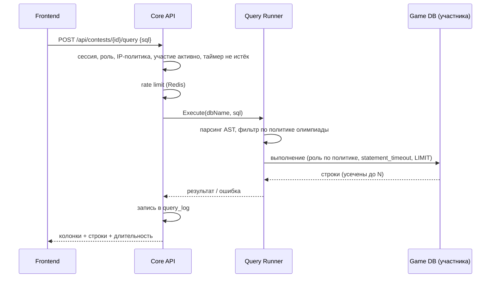
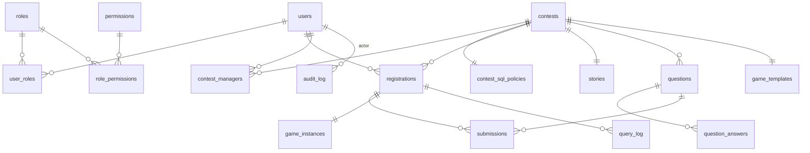

# DB Contest — архитектурный план

Платформа для проведения университетских SQL-олимпиад формата «Детектив»: студенты получают историю преступления и доступ к игровой базе данных, пишут SQL-запросы через веб-интерфейс, отвечают на вопросы и находят преступника.

Документ — основа для имплементации. Все ключевые решения зафиксированы с альтернативами и обоснованием.


## 1. Архитектурный стиль

### Рассмотренные варианты

| Вариант | Плюсы | Минусы |
|---|---|---|
| **Классический монолит** | Просто деплоить и отлаживать | Выполнение студенческих SQL внутри того же процесса — риск: тяжёлый запрос или уязвимость влияет на всё приложение |
| **Микросервисы** (auth, contest, query, reporting…) | Независимое масштабирование | Для университетской системы (сотни участников, одна команда разработки) — избыточная операционная сложность: service discovery, распределённые транзакции, версионирование API |
| **Serverless** | Нулевая инфраструктура в простое | Система локальная (on-premise), долгоживущие SQL-сессии и провижининг БД плохо ложатся на FaaS |

### Решение: модульный монолит + выделенный Query Runner

Основной бэкенд — **один Go-процесс с жёсткими модульными границами** (auth, contests, submissions, reporting, audit). Единственный компонент, вынесенный в **отдельный сервис** — **Query Runner**, который выполняет студенческие SQL-запросы.

Почему именно так:

1. **Изоляция отказов там, где она реально нужна.** Единственный источник непредсказуемой нагрузки — студенческий SQL. Вынос Query Runner в отдельный процесс означает, что даже при его деградации (OOM, зависшие соединения) авторизация, таймер и приём ответов продолжают работать.
2. **Масштабирование по месту.** Во время олимпиады нагрузка на Query Runner на порядок выше, чем на остальное. Его можно реплицировать независимо (это stateless-прокси).
3. **Минимальная операционная цена.** Два сервиса вместо десяти — деплой остаётся простым (Docker Compose), но граница безопасности проведена там, где нужно.
4. **Путь к росту.** Модульные границы внутри монолита позволяют позже вынести reporting или provisioning в отдельные сервисы без переписывания.


## 2. Компоненты системы и их взаимодействие


### 2.1 Frontend (Next.js)

Одно приложение, два раздела с разграничением по ролям:

- **Студенческий UI**: список доступных олимпиад с кнопкой «Участвовать» для открытых (раздел 7.1), страница олимпиады (история преступления, таймер, вопросы), SQL-консоль (редактор с подсветкой, таблица результатов, история запросов), профиль с прогрессом и результатами.
- **Админский UI**: управление пользователями и ролями (только админ системы), конструктор олимпиад (история, вопросы, эталонные ответы, загрузка игровой схемы, тип записи и IP-ограничения — раздел 7.1), управление участниками (добавление поштучно и импортом CSV для `invite_only`), настройка политики SQL-доступа олимпиады, назначение менеджеров олимпиады, мониторинг хода олимпиады в реальном времени, панель журнала запросов с live-режимом и экспортом (раздел 9.1), отчёты. Видимость разделов определяется ролью: админ системы видит всё, owner/manager олимпиады — только свои олимпиады (раздел 7).

**SQL-консоль подробнее.** Ключевой инвариант: всё, что студент делает в консоли, — это либо чтение кеша, либо запрос через единый конвейер queryproxy → Query Runner (разделы 4.3, 5). Привилегированных «обходных» путей к БД у UI нет, поэтому никакая кнопка интерфейса не может нагрузить кластер сильнее, чем разрешает admission control, и не влияет на других участников.

- **Результат запроса** — таблица с именами и типами колонок, явным отображением `NULL`, счётчиком строк и временем выполнения; при усечении — баннер «показаны первые 1000 строк, уточните запрос». Ошибка СУБД показывается с привязкой к месту в тексте (PostgreSQL возвращает позицию ошибки — редактор подсвечивает её), отклонение валидатором — человекочитаемой причиной («функция X не поддерживается»). Полученный результат можно скачать в CSV — из уже переданных строк, без повторного похода в БД.
- **История запросов** — собственные запросы участника (из `query_log`) со статусами и временем; клик восстанавливает запрос в редакторе. Это же «сохранённые наработки»: вернуться к удачному запросу после серии неудачных.
- **Обзор схемы («полазить по базе»)** — постоянная левая панель консоли: дерево таблиц и колонок с типами и FK-связями плюс автогенерируемая ER-диаграмма игровой схемы. Источник — **кешированное описание схемы**, построенное один раз при сборке шаблона: клики по дереву не создают ни одного запроса к инстансам и не тратят rate limit студента. Кнопка «посмотреть данные» у таблицы — обычный сгенерированный `SELECT * FROM t LIMIT 50`, который идёт через общий конвейер на общих правах и лимитах (и виден в query_log, как любой запрос).

Рендеринг: App Router; публичные страницы — SSR, игровая консоль — клиентский компонент. Все запросы к данным идут в Core API; у Next.js нет прямого доступа к БД.

### 2.2 Core API (Go, модульный монолит)

| Модуль | Ответственность |
|---|---|
| `auth` | Логин/пароль, сессии, RBAC-middleware |
| `users` | Профили, управление пользователями (админ) |
| `contests` | CRUD олимпиад, историй, вопросов, эталонных ответов; политика SQL-доступа олимпиады; назначение менеджеров олимпиады; жизненный цикл (draft → published → running → finished); таймер |
| `registrations` | Запись участников (самозапись для `open`, добавление менеджером для `invite_only`), старт/финиш участия |
| `submissions` | Приём ответов, автоматическая проверка, подсчёт баллов |
| `provisioner` | Создание/удаление игровых БД участников из шаблона: очередь с воркерами + резервный пул (раздел 4.2) |
| `queryproxy` | Тонкий фасад: принимает SQL от фронтенда, применяет rate limit, передаёт в Query Runner, пишет query log |
| `reporting` | Статистика, лидерборды, экспорт |
| `audit` | Append-only журнал действий |

Модули общаются только через Go-интерфейсы (никаких прямых обращений к чужим таблицам) — это и есть «швы» для будущего разрезания на сервисы.

### 2.3 Query Runner (Go, отдельный сервис)

Stateless-сервис с единственной задачей: безопасно выполнить один SQL-запрос студента в его игровой БД и вернуть результат. Подробности в разделе 5. Общение с Core API — по gRPC внутри приватной сети; из внешней сети недоступен.

### 2.4 Потоки данных (ключевые сценарии)

**Выполнение SQL-запроса студентом:**



**Старт олимпиады для участника:** запись на олимпиаду → provisioner ставит создание БД `game_c{contest}_u{user}` в очередь (или мгновенно привязывает копию из резервного пула — раздел 4.2) → статус в `game_instances` = `ready` → в момент старта студенту открывается консоль. После финиша + грейс-период БД удаляются.

## 3. Технологический стек

| Слой | Выбор | Обоснование |
|---|---|---|
| Backend | **Go 1.23+**, роутер **chi**, **pgx/v5** + **sqlc** | Требование ТЗ; chi — минималистичный и совместим со stdlib; sqlc даёт типобезопасный SQL без ORM-магии |
| Парсинг студенческого SQL | **pg_query_go** (обёртка над парсером PostgreSQL) | Валидация по настоящему AST, а не по regex — regex-фильтры SQL обходятся |
| RPC между сервисами | **gRPC** | Строгий контракт Core API ↔ Query Runner |
| Frontend | **Next.js 15** (App Router, TypeScript), **TanStack Query**, **CodeMirror 6** (SQL-редактор), **Tailwind CSS** | Требование ТЗ; CodeMirror — лёгкий редактор с подсветкой SQL |
| Основная БД | **PostgreSQL 16** | Реляционная модель идеальна для сущностей системы; один движок для core и game упрощает эксплуатацию |
| Игровой кластер | **Отдельный инстанс PostgreSQL 16** | Физическая изоляция от core. PgBouncer убран осознанно: его пулы привязаны к паре «БД + роль», а БД у каждого участника своя — мультиплексирования не получилось бы. Соединениями управляет Query Runner (раздел 4.3) |
| Кеш / сессии / rate limit | **Redis 7** (опционально) | Сессии, окна rate limit, кеш таймера, лидерборд. За интерфейсом `Cache`: без Redis работает встроенное хранилище в памяти — см. раздел 3.1 |
| Миграции | **golang-migrate** | Версионируемые SQL-миграции core-БД |
| Логи | **slog** (JSON) → stdout → **Promtail → Loki** | Стандартная библиотека, структурные логи; Loki дешевле ELK и достаточен |
| Метрики | **Prometheus + Grafana** (опционально) | Дашборды нагрузки и алерты. За интерфейсом `Recorder`: бэкенд переключается на лог-дайджест или отключается — см. раздел 3.1 |
| Деплой | **Docker Compose** (on-premise) | Система локальная; путь миграции в k8s описан в разделе 10 |

Пароли — **argon2id**. Аутентификация — **серверные сессии** (httpOnly cookie + Redis), не JWT: сессию можно мгновенно отозвать (дисквалификация участника, компрометация), нет проблемы «живого» токена.

## 3.1 Обязательные и опциональные зависимости

Не все зависимости равноценны, и система различает их явно: одна её часть без внешнего компонента бессмысленна, другая — просто работает хуже. Каждая опциональная зависимость спрятана за интерфейсом, у каждой есть встроенная замена, и выбор замены — всегда громкий, никогда молчаливый.

| Зависимость | Класс | Без неё | Поведение при старте |
|---|---|---|---|
| **PostgreSQL (core)** | обязательная | нет пользователей, олимпиад и ответов — сервису нечего обслуживать | отказ с внятной ошибкой |
| **PostgreSQL (игровой кластер)** | обязательная для игры | нельзя выполнять студенческий SQL | админка и отчёты работают, консоль недоступна |
| **Redis** | опциональная | сессии, rate limit и кеш уходят в память процесса | старт с предупреждением |
| **Prometheus** | опциональная | метрики уходят в лог-поток или выключаются | старт по настройке `METRICS_BACKEND` |
| **Loki / Grafana** | опциональная | логи остаются в stdout контейнера | никак не влияет на сервис |

### Кеш: Redis или память

`Cache` — интерфейс (`Get`/`Set`/`Delete`/`Incr`/`Ping`) с двумя реализациями. Пустой `REDIS_ADDR` выбирает **встроенное хранилище в памяти**: LRU с ограничением по числу записей и TTL на каждую запись. Ограничение по размеру обязательно — ключи строятся из пользовательского ввода (идентификаторы сессий, субъекты rate limit), и неограниченная карта была бы способом расти до убийства процесса.

Замена **не эквивалентна**, и разница не косметическая: память не разделяется между репликами (сессии и лимиты разъезжаются по инстансам) и теряется при рестарте. Поэтому:

- режим годится **только для одного инстанса** — это записано в предупреждении при старте, в `.env.example` и в README;
- активный режим отдаётся в `/readyz` полем `cache`, чтобы деградация была видна снаружи, а не только в логе первых секунд;
- если `REDIS_ADDR` **задан**, но сервер не отвечает — это **ошибка старта**, а не повод подставить память. Оператор указал конкретный адрес; тихо использовать другое хранилище значило бы скрыть сломанный деплой и — при нескольких репликах — незаметно сломать общие сессии.

Контракт для вызывающего кода: ошибка `Get` — это промах для read-through кеша, но **fail closed** для всего, что касается безопасности: нечитаемая сессия означает «не аутентифицирован», а не «аутентифицирован».

### Метрики: сменный бэкенд

Prometheus не может «упасть» для приложения — он сам ходит за `/metrics`. Задача другая: не делать его обязательной зависимостью. `Recorder` — интерфейс с одним методом наблюдения и тремя реализациями, выбираемыми через `METRICS_BACKEND`:

| Значение | Поведение |
|---|---|
| `prometheus` (по умолчанию) | приватный registry + эндпоинт `/metrics` на внутреннем порту |
| `log` | агрегация в памяти и периодический дайджест в лог-поток (счётчики, среднее и максимум по `метод + маршрут + статус`) |
| `none` | наблюдения отбрасываются |

Два следствия зафиксированы в коде тестами: инструментирование **одинаково** для всех бэкендов (смена бэкенда меняет только адресата, но не то, что измеряется), и `/metrics` регистрируется **только** если бэкенд его отдаёт — пустая страница сказала бы скраперу, что сервис инструментирован, тогда как его числа лежат в другом месте. Неизвестное значение `METRICS_BACKEND` — ошибка старта: опечатка должна ловиться при загрузке, а не обнаруживаться после олимпиады как «мы ничего не записали».

Общий принцип: **метрики — диагностика**. Ни одна ветка их кода не имеет права влиять на обслуживание запроса.

## 3.2 Смена СУБД: где проходит шов

Честная оценка, а не декларация переносимости.

**Игровой кластер сменить нельзя, и это осознанно.** На PostgreSQL завязана суть продукта: `CREATE DATABASE … TEMPLATE` для провижининга, парсер `pg_query_go` для AST-валидации студенческого SQL, роли с `statement_timeout`, `temp_file_limit` и `CONNECTION LIMIT` на базу, поведение `EXPLAIN`. Сам предмет олимпиады — «студенты пишут SQL к PostgreSQL». Абстракция здесь дала бы иллюзию выбора и стоила бы дорого.

**Core-БД сменить можно, и шов проведён на уровне репозиториев, а не драйвера.** Абстрагировать `Query`/`Exec` бессмысленно: такая обёртка протекает типами драйвера и не даёт переносимости. Вместо этого каждый доменный модуль объявляет интерфейс, который ему нужен, в своих терминах:

```go
// Интерфейс объявляет потребитель, а не реализация (идиома Go).
type ContestRepository interface {
    ByID(ctx context.Context, id uuid.UUID) (Contest, error)
    Save(ctx context.Context, c Contest) error
}
```

Реализация живёт в отдельном пакете (`postgres`), SQL не покидает его, а handlers и бизнес-логика знают только интерфейс. Смена СУБД — это новый пакет-реализация, без единой правки в доменном коде. Побочная выгода важнее гипотетической миграции: бизнес-логика тестируется без базы вообще.

**Транзакции — часть того же шва.** Архитектура требует атомарности разнородных записей (принятый ответ обновляет счёт и добавляет запись аудита — либо всё, либо ничего). Для этого есть `UnitOfWork`:

```go
type UnitOfWork interface {
    Do(ctx context.Context, fn func(ctx context.Context) error) error
}
```

Транзакция передаётся через контекст, а репозитории берут её оттуда (`storage.QuerierFrom(ctx, pool)`) — поэтому один и тот же метод репозитория работает и сам по себе, и внутри чужой транзакции, а handler'ы вообще не держат объект транзакции. Вложенный вызов присоединяется к внешней транзакции, а не открывает вторую: независимых вложенных транзакций в PostgreSQL нет, и молча открыть новую значило бы сломать ту атомарность, ради которой вызывающий код и обернул работу.

## 4. Изоляция игровых баз данных

Ключевое требование ТЗ (п. 5): каждый участник работает со **своей копией** игровой БД и не может положить систему.

### Варианты

| Вариант | Плюсы | Минусы |
|---|---|---|
| **A. Одна общая игровая БД на всех** | Дёшево | Один тяжёлый запрос деградирует всех; нет изоляции |
| **B. Схема на участника** (search_path) | Легковесно, тысячи схем в одной БД | Изоляция логическая: ошибка в правах — и участник видит чужую схему; общие shared_buffers |
| **C. БД на участника в общем игровом кластере** ✅ | Жёсткая граница видимости (нельзя сделать cross-database запрос), быстрый провижининг из шаблона, простое удаление | Больше накладных расходов, чем у схем — приемлемо до ~1–2 тыс. участников |
| **D. Контейнер PostgreSQL на участника** | Максимальная изоляция (CPU/RAM-квоты) | Тяжело: сотни контейнеров, оркестрация; не оправдано при нагрузке, управляемой admission control (раздел 4.3) |

### Решение: вариант C

- Админ загружает игровую схему как SQL-скрипт (DDL + данные) → provisioner создаёт **БД-шаблон** `game_tpl_c{contest}` и валидирует её.
- Инстанс участника создаётся командой `CREATE DATABASE game_c{id}_u{id} TEMPLATE game_tpl_c{id}`. У операции есть жёсткие ограничения (к шаблону в момент копирования не должно быть подключений; массовое создание сотен БД упирается в диск и WAL), поэтому базы **никогда не создаются «всем потоком в момент старта»** — только заранее, через очередь с резервным пулом (раздел 4.2).
- Доступ к игровым БД имеет **только Query Runner**, под одной из двух ролей — какая используется, определяет политика SQL-доступа олимпиады (раздел 4.1):

```sql
-- Базовая роль: только чтение (режим по умолчанию)
CREATE ROLE game_reader LOGIN CONNECTION LIMIT 60;
ALTER ROLE game_reader SET default_transaction_read_only = on;
ALTER ROLE game_reader SET statement_timeout = '5s';
ALTER ROLE game_reader SET idle_in_transaction_session_timeout = '5s';
ALTER ROLE game_reader SET work_mem = '16MB';
ALTER ROLE game_reader SET temp_file_limit = '64MB';
GRANT SELECT ON ALL TABLES IN SCHEMA public TO game_reader; -- в шаблоне

-- Расширенная роль: для олимпиад с записью / CREATE VIEW
CREATE ROLE game_writer LOGIN CONNECTION LIMIT 60;
ALTER ROLE game_writer SET statement_timeout = '5s';
ALTER ROLE game_writer SET idle_in_transaction_session_timeout = '5s';
ALTER ROLE game_writer SET work_mem = '16MB';
ALTER ROLE game_writer SET temp_file_limit = '64MB';
-- Точечные GRANT'ы выдаются при сборке шаблона по политике олимпиады:
--   GRANT INSERT, UPDATE, DELETE ON <разрешённые таблицы> TO game_writer;
--   GRANT CREATE ON SCHEMA work TO game_writer;  -- для VIEW и своих таблиц

-- CONNECTION LIMIT ролей — последний рубеж: реальное ограничение
-- одновременных выполнений — семафор Query Runner (раздел 4.3).
-- Дополнительно на каждом инстансе: ALTER DATABASE <db> CONNECTION LIMIT 2;
-- в шаблоне отозваны чувствительные каталоги (раздел 5):
--   REVOKE SELECT ON pg_catalog.pg_database, pg_catalog.pg_stat_activity,
--                   pg_catalog.pg_roles, pg_catalog.pg_settings FROM PUBLIC;
```

- Игровой кластер — **отдельный PostgreSQL-инстанс** (отдельный контейнер/хост с собственными лимитами памяти). Даже полная деградация игрового кластера не затрагивает core-БД: авторизация, ответы и таймер живут.
- Студент **никогда не получает прямого сетевого доступа к БД** — только через интерфейс (SQL-консоль → Core API → Query Runner). Порт игрового кластера не публикуется наружу.

### 4.1 Политика SQL-доступа олимпиады

Не все олимпиады одинаковы: базовый «Детектив» — чистое чтение, но продвинутый сценарий может требовать от студента вести собственные заметки в таблице, помечать улики или строить `VIEW` для промежуточных выводов. Уровень доступа — **настройка олимпиады**, которую задаёт админ системы или менеджер олимпиады через админский UI (форма, не сырой SQL):

| Параметр политики | Значения | По умолчанию |
|---|---|---|
| `mode` | `read_only` \| `read_write` | `read_only` |
| `writable_tables` | список таблиц игровой схемы, куда разрешён INSERT/UPDATE/DELETE | пусто |
| `allow_create_view` | студент может создавать/удалять **свои** VIEW | `false` |
| `allow_own_tables` | студент может создавать **свои** таблицы (для заметок/расчётов) | `false` |
| `allow_temp_tables` | разрешены временные таблицы | `false` |

Как это работает:

- **Игровые данные и студенческие объекты разделены схемами.** Данные олимпиады живут в схеме `public` (или `game`); для студенческих объектов при сборке шаблона создаётся пустая схема **`work`** — только на неё `game_writer` получает право `CREATE`. VIEW и собственные таблицы студента создаются в `work`, шаблонные таблицы он изменить структурно не может (никаких `ALTER`/`DROP` на `public` — прав нет). Запись в игровые таблицы — только точечные `GRANT INSERT/UPDATE/DELETE` на таблицы из `writable_tables`.
- **Политика применяется дважды** (эшелонирование, как и везде): Query Runner фильтрует statements по AST согласно политике (раздел 5), а GRANT'ы в шаблоне гарантируют то же самое на уровне СУБД, даже если валидатор ошибётся.
- **Изоляция делает запись безопасной.** Поскольку у каждого участника своя БД, его INSERT/UPDATE/DELETE и VIEW видны только ему — целостность чужих игровых данных не затрагивается по построению.
- **Кнопка «Сбросить мою базу».** В режимах с записью студент может испортить себе данные — в UI доступен сброс: provisioner пересоздаёт его инстанс из шаблона (секунды), факт сброса пишется в аудит и query_log. Сброс и удаление выполняются через `DROP DATABASE … WITH (FORCE)` (PostgreSQL 13+): активные сессии терминируются автоматически, зависшее выполнение не заблокирует пересоздание.
- **Дисковые квоты.** Запись открывает вектор DoS «залить диск». Три уровня: (1) перед каждым DML Query Runner синхронно проверяет размер инстанса по кешу, обновляемому после каждого DML, — при превышении квоты (например, 5× размера шаблона, настраивается в политике) запрос не допускается; (2) фоновый монитор `pg_database_size()` как страховка переводит перелимиченный инстанс в read-only (`ALTER DATABASE … SET default_transaction_read_only = on`) с понятным сообщением студенту. Гонку внутри **одного** statement (`INSERT … SELECT`, успевающий превысить квоту до следующей проверки) полностью убрать нельзя — но перелёт ограничен объёмом, записываемым за `statement_timeout` (5 с), и (3) диск кластера планируется с запасом на этот worst case × число одновременных DML (ограничено семафором 4.3). `temp_file_limit` дополнительно ограничивает временные файлы.
- **Смена политики после публикации** запрещена при `running` (иначе участники в неравных условиях); до старта — можно, изменение попадает в audit_log и требует пересборки шаблона (GRANT'ы).

### 4.2 Провижининг без пиков

`CREATE DATABASE … TEMPLATE` — не бесплатная операция, и провижининг спроектирован так, чтобы она никогда не выполнялась массово в критический момент:

- **Очередь с ограниченной параллельностью.** Все создания идут через очередь provisioner'а (2–4 воркера): база создаётся при регистрации/добавлении участника и размазывается по времени до старта, а не залпом в момент старта. Глубина очереди — метрика с алертом (раздел 9).
- **Резервный пул.** Для каждой опубликованной олимпиады provisioner заранее держит K запасных копий (`game_pool_c{id}_NNN`; K настраивается, по умолчанию ~10% от ожидаемых участников). Привязка копии к участнику — запись имени в `game_instances`, мгновенная операция. Пул пополняется фоном.
- **Поздняя запись (open-олимпиады).** Записавшийся перед самым стартом получает базу из пула; если пул исчерпан — статус «готовим вашу базу», консоль открывается по SSE-событию готовности (обычно десятки секунд). Опционально — дедлайн записи (например, за 10 минут до старта).
- **Инвалидация при пересборке шаблона.** Любая пересборка (новая игровая схема, смена SQL-политики до старта) инкрементирует `game_templates.version`. Provisioner после этого дропает **все свободные копии пула и все уже созданные инстансы** со старой версией и пересоздаёт их через очередь — участник не может получить БД со старыми GRANT'ами или данными. `game_instances.template_version` делает рассинхрон обнаружимым; проверка «все инстансы на актуальной версии» — обязательное условие перехода олимпиады в `running`.
- **Дисциплина шаблона.** На время `CREATE DATABASE` к шаблону не должно быть подключений: роль-строитель отключается сразу после сборки, «предпросмотр» игровой схемы админом выполняется на отдельной копии, не на шаблоне.
- **Стратегия копирования** (PostgreSQL 15+): `WAL_LOG` (по умолчанию; без чекпоинтов, но весь объём проходит через WAL) против `FILE_COPY` (быстрее для крупных шаблонов, но два чекпоинта на операцию). Выбор — конфигурация provisioner'а, по замеру на целевом размере шаблона в пилоте.
- **План Б.** Интерфейс provisioner'а не привязан к модели «БД на участника»: если пилот покажет, что провижининг — узкое место на целевых размерах, вариант B (схема на участника) подключается как альтернативная реализация за тем же Query Runner'ом — с осознанной потерей жёсткости изоляции.

### 4.3 Изоляция производительности (admission control)

Честная формулировка: вариант C полностью изолирует **видимость данных**, но CPU, диск и память инстанса — общие. `statement_timeout` ограничивает один запрос, но не совокупную нагрузку: 200 участников × тяжёлый запрос уронят инстанс и с таймаутом. Совокупной нагрузкой управляет **admission control в Query Runner**:

- **1 одновременный запрос на участника** + **глобальный семафор** на N одновременных выполнений на инстанс (N — от числа ядер, порядка 2–3 × CPU). Сверх N — короткая FIFO-очередь; при её переполнении — мгновенный ответ «система занята, повторите через пару секунд», а не зависание.
- **Соединения короткоживущие:** открываются под выполнение и закрываются; накладные расходы в локальной сети — миллисекунды, приемлемо при лимите 30 запросов/мин. Страховка на уровне СУБД: `CONNECTION LIMIT 2` на каждый инстанс-БД и общий лимит роли — оба срабатывают, только если семафор сломан.
- **Границы контейнера:** игровой кластер живёт в контейнере с cgroup-лимитами CPU/IO/памяти — даже полная деградация не выходит за выделенные ресурсы; core-БД на отдельном инстансе не затрагивается.
- **Опционально (флаг политики):** pre-flight `EXPLAIN` с порогом стоимости плана — отсекает заведомо взрывные запросы (декартовы произведения на больших таблицах) до выполнения. Эвристика, не гарантия; по умолчанию выключено.
- **Рост** — шардирование участников по нескольким игровым инстансам (раздел 12); admission control действует на каждый инстанс отдельно.

## 5. Безопасное выполнение студенческого SQL

Здесь классическая защита от SQL-инъекций неприменима — SQL и есть пользовательский ввод. Модель угроз: DoS тяжёлыми запросами, попытки записи/DDL, выход за пределы своей БД, извлечение служебной информации. Защита — эшелонированная:

1. **Аутентификация и контекст.** Запрос принимается только от участника с активной регистрацией в идущей олимпиаде. Имя целевой БД берётся из `game_instances` на сервере — клиент его не передаёт.
2. **Rate limiting и admission control.** Скользящее окно в Redis (например, 30 запросов/мин на участника), 1 конкурентный запрос на участника и глобальный семафор одновременных выполнений на инстанс (раздел 4.3). Превышение — HTTP 429 с человекочитаемым сообщением.
3. **Валидация AST по принципу белого списка** (pg_query_go, в Query Runner; политика — из раздела 4.1, передаётся Core API вместе с запросом). Валидатор **разрешает только то, что знает**; всё неопознанное отклоняется. Чёрных списков нет — чёрный список всегда неполон:
   - ровно **одно** statement;
   - допустимые корневые узлы: `SELECT` / `WITH … SELECT` / `EXPLAIN`; при соответствующей политике — `INSERT`/`UPDATE`/`DELETE` (только таблицы из `writable_tables`), `CREATE [OR REPLACE] VIEW` / `DROP VIEW` и `CREATE/DROP TABLE` (только в схеме `work`), `CREATE TEMP TABLE`;
   - обход дерева: каждый узел обязан принадлежать известному набору безопасных типов (выражения, join'ы, подзапросы, агрегаты, оконные функции, CTE…); любой другой тип узла (`COPY`, `SET`, `DO`, DDL вне политики и всё, чего валидатор не знает) — отказ «конструкция не поддерживается»;
   - вызовы функций — по **allowlist** стандартных функций PostgreSQL (математика, строки, даты, агрегаты, окна…); функций вида `pg_sleep`, `pg_read_file`, `dblink`, `lo_*` в нём просто нет. Ложные отказы — ожидаемая эксплуатационная цена allowlist'а, поэтому вокруг него процесс: список живёт в конфигурации (пополняется без релиза, изменения аудируются), отказ логируется с именем функции («функция X не поддерживается»), панель журнала (9.1) агрегирует такие отказы, и по итогам пилота список пополняется — это явный пункт этапа 7 плана;
   - каталоги: **структурные** (`pg_class`, `pg_attribute`, `information_schema`) по умолчанию разрешены — студентам полезно смотреть структуру таблиц (флаг `allow_catalog` отключает); **чувствительные** (`pg_database`, `pg_stat_activity`, `pg_roles`, `pg_settings`) запрещены всегда — и валидатором, и `REVOKE` в шаблоне (раздел 4): участник не должен видеть имена чужих БД и чужую активность.
4. **Права БД — основная граница безопасности.** Роль `game_reader` (read-only) либо `game_writer` с точечными GRANT'ами строго по той же политике, `statement_timeout=5s`, лимиты памяти и temp-файлов, отозванные чувствительные каталоги (раздел 4). Даже полный обход валидатора не даёт ни записи вне политики, ни выхода за пределы своей БД. Валидатор и GRANT'ы собираются из **одного** описания политики — они не могут разъехаться.
5. **Ограничение результата.** `SELECT` оборачивается: `SELECT * FROM (…user query…) q LIMIT 1001`; при 1001 строке фронтенду возвращается флаг «результат усечён до 1000 строк». Плюс лимит размера ответа (например, 5 МБ). Для DML возвращается число затронутых строк.
6. **Контекст выполнения.** Каждый запрос — в отдельной транзакции: `READ ONLY` для чтения, обычная — для разрешённых политикой DML/DDL; соединение короткоживущее — открывается под выполнение и закрывается (раздел 4.3), разделяемого состояния между запросами нет.
7. **Полное журналирование, двухфазное.** Строка `query_log` создаётся **до** отправки запроса в Query Runner (статус `running`), результат дописывается апдейтом после — падение Core API между выполнением и записью не теряет факт запроса, «зависшие» `running`-строки видны и размечаются фоновой задачей как `error`. Журналируется всё, включая отклонённые валидацией запросы, — это и аудит, и материал для отчётности («сколько запросов понадобилось участнику»). Ради этого `query_log` — единственное осознанное исключение из append-only: приложению разрешён UPDATE полей результата своей строки; `audit_log` остаётся строго append-only.

Разделение ответственности слоёв: **права БД** гарантируют невозможность записи вне политики и выхода за пределы своей БД; **валидатор** обеспечивает форму (одно statement, LIMIT), политику и понятные ошибки — и закрывает то, что права не ограничивают (например, `pg_sleep` доступен любой роли — против него работают allowlist функций и таймаут); **admission control** отвечает за ресурсы: таймаут и лимиты памяти ограничивают один запрос, семафор — совокупную нагрузку.

Остальной API (логин, ответы, админка) использует **только параметризованные запросы** через sqlc — классические инъекции исключены by construction.


## 6. Структура основной базы данных (core)

Игровая БД произвольна и задаётся админом per-олимпиада; фиксируем только core-схему.



```sql
-- Пользователи и RBAC
CREATE TABLE users (
    id            uuid PRIMARY KEY DEFAULT gen_random_uuid(),
    login         text NOT NULL UNIQUE,          -- студ. билет / username
    email         text UNIQUE,
    password_hash text NOT NULL,                 -- argon2id
    full_name     text NOT NULL,
    status        text NOT NULL DEFAULT 'active' -- active | blocked
        CHECK (status IN ('active','blocked')),
    created_at    timestamptz NOT NULL DEFAULT now(),
    updated_at    timestamptz NOT NULL DEFAULT now()
);

CREATE TABLE roles (          -- student, admin, organizer; расширяемо
    id   smallserial PRIMARY KEY,
    code text NOT NULL UNIQUE,
    name text NOT NULL
);

CREATE TABLE permissions (    -- contest.create, users.manage, reports.view …
    id   smallserial PRIMARY KEY,
    code text NOT NULL UNIQUE
);

CREATE TABLE role_permissions (
    role_id       smallint REFERENCES roles ON DELETE CASCADE,
    permission_id smallint REFERENCES permissions ON DELETE CASCADE,
    PRIMARY KEY (role_id, permission_id)
);

CREATE TABLE user_roles (
    user_id uuid     REFERENCES users ON DELETE CASCADE,
    role_id smallint REFERENCES roles ON DELETE CASCADE,
    PRIMARY KEY (user_id, role_id)
);

-- Олимпиады
CREATE TABLE contests (
    id          uuid PRIMARY KEY DEFAULT gen_random_uuid(),
    title       text NOT NULL,
    description text,
    status      text NOT NULL DEFAULT 'draft'
        CHECK (status IN ('draft','published','running','finished','archived')),
    enrollment  text NOT NULL DEFAULT 'invite_only' -- тип записи (раздел 7.1)
        CHECK (enrollment IN ('open','invite_only')),
    allowed_cidrs cidr[] NOT NULL DEFAULT '{}',   -- IP-ограничения; пусто = без ограничений
    timing      text NOT NULL DEFAULT 'fixed'     -- модель таймера (раздел 8)
        CHECK (timing IN ('fixed','individual')),
    duration_min int,                             -- длительность сессии для timing = individual
    starts_at   timestamptz,
    ends_at     timestamptz,
    settings    jsonb NOT NULL DEFAULT '{}',  -- лимиты запросов, грейс-период и пр.
                                              -- (политика SQL-доступа — в contest_sql_policies)
    created_by  uuid NOT NULL REFERENCES users,
    created_at  timestamptz NOT NULL DEFAULT now()
);

CREATE TABLE contest_managers (   -- админы/менеджеры конкретной олимпиады
    contest_id uuid NOT NULL REFERENCES contests ON DELETE CASCADE,
    user_id    uuid NOT NULL REFERENCES users ON DELETE CASCADE,
    role       text NOT NULL DEFAULT 'manager'
        CHECK (role IN ('owner','manager')),
    granted_by uuid NOT NULL REFERENCES users,
    granted_at timestamptz NOT NULL DEFAULT now(),
    PRIMARY KEY (contest_id, user_id)
);

CREATE TABLE contest_sql_policies (  -- политика SQL-доступа (раздел 4.1)
    contest_id        uuid PRIMARY KEY REFERENCES contests ON DELETE CASCADE,
    mode              text NOT NULL DEFAULT 'read_only'
        CHECK (mode IN ('read_only','read_write')),
    writable_tables   text[] NOT NULL DEFAULT '{}',
    allow_create_view boolean NOT NULL DEFAULT false,
    allow_own_tables  boolean NOT NULL DEFAULT false,
    allow_temp_tables boolean NOT NULL DEFAULT false,
    allow_catalog     boolean NOT NULL DEFAULT true,  -- структурные каталоги; чувствительные
                                                      -- (pg_database, pg_stat_activity…) закрыты всегда
    disk_quota_ratio  int NOT NULL DEFAULT 5,         -- квота = N × размер шаблона
    updated_by        uuid REFERENCES users,
    updated_at        timestamptz NOT NULL DEFAULT now()
);

CREATE TABLE stories (        -- история преступления
    id         uuid PRIMARY KEY DEFAULT gen_random_uuid(),
    contest_id uuid NOT NULL UNIQUE REFERENCES contests ON DELETE CASCADE,
    body_md    text NOT NULL,                 -- markdown
    updated_at timestamptz NOT NULL DEFAULT now()
);

CREATE TABLE questions (
    id           uuid PRIMARY KEY DEFAULT gen_random_uuid(),
    contest_id   uuid NOT NULL REFERENCES contests ON DELETE CASCADE,
    ord          int  NOT NULL,               -- порядок отображения
    kind         text NOT NULL DEFAULT 'text' -- text | choice | final (кто преступник)
        CHECK (kind IN ('text','choice','final')),
    body_md      text NOT NULL,
    points       int  NOT NULL DEFAULT 1,
    max_attempts int,                          -- NULL = не ограничено
    choices      jsonb,                        -- для kind = choice
    UNIQUE (contest_id, ord)
);

CREATE TABLE question_answers (               -- эталонные ответы
    id          uuid PRIMARY KEY DEFAULT gen_random_uuid(),
    question_id uuid NOT NULL REFERENCES questions ON DELETE CASCADE,
    match_kind  text NOT NULL DEFAULT 'exact_ci' -- exact | exact_ci | regex
        CHECK (match_kind IN ('exact','exact_ci','regex')),
    value       text NOT NULL
);

-- Игровые шаблоны и инстансы
CREATE TABLE game_templates (
    id           uuid PRIMARY KEY DEFAULT gen_random_uuid(),
    contest_id   uuid NOT NULL UNIQUE REFERENCES contests ON DELETE CASCADE,
    template_db  text NOT NULL,               -- game_tpl_c{short_id}
    version      int  NOT NULL DEFAULT 1,     -- растёт при каждой пересборке (раздел 4.2)
    init_script  text NOT NULL,               -- исходный SQL (DDL + данные)
    status       text NOT NULL DEFAULT 'pending'
        CHECK (status IN ('pending','building','ready','failed')),
    build_error  text,
    updated_at   timestamptz NOT NULL DEFAULT now()
);

CREATE TABLE registrations (
    id          uuid PRIMARY KEY DEFAULT gen_random_uuid(),
    contest_id  uuid NOT NULL REFERENCES contests ON DELETE CASCADE,
    user_id     uuid NOT NULL REFERENCES users ON DELETE CASCADE,
    status      text NOT NULL DEFAULT 'registered'
        CHECK (status IN ('registered','active','finished','disqualified')),
    started_at  timestamptz,  -- при timing = individual определяет дедлайн (раздел 8)
    finished_at timestamptz,
    total_score int NOT NULL DEFAULT 0,       -- денормализация для лидерборда
    UNIQUE (contest_id, user_id)
);

CREATE TABLE game_instances (
    id              uuid PRIMARY KEY DEFAULT gen_random_uuid(),
    registration_id uuid NOT NULL UNIQUE REFERENCES registrations ON DELETE CASCADE,
    db_name         text NOT NULL UNIQUE,
    template_version int NOT NULL DEFAULT 1,  -- версия шаблона, из которой создан (раздел 4.2)
    status          text NOT NULL DEFAULT 'provisioning'
        CHECK (status IN ('provisioning','ready','failed','dropped')),
    created_at      timestamptz NOT NULL DEFAULT now()
);

-- Ответы участников
CREATE TABLE submissions (
    id              uuid PRIMARY KEY DEFAULT gen_random_uuid(),
    registration_id uuid NOT NULL REFERENCES registrations ON DELETE CASCADE,
    question_id     uuid NOT NULL REFERENCES questions ON DELETE CASCADE,
    attempt_no      int  NOT NULL,
    value           text NOT NULL,
    is_correct      boolean NOT NULL,
    points_awarded  int NOT NULL DEFAULT 0,
    submitted_at    timestamptz NOT NULL DEFAULT now(),
    UNIQUE (registration_id, question_id, attempt_no)
);

-- Журналы
CREATE TABLE query_log (
    id              bigserial PRIMARY KEY,
    registration_id uuid NOT NULL REFERENCES registrations ON DELETE CASCADE,
    request_id      uuid NOT NULL,             -- связь с техническими логами в Loki
    sql_text        text NOT NULL,
    status          text NOT NULL DEFAULT 'running' -- двухфазная запись (раздел 5, п.7)
        CHECK (status IN ('running','ok','rejected','error','timeout')),
    error_text      text,
    duration_ms     int,
    row_count       int,
    executed_at     timestamptz NOT NULL DEFAULT now()
);

CREATE TABLE audit_log (
    id         bigserial PRIMARY KEY,
    actor_id   uuid REFERENCES users,          -- NULL для системных событий
    action     text NOT NULL,                  -- auth.login, contest.create, user.block …
    entity     text,
    entity_id  text,
    payload    jsonb,
    ip         inet,
    user_agent text,
    created_at timestamptz NOT NULL DEFAULT now()
);
```

Замечания:

- **Проверка ответов** — на сервере, сравнение с `question_answers` по `match_kind`; эталонные ответы никогда не попадают в API-ответы студенту.
- `audit_log` — строго append-only (у роли приложения нет прав UPDATE/DELETE). `query_log` — почти append-only: единственный разрешённый UPDATE — дозапись результата в строку, созданную перед выполнением (двухфазная запись, раздел 5, п.7). При росте — месячное партиционирование.
- `total_score` пересчитывается транзакционно при каждом принятом ответе — лидерборд без агрегаций на лету.

## 7. Аутентификация и авторизация

- **Вход:** логин + пароль (argon2id, per-user salt). Защита от перебора: rate limit по IP и по логину (Redis), экспоненциальная задержка после N неудач, единый ответ «неверный логин или пароль» без раскрытия существования учётки.
- **Сессии:** случайный 256-бит идентификатор в httpOnly, Secure, SameSite=Lax cookie; данные сессии в Redis с TTL (напр., 12 ч) и продлением при активности. Logout и блокировка пользователя = немедленное удаление сессий.
- **RBAC — два уровня: глобальный и уровень олимпиады.**
  - **Глобальные роли** (`roles`/`user_roles`): `student`, `organizer` (может создавать олимпиады), `admin` (админ **системы**: всё, включая управление пользователями, глобальными ролями и любыми олимпиадами).
  - **Роли уровня олимпиады** (`contest_managers`): создатель олимпиады становится её `owner`; owner (или админ системы) назначает `manager`'ов. Owner и manager управляют **только своей олимпиадой**: контент (история, вопросы, ответы), политика SQL-доступа, список участников, мониторинг и отчёты по ней. Разница owner/manager: только owner назначает и снимает менеджеров и может архивировать олимпиаду. Ни owner, ни manager не видят чужие олимпиады и не управляют пользователями системы.
  - **Проверка доступа** двухступенчатая: `RequirePermission("contest.edit", contestID)` — сначала глобальные permissions (админ системы проходит всегда), затем запись в `contest_managers` для данной олимпиады. Middleware проверяет permission, а не роль — новые роли и права добавляются данными, без изменения кода.
  - Назначение/снятие менеджеров — только через UI, каждое изменение — в `audit_log` (кто, кого, на какую олимпиаду).
- **Учётные записи** создаёт админ (импорт CSV со списком группы + генерация одноразовых паролей со сменой при первом входе). Самостоятельная регистрация учётных записей на данном этапе отключена — меньше поверхность атаки. (Запись на олимпиаду — отдельный механизм, см. 7.1.)

### 7.1 Доступ к олимпиаде: тип записи и IP-ограничения

Обе настройки задаются в форме олимпиады админом системы или owner/manager'ом этой олимпиады; изменения пишутся в `audit_log`.

**Тип записи (`contests.enrollment`):**

| Тип | Поведение |
|---|---|
| `open` | Олимпиада видна в общем списке; студент записывается сам кнопкой «Участвовать» (создаётся запись в `registrations`) до момента старта или дедлайна записи |
| `invite_only` (по умолчанию) | Самозапись недоступна; участников добавляет owner/manager через админку — поштучно поиском по пользователям или пакетно импортом CSV (список логинов). Олимпиада видна только добавленным участникам |

Тип влияет лишь на то, **кто создаёт** запись в `registrations` — дальше оба пути идентичны (провижининг игровой БД, старт, таймер). Смена типа возможна до старта; каждое добавление/удаление участника менеджером — событие аудита.

**IP-ограничения (`contests.allowed_cidrs`):**

Список адресов и диапазонов в формате CIDR (например, `10.20.0.0/16`, `192.168.1.42/32`) — для очных олимпиад «только из этой аудитории/кампусной сети». Пустой список = ограничений нет.

- **Проверка на каждом действии участника**, а не только при входе: просмотр страницы олимпиады, SQL-запрос, отправка ответа, SSE-подписка. Участник, вышедший из разрешённой сети посреди олимпиады, немедленно теряет доступ (и восстанавливает его, вернувшись) — сессию это не убивает.
- **Определение IP клиента:** Core API берёт адрес из `X-Forwarded-For`, доверяя **только своему** реверс-прокси (список доверенных прокси — в конфигурации; заголовок от клиента напрямую игнорируется). Это стандартная точка ошибок — закрепить интеграционным тестом на подделку заголовка.
- **Сопоставление** — типом `inet` в Go (`netip.Prefix.Contains`), список CIDR олимпиады кешируется в памяти/Redis.
- **Отказ** — понятная страница «Олимпиада доступна только из сети университета», а не голый 403; каждая заблокированная попытка — в `audit_log` (кто, откуда, когда) — это же сигнал о попытке писать со стороннего устройства.
- **На кого действует:** только на участие студентов. Админы и менеджеры олимпиады под ограничение не попадают (иначе можно случайно запереть самого себя, настроив неверный диапазон) — их действия и так полностью аудируются.


## 8. Таймер олимпиады

- **Две модели тайминга** (`contests.timing`, выбирается при создании олимпиады):
  - `fixed` (по умолчанию) — общее окно: все стартуют в `starts_at`, приём закрывается в `ends_at` для всех одновременно. `registrations.started_at` здесь — только факт для аналитики, на дедлайн не влияет.
  - `individual` — у каждого участника свои `duration_min` минут с момента **его** старта; начать можно в любой момент окна `[starts_at, ends_at]`.
- **Единая формула дедлайна участника**, используемая во всех проверках (приём ответов, SQL-запросы, UI): для `fixed` — `deadline = ends_at`; для `individual` — `deadline = LEAST(started_at + duration_min, ends_at)`. Другой логики тайминга в коде не существует — submission-путь, queryproxy и SSE считают дедлайн одной и той же функцией.
- **Источник истины — сервер:** `contests` и `registrations` в core-БД. Никакие клиентские часы не участвуют в решениях.
- Все проверки «олимпиада идёт?» выполняются на бэкенде при каждом действии (запрос SQL, отправка ответа). Приём ответов закрывается атомарно по серверному времени; небольшой грейс на сетевые задержки (напр., 5 сек) — конфигурируемо.
- **Синхронизация UI:** фронтенд получает при загрузке `server_now` и **свой** `deadline` (по формуле выше), считает оффсет локально; раз в 30–60 сек ресинхронизация через **SSE**-канал (`/api/contests/{id}/events`), по нему же приходят события `contest_started` / `contest_finished`. SSE выбран вместо WebSocket: трафик односторонний, SSE проще и переживает reconnect из коробки.
- Смена статусов `published → running → finished` — фоновым шедулером в Core API: каждый тик реплики соревнуются за advisory lock, lock не удерживается между тиками, поэтому падение реплики сдвигает переход максимум на один тик. **Гарантия закрытия от шедулера не зависит:** проверка `now() < deadline + grace` (формула дедлайна выше) по часам core-БД выполняется в той же транзакции, что и вставка ответа, — просроченный ответ не будет принят даже при мёртвом шедулере; статус и SSE-события влияют только на UI.

## 9. Логирование и аудит

Три независимых потока с разными целями:

| Поток | Что | Куда | Хранение |
|---|---|---|---|
| **Технические логи** | Структурные JSON-логи приложений (slog): HTTP-запросы, ошибки, провижининг; в каждом событии `request_id`, `user_id`; при `METRICS_BACKEND=log` сюда же идёт дайджест метрик | stdout → Promtail → **Loki**, дашборды в Grafana | 30–90 дней |
| **Аудит действий** (требование п. 13) | Логины/логауты (в т.ч. неудачные), все админские действия (CRUD олимпиад, изменение ответов, блокировки), старт/финиш участия, дисквалификации | Таблица `audit_log` в core-БД (append-only), просмотр в админке с фильтрами | 1+ год |
| **Журнал SQL-запросов** | Каждый студенческий запрос: текст, статус, длительность, число строк | Таблица `query_log`; просмотр и экспорт — через панель в админке (раздел 9.1) | Срок жизни олимпиады + архив |

Правила: писать аудит в той же транзакции, что и само действие; никогда не логировать пароли и хеши; `request_id` пробрасывается фронтенд → Core API → Query Runner для сквозной трассировки; каждая запись `query_log` несёт этот `request_id` — по нему студенческий запрос связывается с техническими логами в Loki. Метрики (Prometheus): RPS, латентность по эндпоинтам, число активных участников, длительность и частота отказов студенческих запросов, глубина очереди провижининга.

### 9.1 Панель журнала запросов (админка)

Журнал студенческих SQL — первоклассная фича продукта, а не служебная таблица. В админском UI — отдельный раздел «Журнал запросов»:

- **Просмотр.** Таблица с колонками: время, участник, статус (цветные бейджи: `ok` / `rejected` / `error` / `timeout`), длительность, число строк, свёрнутый текст запроса. Клик по строке — детальная карточка: полный SQL с подсветкой синтаксиса (тот же CodeMirror в read-only), текст ошибки БД или причина отклонения валидатором, длительность, `request_id`.
- **Фильтры и поиск:** по олимпиаде, участнику, статусу, диапазону времени, полнотекстовый поиск по тексту запроса (например, «кто обращался к таблице suspects»). Пагинация — keyset по `(executed_at, id)`, чтобы панель оставалась быстрой на сотнях тысяч записей.
- **Live-режим.** Во время олимпиады — «хвост» журнала в реальном времени через уже существующий SSE-канал: админ видит поток запросов участников по мере выполнения. Полезно и для мониторинга («поток встал — все застряли на вопросе 4»), и для контроля честности.
- **Экспорт** — кнопкой из панели, с учётом текущих фильтров. **CSV** и **NDJSON** стримятся построчно без ограничений по объёму; **XLSX** (для отчётов и деканата) пишется через excelize `StreamWriter` (константная память, сборка во временном файле — честного потокового вывода у формата нет) и ограничен, например, 200 тыс. строк — выборки больше выгружаются в CSV/NDJSON. Большие экспорты выполняются асинхронно с уведомлением о готовности файла. Каждый экспорт фиксируется в `audit_log`.
- **Доступ по ролям:** админ системы видит журнал всех олимпиад; owner/manager — только своих. Студент в своём профиле видит **собственную** историю запросов (это же удобно ему самому — вернуться к удачному запросу).
- **Аналитика поверх журнала** — в модуле отчётности (раздел 10): число запросов на участника, доля ошибок, среднее время до правильного ответа.

Индексы под панель: `query_log (registration_id, executed_at)`, `query_log (executed_at, id)`, GIN-индекс по `to_tsvector(sql_text)` для полнотекстового поиска.


## 10. Отчётность

Модуль `reporting` поверх core-БД (query_log + submissions + registrations):

- **Во время олимпиады (админ):** живой лидерборд, прогресс по вопросам (сколько участников на каком вопросе), частота ошибок в запросах, активность по времени.
- **После олимпиады:** итоговая таблица результатов, разбор по вопросам (процент решивших, среднее число попыток и запросов), персональный отчёт участника (виден в его профиле).
- **Экспорт:** CSV/XLSX для деканата.

Реализация: SQL-представления + при необходимости материализованные view с обновлением по расписанию; тяжёлые отчёты считаются по завершении олимпиады и кешируются. Отдельная аналитическая БД не нужна на этих объёмах — «шов» модуля позволяет добавить её позже.


## 11. Безопасность (сводно) и план security-аудита

Защита студенческого SQL — раздел 5, изоляция БД — раздел 4, аутентификация — раздел 7. Дополнительно:

- **Сеть:** наружу открыт только фронтенд/реверс-прокси (**Caddy** или Nginx, TLS обязателен). Core API — за прокси; Query Runner, обе БД, Redis — только в приватной docker-сети, порты не публикуются.
- **Web-уязвимости:** CSRF — SameSite cookie + проверка Origin на мутирующих запросах; XSS — экранирование по умолчанию в React + рендер markdown историй через санитайзер (rehype-sanitize) + строгий CSP; защита заголовками (HSTS, X-Content-Type-Options, frame-ancestors).
- **Ввод админа:** загружаемый игровой SQL-скрипт исполняется только на игровом кластере под отдельной ролью-строителем при создании шаблона, никогда — на core-БД; валидация и ограничение размера.
- **Секреты:** через переменные окружения / docker secrets; в репозитории — только `.env.example`; разные пароли ролей БД (core-приложение, provisioner, game_reader).
- **Зависимости:** `govulncheck` + `npm audit` в CI; pinned-версии базовых образов.
- **Целостность соревнования:** эталонные ответы недоступны из студенческих эндпоинтов; лимит попыток на вопрос; audit trail изменений вопросов/ответов после публикации; смена политики SQL-доступа заблокирована во время `running`; назначения менеджеров олимпиад — только явные, с записью в аудит; IP-ограничения олимпиады (раздел 7.1) проверяются на каждом действии участника, а `X-Forwarded-For` принимается только от доверенного реверс-прокси (закреплено интеграционным тестом на подделку заголовка).
- **Режим записи (mode = read_write):** дополнительные векторы закрыты так — заполнение диска ограничено квотой на размер инстанса (мониторинг `pg_database_size` + `temp_file_limit`), структура игровых таблиц неизменяема (нет `ALTER`/`DROP` ни в валидаторе, ни в GRANT'ах), студенческие объекты живут только в схеме `work`, а изоляция «БД на участника» гарантирует, что записи не видны другим участникам.

**План аудита перед первой олимпиадой (требование п. 8):**

1. Чек-лист **OWASP ASVS L2** по разделам аутентификации, сессий, контроля доступа, валидации.
2. Автоматика: SAST (gosec, semgrep), сканирование зависимостей, **OWASP ZAP** baseline-скан развёрнутого стенда.
3. Ручной пентест Query Runner'а: попытки обхода AST-валидации (вложенные statements, функции записи, доступ к чужим БД, DoS через рекурсивные CTE / декартовы произведения) — оформить как регрессионный набор тестов.
4. Нагрузочное тестирование (k6): пиковый сценарий «N участников одновременно жмут Run» + массовый провижининг (создание N инстансов из шаблона целевого размера, замер WAL_LOG против FILE_COPY).
5. Повторять сокращённый аудит перед каждой олимпиадой и полный — при изменениях в auth/queryproxy/provisioner.


## 12. Масштабируемость

Целевая нагрузка: сотни одновременных участников (олимпиада на весь поток).

- **Stateless-слои** — Core API и Query Runner не хранят состояния (сессии в Redis) → горизонтальное масштабирование добавлением реплик за прокси. Query Runner масштабируется независимо (главный потребитель ресурсов).
- **Игровой кластер** — шардируется тривиально: участники не связаны между собой, значит при росте ставится второй PostgreSQL-инстанс, и `game_instances.db_name` дополняется адресом кластера; provisioner раскладывает участников round-robin. Это главное преимущество выбранной модели «БД на участника».
- **Соединения к игровому кластеру** — под управлением Query Runner: короткоживущее соединение на выполнение + глобальный семафор (раздел 4.3), физических соединений ровно столько, сколько запросов реально выполняется. PgBouncer не используется: его пулы привязаны к паре «БД + роль», при БД-на-участника мультиплексирования он не даёт.
- **Core-БД** — на этих объёмах узким местом не станет; горячие чтения (таймер, лидерборд) кешируются в Redis.
- **Пики старта** — провижининг заранее через очередь и резервный пул (раздел 4.2); SSE-раздача события старта вместо синхронного поллинга.
- **SSE-ёмкость** — на клиента ровно **один** мультиплексированный SSE-канал (таймер, события олимпиады, live-журнал в админке — внутри него). Простаивающее соединение для Go дёшево (горутина + килобайты буферов), но сотни соединений требуют поднятого лимита файловых дескрипторов, heartbeat каждые ~30 с и отключённой буферизации SSE на реверс-прокси — фиксируется в конфигурации деплоя.
- **RBAC масштабируем** (требование п. 11) за счёт permission-модели: новые роли и права — это строки в таблицах.

Путь роста: Docker Compose (текущий, on-premise) → те же образы в k8s с HPA для Query Runner, если система выйдет за пределы одного вуза.

## 13. Структура репозитория и деплой

Монорепозиторий:

```
DBContest/
├── backend/
│   ├── cmd/api/            # Core API
│   ├── cmd/queryrunner/    # Query Runner
│   ├── internal/
│   │   ├── auth/  contests/  submissions/  provisioner/
│   │   ├── queryproxy/  reporting/  audit/
│   │   └── platform/       # config, db, logging, middleware
│   ├── migrations/         # golang-migrate, core DB
│   └── proto/              # gRPC-контракт Query Runner
├── frontend/               # Next.js (app/, components/, lib/)
├── deploy/
│   ├── docker-compose.yml  # prod: caddy, api, queryrunner, frontend,
│   │                       #  pg-core, pg-game, redis,
│   │                       #  loki, promtail, prometheus, grafana
│   └── docker-compose.dev.yml
└── docs/
```

CI (GitHub Actions): линт + тесты + gosec/govulncheck + сборка образов. Бэкапы: nightly `pg_dump` core-БД + дампы шаблонов игровых БД (инстансы участников не бэкапятся — восстанавливаются из шаблона).


## 14. Порядок имплементации

1. **Фундамент:** каркас монорепо, docker-compose (pg-core, redis), миграции core-схемы, каркас Core API + логирование/метрики.
2. **Auth + RBAC:** логин, сессии, permissions-middleware (глобальный уровень + contest_managers), управление пользователями, audit_log.
3. **Контент:** CRUD олимпиад/историй/вопросов/ответов, назначение менеджеров, тип записи и управление участниками, IP-ограничения, админский UI конструктора.
4. **Игровой контур:** игровой кластер, provisioner (очередь + резервный пул, GRANT'ы по политике), Query Runner с whitelist-AST-валидацией и admission control — **самая рискованная часть, покрыть регрессионными security-тестами** (первая итерация — только `read_only`; режим `read_write` — следующая итерация с собственным набором тестов).
5. **Игра:** студенческий UI (история, SQL-консоль, вопросы), submissions с автопроверкой, таймер + SSE.
6. **Отчётность и журнал:** лидерборд, панель журнала запросов (фильтры, live-режим, экспорт CSV/XLSX/NDJSON), отчёты.
7. **Аудит и нагрузка:** security-аудит по плану раздела 11, k6-нагрузка, пилотная олимпиада на тестовой группе; по её итогам — пополнение allowlist функций валидатора (агрегированные отказы из панели журнала).

Каждый этап завершается работающим вертикальным срезом — систему можно показать заказчику после каждого пункта.


## 15. Принятые допущения

- Масштаб — один университет, сотни (не десятки тысяч) одновременных участников; on-premise размещение.
- Участие индивидуальное (командный режим — расширение: `registrations` получает `team_id`).
- Ответы проверяются автоматически по эталону; ручная перепроверка жюри — возможное расширение (`submissions.review_status`).
- Интеграция с университетским SSO (LDAP/OAuth) не требуется сейчас; модуль `auth` изолирован, добавление провайдера не затронет остальное.
