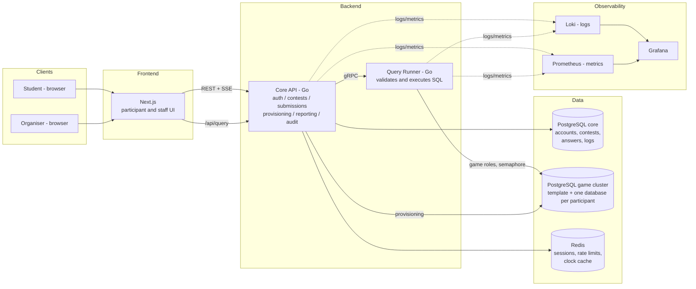
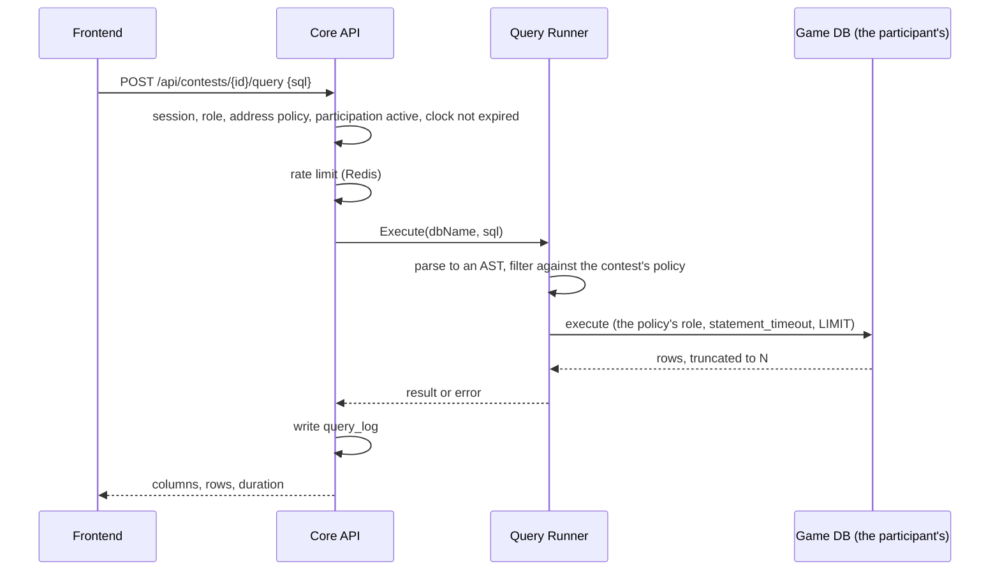
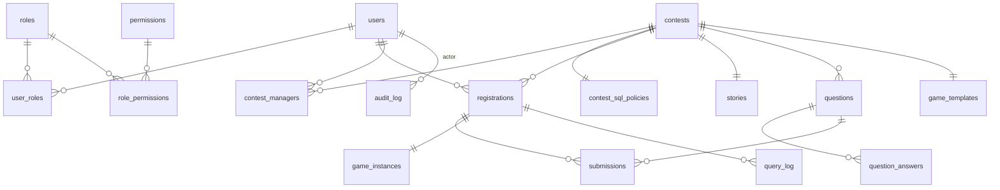

# DB Contest — architecture

A platform for running university SQL olympiads in a detective format:
students are given the story of a crime and a database holding the evidence,
write SQL in a browser, answer questions from what the queries tell them, and
name the culprit.

This document is the implementation's foundation. Every decision that mattered
is recorded here together with what was considered instead and why it lost.
Where a decision has since been revisited, the revision is written beside the
original rather than replacing it: a document that only ever shows the current
answer teaches nobody why the earlier one failed.

## 1. Architectural style

### What was considered

| Option | For | Against |
|---|---|---|
| **A classic monolith** | Simple to deploy and to debug | Student SQL runs inside the same process — one heavy query or one vulnerability reaches the whole application |
| **Microservices** (auth, contest, query, reporting…) | Independent scaling | For a university system — hundreds of participants, one development team — the operational cost is out of proportion: service discovery, distributed transactions, API versioning |
| **Serverless** | No infrastructure while idle | The system is on-premise, and long-lived SQL sessions and database provisioning sit badly on FaaS |

### The decision: a modular monolith plus a separate Query Runner

The backend is **one Go process with firm module boundaries** — auth,
contests, submissions, reporting, audit. Exactly one component is split out
into a **service of its own**: the **Query Runner**, which executes the SQL
students write.

Why that line and not another:

1. **Failure isolation where it is actually needed.** The one source of
   unpredictable load is student SQL. With the Query Runner in its own
   process, sign-in, the clock and answer submission keep working even when it
   degrades — an out-of-memory kill, connections that will not close.

   "Degrades" is too soft for the real reason. The Runner links **PostgreSQL's
   own parser through cgo** to inspect a statement before running it. That is
   C code reading text an attacker chose, and a crash there is not a Go panic
   that `recover` catches — it is the end of the process. Inside the Core API,
   a well-chosen query would be a **reproducible way to take down sign-in, the
   clock and answer submission**, and breaking the console is literally the
   content of the olympiad. The probability is low, the consequence is total,
   and the input is adversarial by construction.

   The build is part of the same argument. Every other binary compiles with
   `CGO_ENABLED=0` and ships on `distroless/static`, with no libc at all. The
   Runner needs cgo, and needs libc at runtime. Were it part of the Core API's
   binary, cgo, a compiler in the build and libc in the image would come with
   it — widening the attack surface of the API, the migrations and the
   bootstrap job for the sake of one component. So the Runner has an image of
   its own, `db-contest-queryrunner`, on `distroless/base`.

2. **Only the Runner holds the game cluster's credentials.** In one process
   with the Core API, a mistake in any handler would be within reach of the
   participants' databases. The configuration is split so that the Core API's
   settings structure physically cannot name the game cluster.

3. **Minimal operational cost.** Two services instead of ten: deployment stays
   a Docker Compose file, and the security boundary is drawn where it earns
   its keep.

4. **Room to grow.** The module boundaries inside the monolith let reporting
   or provisioning move out later without a rewrite.

Scaling each part independently is a real advantage of the split and almost
irrelevant at this size: nobody replicates a single on-premise machine serving
a few hundred participants. It is recorded as "do not make it impossible
later", not as a reason the decision was taken.

## 2. Components, and how they talk



### 2.1 Frontend (Next.js)

One application, two areas divided by role:

- **The participant's side**: the contests open to them, with a "take part"
  button on the open ones (section 7.1); the contest page with the story, the
  clock and the questions; the SQL console — an editor with highlighting, a
  result table, a query history; and a profile carrying their progress and
  results.
- **The staff side**: accounts and roles (system administrator only); the
  contest builder — story, questions, reference answers, the game schema,
  registration type and address restrictions (section 7.1); participant
  management, one at a time or imported from CSV for an `invite_only` contest;
  the contest's SQL policy; appointing contest managers; live monitoring of a
  contest in flight and of each participant — what they did, live and
  afterwards (section 9.4); the query log with a live mode and export
  (section 9.1); and reports. What a person sees is decided by role: a system
  administrator sees everything, a contest's owner and managers see their own
  contests (section 7).

**The SQL console in more detail.** The invariant that matters: everything a
student does in the console is either a read from cache or a query through the
one pipeline — `queryproxy` → Query Runner (sections 4.3 and 5). The interface
has no privileged side door to the database, so no button in it can load the
cluster harder than admission control allows, and none can affect another
participant.

- **The result** is a table with column names and types, `NULL` shown as
  itself, a row count and an execution time. When the result was cut, a banner
  says so — "the first 1000 rows; narrow the query". A database error is shown
  against the place it happened (PostgreSQL returns the position, and the
  editor highlights it); a validator refusal is shown as a readable reason
  ("the function X is not supported"). What came back can be downloaded as
  CSV, built from the rows already sent rather than from a second trip to the
  database.
- **The query history** holds the participant's own queries, from `query_log`,
  with their status and timing; clicking one restores it in the editor. It
  doubles as saved work: a way back to the query that worked after a run of
  ones that did not.
- **Notes and editor tabs** are the participant's workspace, kept on the
  server so it survives a reload and a change of machine; the limits are in
  section 6.4. It is not private: the contest's organiser sees it along with
  its edit history, and the screen tells the participant so (section 9.4).
- **The schema browser** is a permanent panel on the left of the console: a
  tree of tables and columns with their types and foreign keys, plus a
  generated ER diagram of the game schema. Its source is a **cached
  description of the schema**, built once when the template was built, so
  clicking through the tree costs no query against an instance and none of the
  student's rate limit. The "show me the data" button on a table is an
  ordinary generated `SELECT * FROM t LIMIT 50` that goes through the same
  pipeline under the same rules and limits — and appears in `query_log` like
  any other query.

Rendering: the App Router, with public pages server-rendered and the console a
client component. Every read goes to the Core API; Next.js has no database
access of its own.

### 2.2 Core API (Go, a modular monolith)

| Module | Responsibility |
|---|---|
| `auth` | Sign-in, sessions, the RBAC middleware |
| `users` | Profiles, account administration |
| `contests` | Contests, stories, questions and reference answers; the contest's SQL policy; appointing managers; the lifecycle (draft → published → running → finished) and the clock |
| `registrations` | Enrolment — self-service for `open`, by a manager for `invite_only` — and the start and finish of one participant's run |
| `submissions` | Taking answers, checking them, scoring |
| `provisioning` | Creating and removing participants' game databases from a template: a worker queue plus a pool of spares (section 4.2) |
| `queryproxy` | A thin façade: takes SQL from the interface, applies the rate limit, hands it to the Query Runner, writes the query log |
| `reporting` | Statistics, leaderboards, export |
| `audit` | The append-only record of what staff did |
| `monitor` | Watching a participant: browser and server signals, the history of their notes and tabs, a fingerprint of each query; and the organiser's reads — a participant table with flags, a combined feed, queries, answers, workspace, CSV (section 9.4) |

Modules talk to each other only through Go interfaces — never by reaching into
another module's tables. Those interfaces are the seams a future split into
services would cut along.

### 2.3 Query Runner (Go, a separate service)

A stateless service with one job: execute one student's SQL query in that
student's game database, safely, and return the result. Section 5 has the
detail. It speaks gRPC to the Core API on a private network and is not
reachable from outside.

### 2.4 The paths that matter

**A student runs a query:**



**A contest starts for a participant:** enrolment puts the creation of
`game_c{contest}_u{user}` on the provisioning queue — or binds a copy already
waiting in the pool (section 4.2) — the row in `game_instances` reaches
`ready`, and the console opens when the contest starts. After the finish plus
a grace period the databases are dropped.

## 3. The stack

| Layer | Choice | Why |
|---|---|---|
| Backend | **Go 1.26**, the **chi** router, **pgx/v5** | chi is minimal and stdlib-compatible; pgx is used directly, with SQL kept inside the `postgres` package rather than generated (section 3.2) |
| Parsing student SQL | **pg_query_go**, a binding for PostgreSQL's own parser | Validation against a real AST. A regular expression over SQL is a filter that can be walked around |
| Between the services | **gRPC** | A strict contract between the Core API and the Query Runner. The choice has been revisited: HTTP with JSON would need less machinery, since `platform/httpx` and an error-code contract already exist, and the case for gRPC rests on one thing — being able to stream a result one day. While a result is at most 1000 rows and 5 MB that is the only argument, and it is worth remembering as a condition rather than a given |
| Frontend | **Next.js 16** (App Router, TypeScript), **CodeMirror 6** for the SQL editor, **Tailwind CSS 4** | Data is read through server components and server actions; there is no client-side query cache to keep in sync |
| Core database | **PostgreSQL 16** | The relational model fits the domain, and one engine for both clusters keeps operations simple |
| Game cluster | **A separate PostgreSQL 16 instance** | Physically apart from the core. PgBouncer was dropped deliberately: its pools are keyed by database and role, and every participant has a database of their own, so there would be nothing to multiplex. Connections are managed by the Query Runner (section 4.3) |
| Cache, sessions, rate limits | **Redis 7**, optional | Sessions, rate-limit windows, the clock cache, the leaderboard. Behind a `Cache` interface: without Redis an in-process store takes over — section 3.1 |
| Migrations | **golang-migrate** | Versioned SQL against the core database |
| Logs | **slog** as JSON → stdout → **Promtail → Loki** | The standard library, structured; Loki is cheaper than ELK and sufficient |
| Metrics | **Prometheus + Grafana**, optional | Behind a `Recorder` interface: the backend switches to a log digest or off entirely — section 3.1 |
| Deployment | **Docker Compose**, on-premise | The system is local; the path to Kubernetes is in section 12 |

Passwords are hashed with **argon2id**. Authentication is a **server-side
session** — an httpOnly cookie plus the cache — rather than a JWT, because a
session can be revoked the moment it has to be: a disqualified participant, a
compromised account. There is no window in which a token is still good.

## 3.1 Which dependencies are required, and which are not

Not every dependency is equal, and the system says which is which. One part of
it is meaningless without its external component; another simply works worse.
Every optional dependency sits behind an interface, every one has a built-in
replacement, and choosing the replacement is always loud, never silent.

| Dependency | Class | Without it | At startup |
|---|---|---|---|
| **PostgreSQL (core)** | required | no accounts, contests or answers — there is nothing to serve | refuses to start, with a clear reason |
| **PostgreSQL (game cluster)** | required for play | student SQL cannot run | staff screens and reports work, the console does not |
| **Redis** | optional | sessions, rate limits and cache move into the process | starts with a warning |
| **Prometheus** | optional | metrics go to the log stream, or nowhere | starts according to `METRICS_BACKEND` |
| **Loki / Grafana** | optional | logs stay in the container's stdout | no effect on the service |

### The cache: Redis or memory

`Cache` is an interface — `Get`, `Set`, `Delete`, `Incr`, `Ping` — with two
implementations. An empty `REDIS_ADDR` selects the **in-process store**: an
LRU bounded by entry count, with a TTL on each entry. The bound is not
optional, because the keys are built from user input — session identifiers,
rate-limit subjects — and an unbounded map would be a way to grow until the
process dies.

The replacement is **not equivalent**, and the difference is not cosmetic:
memory is not shared between replicas, so sessions and limits drift apart, and
it is lost on restart. Therefore:

- the mode is good for **a single instance only**, and that is said in the
  startup warning, in `.env.example` and in the README;
- the active mode is reported by `/readyz` in a `cache` field, so the
  degradation is visible from outside rather than only in the first seconds of
  a log;
- if `REDIS_ADDR` **is set** and the server does not answer, that is a startup
  failure, not a reason to fall back to memory. The operator named an address;
  quietly using something else would hide a broken deployment and — with more
  than one replica — break shared sessions without a sign.

The contract for calling code: a failed `Get` is a miss for a read-through
cache, but **fails closed** for anything touching security. A session that
cannot be read means "not authenticated", never "authenticated".

### Metrics: a replaceable backend

Prometheus cannot fail for the application — it comes and fetches `/metrics`
itself. The problem is different: not making it required. `Recorder` is an
interface with one observation method and three implementations, chosen by
`METRICS_BACKEND`:

| Value | Behaviour |
|---|---|
| `prometheus` (default) | a private registry and a `/metrics` endpoint on the internal port |
| `log` | aggregation in memory and a periodic digest into the log stream — counts, mean and maximum per method, route and status |
| `none` | observations are dropped |

Two consequences are pinned by tests. Instrumentation is **identical** across
backends, so changing the backend changes where the numbers go and never what
is measured; and `/metrics` is registered **only** when the backend serves it,
because an empty page would tell a scraper the service is instrumented while
its numbers are somewhere else. An unknown `METRICS_BACKEND` is a startup
failure: a typo should be caught when configuration loads, not discovered
after an olympiad as "we recorded nothing".

The principle underneath: **metrics are diagnostics**. No branch of their code
may affect how a request is served.

## 3.2 Changing the database: where the seam runs

An honest assessment rather than a claim of portability.

**The game cluster cannot be changed, and that is deliberate.** The product
rests on PostgreSQL specifically: `CREATE DATABASE … TEMPLATE` for
provisioning, `pg_query_go` for validating student SQL against a real AST,
roles carrying `statement_timeout`, `temp_file_limit` and a per-database
`CONNECTION LIMIT`, the behaviour of `EXPLAIN`. The subject of the olympiad is
"students write SQL against PostgreSQL". An abstraction here would offer the
illusion of a choice and charge a great deal for it.

**The core database can be changed, and the seam runs at the repository, not
at the driver.** Abstracting `Query` and `Exec` is pointless: such a wrapper
leaks the driver's types and buys no portability. Instead each domain module
declares the interface it needs, in its own vocabulary:

```go
// The consumer declares the interface, not the implementation — the Go idiom.
type ContestRepository interface {
    ByID(ctx context.Context, id uuid.UUID) (Contest, error)
    Save(ctx context.Context, c Contest) error
}
```

The implementation lives in a package of its own (`postgres`), SQL never
leaves it, and handlers and business logic know only the interface. Changing
the database means a new implementation package and not one edit in domain
code. The side benefit matters more than the hypothetical migration: business
logic is tested without a database at all.

**Transactions are part of the same seam.** The architecture needs unlike
writes to be atomic — an accepted answer updates a score and appends an audit
entry, and either both land or neither does. That is `UnitOfWork`:

```go
type UnitOfWork interface {
    Do(ctx context.Context, fn func(ctx context.Context) error) error
}
```

The transaction travels in the context and repositories take it from there
(`storage.QuerierFrom(ctx, pool)`), so one repository method works both alone
and inside somebody else's transaction, and handlers never hold a transaction
object at all. A nested call joins the outer transaction rather than opening a
second one: PostgreSQL has no independent nested transactions, and silently
opening one would break the very atomicity the caller wrapped the work for.

## 4. Isolating the game databases

The requirement: every participant works in **their own copy** of the game
database and cannot bring the system down.

### What was considered

| Option | For | Against |
|---|---|---|
| **A. One shared game database** | Cheap | One heavy query degrades everybody; no isolation |
| **B. A schema per participant** (`search_path`) | Light; thousands of schemas in one database | Isolation is logical: one mistake in privileges and a participant sees somebody else's schema; shared buffers are common |
| **C. A database per participant in a shared game cluster** ✅ | A hard visibility boundary — a cross-database query is not possible — fast provisioning from a template, simple removal | More overhead than schemas, which is acceptable up to one or two thousand participants |
| **D. A PostgreSQL container per participant** | Maximum isolation, with CPU and memory quotas | Heavy: hundreds of containers and their orchestration, unjustified when load is governed by admission control (section 4.3) |

### The decision: option C

- An organiser supplies the game schema — as a SQL script, an uploaded dump or
  a table-by-table description — and provisioning builds a **template
  database**, `game_tpl_c{contest}`, and validates it.
- A participant's instance is made with `CREATE DATABASE game_c{id}_u{id}
  TEMPLATE game_tpl_c{id}`. The operation has hard constraints — nothing may
  be connected to the template while it is copied, and creating hundreds of
  databases at once saturates disk and WAL — so databases are **never created
  in a rush at the start**. They are made ahead of time, through a queue with
  a pool of spares (section 4.2).
- Only the **Query Runner** reaches a game database, under one of two roles.
  Which one is decided by the contest's SQL policy (section 4.1):

```sql
-- The base role: read only, and the default
CREATE ROLE game_reader LOGIN CONNECTION LIMIT 60;
ALTER ROLE game_reader SET default_transaction_read_only = on;
ALTER ROLE game_reader SET statement_timeout = '5s';
ALTER ROLE game_reader SET idle_in_transaction_session_timeout = '5s';
ALTER ROLE game_reader SET work_mem = '16MB';
ALTER ROLE game_reader SET temp_file_limit = '64MB';
GRANT SELECT ON ALL TABLES IN SCHEMA public TO game_reader; -- in the template

-- The wider role: for contests that ask participants to write, or to CREATE VIEW
CREATE ROLE game_writer LOGIN CONNECTION LIMIT 60;
ALTER ROLE game_writer SET statement_timeout = '5s';
ALTER ROLE game_writer SET idle_in_transaction_session_timeout = '5s';
ALTER ROLE game_writer SET work_mem = '16MB';
ALTER ROLE game_writer SET temp_file_limit = '64MB';
-- Individual grants are issued when the template is built, from the policy:
--   GRANT INSERT, UPDATE, DELETE ON <the permitted tables> TO game_writer;
--   GRANT CREATE ON SCHEMA work TO game_writer;  -- for views and own tables

-- The roles' CONNECTION LIMIT is the last line, not the first: what actually
-- bounds concurrent execution is the Query Runner's semaphore (section 4.3).
-- On each instance as well: ALTER DATABASE <db> CONNECTION LIMIT 2;
-- and the sensitive catalogues are revoked in the template (section 5):
--   REVOKE SELECT ON pg_catalog.pg_database, pg_catalog.pg_stat_activity,
--                   pg_catalog.pg_roles, pg_catalog.pg_settings FROM PUBLIC;
```

**Which of those is a boundary and which is merely a default.** Checked
against a live cluster rather than inferred from documentation, because the
difference is invisible in the SQL itself:

| Mechanism | Does it hold against SQL that got past the validator? |
|---|---|
| Privileges — a `GRANT`, or its absence | **Yes.** A role without `INSERT` does not insert, and no session setting changes that. This is what stops **every** write |
| `REVOKE` on the sensitive catalogues | **Yes.** And it is inherited by `CREATE DATABASE … TEMPLATE`, or it would never reach the participant at all |
| `temp_file_limit` | **Yes.** Not a `USERSET` parameter; a session cannot raise it |
| `statement_timeout` | **No.** `USERSET` — `SET statement_timeout = 0` removes it in one line |
| `default_transaction_read_only` | **No.** `USERSET`, removed the same way |

Hence a correction worth stating plainly: `default_transaction_read_only` is
not what forbids writing. Missing grants forbid writing; the setting only
produces a clearer error sooner. And against unvalidated SQL, execution time
is bounded not by the role but by the Query Runner's own deadline and its
cancellation — which the SQL cannot reach (section 4.3). The role's settings
stay because they bound the ordinary case, which is every query as long as
nothing else has already broken.

- The game cluster is a **separate PostgreSQL instance**, in its own container
  with its own memory limits. Even its total collapse leaves the core database
  alone: sign-in, answers and the clock keep working.
- A student **never gets network access to a database**. The only way in is
  the interface: console → Core API → Query Runner. The game cluster's port is
  not published outside.

### 4.1 A contest's SQL policy

Not every olympiad is the same. The basic detective story is pure reading, but
a more advanced one may ask a participant to keep their own notes in a table,
mark evidence, or build a view for an intermediate conclusion. The level of
access is **a setting of the contest**, chosen by a system administrator or a
contest manager through a form — never raw SQL:

| Policy field | Values | Default |
|---|---|---|
| `mode` | `read_only` \| `read_write` | `read_only` |
| `writable_tables` | the game tables INSERT/UPDATE/DELETE is allowed on | empty |
| `allow_create_view` | the participant may create and drop **their own** views | `false` |
| `allow_own_tables` | the participant may create **their own** tables, for notes or working data | `false` |
| `allow_temp_tables` | temporary tables are allowed | `false` |

How it holds together:

- **The game's data and the participant's own objects are separated by
  schema.** The contest's data lives in `public` (or `game`); building the
  template also creates an empty schema **`work`**, and that is the only one
  `game_writer` is granted `CREATE` on. A participant's views and tables go
  into `work`, and the template's tables cannot be altered structurally —
  there is no `ALTER` or `DROP` privilege on `public`. Writing into a game
  table is only ever an individual grant on a table named in
  `writable_tables`.
- **The policy is applied twice**, as everything here is: the Query Runner
  filters statements by AST against the policy (section 5), and the grants in
  the template enforce the same thing at the database, even if the validator
  is wrong.
- **Isolation is what makes writing safe.** Because each participant has their
  own database, their inserts, updates and views are visible only to them. The
  integrity of anybody else's data is not at stake by construction.
- **"Reset my database".** In a writing mode a participant can ruin their own
  data, so the interface offers a reset: provisioning recreates their instance
  from the template in seconds, and the fact is written to the audit trail and
  the query log. Resets and removals use `DROP DATABASE … WITH (FORCE)`
  (PostgreSQL 13+), so an active session is terminated automatically and a
  hung statement cannot block the rebuild.
- **Disk quotas.** Writing opens a denial-of-service vector: fill the disk.
  Three levels answer it. (1) Before every DML the Query Runner checks the
  instance's size against a cache refreshed after each DML, and refuses the
  query when the quota — five times the template's size by default,
  configurable in the policy — is exceeded. (2) A background monitor reading
  `pg_database_size()` is the safety net, putting an over-quota instance into
  read-only (`ALTER DATABASE … SET default_transaction_read_only = on`) with a
  message the participant can understand. The race inside a **single**
  statement — an `INSERT … SELECT` that crosses the quota before the next
  check — cannot be removed entirely, but the overshoot is bounded by what can
  be written within `statement_timeout`, five seconds. (3) The cluster's disk
  is planned with room for that worst case multiplied by the number of
  concurrent DML statements, which the semaphore bounds.

  `temp_file_limit` bounds temporary files separately. The size check applies
  only to writing that can grow the database: a statement that can only shrink
  it — `TRUNCATE`, or dropping one's own object — passes even at the quota
  (`sqlpolicy.Statement.Frees`, decided by the validator from the parse tree
  rather than by the Runner from the text). Otherwise the limit would be a
  one-way door: at the quota, the only statements able to free space would be
  refused along with the rest, and a participant who filled their database in
  two queries would never get out of it — while the refusal itself advises
  them to free some space. `DELETE` is not on that list and cannot be: the
  rows go, the pages stay with the database, and `pg_database_size` does not
  move.

  `TRUNCATE` is granted alongside `INSERT`, `UPDATE` and `DELETE` in two
  places: when a contest's template is built, and again on every instance
  copied from it (`gamedb.settleInstance`). The second exists for contests
  created earlier: a copy inherits the template's catalogue as it was when the
  template was built, so a template without that privilege would hand a
  participant a PostgreSQL refusal on a statement the validator had allowed —
  along with advice to free space that they cannot follow. Granting on the
  instance makes the privilege a property of the deployed version rather than
  of the template's build date: no rebuild is needed for `TRUNCATE`, and
  granting what a copy already inherited changes nothing.
- **Changing the policy after publication** is refused while the contest is
  `running`, or participants would be competing under different rules. Before
  the start it is allowed, lands in the audit trail, and requires the template
  to be rebuilt, because the grants come from it.

### 4.2 Provisioning without a spike

`CREATE DATABASE … TEMPLATE` is not free, and provisioning is designed so that
it never runs in bulk at the moment that matters:

- **A queue with bounded concurrency.** Every creation goes through the
  provisioning queue, two to four workers wide: a database is made when a
  participant registers or is added, spread over the time before the start
  rather than fired off at it. Queue depth is a metric with an alert
  (section 9).
- **A pool of spares.** For each published contest, provisioning keeps K spare
  copies ready (`game_pool_c{id}_NNN`). K is not a number from configuration
  but the roster's own answer: everybody who has no copy yet, plus
  `GAME_POOL_DEPTH` for whoever enrols next (`provisioning.Service.
  RosterDepth`). Two different limits cut it down. `GAME_POOL_MAX` is how many
  copies one contest may ask for; by itself that is not a disk limit, because
  500 copies is 10 GiB with a 20 MiB template and a terabyte with a 2 GiB one.
  `GAME_CLUSTER_MAX_BYTES` is how many bytes the whole cluster may occupy
  together: provisioning asks `DatabaseSize` for the template — what one copy
  costs — and `ClusterBytes` for what is already taken, and hands out exactly
  as many copies as fit. The budget is per cluster and not per contest,
  because a per-contest quota multiplied by the number of live contests
  bounds nothing. When either limit binds, the tick logs a warning carrying
  both figures: a pool that quietly stopped growing is worse than one that
  says why.

  Binding a copy to a participant is a name written into `game_instances`, and
  is instant. The pool is refilled in the background: the ordinary tick is
  once a minute for published and running contests — nothing else needs it,
  since nobody enrols on the rest — while a registration, a roster import and
  a contest entering `running` additionally **wake the tender at once** rather
  than waiting out the minute blindly. The alarm (`provisioning.Tender`)
  collapses any number of wake-ups raised before the tender read its channel
  into one extra pass: however many requests arrive together, there is still
  one tick, and it visits every live contest rather than only the one that
  woke it. Only a committed change can wake it — a registration rolled back
  with its transaction does not.
- **Late enrolment, on an open contest.** Somebody enrolling just before the
  start gets a database from the pool; if the pool is empty they see "your
  database is being prepared", and the console opens on a readiness event over
  SSE, usually within tens of seconds. An enrolment deadline — ten minutes
  before the start, say — is available as an option.

  `GAME_CLUSTER_MAX_BYTES` binds here too, not only in the background tender:
  `provisioning.Service.Ensure` does the same arithmetic (`roomForOneCopy`)
  before `CREATE DATABASE` and refuses with `ErrClusterFull`, which reaches
  the client as `503 game_cluster_full`. Without that check the budget bounded
  only the pool: with a 3 GB template and the default 64 GiB, the pool would
  honestly stop at around twenty copies while every other participant created
  one outside the budget until the host's filesystem ran out — and then
  PostgreSQL stopped for everybody, not only for the latecomers. Rebuilding an
  existing copy under the same name is not charged to the budget:
  `CreateInstance` drops the old one first, so the cluster does not grow.
- **A template's size is read once per version.** A participant's quota is a
  multiple of the template's size (`Service.Quota`), and every query used to
  cost a `SELECT pg_database_size(...)` against a ten-connection maintenance
  pool that `CREATE DATABASE … TEMPLATE` and the janitor hold for minutes at a
  time. A template does not change until it is rebuilt, and a rebuild raises
  the version — so the version is the invalidation rule
  (`provisioning.templateSizes`).
- **Rebuilding a template invalidates copies.** Any rebuild — a new game
  schema, a policy change before the start — increments
  `game_templates.version`. Provisioning then drops **every free copy in the
  pool and every instance already created** at the old version and remakes
  them through the queue, so nobody can be handed a database with stale grants
  or stale data. `game_instances.template_version` makes the drift
  detectable, and "every instance is at the current version" is a condition of
  a contest entering `running`.
- **Template discipline.** Nothing may be connected to a template while
  `CREATE DATABASE` copies it: the builder role is disconnected as soon as the
  build finishes, and an organiser previewing the game schema does so on a
  separate copy, never on the template.
- **The copy strategy** (PostgreSQL 15+) is `WAL_LOG` by default — no
  checkpoints, but the whole volume passes through WAL — against `FILE_COPY`,
  faster for large templates but two checkpoints per operation. The choice is
  provisioning's configuration, to be measured at the target template size
  during the pilot.
- **Plan B.** The provisioning interface is not tied to a database per
  participant. If the pilot shows provisioning to be the bottleneck at the
  target sizes, option B — a schema per participant — becomes an alternative
  implementation behind the same Query Runner, at a deliberate cost in
  isolation.

### 4.3 Isolating performance: admission control

Stated honestly: option C fully isolates **what data can be seen**, but an
instance's CPU, disk and memory are shared. `statement_timeout` bounds one
query and not the total load — two hundred participants each running a heavy
query will bring the instance down, timeout or no timeout. The total is
governed by **admission control in the Query Runner**:

- **The deadline is held by the client, not by the role.** `statement_timeout`
  is a `USERSET` parameter: a query that reached the database unchecked
  removes it in one line. So the Query Runner keeps its own deadline on the
  connection's context and cancels the query itself; the role's setting
  remains the second line for the ordinary case. That is the difference
  between "bounded" and "bounded by the one being bounded".
- **One concurrent query per participant**, plus a **global semaphore** over N
  concurrent executions on the instance, N being on the order of two to three
  times the core count. Beyond N there is a short FIFO queue; when that
  overflows the answer is immediate — "the system is busy, try again in a few
  seconds" — rather than a hang.
- **A read connection is kept until the next query.** Establishing one — TCP,
  SCRAM-SHA-256, forking a backend — costs about five milliseconds of server
  CPU on the test cluster, as much as a participant's typical join. So the
  Runner keeps at most one idle connection per participant database
  (`QUERY_CONN_IDLE_TIMEOUT`, thirty seconds by default) and resets the
  session with `DISCARD ALL` before leaving it. Only a read that finished
  without an error and without a cancellation leaves its connection behind;
  a write, an error, a cancellation and a deadline all close it as before.
  Every connection the Runner holds, busy or idle, counts against
  `QUERY_CONCURRENT`: at the boundary the least recently used idle one is
  closed, so the cluster's memory arithmetic does not change. The database's
  own backstop is `CONNECTION LIMIT 2` per instance and the role's overall
  limit — both of which only ever fire if the semaphore is broken.
- **Container boundaries.** The game cluster runs in a container with cgroup
  limits on CPU, IO and memory, so even total degradation stays inside the
  resources it was given, and the core database on its own instance is
  untouched.
- **One backend's memory is bounded separately from the container's.** The
  container limit (`GAME_DB_MEMORY_BYTES`) stops the whole cluster when
  exceeded — the OOM killer ends the postmaster and every participant with it.
  A per-process limit (`ulimits.data` in `docker-compose.yml`, taken from
  `GAME_DB_PROCESS_MEMORY_BYTES`, 256 MiB by default) turns an overflow from a
  shared collapse into `ERROR: out of memory` inside the one backend that
  overflowed, while every other session carries on. Legitimate work — building
  an index, `CREATE DATABASE … TEMPLATE`, `VACUUM`, a parallel query — stays
  well under the limit, which was measured with room to spare. Parallel
  workers share memory the limit does not cover, so the participant's role
  bounds their number too (`max_parallel_workers_per_gather=1` in the session
  defaults) — but the memory boundary is held by the process limit, not by
  that setting.
- **The Runner refuses to start with arithmetic the cluster cannot survive.**
  `QUERY_CONCURRENT` decides not only the queue's length but the memory
  footprint: each concurrent query is one more process against the limit. The
  formula the Runner checks at startup is `(QUERY_CONCURRENT + the cluster's
  parallel workers + concurrent template builds) × per-process limit + reserve
  ⩽ GAME_DB_MEMORY_BYTES`, where the reserve covers `shared_buffers`, the
  shared memory of parallel workers, the postmaster itself and autovacuum.
  Deployment (`cmd/gamedb`) checks the same equation again against the real
  cluster rather than against the declaration in the variables: a freshly
  prepared instance confirms its own process limit — by reading
  `/proc/self/limits` from inside the cluster — its worker count, its build
  concurrency and the container's memory limit from its own cgroup, and
  refuses to finish preparing the cluster if any of them disagrees with what
  the environment claims.
- **A query whose client left does not run forever.** The Runner cancels a
  query when its own deadline expires or when the caller cancelled the RPC —
  with a `CancelRequest` to the server rather than by dropping the connection,
  which the executing backend would not notice. The separate safety net, for
  when neither a deadline nor a cancellation arrives at all because the Runner
  died or the network vanished without a TCP reset, is the role's
  `client_connection_check_interval` at 250 ms: the backend periodically
  checks that its client is still there and ends itself when it is not.
  Without it such a backend would stay active indefinitely — occupied by
  nobody, yet subtracted from the process count the arithmetic above depends
  on.
- **Optional, behind a policy flag:** a pre-flight `EXPLAIN` with a plan-cost
  threshold, cutting off the obviously explosive — a Cartesian product over
  large tables — before it runs. A heuristic, not a guarantee; off by default.
- **Growth** means sharding participants across several game instances
  (section 12); admission control applies to each instance separately.

## 5. Executing student SQL safely

Classic injection defence does not apply here, because SQL *is* the user
input. The threat model is denial of service through heavy queries, attempts
to write or run DDL, escaping one's own database, and extracting information
about the installation. The defence is layered:

1. **Authentication and context.** A query is accepted only from a participant
   with an active registration in a running contest. The target database's
   name comes from `game_instances` on the server; the client never sends it.
   The Runner, for its part, obeys only the Core API: every gRPC call, unary
   or streaming, carries the shared `QUERY_RUNNER_TOKEN` in its metadata,
   compared in constant time over the SHA-256 of both sides rather than the
   bytes themselves — otherwise anyone who could reach the Runner would choose
   the database and the policy instead of the Core API. By default the Runner
   listens on loopback only (`127.0.0.1:9100`, and Compose's private network
   keeps it apart); outside `ENV=development` both processes refuse to start
   without a valid token rather than allowing a call without one.
2. **Rate limiting and admission control.** A sliding window in the cache —
   thirty queries a minute per participant, say — one concurrent query per
   participant, and the global semaphore over concurrent executions on the
   instance (section 4.3). Exceeding it is an HTTP 429 with a message a person
   can read.
3. **Allow-list validation over the AST** (`pg_query_go`, inside the Query
   Runner; the policy comes from section 4.1, handed over with the query). The
   validator **permits only what it recognises**, and everything unrecognised
   is refused. There is no block list, because a block list is always
   incomplete:
   - exactly **one** statement;
   - permitted root nodes are `SELECT`, `WITH … SELECT` and `EXPLAIN`, plus —
     where the policy allows — `INSERT`/`UPDATE`/`DELETE` restricted to
     `writable_tables`, `CREATE [OR REPLACE] VIEW` and `DROP VIEW`,
     `CREATE`/`DROP TABLE` restricted to the `work` schema, and
     `CREATE TEMP TABLE`;
   - walking the tree, every node must belong to a known safe set —
     expressions, joins, subqueries, aggregates, window functions, CTEs. Any
     other node type (`COPY`, `SET`, `DO`, DDL outside the policy, and
     anything the validator does not know) is refused as "that construct is
     not supported";
   - function calls go through an **allow list** of standard PostgreSQL
     functions — arithmetic, strings, dates, aggregates, windows. Functions
     like `pg_sleep`, `pg_read_file`, `dblink` and `lo_*` are simply not in
     it. False refusals are the operational price of an allow list, so there
     is a process around it: the list lives in configuration and can grow
     without a release, changes are audited, a refusal is logged with the
     function's name ("the function X is not supported"), and the query-log
     panel (section 9.1) aggregates such refusals so the list can be extended
     from what the pilot actually found;
   - functions that build a large value or a long series of rows from a small
     argument (`repeat`, `lpad`, `rpad`, `format`, `generate_series`) are
     allowed only when the size argument is a number written directly in the
     query text — not a column, not a subquery, not arithmetic — and is no
     larger than a set limit (`internal/sqlpolicy/checker`:
     `MaxGeneratedLength` at 10,000 characters, `MaxSeriesLength` at 100,000
     values). The reason is that PostgreSQL builds such a value whole, inside
     the backend, before `LIMIT`, the Runner's deadline or the response's byte
     budget can reach it — those discard memory already allocated rather than
     preventing the allocation. A size argument that is not a literal number
     is allowed without a size check: that boundary is held by the
     per-process memory limit below, not by the validator. Aggregates over a
     table's real rows (`string_agg`, `array_agg` and the like) are not
     bounded by this rule at all — their ceiling is the data the organiser
     loaded, not a number the participant chose;
   - catalogues: the **structural** ones (`pg_class`, `pg_attribute`,
     `information_schema`) are allowed by default, because looking at the
     shape of the tables is useful to a student, and `allow_catalog` turns
     them off. The **sensitive** ones (`pg_database`, `pg_stat_activity`,
     `pg_roles`, `pg_settings`) are always forbidden, by the validator and by
     the `REVOKE` in the template (section 4): a participant has no business
     seeing other databases' names or other people's activity.
4. **Database privileges are the real boundary.** `game_reader`, or
   `game_writer` with individual grants from the same policy;
   `statement_timeout=5s`; memory and temp-file limits; the sensitive
   catalogues revoked (section 4). Even a complete bypass of the validator
   yields neither a write outside the policy nor an escape from one's own
   database — but what guarantees that is the **privileges**, not
   `statement_timeout` and not `default_transaction_read_only`, both of which
   are `USERSET` and removable in one line (the table in section 4). The
   validator and the grants are built from **one** description of the policy,
   so they cannot drift apart.
5. **Bounding the result.** A `SELECT` is wrapped — `SELECT * FROM (…the
   query…) q LIMIT 1001` — and at 1001 rows the interface is told the result
   was truncated to 1000. There is a response-size limit as well, five
   megabytes. For DML, the number of affected rows comes back instead.
6. **The execution context.** Every query runs in its own transaction:
   `READ ONLY` for a read, an ordinary one for DML or DDL the policy allows. A
   read's connection may serve the next query against the same database, but
   only after `DISCARD ALL`; a write's, an error's or a cancellation's is
   closed (section 4.3). `DISCARD ALL` resets session settings to the role's
   and the database's, releases session advisory locks, drops temporary
   tables, prepared statements and the plan cache. What it does not reset: a
   user-defined variable with a dot in its name set through `set_config(...,
   false)` — after the discard, `current_setting('x.y', true)` returns an
   empty string rather than NULL — and the generator state left by `setseed`.
   Neither function is on the validator's allow list, and a connection serves
   only the database it was opened against, which is one participant's; there
   is no way to carry another participant's data or privileges through it.
7. **Complete logging, in two phases.** The `query_log` row is created
   **before** the query is sent to the Runner, with status `running`, and the
   result is written into it afterwards — so a Core API that dies between
   executing and recording does not lose the fact that a query ran, and rows
   left `running` are visible and marked `error` by a background job.
   Everything is logged, including queries the validator refused: it is both
   the audit trail and the material for reporting ("how many queries did this
   participant need"). For that, `query_log` is the one deliberate exception
   to append-only — the application may update the result fields of its own
   row. `audit_log` stays strictly append-only.

Who guarantees what: **database privileges** make writing outside the policy
and escaping one's own database impossible; **the validator** enforces shape
(one statement, a `LIMIT`), the policy and readable errors, and closes what
privileges do not — `pg_sleep` is available to any role, and what stops it is
the function allow list and the timeout; **admission control** owns resources,
where the timeout and the memory limits bound one query and the semaphore
bounds the total.

The rest of the API — sign-in, answers, the staff screens — uses **only
parameterised queries** through pgx, so classic injection is excluded by
construction.

## 6. The core database

The game database is arbitrary — an organiser defines it per contest. Only
the core schema is fixed.



```sql
-- Accounts and RBAC
CREATE TABLE users (
    id            uuid PRIMARY KEY DEFAULT gen_random_uuid(),
    login         text NOT NULL UNIQUE,          -- student number or username
    email         text UNIQUE,
    password_hash text NOT NULL,                 -- argon2id
    full_name     text NOT NULL,
    status        text NOT NULL DEFAULT 'active' -- active | blocked
        CHECK (status IN ('active','blocked')),
    created_at    timestamptz NOT NULL DEFAULT now(),
    updated_at    timestamptz NOT NULL DEFAULT now()
);

CREATE TABLE roles (          -- student, admin, organizer; extensible
    id   smallserial PRIMARY KEY,
    code text NOT NULL UNIQUE,
    name text NOT NULL
);

CREATE TABLE permissions (    -- contest.create, users.manage, reports.view …
    id   smallserial PRIMARY KEY,
    code text NOT NULL UNIQUE
);

CREATE TABLE role_permissions (
    role_id       smallint REFERENCES roles ON DELETE CASCADE,
    permission_id smallint REFERENCES permissions ON DELETE CASCADE,
    PRIMARY KEY (role_id, permission_id)
);

CREATE TABLE user_roles (
    user_id uuid     REFERENCES users ON DELETE CASCADE,
    role_id smallint REFERENCES roles ON DELETE CASCADE,
    PRIMARY KEY (user_id, role_id)
);

-- Contests
CREATE TABLE contests (
    id          uuid PRIMARY KEY DEFAULT gen_random_uuid(),
    title       text NOT NULL,
    description text,
    status      text NOT NULL DEFAULT 'draft'
        CHECK (status IN ('draft','published','running','finished','archived')),
    enrollment  text NOT NULL DEFAULT 'invite_only' -- how people join (section 7.1)
        CHECK (enrollment IN ('open','invite_only')),
    allowed_cidrs cidr[] NOT NULL DEFAULT '{}',   -- address restriction; empty means none
    timing      text NOT NULL DEFAULT 'fixed'     -- the clock's model (section 8)
        CHECK (timing IN ('fixed','individual')),
    duration_min int,                             -- session length when timing = individual
    starts_at   timestamptz,
    ends_at     timestamptz,
    settings    jsonb NOT NULL DEFAULT '{}',  -- query limits, grace period and the like
                                              -- (the SQL policy lives in contest_sql_policies)
    created_by  uuid NOT NULL REFERENCES users,
    created_at  timestamptz NOT NULL DEFAULT now()
);

CREATE TABLE contest_managers (   -- the staff of one contest
    contest_id uuid NOT NULL REFERENCES contests ON DELETE CASCADE,
    user_id    uuid NOT NULL REFERENCES users ON DELETE CASCADE,
    role       text NOT NULL DEFAULT 'manager'
        CHECK (role IN ('owner','manager')),
    granted_by uuid NOT NULL REFERENCES users,
    granted_at timestamptz NOT NULL DEFAULT now(),
    PRIMARY KEY (contest_id, user_id)
);

CREATE TABLE contest_sql_policies (  -- the SQL policy (section 4.1)
    contest_id        uuid PRIMARY KEY REFERENCES contests ON DELETE CASCADE,
    mode              text NOT NULL DEFAULT 'read_only'
        CHECK (mode IN ('read_only','read_write')),
    writable_tables   text[] NOT NULL DEFAULT '{}',
    allow_create_view boolean NOT NULL DEFAULT false,
    allow_own_tables  boolean NOT NULL DEFAULT false,
    allow_temp_tables boolean NOT NULL DEFAULT false,
    allow_catalog     boolean NOT NULL DEFAULT true,  -- the structural catalogues; the sensitive
                                                      -- ones (pg_database, pg_stat_activity…)
                                                      -- are closed always
    disk_quota_ratio  int NOT NULL DEFAULT 5,         -- quota = N × the template's size
    updated_by        uuid REFERENCES users,
    updated_at        timestamptz NOT NULL DEFAULT now()
);

CREATE TABLE stories (        -- the story of the crime
    id         uuid PRIMARY KEY DEFAULT gen_random_uuid(),
    contest_id uuid NOT NULL UNIQUE REFERENCES contests ON DELETE CASCADE,
    body_md    text NOT NULL,                 -- markdown
    updated_at timestamptz NOT NULL DEFAULT now()
);

CREATE TABLE questions (
    id           uuid PRIMARY KEY DEFAULT gen_random_uuid(),
    contest_id   uuid NOT NULL REFERENCES contests ON DELETE CASCADE,
    ord          int  NOT NULL,               -- display order
    kind         text NOT NULL DEFAULT 'text' -- text | choice | final (who did it)
        CHECK (kind IN ('text','choice','final')),
    body_md      text NOT NULL,
    points       int  NOT NULL DEFAULT 1,
    max_attempts int,                          -- NULL means unlimited
    choices      jsonb,                        -- for kind = choice
    UNIQUE (contest_id, ord)
);

CREATE TABLE question_answers (               -- the reference answers
    id          uuid PRIMARY KEY DEFAULT gen_random_uuid(),
    question_id uuid NOT NULL REFERENCES questions ON DELETE CASCADE,
    match_kind  text NOT NULL DEFAULT 'exact_ci' -- exact | exact_ci | regex
        CHECK (match_kind IN ('exact','exact_ci','regex')),
    value       text NOT NULL
);

-- Game templates and instances
CREATE TABLE game_templates (
    id           uuid PRIMARY KEY DEFAULT gen_random_uuid(),
    contest_id   uuid NOT NULL UNIQUE REFERENCES contests ON DELETE CASCADE,
    template_db  text NOT NULL,               -- game_tpl_c{short_id}
    version      int  NOT NULL DEFAULT 1,     -- rises on every rebuild (section 4.2)
    init_script  text NOT NULL,               -- the source SQL: DDL and data
    status       text NOT NULL DEFAULT 'pending'
        CHECK (status IN ('pending','building','ready','failed')),
    build_error  text,
    updated_at   timestamptz NOT NULL DEFAULT now()
);

CREATE TABLE registrations (
    id          uuid PRIMARY KEY DEFAULT gen_random_uuid(),
    contest_id  uuid NOT NULL REFERENCES contests ON DELETE CASCADE,
    user_id     uuid NOT NULL REFERENCES users ON DELETE CASCADE,
    status      text NOT NULL DEFAULT 'registered'
        CHECK (status IN ('registered','active','finished','disqualified')),
    started_at  timestamptz,  -- with timing = individual, this sets the deadline (section 8)
    finished_at timestamptz,
    total_score int NOT NULL DEFAULT 0,       -- denormalised for the leaderboard
    UNIQUE (contest_id, user_id)
);

CREATE TABLE game_instances (
    id              uuid PRIMARY KEY DEFAULT gen_random_uuid(),
    registration_id uuid NOT NULL UNIQUE REFERENCES registrations ON DELETE CASCADE,
    db_name         text NOT NULL UNIQUE,
    template_version int NOT NULL DEFAULT 1,  -- the template version it was copied from (4.2)
    status          text NOT NULL DEFAULT 'provisioning'
        CHECK (status IN ('provisioning','ready','failed','dropped')),
    created_at      timestamptz NOT NULL DEFAULT now()
);

-- Answers
CREATE TABLE submissions (
    id              uuid PRIMARY KEY DEFAULT gen_random_uuid(),
    registration_id uuid NOT NULL REFERENCES registrations ON DELETE CASCADE,
    question_id     uuid NOT NULL REFERENCES questions ON DELETE CASCADE,
    attempt_no      int  NOT NULL,
    value           text NOT NULL,
    is_correct      boolean NOT NULL,
    points_awarded  int NOT NULL DEFAULT 0,
    submitted_at    timestamptz NOT NULL DEFAULT now(),
    UNIQUE (registration_id, question_id, attempt_no)
);

-- Journals
CREATE TABLE query_log (
    id              bigserial PRIMARY KEY,
    registration_id uuid NOT NULL REFERENCES registrations ON DELETE CASCADE,
    request_id      uuid NOT NULL,             -- ties the row to the technical logs in Loki
    sql_text        text NOT NULL,
    status          text NOT NULL DEFAULT 'running' -- written in two phases (section 5, item 7)
        CHECK (status IN ('running','ok','rejected','error','timeout')),
    error_text      text,
    duration_ms     int,
    row_count       int,
    executed_at     timestamptz NOT NULL DEFAULT now(),
    ip              inet,                      -- the client's address (9.4); NULL before migration 33
    sql_fingerprint bigint                     -- hash of the normalised text, only from 60 characters (9.4)
);

CREATE TABLE audit_log (
    id         bigserial PRIMARY KEY,
    actor_id   uuid REFERENCES users,          -- NULL for a system event
    action     text NOT NULL,                  -- auth.login, contest.create, user.block …
    entity     text,
    entity_id  text,
    payload    jsonb,
    ip         inet,
    user_agent text,
    created_at timestamptz NOT NULL DEFAULT now()
);
```

Notes:

- **Answers are checked on the server**, against `question_answers` by
  `match_kind`. A reference answer never appears in an API response to a
  student.
- `audit_log` is strictly append-only: the application's role holds no UPDATE
  or DELETE privilege on it. `query_log` is almost append-only — the one
  permitted update writes the result into the row created before execution
  (section 5, item 7). As it grows, monthly partitioning.
- `total_score` is recomputed transactionally with every accepted answer, so
  the leaderboard needs no aggregation at read time.

## 6.1 How a contest asks its questions

A contest asks in one of two modes, `contests.question_mode`:

| Mode | What the participant sees |
|---|---|
| `multi` (default) | Several questions, each with its own points and attempts |
| `single` | One question carrying the whole olympiad: the classic "here is the story, name the culprit" |

Separate from the mode is a question's **visibility**, `questions.is_visible`.
A hidden question exists fully — it has reference answers and points — it is
simply not shown. The participant sees the story and a field to answer in, and
working out what is being asked is part of the puzzle rather than a line of
instructions.

**Why visibility belongs to the question and not to the contest.** The single
mode is what motivated it, but there is nothing single-specific about hiding,
and a contest-level flag would have to be reinvented the first time somebody
wanted one hidden question among several.

**Why "exactly one question in `single` mode" is not a constraint or a
trigger.** An organiser building such a contest passes through zero questions,
and through two while replacing one. A trigger would fight the editor for no
benefit: the invariant only has to hold at publication. It is checked by the
**publication gate**, along with translation completeness and the game
instances' versions (section 4.2). That is a deliberate division: the database
guarantees what is true always, the gate guarantees what is true at the
transition.

## 6.1.1 How a contest decides a result

Today there is one way to score: each question carries `points`, and they are
summed into `registrations.total_score`. Three settings build on that. All
three are optional and all are off by default, so a contest assembled without
a thought for them behaves exactly as it does today.

**The scoring mode — `contests.scoring`: `points` (default), `winner` or
`icpc`.**

| Mode | How the result is decided |
|---|---|
| `points` | The sum of the points; a tie goes to whoever reached it first |
| `winner` | There is only a winner: whoever answered the final question correctly first |
| `icpc` | More questions solved wins; a tie goes to less penalty time |

The mode decides **how a place is computed, not what is recorded**.
`submissions` and `points_awarded` are written identically in every mode: an
organiser needs the numbers after the olympiad even where participants were
never shown them, and changing the mode must not destroy data. Otherwise
switching there and back would be an irreversible operation disguised as a
setting.

The winner is decided by `submitted_at`, stamped by the server. The client's
clock plays no part at all, or a prize would be won by changing it.

The publication gate: `winner` requires at least one question of
`kind = final`, and that final question must carry an attempt limit
(`max_attempts`). Without one, answering the final question is guessing at no
cost — attempts spend nothing but rate limit, so the right answer can be found
by trying, and "winning" is decided by how fast somebody clicks rather than by
the investigation. The gate fires both at publication and again at the start,
so a contest already published with such a question will not begin until the
limit exists.

**Answers have a rate limit of their own, not a share of the SQL budget.**
`ANSWER_RATE_PER_MINUTE` (six by default, separate from the console's budget)
counts per registration, counts refused attempts too — so a deliberately wrong
query cannot buy free guessing — and is checked before anything else in the
answer handler, before the question is resolved and before the reference
answer is consulted. Otherwise `max_attempts` would bound the attempts on one
*question* while guessing across several at once, or character by character in
a text answer, stayed a cheap way around exactly that limit.

In `icpc` mode a question has no points: `submissions.points_awarded` and
`registrations.total_score` are always zero, while `questions.points` and
`penalty_pct` stay in the data — not shown to the participant and disabled in
the editor, in case the contest is moved back to another mode before the
start. A place is decided by the number of questions solved and by penalty
time: the minutes from the contest's start (`contests.starts_at`, or
`registrations.started_at` under an individual clock) to the first correct
answer, plus `contests.icpc_penalty_min` for every earlier wrong attempt. The
publication gate refuses a multiple-choice question whose attempt limit is
unset or larger than the number of options minus the number of correct ones,
because otherwise the right option is reachable by exhaustion at the price of
a penalty. A frozen ICPC table shows, in the cell of a question not yet
solved, how many attempts were submitted after the freeze without their
outcome — the one deliberate exception to "nothing leaves the server after the
freeze" (section 10). Where sequential progression is in force, attempts after
the freeze are not shown at all, because opening the next question would
reveal that a correct answer was given after it.

**A penalty for a wrong attempt — `questions.penalty_pct`, zero by default,
with a contest-wide default.**

Each wrong attempt costs a percentage of the question's face value. Three
decisions are worth taking in advance:

1. **The penalty is applied at the moment of answering, and the result is
   written into `submissions.points_awarded`.** It is never recomputed from
   the current setting. Otherwise an organiser adjusting the percentage
   mid-contest would silently rewrite everybody's score, and the denormalised
   `total_score` would disagree with the recomputation. It is the same
   boundary the audit trail draws (section 9.2): a record fixes what was
   decided then, not what is configured now.
2. **The floor is zero per question.** A score cannot go negative. A question
   that can take more than it gives makes "do not answer" strictly better than
   "try", and the olympiad is about trying.
3. **The penalty and `max_attempts` are two handles on one mechanism, and both
   may be set at once.** If the penalty zeroed a question before the attempts
   ran out, the remaining attempts are free. That is deliberate: the point of
   further attempts is that the participant reaches the answer, not that they
   are punished again.

In `winner` mode a penalty is meaningless and is ignored — not forbidden by
the setting, simply not applied, because the mode can change.

**Progression — `contests.progression`: `free` (default) or `sequential`.**

Under `sequential` the next question opens only when the previous one is
**closed** — answered correctly **or** out of attempts.

The second condition is mandatory, and it is the main decision here. If a
question opened only on a correct answer, a participant stuck on the second
one is locked in for the rest of the olympiad: the competition is over for
them while the clock runs. So the publication gate **refuses** the
combination of `sequential` and a question without `max_attempts`: that is a
contest capable of trapping a participant, and it would do so on the one day
it costs the most.

The order is `questions.ord`, the same one used for display. Hidden questions
(`is_visible = false`) count in the sequence like any other: hidden is not
absent.

**The server checks it, not the interface.** Submitting an answer to a
question that has not opened is refused by the API. Hiding the question in the
interface is not enough, for the same reason the password-change flag is
checked in middleware and not on a screen: a rule that lives only in the
interface is not a rule.

It is meaningful only with `question_mode = multi`; with `single` there is one
question and the sequence degenerates.

## 6.2 More than one language

**The game database is entirely English** — the schema, the suspects, the
evidence. Only authored content is translated: the contest's title and
description, the story, the questions, the labels on multiple-choice options.

That decision removes the most expensive part of the problem. Were the
puzzle's data translated, every contest would need a template per language,
provisioning would multiply by the number of languages, and a participant
would have to be pinned to one language for the whole olympiad — because
changing it would mean rebuilding their database and losing their work. With
an English database none of that exists: a participant switches language
whenever they like and loses nothing.

### The data model

**Languages are data, not code.** A table
`languages(code, name, native_name, is_active, sort_order)`, seeded with
three: `en`, `ro`, `ru`. **Adding a fourth is an `INSERT`** — no migration, no
deployment, no Go to edit. Neither the schema nor the code enumerates language
codes anywhere, which is exactly why this is a table and not an enum or a
constant.

**A contest's set of languages** is `contest_languages(contest_id, lang,
is_default)`. A partial unique index guarantees exactly one default per
contest: "what do we serve when the requested language is missing" must not be
ambiguous.

**Translations live in tables of their own**, not in `jsonb` columns on the
base rows:

```
contest_translations  (contest_id, lang) → title, description
story_translations    (story_id,   lang) → body_md
question_translations (question_id, lang) → body_md, choices
```

Why not `jsonb`: it would lose the foreign key on the language code, so a
misspelled `rus` would pass silently; it would lose `NOT NULL` on individual
fields; and it would turn "which contests have no English story" — the query
the publication gate stands on — into fumbling with JSON keys.

**Authored text moved into those tables completely**: `contests.title` and
`description`, `stories.body_md`, `questions.body_md` and `choices` are gone
from the base tables. A copy on the base row "for the default language" would
be a second source of truth for one fact — precisely the class of mistake this
project removes everywhere else.

**Multiple-choice options are language-independent.** `questions.choice_ids
text[]` holds stable identifiers (`{a,b,c}`), and the labels live in
`question_translations.choices` (`{"a": "The butler"}`). A participant's
answer is an identifier, never a label, so checking a choice question does not
depend on the language it was read in.

**Reference answers have no language, deliberately.** The database is English,
so an answer a participant read out of it is English whatever language the
story was in. If a translated story transliterates a name, the acceptable
spelling is simply one more row — the table already allows several answers per
question — and the comparison stays language-independent: a participant who
worked out the culprit has solved the problem, and refusing them over spelling
would be grading language rather than detection.

**A participant's preference** is `users.locale`, and it is optional. There is
deliberately no language bound to a registration: the game instance is
language-neutral, so switching costs nothing.

### Resolving a language

One function — `platform/i18n.Match(preferred, available, fallback)` — carries
everything language-dependent, so that "which language did they get, and why"
has a single answer. The chain:

1. the request's explicit choice (`?lang=`), then `Accept-Language` by its
   q-weights;
2. `users.locale`;
3. the contest's default language (`contest_languages.is_default`);
4. `DEFAULT_LOCALE` from configuration — **`en`**, because the database is
   English and that is the one language an installation certainly has;
5. anything available at all: a contest whose declared default was deleted
   still has to serve something.

Regional matching works both ways: a request for `ro-MD` accepts an available
`ro`, and a request for `ro` accepts an available `ro-MD`. A region refines a
language rather than replacing it. When nothing is available, the empty string
comes back: there is no honest answer, and the caller must read that as
"there is no content" rather than serve a language nobody wrote.

### The API's own messages are already multilingual

Error responses carry a **machine code** (`error.code`:
`invalid_credentials`, `login_taken`), and the human sentence beside it is for
the developer. The interface translates from the code. Nothing needs to change
for this: the server never has to know a user's language in order to report an
error.

### The publication gate

A contest does not reach `published` until **every** declared language has the
full set: `contest_translations`, `story_translations`, and
`question_translations` for every question. Plus the mode check from section
6.1: under `single`, exactly one question. Otherwise a participant who chose
Romanian would walk into an empty story mid-olympiad.

**The gate looks at the roster as well as at the content** (`staff_registered`).
An account holding `contest.admin_all` reads the reference answers and the
unfrozen leaderboard of any contest without being appointed to one, so it
cannot compete. Both registration paths already refuse such an account
(`Enroll`, `AddParticipants`), but neither undoes a registration made before
that rule existed, and neither notices the permission being granted to an
account that had already registered. Publication is the last moment before
anybody is let in, and the only one where an organiser sees the refusal while
there is still time: the gate names the logins — no more than
`contests.MaxReportedStaff` of them — so there is somebody to remove. The
check costs one indexed query per publication, not per participant request,
and stands on both doors like the rest of the gate: on `published` and on
`running`, including a scheduled start, where a refusal reaches the journal as
`contest.start_blocked`. What it does not cover is a contest already `running`
when this was deployed; those are checked once, with a query.

## 6.3 The authoring screens

**One Save button on a question's page.** A question used to be edited through
three requests — its own fields, its texts per language, its reference answers
— each with its own button. The author was editing one object and saving it in
parts.

There are two ways to reduce that to one button, and they are not equivalent.
Sending three requests in a row from the browser produces a state where the
first landed and the second failed: the page is half saved and the button has
already said "done". The honest option is **one endpoint that takes the whole
question and writes it in one transaction**: `PUT
/contests/{id}/questions/{questionId}`. The service already runs each of the
three operations inside `uow.Do`, so this combines existing steps rather than
introducing a mechanism.

A side benefit: the journal gets one record carrying one set of changes
instead of three scattered ones — which is what the author actually did, in
one action. Editing the reference answers still writes its **own** row
(`contest.answers_change`) in the same transaction: "who changed the reference
answers after publication" is a question the journal answers with an indexed
filter (section 9), and folding it into the general record would lose that
answer.

**And it is not only about the experience.** Through three narrow endpoints,
changing a question's kind was impossible: updating the question compared the
*existing* answers against the *new* kind and refused, while saving the
answers compared the *new* answers against the *old* kind and refused too.
Whichever way round, one half of the edit rejected the other, and a text
question could not become a multiple-choice one. When both halves are known at
once, the answers are compared against the question as it will be.

**The story editor is WYSIWYG over Markdown.** A story is stored as Markdown
(`stories.body_md`) per language; the editor parses it into a document, shows
the formatting in place, and serialises back to Markdown. Finished Markdown
can be pasted in, and Markdown comes back out — editable by hand.

The price is named once and accepted. A rich editor holds a document tree and
runs it back to Markdown on every change, and anything the tree cannot
represent does not survive the trip. That is acceptable here for two reasons:
the usual casualty of such a round trip is raw HTML, which this application
forbids anyway — so the editor loses exactly what the reader would refuse to
render — and a story is prose: paragraphs, headings, emphasis, lists, quotes,
tables, all of which the tree has.

**The security boundary is not in the editor.** It shows an author their own
text, which is nobody else's problem. What every participant reads is rendered
by `StoryText`, and that does not build an HTML string at all. Whatever the
editor let through arrives at the reader as text.

A consequence: the story screen requires JavaScript. The rest of the builder
does not, and its plain forms were left plain for that reason — but an editor
of this kind does not exist without it.

Two constraints to build in from the start:

- **Raw HTML in Markdown is disabled, not cleaned up afterwards.** A story is
  written by a contest manager — a less trusted role than an administrator —
  and read by every participant. A `<script>` in a story is cross-site
  scripting with every participant's privileges at once. It is handled
  structurally rather than by a filter: the renderer
  (`components/product/story-text.tsx`) builds React elements and **never
  assembles an HTML string**, so there is no `dangerouslySetInnerHTML` in the
  path and no sanitiser to walk around. Raw HTML is not parsed at all; it
  stays text.
- **The same renderer in the builder and on the participant's screen.** Two
  different ones would guarantee that the author sees something other than the
  participant does, and that it is discovered on the day of the olympiad.

What implementation taught, and is worth keeping:

- **A paste prefers `text/plain` and is parsed as Markdown.** The browser
  offers `text/html` for anything copied from a page, and a code block arrives
  with its furniture — the language label, the word from the Copy button, line
  numbers in the gutter, all of them real elements inside the selection. Here
  that costs nothing, because the document is Markdown anyway: headings, lists
  and emphasis survive a paste from an editor, a file or a chat. A paste with
  no plain text, and copying inside the editor itself, behave as before — in
  the second case ProseMirror has its own slice, and it is better than
  re-parsing.
- **The block handle lives on the left and needs room.** Two 32px buttons with
  a 2px gap and an 8px margin from the paragraph — 74px to the left of where
  the text starts, positioned relative to `.milkdown`. Hence the rule: a 56px
  gutter where the box may overflow visibly, 96px where it clips. Clipping
  goes on the outer box and **never** on `.milkdown`, where it would cut off
  the handle itself.
- **Each editor is isolated** (`isolation: isolate`). Crepe's styles carry
  `z-index: 999` for a code block's furniture, and `100` and `50` for tables,
  and `.milkdown` bounds none of them — they compete in the page's root
  stacking context and draw over an editor expanded to full screen. Chasing
  the number is pointless; isolation gives them a ceiling, and the wrappers
  compete among themselves.
- **Full screen does not recreate the editor.** The same node stays where it
  is in the tree and only its position changes: the editor is a ProseMirror
  instance bound to that node, and a second copy would lose the undo history
  and the text typed into it. The closed editors of every language are
  identical rectangles that scroll inside, because height-to-content turned a
  row of languages into a staircase — and it is one story in three
  translations.

The editor is loaded only in the builder. It does not enter a participant's
bundle: the olympiad runs against a clock, and the editor's kilobytes would be
paid for by the person solving the problem.

## 6.4 A participant's workspace: notes and SQL tabs

**Notes and the SQL editor's tabs are stored in the core database against
`registration_id`**, not in the browser's `localStorage`. The olympiad runs in
computer labs: a browser profile is wiped at sign-out, a student can be moved
to another machine, a tab can crash. Data on the server survives all of that
and comes back at the next sign-in from any device; data in `localStorage` is
gone for good in each of those cases. It also removes a cleanup job of its
own: when a registration is deleted, `ON DELETE CASCADE` takes the notes and
the tabs with it.

**Notes and tabs are not private.** The original decision was the opposite —
teachers had no API for reading them, and it was the participant's own space —
and it was reversed by participant monitoring (section 9.4): a contest's
organiser sees the current notes and tabs and the whole history of their
edits. Every save of a note or a tab writes a revision into
`workspace_revisions` in the same transaction, and creating, renaming or
deleting a tab writes an event into `participant_events`; if the history did
not record, the change did not save. The participant is told so on screen, in
a line under the heading and a line under the notes field.

`localStorage` stays in this design for one job: a draft that has been typed
but not yet confirmed by the server (below), and the layout of the machine's
own screen — collapsed panels, column widths — which is a setting of the
computer rather than of the participant and has no place in a database.

**The tables — migration `000032_play_workspace`:**

```sql
CREATE TABLE participant_notes (
    registration_id uuid PRIMARY KEY REFERENCES registrations ON DELETE CASCADE,
    body            text NOT NULL,
    updated_at      timestamptz NOT NULL DEFAULT now()
);
CREATE TABLE participant_sql_tabs (
    id              uuid PRIMARY KEY DEFAULT gen_random_uuid(),
    registration_id uuid NOT NULL REFERENCES registrations ON DELETE CASCADE,
    position        int  NOT NULL,
    title           text NOT NULL,
    body            text NOT NULL DEFAULT '',
    updated_at      timestamptz NOT NULL DEFAULT now()
);
CREATE INDEX participant_sql_tabs_registration_idx ON participant_sql_tabs (registration_id, position);
```

Nothing makes `(registration_id, position)` unique, and that is on purpose: an
advisory lock per registration holds it (`pg_advisory_xact_lock`, the same
device the first tab uses against a race), not an index. Positions are
rewritten wholesale when a tab is deleted or moved, and a partial unique index
would only get in the way.

**The limits:**

| What | Limit |
|---|---|
| The notes' text | 20,000 characters |
| SQL tabs per participant | 10 |
| A tab's title | 1–40 characters, no control characters |
| A tab's text | `sqlpolicy.MaxQueryBytes` (64 KiB) — the same limit the console's query has (section 5) |
| Write rate | 60 a minute per account, one counter shared by notes and tabs; refusals count too |

**The write rate is a budget separate from the console's read budget, and it
is checked first.** The `admit` the rest of `/play/*` goes through spends
`AdmitRead` — the same budget as running a SQL query. If autosave spent it,
continuous typing (up to forty writes a minute at a 1.5-second pause) would be
taking a participant's own queries away from them. So a write goes through
`workspace.Service.AdmitWrite` first — its own counter, keyed
`workspace:user:<account>` — and only then looks up the participant and the
contest. The order is mandatory: a counter bounded by a budget before the
lookup stops a refused request from creating extra counters in the limiter,
and after the lookup it is too late, because the work the limit existed to
prevent has been done. The key is as bounded as an address is — one per
account — and the fact that a participant in two running contests shares one
budget between them is not a case worth a mechanism of its own.

**The routes are all under `/contests/{id}/play/`,** with the same access and
authentication as the rest of the participant handler:

- `GET /play/workspace` — the notes and every tab; if there are no tabs yet
  the server creates the first, named in the request's language.
- `PUT /play/notes`, `POST /play/tabs`, `PATCH /play/tabs/{tabId}`,
  `DELETE /play/tabs/{tabId}`, `PUT /play/tabs/order`.

**The workspace closes with the contest; there is no read-only mode.** Reading
and writing are possible only while `Access` admits the participant — the same
`Access` that guards `/play/story` and the console. Once the contest has ended
for them, every workspace route answers 409 `contest_not_running` or
`contest_finished`, like the rest of `/play`. The `/play` screen itself is
unreachable after the end, so a state where "the notes are visible but not
editable" does not exist and is not needed.

**A document's version is `updated_at` formatted as `time.RFC3339Nano`**, and
only on these routes: the API's ordinary layout rounds to the second, and the
client needs to tell two saves of one document within the same second apart in
order to know whose draft is newer. That precision does not conflict with the
rest of the API — it is simply not needed anywhere else.

**Autosave on the client** is one engine shared by notes and tabs
(`useAutosave`), not a Save button:

- a write goes out 1.5 seconds after the last edit, and at least once every 10
  seconds during continuous typing;
- on a refusal it retries with a growing pause from 2 to 30 seconds. Network
  failures, 5xx and 429 (the last honouring `Retry-After`) do not mark the
  text as rejected; a refusal by the rate limit or because the contest ended
  does;
- hiding the tab, `pagehide` and losing focus each send a save immediately,
  and on `pagehide` it goes straight to `/api/v1/...` with `keepalive: true`,
  because a server action will not complete as the page closes;
- until a save is confirmed, the text sits as a draft in `localStorage`, keyed
  by contest and document. The draft is removed once the save is confirmed,
  and a reload before the server answered shows the draft and immediately
  tries to save it again.

## 7. Authentication and authorisation

- **Sign-in:** a login and a password (argon2id, per-user salt). Against
  guessing: rate limits by address and by login — a fixed window rather than a
  sliding one or an exponential delay, for the reason given in section 7.2 —
  and one answer, "wrong login or password", that never reveals whether an
  account exists.
- **Sessions:** a random 256-bit identifier in an httpOnly, Secure,
  SameSite=Lax cookie; the session's data in the cache with a TTL (twelve
  hours, say) extended by activity. Signing out, and blocking an account,
  delete the sessions immediately.
- **RBAC on two levels, global and per contest.**
  - **Global roles** (`roles` / `user_roles`): `student`, `organizer` — who may
    create contests — and `admin`, the **system** administrator, who may do
    everything including managing accounts, global roles and any contest.
  - **Contest-level roles** (`contest_managers`): whoever creates a contest
    becomes its `owner`, and the owner (or a system administrator) appoints
    `manager`s. An owner and a manager govern **only their own contest**: its
    content, its SQL policy, its roster, its monitoring and its reports. The
    difference between the two is that only an owner appoints and removes
    managers and may archive the contest. Neither sees anybody else's contest,
    and neither manages accounts.
  - **A contest's staff and its participants are disjoint sets.** An owner or
    a manager cannot enrol in their own contest, and a registered participant
    cannot be appointed its manager; both directions are refused with their
    own 409 code. Staff know the reference answers and see everybody's
    results, and combining the roles would make the competition unfair by
    construction rather than by oversight. The rule binds new appointments
    only: an account that already held both before the check existed is not
    separated by it.
  - **The access check has two steps.**
    `RequirePermission("contest.edit", contestID)` consults the global
    permissions first — a system administrator always passes — and then the
    row in `contest_managers` for that contest. The middleware checks a
    permission and never a role, so new roles and rights are added as data,
    without touching code.
  - Appointing and removing managers happens only through the interface, and
    every change lands in `audit_log`: who, whom, on which contest.
- **Accounts are created by an administrator** — a CSV import of a group's
  roster, with one-time passwords that must be changed at first sign-in.
  Self-registration of accounts is disabled at this stage: a smaller attack
  surface. Enrolling in a contest is a separate mechanism (section 7.1).

## 7.1 Reaching a contest: enrolment and address restrictions

Both settings live in the contest's form and are set by a system
administrator or by the contest's owner or manager; changes are written to
`audit_log`.

**Enrolment (`contests.enrollment`):**

| Type | Behaviour |
|---|---|
| `open` | The contest appears in the public list, and a student enrols themselves with a button — creating the row in `registrations` — until the start or an enrolment deadline |
| `invite_only` (default) | No self-enrolment; the owner or a manager adds participants, one at a time by searching accounts or in bulk from a CSV of logins. The contest is visible only to those added |

The type decides only **who creates** the row in `registrations`; from there
both paths are identical — provisioning, the start, the clock. The type can be
changed before the start, and every addition or removal by a manager is an
audit event.

**Address restrictions (`contests.allowed_cidrs`):**

A list of addresses and ranges in CIDR form (`10.20.0.0/16`,
`192.168.1.42/32`), for an in-person olympiad that should run "only from this
room, or this campus network". An empty list means no restriction.

- **Checked on every action a participant takes**, not only at sign-in:
  opening the contest page, running a query, submitting an answer,
  subscribing to events. A participant who leaves the permitted network
  mid-olympiad loses access at once and regains it on returning; their session
  is not destroyed.
- **The client's address** is taken from `X-Forwarded-For`, trusting **only
  the installation's own** reverse proxy — the list of trusted proxies is
  configuration, and the header straight from a client is ignored. This is a
  classic place to get it wrong, so it is pinned by an integration test that
  forges the header. Behind an edge proxy that terminates TLS (a WAF, a CDN, a
  load balancer), Caddy is the one that believes the edge
  (`EDGE_TRUSTED_PROXIES`, its chain read right to left) and hands the API a
  single client address; the API's own list does not change. `make edge-check`
  proves what Caddy forwards in both arrangements.
- **Matching** uses Go's own address types (`netip.Prefix.Contains`), and the
  contest's CIDR list is cached.
- **A refusal** is a page that says the contest is available only from the
  university's network, not a bare 403; and every blocked attempt goes to
  `audit_log` with who, from where and when — which is also the signal that
  somebody is trying from a device of their own.
- **Who it binds:** participants only. Administrators and a contest's managers
  are outside it, or a wrong range would lock the person who set it out of
  their own contest. Their actions are fully audited anyway.

## 7.2 Authentication as implemented

**Passwords use argon2id** (64 MiB, three iterations, the OWASP baseline) in
`platform/password`. The parameters are encoded into the digest itself as a
PHC string, so raising the cost later **rehashes** accounts at their next
sign-in rather than invalidating them. Comparison is constant-time. An empty
password and an over-long one are refused: argon2 hashes the whole input, and
unbounded length is a way to burn CPU on an unauthenticated endpoint.

**Sessions are server-side, and the token is stored hashed.** The client gets
a 256-bit opaque token; the cache holds **its SHA-256**. A dump of the cache
therefore yields digests that cannot authenticate anything and cannot be used
to steal a live session. The cookie is `HttpOnly` — cross-site scripting
cannot read the token — `SameSite=Lax`, and `Secure` from **configuration**
rather than from a proxy header; it is on everywhere except
`ENV=development`, because a browser silently discards a Secure cookie
delivered over plain HTTP and a local instance without a certificate would
become unreachable. The TTL slides (twelve hours by default) and is extended
on each request, because a participant must not be signed out in the middle of
an answer. Above it sits an absolute lifetime from sign-in,
`SESSION_MAX_LIFETIME`, which activity does not extend: a sliding TTL by
itself never ends a session that is still being used, including one used from
a cookie copied off a shared computer. A session older than that is refused
and deleted on its next request, and the cache entry is given a TTL no longer
than the remaining lifetime in the first place.

**Sessions are revoked through a generation counter.**
`users.session_generation` rises on a block, a password change, a password
reset and a change of roles, and a session records the generation it was
issued under. A mismatch means the session is dead. That is "sign out
everywhere", implemented without an index of live sessions over a plain
key-value interface.

The account itself is **checked on every request**, so a block takes effect on
the next request rather than when the session happens to expire. So that this
does not cost a query with two aggregates — roles and permissions — on every
poll, the middleware caches a copy of what it decides from: status, session
generation, the one-time-password flag and the permissions, for
`SESSION_ACCOUNT_CACHE_TTL` (five seconds by default, zero to disable;
`auth.AccountCache`). The entry's key includes a random cache generation kept
in the same cache: after committing any change of status — in either
direction — of roles or of a password, including in bulk, `users.Service`
replaces that generation and the old entry becomes unreachable, so the account
is re-read from the database on the very next request. That also closes the
ordinary update race, where a request that read the row before a change writes
it into the cache after: it writes under the old generation. With Redis the
generation is shared by every API instance; with the in-process cache it is
one instance's, as the sessions are. Anything the cache cannot be told about —
a row edited by hand, a migration changing a role's permissions, a failed
write of the generation — takes effect within the TTL at the latest. A cache
error is a miss and a read from the database without a write, as is a
corrupted entry or one belonging to another account. A cached copy can only
let a request through: when the copy says to refuse, the middleware re-reads
the account from the database first, so a copy stale in the permissive
direction — an unblock, a new session after a password change — never throws
anybody out.

**Against guessing: a fixed window**, not a sliding one. A sliding window
extended by every attempt never resets under load, which turns guessing at
somebody's account into a denial of service against its owner. Three counters:
ten attempts per fifteen minutes on the pair of login and address, an overall
ceiling per login across all addresses (100), and a limit per address (300,
discussed below). A cache failure refuses the attempt: with no counter there
is no protection.

**The answers are indistinguishable.** An unknown login and a wrong password
return the same text and — more importantly — take the **same time**: for an
account that does not exist, a comparison against a dummy digest is performed
anyway. Otherwise an early return in microseconds against tens of
milliseconds would be an oracle for enumerating logins. A blocked account
learns that it is blocked **only after the password matched**: the owner has a
right to know, somebody guessing does not.

**Authorisation has two levels** (`internal/rbac`) — exactly the model in
section 7. A separate permission, `contest.admin_all`, removes the scope, and
only `admin` holds it; it is a permission rather than a hard-coded "if admin",
so the same reach can be granted to a new role as data. A failure to load a
role is a **refusal**, never a grant. Migration 000006 removed the global
`contest.edit`, `publish` and `manage` from `organizer`: they would have read
as "may edit any contest", which is precisely what the second level prevents.

**The audit entry is written in the same transaction** as the action:
`storage.UnitOfWork` is injected into `users.Service`, and every multi-step
operation — creating an account with its roles, blocking one and dropping its
sessions — runs under one `Do`, whole or not at all. The request's origin, its
address and user agent, travels in the context (`audit.RequestMeta`) and is
stamped onto every entry automatically, so services need not remember it. The
payload goes through **redaction at any depth**: `password`, `token`,
`secret`, `password_hash` and keys like them never reach a table that is kept
for a year and read by administrators. A failed sign-in is logged with the
login, which is what somebody searches by, and never with the password. A
failure to write the audit entry **returns an error for a privileged
operation** — an action nobody can be held to account for is worse than one
that did not happen — while for a sign-in it is only logged: refusing to let
people in because the journal is unavailable would turn an observability
problem into an authentication outage.

**CSRF** is handled by `SameSite=Lax` plus an `Origin` check on every mutating
request. A request **without** `Origin` is allowed: browsers always send it on
a cross-origin write, while curl, health probes and server-side integrations
do not, so requiring it would break every non-browser client without stopping
the attack.

**The one-time password is enforced by the server, not the interface:** until
`must_change_password` is cleared, the middleware answers 403
`password_change_required` to everything except changing the password, signing
out and `/auth/me`. **Trusted proxies:** `TRUSTED_PROXIES` decides whose
`X-Forwarded-For` to believe, and it is exactly the two containers in front of
the interface — Caddy and the interface itself — rather than the whole private
subnet. The subnet as a whole would mean any container in it, including the
bridge gateway through which the development overlay publishes a port, could
call itself any address. Without the list at all, every request behind Caddy
would share the proxy's address and the per-address sign-in throttle would
choke the whole installation at once. It is also the foundation of the
address restrictions in section 7.1.

**The interface forwards somebody else's address only on a secret, never on
the fact that the request came through Caddy.** Caddy sets the browser's
`X-Forwarded-For` when it proxies to the interface and adds
`X-Ingress-Secret`; the interface passes the address and user agent on to the
API **only** when that secret (`INGRESS_SECRET`, at least 32 characters,
compared in constant time) matched, and always strips the secret header before
sending anything anywhere. A plain "I am behind Caddy" flag would not do: any
container able to reach the interface directly could claim it, while the
secret is known only to the two processes it was issued to. Without a matching
secret the API sees the interface's own address — so the sign-in throttle, a
contest's address restriction and the audit entry all fall back to one shared
address for every visitor at once, rather than opening a door. A failure here
always makes the check stricter, never looser.

**An installation will not start on a placeholder from the example.**
`deploy/.env.example` keeps its secrets and passwords empty or explicitly
marked `change-me` rather than filled in — a completed example would be a
password known to everybody who read the repository. Outside
`ENV=development`, the API, the Query Runner and the interface each refuse to
start if a secret, or a password inside a DSN they read, still carries that
mark: `DEVICE_COOKIE_SECRET`, `QUERY_RUNNER_TOKEN`, `INGRESS_SECRET`,
`GAME_AUTHOR_PASSWORD`, and the database and cache passwords inside
`CORE_DB_DSN`, `REDIS_ADDR`, `GAME_PROVISIONER_DSN` and the Runner's DSNs for
the game roles. The game-cluster preparation job (`cmd/gamedb`, `make
game-roles`) holds the same rule for its own credentials, or a cluster
prepared straight from the example would come up without complaint and fail
only when something tried to use them.

**The first administrator is created by a `bootstrap` command**, not an HTTP
endpoint: an unauthenticated route that creates administrators would remain a
vulnerability long after it was needed once. The command is idempotent.

**API responses do not serialise domain objects.** The DTOs are separate from
`users.User` deliberately: serialising directly would publish `PasswordHash`
the first time somebody added a field without thinking. Tests on every
endpoint hold that.

**The sign-in attempt counter is never evicted.** In the in-process cache an
LRU would discard the least used entry, which is exactly what an attacker
controls: walking other people's logins, they would push the victim's counter
out and start again from zero, leaving no trace. So `Incr` on a full store
first collects expired windows, and if there is still no room it returns an
error. `Limiter.Allow` reads that as "there is no protection" and refuses — a
visible refusal instead of an invisible bypass. `Set`, which sessions use,
keeps eviction: a lost session is a second sign-in, not a protection that
quietly stopped working.

**The per-address limit counts successful sign-ins too, so it is about
people.** It cannot be reset on success, or an attacker would launder the
counter through their own account. That means a room of students behind one
NAT is one address, and the earlier thirty attempts per quarter-hour would
have refused honest participants at the start of an olympiad. The default is
300, set by `MAX_LOGIN_ATTEMPTS_PER_ADDRESS`. Guessing is stopped by the limit
on the pair of account and address (ten); this one exists against a sweep
across many logins. That same room is the argument for IPv6 as well: a
provider gives a home user not one address but a whole /64, so the
per-address key is built not from the exact address but from a limiter
subject (`httpx.AddressSubject` / `httpx.ClientSubject`), which leaves IPv4
exact and folds IPv6 to its /64 — otherwise one subscriber would get a fresh
budget of attempts for every address inside their own prefix. The audit trail
and a contest's address restriction still ask for the exact address
(`httpx.ClientIP`): they need the real address, not a throttling subject.

**Guessing is counted per account-and-address pair, not per account.** Logins
are not secret — a public results table may show them — and a counter on the
login alone became a block on demand: ten wrong passwords from anywhere closed
the owner out for a quarter of an hour, even with the right password. On the
pair, somebody guessing still stops at ten attempts and the owner, from their
own address, does not. Against guessing from many addresses there is the
overall ceiling per account, `MAX_LOGIN_ATTEMPTS_PER_ACCOUNT` (100 per fifteen
minutes): only attempts the pair limit let through reach it, so one address
repeating refused attempts does not exhaust it. The order of checks is
address, login and password lengths, pair, ceiling, then hashing. A successful
sign-in resets the pair's counter but not the ceiling — otherwise the owner
signing in would hand a distributed attack a fresh budget.

**The owner's own browser does not share a limit with its address.** Inside
one room behind a shared NAT, a rival and the owner have the same
account-and-address pair, and the rival could still close the owner out. So
after a successful sign-in the browser gets a `dbcontest_device` cookie
(HttpOnly, SameSite=Lax, Secure by configuration, thirty days,
`DEVICE_COOKIE_TTL`): an HMAC-SHA256 over the account's identifier, a random
device identifier, the time of issue, the account's session generation and the
moment its status last changed, keyed by `DEVICE_COOKIE_SECRET`. The login is
part of the signature but not of the cookie, so another account's cookie
simply fails the check.

A signature was chosen over a random token in the cache: the in-process cache
would lose devices on restart and fill up with them, Redis would hold a row
per laboratory computer for a month, and revocation is free anyway — a
password change moves the generation, and blocking, deletion and restoration
move the status moment, and the cookie stops fitting. An attempt carrying a
valid cookie spends neither the address limit, nor the pair, nor the ceiling;
instead it is bounded by that device's counter
(`MAX_LOGIN_ATTEMPTS_PER_DEVICE`, ten per fifteen minutes) and by the
account's overall trusted budget across all of its devices
(`MAX_TRUSTED_LOGIN_ATTEMPTS_PER_ACCOUNT`, twenty). Both count successes and
neither resets on one — otherwise an account's own cookie would sign in
without limit, and every sign-in would take a hashing slot, a session and a
journal row; the shared budget stops the limit being multiplied by collecting
cookies in advance. An exhausted trusted limit is not a refusal: the attempt
continues as an ordinary one, without the cookie, and pays the address limit,
the pair and the ceiling. Otherwise whoever obtained a copy of the cookie
would exhaust the owner's trusted limits and close them out — the very lockout
the cookie exists to prevent. A trusted sign-in past half the cookie's
lifetime renews it under the same device identifier; renewal only ever follows
a correct password, and the counters are not reset by it.

**An administrator lifts a sign-in lockout.** A rival at the same laboratory
address, or guessing from many addresses, can still close an account for a
window. `POST /users/{id}/sign-in/unlock` (the `users.manage` permission, and
a `user.sign_in_unlock` entry in the journal) resets the pair's counters, the
account's ceiling and its trusted devices' counters. Their keys cannot be
enumerated — they depend on the login and on the addresses attempts came from
— so every key for an account includes a throttling generation kept in the
cache; unlocking writes a new random generation, and the old counters simply
stop being read. The generation lives for two windows (thirty minutes): one
would be enough for every counter of the previous generation to expire, and
the second is slack, so that an expiry on the boundary does not meet a counter
with an instant left and hand the guesser a second reset. The per-address
limit is not reset: it is about a machine, not an account.

**No more than a set number of argon2id computations run at once.** Each holds
64 MiB, and without a bound the process's memory is 64 MiB times the number of
concurrent sign-in attempts — a number an anonymous caller chooses. So there
is one `password.Hasher` for the whole process: sign-in, password changes,
passwords issued by an administrator, and bulk operations. There are
`PASSWORD_HASH_CONCURRENCY` slots (four in Compose), and a sign-in or a
password change waits `PASSWORD_HASH_MAX_WAIT` (two seconds) before answering
503 `sign_in_busy`. The password was not checked in that case, but the attempt
has already been counted against the budget it pays before waiting — the
address or the trusted browser — or the refusal would be free; the account's
own limits it does not spend.

The queue for slots is shared, so one address (`httpx.AddressSubject`) may
hold no more than eight waiting attempts per slot — with four slots, 32.
One address's queue clears in under a second, and a room behind one NAT at the
start of a round mostly queues rather than being refused. Past that, a sign-in
without a trusted device gets the same 503 immediately, and hundreds of
simultaneous attempts from one machine do not line up in front of everybody
else's. Passwords issued by an administrator — creation, reset, import, bulk
reset — share the same slots but wait up to thirty seconds within the
request, because an import interrupted half way would have to start again. If
a slot never frees, the import still answers 200 with what it managed: the
accounts it created with their one-time passwords, which exist in no other
copy; the logins of the rows it did not reach (`not_imported`); and the reason
(`stopped: sign_in_busy`). The API container's memory limit and `GOMEMLIMIT`
are computed from the slot count, and the arithmetic is written into
`deploy/docker-compose.yml`.

**What is exempt from the one-time password is listed by exact path.** It used
to compare a suffix, which is not the same rule: it exempted any route whose
path ended in `/auth/me`. None does today, but adding
`/contests/{id}/auth/me` tomorrow would open the API to an account holding
somebody else's issued password, and nothing in that change would look like a
decision about security.

## 7.3 Content as implemented

How sections 6, 6.1, 6.2 and 7.1 look in code. The module is
`internal/contests`; it owns everything an organiser writes and runs, and
contains neither SQL nor HTTP.

**The storage interfaces are declared by the consumer, and there are several.**
`Repository` (the contest, its languages and its titles), `StoryRepository`,
`QuestionRepository`, `ManagerRepository`, `RegistrationRepository`,
`PolicyStore`, `LanguageCatalog` — each in the domain's own vocabulary and
exactly as wide as it needs to be. The implementations live in
`internal/postgres`. The practical benefit is not a hypothetical change of
database: the tests of a contest's rules run with no database at all, and
`PolicyStore` is separate because it has a different consumer — the game side
reads the policy to build its grants, and titles are none of its business.

**The publication gate is not a constraint and not a trigger, and that is
fundamental.** A contest under construction passes through every state the
gate forbids: no questions, a story without its Romanian translation, a
question with no reference answer. A database constraint would fight the
editor. The invariant must hold at the transition — and it is checked at
**both**: at `published` and at `running`. The second is not redundant:
content stays editable after publication on purpose, because an organiser
publishes in order to see the contest as a participant does and may still fix
a typo, which means "publish → delete the story → start" is a sequence the
rules allow. The guarantee is needed at the moment people are actually let in.
The gate returns **every** reason at once, as machine codes (`no_story`,
`missing_question_translation` naming the language and the question): an
organiser fixing a contest one refusal at a time would need as many trips to
the server as they have unfinished translations. The same call is available as
`GET /publish-check`, so the builder shows the remaining work rather than
making somebody discover it through a refusal.

**There are two editability boundaries, not one.** Content freezes at the
start: changing a question while people are answering it changes the problem
under them. Settings stay open even at `running`, because extending the window
after a power cut and fixing a mistyped network range are exactly what a
running olympiad needs. What does not move is **shape**: the question mode,
the timing model, the session length — people are already answering under
them. The SQL policy freezes with the content (section 4.1), or participants
would have different privileges depending on when they connected, and the
template's grants would drift away from the validator.

**But not every setting is safe to move even at `running`.** `ends_at` and
`starts_at` have a rule of their own, precisely because two facts that have
already happened are computed from them rather than only a future deadline:
the moment the leaderboard freezes (section 10) is `ends_at` minus
`leaderboard_freeze_min`, and ICPC penalty time (section 6.1.1) is measured
from `starts_at`. While a running contest has not reached the freeze, `ends_at`
moves freely in either direction — an ordinary change of duration. But once
that moment has passed, moving `ends_at` would move it too: the formula
against a new `ends_at` would put the freeze in the future, and a table that
had already frozen would thaw. So after the freeze, extending `ends_at` by a
whole number of minutes is written together with an increase of
`leaderboard_freeze_min` by the same minutes — the freeze stays exactly where
it was, and the settings form, which does not submit the freeze on a running
contest, is saved as usual. Moving `ends_at` earlier after the freeze is
refused (`freeze_already_reached`), and so is any other change to the freeze
alongside an extension. For the same reason `starts_at` is immobile for as
long as an ICPC contest runs: the penalty time of participants who have
already answered is read from it on every recomputation rather than stored on
their attempts, so moving it would rewrite somebody's penalty after the fact.
Extending `ends_at` stays allowed in both cases.

**A question is checked against its contest, and the answer is 404, not 403.**
The permission was granted on *this* contest; without the check, the owner of
one contest could reach another's question by a guessed identifier, and the
middleware would let them through — it checked the contest in the URL. Saying
"forbidden" is not acceptable either: the existence of somebody else's
question is not their business.

**Question order uses a deferred unique constraint** (migration 000008).
Half way through swapping two questions both rows hold the same position; an
immediate check does not survive that, and there is no way around it — a
temporary position outside the range is visible to readers, and a row-by-row
`UPDATE` in a fixed order breaks on the first rearrangement that forms a
cycle. `DEFERRABLE INITIALLY IMMEDIATE` leaves the ordinary case as it was — a
collision on insert fails on its own statement — and relaxes only for the
transaction that asks. A side effect is recorded in the migration: a deferred
constraint cannot back `ON CONFLICT`. The repository **refuses** to reorder
outside a transaction rather than pretending it worked: `SET CONSTRAINTS` is
silently ignored outside a transaction block, and the operation would work or
fail depending on the order rows happened to be visited in.

**Importing a roster is an honest partial success.** The input is logins —
the organiser has a spreadsheet of student numbers — and one typo must not
refuse the other three hundred rows. The response names every row it did not
accept and why (`unknown_account`, `already_enrolled`), so it can be found in
the original spreadsheet.

**Changing the default language is a separate write.** The partial unique
index `contest_languages_single_default_idx` allows one default per contest
and is checked row by row — it is an index, not a constraint, so it cannot be
deferred. So replacing the set of languages clears the old flag first and only
then writes the new one: otherwise moving the default from `en` to `ro`
collides with the `en` row that has not been rewritten yet, and the operation
becomes simply inexpressible.

**A duplicate enrolment is decided by the write, not by a read.** Two
organisers importing overlapping lists at the same time would both pass a
preliminary check. The real guarantee is the unique index, and its verdict is
treated as an ordinary skipped row: one such row must not bring down the other
three hundred. The same holds for self-enrolment, where a double click sends
two requests.

**Removing a participant differs from disqualifying one.** Somebody who has
already started cannot be removed: their queries and answers are part of the
record of the olympiad. Excluding such a participant is a disqualification,
under which everything they did remains.

**A contest's owner cannot be changed through the staff list.** Two owners
make "who may appoint" ambiguous, and none leaves the contest without anybody
who can appoint at all. Transferring ownership is an operation of its own, not
a quiet side effect of editing a list.

**The address restriction is checked against the address from the trusted
proxy**, never against a header read in the handler (section 7.1), and an
unrecognised address is **refused**: failing open would turn any mistake in
the proxy's configuration into an open door. The check runs after it is
established that the contest accepts enrolment at all, or the journal would
fill with noise about closed contests. Every refusal is written to `audit_log`
with the address.

**Reference answers: a regular expression is compiled while it is authored.**
A pattern that does not compile, discovered mid-olympiad, breaks checking for
everybody who reached that question, at the one moment when nobody can fix it.
An answer to a multiple-choice question must name one of its `choice_ids`, or
an author would create an answer that cannot be submitted and find out at the
prize-giving. The mirror rule holds the server when an answer arrives: a
participant's answer to such a question must match one of the `choice_ids`
exactly, or it is refused with `answer_not_a_choice` before checking and
before recording, and the attempt is not spent. Without it, a string
containing several options at once would solve the question without choosing:
a reference regular expression is not anchored, and the pattern `b` accepts
`abc` too. `audit_log` receives only the *number* of answers — a journal read
by administrators must not be a place where the reference answers can be
glimpsed.

**Table names in the SQL policy are validated more strictly than PostgreSQL
requires** (`^[a-z_][a-z0-9_]*(\.[a-z_][a-z0-9_]*)?$`). Those names become
`GRANT` statements when the game template is built, where they cannot be
passed as parameters; the narrow shape is what makes that construction safe,
whatever an organiser types into the form.

**Translations are replaced as a set, not one key at a time.** What has to be
consistent is the set — exactly one default language, a title for every
declared language — and a half-applied set is precisely what the publication
gate would have to guess about.

**The response's language is chosen by one function.** A listing serves one
consistent title and the code of the language it was served in; a contest's
page for staff serves **every** translation, because they are the people
writing them and showing one would make the rest invisible in the editor. An
undeclared language is not served even when text exists for it: a Romanian
title over an English story is exactly the mixture that declaring a set of
languages exists to prevent.

**Repository tests run against a real PostgreSQL**, each inside a transaction
that is rolled back. Without `CORE_DB_DSN` they skip rather than fail, so
`make test` stays runnable with no database; `make test-db` is what actually
exercises the SQL, and CI sets the variable. A query is the one thing a fake
cannot check. The tests never touch the database the product runs from:
`make test-db` recreates and migrates a separate `dbcontest_core_test`, and
the tests connect only through `storagetest`, which refuses a database whose
name — as the server reports it — does not end in `_test`.

**A status change is a compare-and-set, not simply a write.** `Transition`
reads the contest, checks the transition's rules, runs the publication gate,
and only then writes. Between the read and the write the status can move: two
organisers press Start at the same moment, both pass the check against the
same old state, and the second writes over the first. The danger is not the
duplicate but the sequence in which the gate passed against a state that no
longer exists by the time of the write — that is how a contest starts without
a story. So `SetStatus` also takes the status being moved from: the condition
goes into `WHERE status = $2`, PostgreSQL locks the row for the update and
re-checks it against the committed value, so exactly one of two competitors
finds the row. The other gets `ErrStatusChanged` → 409 `status_changed`, a
code of its own rather than `invalid_transition`: the caller was right a
minute ago, and what they need to hear is "look again", not "that is not
allowed".

**A new question's position is allocated under a lock on the contest.**
`INSERT ... (SELECT MAX(ord)+1)` reads the same number for two simultaneous
authors, and the unique index on `(contest_id, ord)` rejects the second — a
500 where a person should simply have got the next number. Before the insert,
`SELECT id FROM contests WHERE id = $1 FOR UPDATE` is taken. As a separate
statement, and that matters: under READ COMMITTED each statement takes its own
snapshot, so the INSERT is the first thing able to see rows another
transaction committed while we waited. A `MAX` folded into the same statement
would read from the snapshot taken before the lock, and the lock would buy
nothing.

## 8. The contest clock

- **Two timing models** (`contests.timing`, chosen when the contest is
  created):
  - `fixed` (default) — a shared window: everybody starts at `starts_at` and
    submission closes at `ends_at` for all at once. `registrations.started_at`
    here is a fact for analysis and does not affect the deadline.
  - `individual` — each participant gets their own `duration_min` minutes
    from **their** start, and may begin at any point inside
    `[starts_at, ends_at]`. The start is not a separate button and not a
    subscription to events but the **first read of the contest's content** —
    the story, the list of questions or the game schema:
    `registrations.started_at` is stamped by the same `Start` transition that
    marks the beginning of querying and answering, called from the read path
    on the first successful request. Subscribing to events does not stamp it,
    so a participant who opens a tab and reads nothing does not start their
    clock, and a second read does not move a start already noticed.
- **One deadline formula**, used by every check — answers, queries, the
  interface: for `fixed`, `deadline = ends_at`; for `individual`,
  `deadline = LEAST(started_at + duration_min, ends_at)`. No other timing
  logic exists in the code; the submission path, the query proxy and the event
  stream all compute the deadline with the same function.
- **The source of truth is the server:** `contests` and `registrations` in the
  core database. No client clock takes part in any decision.
- Every "is the contest running?" check happens on the backend on every action
  — a query, an answer. Submission closes atomically against server time, with
  a small configurable grace for network delay, five seconds by default.
- **The interface synchronises** by receiving `server_now` and **its own**
  `deadline` at load, computing the offset locally, and resynchronising every
  thirty to sixty seconds over **SSE** (`/api/contests/{id}/events`), which
  also carries `contest_started` and `contest_finished`. SSE was chosen over
  WebSocket because the traffic is one-way, and SSE is simpler and survives a
  reconnect out of the box.
- The transitions `published → running → finished` are driven by a background
  scheduler in the Core API: on each tick the replicas compete for an advisory
  lock, and the lock is not held between ticks, so a replica dying moves a
  transition by at most one tick. **The closing guarantee does not depend on
  the scheduler:** the check `now() < deadline + grace`, against the core
  database's clock, runs in the same transaction as the insert of the answer,
  so a late answer is not accepted even with the scheduler dead; the status
  and the events only affect the interface. The transition into `finished` is
  honest by the same measure: the scheduler ends a contest only when
  `ends_at + grace <= now()`, not at `ends_at` — otherwise the status would
  read "finished" before answers and queries stopped being accepted within the
  grace, and other code that decides by status rather than recomputing the
  deadline would refuse an honest participant early.

## 9. Logging and audit

Three independent streams with different purposes:

| Stream | What | Where | Retention |
|---|---|---|---|
| **Technical logs** | Structured JSON from the applications (slog): HTTP requests, errors, provisioning, each event carrying `request_id` and `user_id`; with `METRICS_BACKEND=log`, the metrics digest joins them | stdout → Promtail → **Loki**, dashboards in Grafana | 30–90 days |
| **The audit trail** | Sign-ins and sign-outs including failed ones, every staff action (contests, reference answers, blocks), the start and finish of a participation, disqualifications; for an edit, the set of changed fields with their old and new values (section 9.2) | The `audit_log` table, append-only, browsable with filters | A year and more |
| **The query log** | Every student query: its text, status, duration, row count, the client's address and a fingerprint of the text (section 9.4) | The `query_log` table; browsing and export through the panel (section 9.1) | The contest's lifetime, then archive |

The rules: the audit entry is written in the same transaction as the action;
passwords and hashes are never logged; `request_id` is threaded from the
interface through the Core API to the Query Runner for end-to-end tracing, and
every `query_log` row carries it, which is what ties a student's query to the
technical logs in Loki. The metrics are requests per second, latency per
endpoint, the number of active participants, the duration and refusal rate of
student queries, and the depth of the provisioning queue.

### 9.1 The query-log panel

The log of student SQL is a first-class feature of the product, not a service
table. The staff interface gets a section of its own:

- **Browsing.** A table of time, participant, status — coloured badges for
  `ok`, `rejected`, `error` and `timeout` — duration, row count and a
  collapsed query. Clicking a row opens a card: the full SQL with
  highlighting (the same CodeMirror, read-only), the database's error text or
  the validator's reason, the duration and the `request_id`.
- **Filters and search:** by contest, participant, status and time range, with
  full-text search over the query's text ("who touched the `suspects`
  table"). Pagination is keyset over `(executed_at, id)`, so the panel stays
  fast over hundreds of thousands of rows.
- **A live mode.** During a contest, a tail of the log over the existing event
  stream: staff watch queries as they run. Useful both for monitoring — "the
  stream has stopped, everybody is stuck on question four" — and for fairness.
- **Export** from the panel, honouring the current filters. CSV and NDJSON
  stream row by row without a size limit; XLSX, for reports, is written
  through excelize's `StreamWriter` (constant memory, assembled in a temporary
  file — the format has no honest streaming output) and is capped at, say,
  200,000 rows, with larger selections exported as CSV or NDJSON. Large
  exports run asynchronously with a notification when the file is ready, and
  every export is recorded in `audit_log`.

  **None of that paragraph exists yet**: there is no staff panel, so there are
  no filters for an export to honour and no selections large enough to need
  the asynchrony. What does exist is below. Some of those questions, within
  one contest, are answered by participant monitoring (section 9.4): a
  participant's queries with search and a status filter, a live feed, and CSV
  for the organiser. That is not a panel across all contests and does not
  replace one.
- **Access by role:** a system administrator sees every contest's log; an
  owner or a manager sees their own. A student sees **their own** history in
  their profile, which is also useful to them — a way back to the query that
  worked (section 9.5).
- **Analysis on top of the log** belongs to reporting (section 10): queries
  per participant, the share that failed, the average time to a correct
  answer.

**What exists today.** Of all that export, exactly two things exist, and
neither is a staff panel.

**A participant's own query log, as CSV.**
`GET /api/v1/contests/{id}/play/log.csv`, beside the existing `/play/log`:
the same page on screen, and the whole session as a file. **A stream, not a
page** — `postgres.QueryLog.ExportHistory` yields rows one at a time,
`csv.Writer` writes them into the socket as they arrive, and nothing
accumulates in memory beyond a buffer. A log has no natural size: a
participant who does not leave the console for two hours leaves hundreds of
rows, and a file that quietly lost most of them is not a record of anything.
The order is the reverse of the panel's: the panel answers "what did I just
run" and starts from the newest, while the file reads top to bottom as a
record of the session and starts from the oldest. One index,
`query_log (registration_id, executed_at)`, serves both, so no migration was
needed.

Access is decided by the same `queryproxy.Service.Access` as every other
`/play/*` endpoint, and the rate budget (`AdmitRead`) is spent **before** the
read: it is this handler's most expensive read and the last one worth giving
away. The rows are only the caller's own — `WHERE registration_id = $1`, with
the identifier coming from `Access` rather than from the request. The error
text goes through exactly the same redaction as the log page and not one of
its own, because `query_log.error_text` is written before anything higher up
the stack cleans anything — otherwise the file would become a second way, and
a more convenient one because it is saved, around the same console defences.
This download is deliberately **not** written to `audit_log`: a participant is
taking what they can already see on screen, and the audit trail is about
privileged actions. "Every export is recorded" applies to the staff panel,
where somebody else's rows are downloaded.

**Streaming does not mean unbounded**, and it used to mean exactly that.
Three limits, each answering its own question. How much may be read:
`queryrunner.MaxExportRows` (20,000 rows, as a `LIMIT` inside the cursor
itself) and `MaxExportBytes` (32 MiB of query text) — at the usual thirty
queries a minute that is eleven hours of unbroken typing, a limit a contest
never reaches; and when it does fire, the file ends with a `truncated` row,
because a record that stopped silently is worse than a short one. How long a
connection may be held: `api.exportDeadline`, one minute — the read runs
inside a transaction, a slow reader is not bounded by the data's size, and the
core pool has 25 connections. And how many such downloads one account may have
at once: one (`api.ExportGate`), because `AdmitRead` bounds how often they
start and not how many run, and thirty starts a minute against a pool of 25
is sign-in stopped for everybody else. A fourth limit is per service rather
than per account: `api.ExportSlots` (`EXPORT_CONCURRENCY`, five by default, a
fifth of the pool) caps how many exports run at once across **every** export
route together, because "one per account" is not a bound at three hundred
accounts. Overflow is a `503 exports_busy` with `Retry-After` rather than a
queue: a waiting request occupies a slot too. The value is checked at startup
against `CORE_DB_POOL_MAX` — each looks reasonable alone, and together they
can ask for more connections than the pool holds.

**A contest package, as JSON.** `GET /api/v1/contests/{id}/export` — what
section 15's item 12 is about: take last year's olympiad and adjust it. It
carries the declared languages with their default, titles and descriptions per
language, the story per language, the questions in order (kind, points,
attempts, penalty, visibility, options and their texts) with their **reference
answers**, the contest's settings, the SQL policy and the game script. It does
not carry identifiers, status, the scheduling window, or anything at all from
a past run — no roster, no answers, no log. It is not a backup, and pretending
to be one is more dangerous than not being one.

**Bounded rather than streamed** — the opposite choice from the CSV, for the
opposite reason: a package is useful only whole, so
`contests.MaxPackageQuestions` (500) is the one list the authoring side never
bounded, and exceeding it is a `package_too_large` refusal rather than a
truncation. A truncated package is not a smaller olympiad but one whose answer
key no longer matches its questions, and the file says nothing about it.

**The package needs `contest.edit`, not `contest.view`.** The package is the
complete answer key, so it belongs to the permission that already means "you
may write these answers". A participant passes neither: taking part is a
registration, not a role in the contest, so `rbac` returns `ErrForbidden`
before the handler. That is asserted by checking **which permission** the
route asked for (`auth.Authorizer` is an interface for exactly this) rather
than by the response code: `managerPermissions` grants a manager
`contest.view` and `contest.edit` together, so the two wirings are
indistinguishable by a 403 or a 200. The download is written to `audit_log`
(`contest.package_export`) inside the transaction and as **counts**, without
content: how many questions, how many reference answers, which languages,
whether there is a game — section 9.2 keeps reference answers at "the count
only" for a reason, and the journal is read by organisers.

**What these two deliberately lack.** NDJSON and XLSX are not written, because
their audience is the staff panel and there is none. There are no asynchronous
exports: both of these answer within the request, because one is bounded and
the other streams.

And one hole was named in advance, before a staff export existed: a
participant's query text goes into a CSV cell as it is, and a cell beginning
with `=`, `+`, `-` or `@` is a formula to a spreadsheet. That day arrived with
monitoring's CSV (section 9.4), and the escaping came with it: a cell starting
with `=`, `+`, `-`, `@`, a tab or a carriage return gets a leading apostrophe.
The participant's own CSV got it at the same time and for the same reason,
although the reasoning above promised otherwise — `=1+1` is an operator a
participant types into the console and a formula to whoever opens the file,
and a file a participant downloaded is often opened by somebody else. Both
text cells, the query and the error, go through the same `spreadsheetSafe`.

The indexes behind the panel: `query_log (registration_id, executed_at, id)`,
`query_log (executed_at, id)`, and a GIN index on `to_tsvector(sql_text)` for
full-text search.

**A deliberate gap.** A rate refusal caught by `queryproxy.Service`'s own
pre-check (section 5, before the journal row is written) does not reach
`query_log` — the pre-check exists precisely so that a query which never got
to the database costs neither a row nor its GIN index. So the panel and the
reporting on top of it (queries per participant, the share refused) undercount
those refusals by exactly what the pre-check turned away. It is an accepted
trade-off rather than a forgotten bug, and the rate of such refusals is still
visible through the 429 metric on the console endpoint.

### 9.2 What the audit trail records

"Who" is always recorded: the actor, their login, address, user agent and the
time. The gap was elsewhere — **what changed, and to what**.

**A set of changes is recorded, not a new state.** The payload carries
`changes`, holding only the fields that actually differ:

```json
{"changes": {
  "ends_at":       {"from": "2026-11-08T21:00:00Z", "to": "2026-11-08T22:00:00Z"},
  "allowed_cidrs": {"from": ["10.20.0.0/16"], "to": []}
}}
```

A form submits every field; recording all of them makes each save look like a
rewrite of the contest. Recording only what differs keeps the journal
readable, and makes an empty set a fact in itself — "saved, nothing changed" —
which is otherwise indistinguishable from a real edit.

**Fields are enumerated explicitly; nothing walks the struct by reflection.**
That is not style but a security boundary: `contest.answers_change` records
only the *number* of answers precisely because organisers read the journal and
it must not become a place where the reference answers can be glimpsed. A
universal diff would leak exactly what is excluded on purpose. Only what
somebody named in code can be written.

**The journal is not a version-control system.** For authored text — the
story, a question's wording, a title — the **fact of a change and the
languages** are recorded, not the text: a story is saved often, weighs
kilobytes and is kept for a year, so previous versions would make `audit_log`
the largest table in the database, mostly duplicated prose. And it could not
be used to roll back anyway: "restore yesterday's story" is content
versioning — a different store, a different lifetime, a separate feature if it
is ever needed.

The boundary follows a field's meaning, not its type:

| What | How it is recorded | Why |
|---|---|---|
| Configuration: status, enrolment, timing, the window, `allowed_cidrs`, the question mode, points, visibility, the SQL policy's flags, languages, roles | `from` → `to` | Small, and exactly what somebody asks about six months later |
| Authored text: the story, wordings, titles | the fact of the change and the languages | Size and retention; and that is a job for versioning, not for audit |
| Reference answers | the count only | Organisers read the journal |
| Passwords, hashes, tokens | not recorded at all | Redacted at any depth before the write (section 7.2) |

**The payload's size is bounded.** A list of CIDRs or languages is short, but
the bound is placed on the input rather than on trust: one entry must not grow
until the journal's page stops opening.

**The entry lives inside the action's transaction.** That is not an
implementation detail but the only arrangement in which the journal stays
evidence: an entry written after the commit is lost while the change remains,
and one written before it survives a rollback. The order "change, record,
commit" repeats in twenty places, and nothing in the code itself forces the
twenty-first to follow, so it is asserted by a test
(`internal/contests/integration_test.go`): every operation that changes
something must leave at least one entry, and all of its entries must be
written with the transaction open. The single exception is a refusal
(`contest.access_denied`): there is nothing to change, so there is nothing to
be atomic with, and an attempt from an address that is not allowed is exactly
what an administrator looks for afterwards. The test names that exception, so
it stays a decision rather than a gap.

**An entry names both who acted and what they acted on.** The actor is given
by login and the entity by name: a contest's title in its default language, or
an account's login. "Changed the reference answers · Contest" answers half the
question, and the important half is which one; a bare identifier reads no
better here than it would in place of the actor. The name is filled in by a
join and the identifier always stays beside it: a deleted contest has no name
any more, and inventing one would be inventing a record.

**A previous value outlives what it describes** — a property, not a defect: a
deleted contest keeps the history of who changed what in it. The consequence
is better named in advance than discovered: the payload keeps the logins of
deleted accounts. That is deliberate, because accountability is what the
journal is for, but the day a requirement to erase personal data arrives, this
is where it has to be answered.

**The mechanism** is a small helper in `internal/audit` that takes pairs and
discards the ones that match:

```go
changes := audit.NewChanges()
changes.Set("enrollment", current.Enrollment, updated.Enrollment)
changes.Set("ends_at", current.EndsAt, updated.EndsAt)
```

Enumerating explicitly is what keeps content out by construction, and
discarding matches removes the "did it actually change?" check from every call
site.

### 9.3 A participant's two lists

`/my` holds the contests a student is enrolled in. `/open` holds everything
visible to them, including the ones they have joined, marked as such.

They are separate because the questions are different and one of them is
urgent: "when does mine start" is asked on the day, under a clock, while "what
can I join" is browsed once a semester. Mixing them dilutes the list somebody
returns to under pressure. The rows also carry different actions — "enter"
against "join" — and one table whose action column means sometimes one and
sometimes the other is two tables that have not admitted it.

**The catalogue does not hide what is already joined.** Filtering those out
answers "what is there" incompletely, and a student who does not find a
familiar title will decide their enrolment was lost. They are shown with a
mark.

**The mark comes from an `enrolled` field on the summary, and it is always
about the person asking.** It is filled from the authenticated session and
never from a request parameter, or the list would become a way to learn who is
taking part in what. One query per page: a catalogue of twenty rows must not
become twenty checks. The method lives on the registrations repository rather
than as a field on `Contest`, because "I am enrolled" is a fact about a pair —
a viewer and a contest — and on the domain type it would have to be either
filled in or left wrong everywhere a contest is loaded.

**The `enrolled` filter only narrows.** It is a separate `AND` after the
visibility rule rather than part of it, so whatever it says, the right to see
a row was decided earlier. Outside the participant's own listing it is
rejected with a 400 rather than ignored: a staff register has no "me", and
applied there it would compare against an empty identifier and quietly return
nothing — the same thing as silently swallowing an unreadable value.

### 9.4 Watching a participant

Code: the domain package `internal/monitor` (both writing and reading), the
repositories `internal/postgres/monitor.go` and `watch*.go`, the handlers
`internal/api/monitor_handler.go`, `monitor_export.go` and
`participant_signals.go`, and the screens under
`frontend/app/(admin)/contests/[contestId]/monitor/`.

**Why.** A contest's organiser needs to see what each participant did — live
during the olympiad and completely afterwards. Almost all of it was already
recorded: queries in `query_log`, answers in `submissions`, sign-ins and
sign-outs in `audit_log`, the start of the clock in `registrations`. What the
organiser was shown was only the final table. Monitoring gathers those
journals into one feed, per contest and per participant, and adds what nobody
recorded: leaving the page, pasting text, changing address, a parallel
session, and the history of the notes and tabs.

**Who sees it — the `contest.monitor` permission.** Migration 000033 grants it
to every role that has `contest.view`, which today is organizer and admin; at
contest level it is part of `managerPermissions`, so an owner and a manager
hold it on their own contest, and installation administrators pass through
`contest.admin_all`. It is only ever checked with a contest identifier: the
global grant to organisers must not open an installation-wide view of
anything. Each staff route runs `Authenticate` and then
`RequireContestPermission(contest.monitor)` on the contest from the URL. The
registration in the URL must belong to that contest: one belonging elsewhere,
one that does not exist and a malformed identifier all give the same 404
`monitor_participant_not_found`, so the response cannot reveal that such a
registration exists somewhere. So that the interface does not restate the
`rbac` rule itself, `GET /contests/{id}` carries `may_monitor` — the same
`Authorize` decision the routes make — and the Monitoring tab is shown from
it. The field serves that read only, never a write; if the decision fails, a
warning goes to the log and `false` is served rather than a 500 on reading the
whole contest.

**What is newly recorded, and why:**

| What | Where | For |
|---|---|---|
| The client's address on every query | `query_log.ip` | The queries tab shows where each came from; a "several addresses" flag |
| A fingerprint of the query text | `query_log.sql_fingerprint` | An "identical queries" flag without comparing texts |
| Leaving the page, pasting text | `participant_events` (`page_left`, `paste`) | Browser signals — the only thing the server cannot see itself |
| A change of address, a parallel session | `participant_events` (`ip_changed`, `parallel_session`) | The server sees these itself but recorded them nowhere |
| Creating, renaming, deleting a tab | `participant_events` (`tab_*`) | Workspace history that the revisions' bodies do not show |
| Notes and SQL tabs over time | `workspace_revisions` | Only the latest state used to be kept |

Sign-in, sign-out, a failed sign-in and a disqualification stay in
`audit_log`; the start and finish stay in `registrations`; queries stay in
`query_log` and answers in `submissions`. None of them is duplicated into
`participant_events` — the feed assembles them at read time.

**The tables, migration `000033_participant_monitoring`:**

```sql
CREATE TABLE participant_events (
    id              bigserial PRIMARY KEY,
    contest_id      uuid NOT NULL,
    registration_id uuid NOT NULL,
    kind            text NOT NULL,
    payload         jsonb NOT NULL DEFAULT '{}',
    client_at       timestamptz,          -- the time the browser claimed; browser signals only
    created_at      timestamptz NOT NULL DEFAULT now(),
    FOREIGN KEY (registration_id, contest_id)
        REFERENCES registrations (id, contest_id) ON DELETE CASCADE
);
CREATE INDEX participant_events_registration_time_idx ON participant_events (registration_id, created_at, id);
CREATE INDEX participant_events_contest_time_idx      ON participant_events (contest_id, created_at, id);

CREATE TABLE workspace_revisions (
    id              bigserial PRIMARY KEY,
    registration_id uuid NOT NULL REFERENCES registrations ON DELETE CASCADE,
    document        text NOT NULL,        -- 'notes' or a tab's id; not a foreign key, so a
                                          -- deleted tab keeps its history
    title           text,                 -- the tab's title at that moment; NULL for notes
    body            text NOT NULL,
    started_at      timestamptz NOT NULL, -- the first edit that went into this revision
    updated_at      timestamptz NOT NULL  -- the last
);
CREATE INDEX workspace_revisions_document_idx ON workspace_revisions (registration_id, document, id);
```

- `participant_events.contest_id` is denormalised on purpose: a contest's live
  feed reads a range of its own index without joining `registrations`. The
  contest is named twice — directly and through the registration — and a
  composite foreign key keeps the two consistent, so a mistake in calling code
  cannot file one participant's inserts into another contest's feed. The same
  key carries the cascade from the registration and through it from the
  contest.
- The event indexes lead on time rather than on `id`: the feed merges with
  journals that share no identifiers with this table, so the cursor and the
  `from`/`until` filter are time ranges and `id` is only the keyset
  tie-breaker.
- `query_log` gains `ip inet` and `sql_fingerprint bigint`. Older rows keep
  `NULL` in both. The fingerprint has no index of its own and needs none:
  since migration 000037 it is read only by the trigger that closes a row — by
  primary key — and placed into `contest_query_fingerprints`, which is where
  it is searched. An index with no reader would cost a write on every console
  insert and on every non-HOT update.
- **Two keyset indexes were replaced under the same names:**
  `query_log_registration_executed_idx` went from
  `(registration_id, executed_at DESC)` to `(registration_id, executed_at, id)`,
  and `submissions_registration_submitted_idx` from
  `(registration_id, submitted_at) INCLUDE (…)` to
  `(registration_id, submitted_at, id) INCLUDE (question_id, is_correct, points_awarded)`.
  The staff pages are keyset over `(time, id)`, and without `id` in the index
  every page sorts what it selected — and the bitmap plan that appears on any
  turn of the statistics reads the whole remainder of the registration's range
  on every page, which grows with the square. With the full key a page is an
  ordered index scan that stops at the `LIMIT`. They were replaced rather than
  added, so that no table gained an extra index write per insert. The other
  readers are served as before: the participant's own log reads the index
  backwards, their CSV and the answer window read a prefix, and the counters
  and the leaderboard read the registration's range with the same `INCLUDE`.
- `audit_log_failed_login_idx ON audit_log (lower(payload->>'login'), created_at)
  WHERE action = 'auth.login_failed'` — a failed sign-in has no actor, because
  no account was proved, and the only way to find it is the login that was
  typed. Partial, so it costs the rest of the journal nothing.
- The `contest.monitor` permission and its grant to roles holding
  `contest.view` are an `INSERT … SELECT` over `role_permissions`, not a list
  of role names.

**The address and the fingerprint are written by the same insert as the query
itself**, so the console's path gains no extra write. The address is
`httpx.ClientIP`, and it crosses every boundary to the journal row:
`api.ConsoleHandler` → `queryproxy.Command.Address` → `queryrunner.Origin` →
`Journalled.Run` → `postgres.QueryLog.Begin`. The gRPC contract did not
change, and that is not an oversight: the journal is written on the Core API's
side, the Query Runner neither sees the address nor should, and a field in
`queryrunner.Request` would silently fail to cross the boundary. The
fingerprint is FNV-1a 64 over the lower-cased text with whitespace collapsed,
computed once in Go before the insert and written only when the normalised
text is at least sixty characters long (`monitor.ComparableFingerprint`),
`NULL` otherwise: short queries match for everybody honestly, and the
participant table then does not have to measure text length on every
recomputation.

**Browser signals — `POST /contests/{id}/play/signals`.** The contest screen
accumulates signals in memory and sends them in a batch every ten seconds,
immediately when the page is hidden (if the previous batch left more than five
seconds ago), and on `pagehide` with `keepalive`, like autosave (section 6.4).
Leaving means the page being hidden (`visibilitychange`) **or** the window
losing focus (`blur`); it is recorded on return and only from one second; on
`pagehide` an open absence is closed and sent with the time so far. A paste is
caught by one listener on the document, in the SQL editor, the answer field
and the notes (`data-paste-target`), and is never cancelled. On a 429, a
network error, a 5xx or a 408 the batch goes back to the front of the buffer
(200 events, with the oldest surplus dropped); on any other 4xx it is
discarded. The end of the contest, `not_a_participant` and any 401 stop the
collector entirely.

The server parses a batch in this order, and the order is part of the design:

1. The budget — twelve batches a minute per account
   (`monitor.BatchesPerMinute`, keyed `signals:user:<account>`), with refusals
   counted, checked before anything else, even before the contest identifier
   is parsed. A refusal is 429 `signals_too_often` with `Retry-After: 60`. The
   budget is its own: it spends neither the console's reads nor the
   workspace's writes.
2. The body — at most 256 KiB, truncated where the bytes arrive
   (`httpx.DecodeJSONWithin`); more than fifty events is a refusal. Both are
   400 `signals_batch_too_large`, and both come before `Access`.
3. `Access`, the same one the rest of `/play` uses, and the address and
   session observation below. This route does not start the participant's
   clock.
4. Each event on its own: an unknown kind, a server-side kind (`ip_changed`,
   `tab_*` and the like, which a client may not send), an absence shorter than
   a second, an unknown paste target, an unreadable event — all are
   **dropped, and do not reject the batch**: one bad event must not cost its
   good neighbours.
5. Pastes are bounded again, so that one participant cannot flood an
   organiser's live feed: consecutive identical pastes — same target, same
   text and length — are folded into one carrying a `count` (a single one has
   no such field, and the participant table counts the folded total), and
   after ten kept pastes (`monitor.MaxBatchPastes`) the batch's remaining
   pastes are dropped. Without it a batch could carry fifty pastes of five
   hundred characters — six hundred events a minute from one participant —
   and a few participants together would push the feed past what one poll can
   catch up with, hiding everybody else's rows.
6. The rest is normalised and written in one insert, with the server stamping
   the time. The response is 204 and `X-Signals-Kept: n`, the number of events
   written, excluding the folded and the dropped.

| Field | Limit |
|---|---|
| `page_left.away_ms` | from 1 s (shorter is not written) to 24 h (longer is clamped) |
| `paste.target` | `editor`, `answer` or `notes` |
| `paste.text` | the first 500 characters |
| `paste.chars` | 0…1,048,576 |
| `paste.count` | 2…50, only on a folded paste; never accepted from a browser |
| Pastes per batch | 10, after folding |
| Events per registration for the whole contest | 20,000 (`monitor.MaxStoredEvents`); beyond that the batch is refused with 409 `signals_too_many_stored` rather than 429, because waiting is pointless and the collector discards such a batch. What was written earlier is kept. The arrival rate was bounded by the batch budget, the volume by nothing, and every row is re-read later by the feed, the export and the backup. Twenty thousand is an order of magnitude above what a very active participant does, and two below what a browser spending its whole budget would manage |
| `parallel_session.user_agent` | 200 characters |
| A tab's title in an event | 40 characters |
| `client_at` | stored only for browser signals, and only within 24 h of the server's time |

Every string is brought into a form `jsonb` will accept before the write:
invalid UTF-8 is replaced and NUL is stripped, or one such character would
tear down the whole batch.

**A change of address and a parallel session are detected on the server,
without a write per request.** `monitor.Tracker` is called immediately after
`Access` admitted the participant: on `/play` reads and on an answer, on
workspace writes, in the console (`queryproxy.Service.Run` after `Admitted`)
and on the signals route. The event stream is not observed: it is one long
connection rather than a stream of requests. This lives beside the
participant's admission rather than in a general middleware.

- The cache holds one key per registration, `monitor:trail:<registration>`,
  with a 24-hour TTL: the last address, the last session and when it was seen,
  and the pairs already reported (at most sixteen, forgotten after ten
  minutes). The session is stored as a hash — the full SHA-256 of the token,
  the same one `auth` stores it under; the token itself never leaves the API
  layer.
- **An ordinary request is one cache read and no writes.** The cache is
  written only when the trail changed or the "seen" mark is older than ten
  seconds (`SeenRefresh`); the database is written only when there is an
  event.
- **`ip_changed`** is the same session arriving from a different address. It
  is damped by the unordered pair of addresses: one pair no more than once
  every ten minutes (`ParallelReportEvery`), so a laptop hopping between IPv4
  and IPv6 produces one event rather than forty, while a new third address is
  reported at once.
- **`parallel_session`** is another session reaching the registration while
  the tracked one was seen less than two minutes ago (`ParallelWindow`) **and
  is still alive**. Liveness is asked of the session store
  (`auth.SessionStore.SessionAlive`): a session has ended if its entry is gone
  (signed out), if it outlived its maximum lifetime, or if the current session
  belongs to the same account at a newer generation (a password change, "sign
  out everywhere"). An ended one is replaced silently. The question is asked
  only when the sessions differ inside the window and the pair is already due
  to be reported again — the ordinary path asks the store nothing. The same
  pair is reported no more than once every ten minutes, and a parallel session
  does not move the tracked address, or somebody else's sign-in would produce
  a run of `ip_changed` as well. After the window the new session replaces the
  old, and if the address differs that is one `ip_changed`.
- **Signing in again in the same browser ends the previous session.** Sign-in
  passes the cookie it arrived with (`auth.LoginCommand.PreviousToken`), and
  the previous session is deleted after the new one is created; a refused
  sign-in signs nobody out. Otherwise "timed out and signed in again" would
  look like a parallel session.
- **Monitoring must not cost the participant a request.** All of it runs under
  `context.WithoutCancel` with a 150 ms timeout (`ObserveTimeout`), and a
  failure of the cache, of the insert or of the trail write is logged as a
  warning while the request carries on. A failed insert still moves the trail,
  or a database outage would become a failed insert on every request.
- The address is the exact `httpx.ClientIP`, not the limiter's grouped key:
  this is about where a request came from, not about a budget.
- There is no compare-and-set in the cache, so two simultaneous requests from
  a new address can produce two identical events. That is accepted: a
  redundant row rather than a missing one.

**The history of notes and tabs keeps at most two revisions a minute per
document.** Autosave sends up to forty writes a minute, and storing each is up
to 64 KiB apiece. So in the same transaction as the save
(`postgres.Workspace`), the document's latest revision is read `FOR UPDATE`:

- the body matches — nothing is written (the comparison happens in SQL; the
  body is not read back);
- the revision **began** less than thirty seconds ago (`RevisionWindow`) — it
  is rewritten in place: body, title, and `updated_at`, which never moves
  backwards;
- otherwise a new one is inserted.

Age is measured from `started_at` rather than from the last edit, so
continuous typing still produces a new revision every thirty seconds. A
revision's body is up to 80,000 bytes — 20,000 characters of notes at four
bytes each; a tab is 64 KiB — and a test holds every workspace limit inside
the history's limits. Renaming without editing writes no revision; the
`tab_renamed` event records it. Tab events read the registration's contest
inside the transaction, but only on the rare create, rename and delete, so
autosave does not pay for it. Two simultaneous *first* saves of a document can
each insert a revision — extra history, nothing lost.

**The organiser's routes, all `GET` under `/contests/{id}/monitor`:**

| Route | What it serves |
|---|---|
| `/participants` | The participant table: queries (total, errors, refusals), answers (right, wrong), absences (count and total time), pastes, address changes, parallel sessions, last activity, status, flags |
| `/feed?after\|before=&kinds=&participant=&from=&until=&limit=` | The contest's combined feed |
| `/participants/{rid}` | A participant page's header: login, name, status, start and finish |
| `/participants/{rid}/timeline` | One participant's feed, the same parameters without `participant` |
| `/participants/{rid}/queries?status=&q=&cursor=&limit=` | The queries in full: text, status, error, duration, rows, time, address |
| `/participants/{rid}/answers` | Attempts per question, each with the queries that led to it |
| `/participants/{rid}/workspace` | The notes and tabs as they are now, and the list of revisions without their bodies |
| `/participants/{rid}/workspace/revisions/{revId}` | One revision in full |
| `/participants/{rid}/export.csv`, `/export.csv` | One participant's feed, or the whole contest's, as a file |

**Read limits:**

| What | Limit |
|---|---|
| The organiser's budget | 240 reads a minute per account across every route, keyed `monitor:user:<account>`, refusals counted; 429 `monitor_too_often` with `Retry-After`. A live screen spends 24 a minute — the table and the feed every five seconds — plus up to a dozen refreshing unfinished queries, which leaves room for several tabs and no room for a script walking the journals |
| A feed page | up to 200 entries (100 by default); at most 16 kinds in the filter; query text in the feed truncated to 1000 characters, full in the queries tab |
| A queries page | up to 50; a search of up to 200 characters |
| Answers | up to 1000 attempts; up to 100 queries per attempt, the rest as a `more_queries` count; texts up to 1000 characters |
| Revisions in a list | up to 2000 |
| The participant table | up to 2000 registrations, beyond which a `truncated` flag |
| The cursor | a time between the years 2000 and 2200, otherwise 400 `monitor_invalid_cursor` |

**The feed merges journals at read time rather than being a table of its
own.** The cursor is an opaque base64url of `(time in microseconds, source,
id)`; the order of sources — audit, start, event, query, answer, finish —
breaks ties within one instant, and `id` breaks ties within one source. Each
source is read from its own index range past the cursor with the page's
`LIMIT` plus one — `query_log` and `submissions` through a `LATERAL` over the
contest's registrations, `participant_events` from its own contest or
registration index — and those pieces are merged in Go. With no cursor the
newest page is served; `after` moves forward (the live poll) and `before`
backwards; a page always runs oldest to newest, and the response carries
`newest`, `oldest` and `more`.

- **Reading forward stops two seconds short of `statement_timestamp()`**
  (`monitor.FeedSettle`), and so does the newest page. The journals stamp a
  row with the time their transaction began, and transactions do not commit in
  that order: a query stamped 10:00:00.9 can become visible after an event
  stamped 10:00:01.0, and a poll whose cursor has already passed 10:00:01.0
  would never see it. The price is that a live screen trails by two seconds,
  and an empty answer to `after=` is normal.
- A `query_log` row appears in the feed as `running` and is completed later
  (the two-phase write, section 5); the cursor will not serve it a second
  time, so the screen re-reads unfinished queries itself through a narrow
  `from`/`until` window.
- **Sign-ins are bounded by the contest's window.** A participant's sign-ins,
  sign-outs and failed sign-ins are counted from
  `GREATEST(the registration's created_at, the start − 1 h)` to
  `COALESCE(finished_at, the participant's deadline, ends_at) + 1 h`
  (`monitor.SignInGrace`), where the start is
  `COALESCE(the contest's starts_at, the participant's started_at, the
  registration's created_at)`. Signing in after the end to read the result is
  the contest's business; a lecture a week later is not. The same before the
  start: an `invite_only` contest may enrol a student weeks ahead, and weeks
  of their sign-ins, addresses and browsers — along with failed sign-ins
  carrying other people's addresses — do not belong to that contest's
  organiser, while signing in an hour before the start to check the machine
  does. One case is left unbounded above: individual timing where the
  participant never started and the contest has no end. Failed sign-ins are
  found by `lower(login)` through the partial index — somebody else's typo in
  a participant's login is attributed to them, deliberately — and a change of
  login loses the earlier failures.
- Disqualifications are read by the contest entity, with the participant
  filter inside the subquery, before the `LIMIT`.

**The queries that led to an answer** are the participant's queries in the
half-open interval `[the previous attempt on any question, this attempt)`, and
from the beginning for the first attempt. It is computed at read time in one
query (`lag()` over the attempts and a `LATERAL` for each); the lower bound is
given as `executed_at >= COALESCE(previous, '-infinity')` so that both bounds
are index conditions rather than filters.

**The participant table reads counters the journals maintain themselves**
(migration 000037), behind a three-second per-contest cache with
single-flight. It used to be one aggregating query: the registrations first,
then each counter as a `LATERAL` aggregate over the registration's whole range
in `query_log`, `submissions` and `participant_events`. A range is the right
shape for a page that serves what it read, and the wrong shape for a counter
that reads the contest's entire history for one number and reads it again
three seconds later. At the platform's limit — three hundred participants and
a million and a half journal rows — that is the whole history read about
twenty times a minute, and three of its aggregates (distinct addresses, the
set of fingerprints, and the "answered with no queries" check) read columns
that no serving index holds, so they also lifted every journal row from the
heap.

A counter cannot be made cheap to recompute; recomputation can be made
unnecessary. Now each journal maintains a row per registration in
`registration_activity`. Whether a correct answer had any successful query
before it is decided once, at the moment of answering, and stored in
`submissions.blind`. A registration's distinct addresses live in
`registration_addresses`, one row per address, and which comparable queries
whom executed successfully lives in `contest_query_fingerprints`, one row per
registration and distinct query.

- **Triggers maintain them, not the writing code** — for the same reason a
  trigger maintains `contest_id` elsewhere: no writer has to remember, and
  there is nothing for the summary and the journal to drift over. The triggers
  are statement-level and take their rows from transition tables, so a batch
  of fifty signals and a bulk insert of a hundred thousand rows are each one
  grouped `UPDATE` rather than a call per row.
- **A journal write touches only the rows of the registration whose row was
  written.** That is a rule, not an observation, and it decides what can be a
  counter at all. "Identical queries" is the one figure in the table that is
  about two participants at once, and a counter for it would have to be
  incremented for whoever owned the fingerprint alone until now — a write into
  somebody else's row. The transaction journalling a query already holds its
  own by then, so two people running each other's queries at the same moment
  would take the same two rows in opposite orders, and one of them would be
  refused with a deadlock. They cannot be ordered: each transaction takes its
  own first, and which that is depends on who is typing. A room that pasted
  the same opening query is the ordinary case, not a rare one. So
  `contest_query_fingerprints` only records who ran what, and shared
  fingerprints are computed when the table is read.
- **The console's path did not get noticeably more expensive.** The
  `query_log` row is written as `running`, which is one upsert of the
  counters; the work that looks into other tables — the fingerprint, the
  "answered blind" mark — happens when the row is closed. Measured over a
  thousand opened and closed queries: 330 bytes of write-ahead log above
  1,964, and about 0.9 ms above 2.1 ms per query. Almost all of the bytes are
  on the open — one new version of the summary row — and almost all of the
  time is on the close, which adds only 78 bytes: so the close costs the
  overhead of the four statements plpgsql runs there, not index work and not
  durable writes. There is nothing to look for in the sets: an
  `ON CONFLICT DO NOTHING` that hit an existing row writes zero bytes, because
  the unique index is checked before a tuple is inserted. The only lever left
  is running fewer statements on the close, and 0.9 ms out of a console
  request of roughly 33 ms does not justify it yet.
- **The two-phase write is accounted for.** A query is journalled before
  execution and closed after, so a participant who answered while their query
  was still in flight would otherwise count as having answered blind while the
  row still says `running`. When the row becomes `ok`, the participant's next
  answer stops counting as blind: being the next, it opens exactly the window
  the old aggregate used.
- **The largest paste is stored, not a count of pastes above a threshold**, so
  that `monitor.LargePasteChars` is applied in one place — `RosterRow.Flags`,
  where the other thresholds are applied. The field has never left the API:
  the screen gets a flag, not a count.
- **"Identical queries" is now computed across the whole contest**, not only
  over the registrations that fitted inside the read's `LIMIT`. The old
  aggregate looked for shared fingerprints inside an already truncated
  selection, so for a contest with more than 2,000 participants — where the
  table is marked `truncated` anyway — the answer depended on where the list
  was cut. The change is deliberate and the new answer is the right one: a
  shared query is shared whether or not its second author fitted on screen.

Measured on one contest of three hundred participants with fifteen hundred
queries, a hundred and eighty events and twenty answers each, by a test that
counts the rows actually read: 525,301 rows per computation before and 9,901
after. Nine thousand of those are the slice of the fingerprint set, and it
grows with the number of *distinct* queries in the contest rather than with
the journal: on a smaller set the same test watches the two numbers diverge —
the table reads 1,321 rows at forty participants and 1,321 again after five
further rounds of the same contest, which add a quarter of a million journal
rows and not one row to the set, while the replaced aggregate reads 8,481 and
then 22,921. The old SQL is kept in the test as the reference
(`TestWatchRosterAgreesWithTheAggregateItReplaces`) and compared with the new
read column by column, so "the same numbers" is a test's assertion rather than
a promise.

The cache is three seconds (`RosterCacheTTL`) with single-flight, following
the leaderboard's pattern: forty staff tabs polling every five seconds are one
computation. The computation itself runs under `context.WithoutCancel` with a
twenty-second timeout, and its lifetime is counted from when it ran.

**Flags are hints, not verdicts.** The thresholds are constants in
`monitor/roster.go`, not settings:

| Flag | Raised when |
|---|---|
| Several addresses | more than one address in `query_log`, or at least one `ip_changed` |
| Parallel sessions | at least one `parallel_session` |
| Long absences | more than five minutes off the page in total, or more than ten absences |
| Answered with no queries | a correct answer with no successful query since the previous attempt |
| A large paste | a paste of more than 200 characters into the editor or the answer field |
| Identical queries | the same fingerprint of a successful query of at least 60 characters as another participant's |

**An organiser is not shown the whole of a query's error**
(`monitor.StaffErrorText`, one rule for the feed, the queries tab and the
answers). More than the participant sees in their own log, because an
organiser has to judge the participant's SQL and PostgreSQL's words about
their query ("column does not exist") are the feedback the participant was
working from. Less than is recorded, because a contest's organisers are not
the platform's operators: when the failure was ours — the Query Runner
unreachable, a connection to the game cluster refused or unauthenticated, the
server shutting down — the text names hosts, ports, roles and databases that
concern the installation rather than the participant. Shown in full:
`rejected` and `timeout`; and `error` when it is the Query Runner's own
verdict (the result is too large, the wait was cancelled, time ran out) or a
PostgreSQL error whose SQLSTATE class is about the statement — and in both
cases only when it carries no signs of a connection (`dial tcp`, `host=`,
`failed to connect`, `connection refused`). The server classes — 08, 28, 3D,
57, 58 — are hidden, as is everything else, exactly as for the participant.

**Views are audited.** A view writes a `contest.monitor_view` action to
`audit_log` — the entity is the contest, the payload carries
`registration_id` — no more than once every fifteen minutes per
organiser-and-participant pair, and per organiser-and-contest pair for the
table and the combined feed. Otherwise a live poll every five seconds would
turn the journal into noise. The rate is held by a mark in the cache
(`monitor:viewed:*`): one read per request, a write only when the audit entry
was made, and the mark is set **after** it — if the entry failed, the next
view tries again, while this one gets a 500 and no data. A refused read (404)
does not count as a view. A CSV export is always written, as
`contest.monitor_export`, before the file's first byte.

**The CSV is a stream with boundaries.** Its columns are
`at, kind, login, full_name, registration_id, data` (JSON). The file is
assembled by a k-way merge over the sources (`monitor.StreamFeed`): in a
contest export the sources that split by registration — sign-ins, queries,
answers — are one stream per registration in pages of fifty, so each journal
row is read about once (a test counts the rows read through
`pg_stat_xact_user_tables`: 1.00× over `query_log`), and the common end of
every source is fixed once at the beginning, two seconds before "now". The
limits: 200,000 rows and 64 MiB, beyond which a `truncated` row; a minute for
the export, and a read failure or an expired deadline gives an `incomplete`
row; one export per account at a time, and no more than
`EXPORT_CONCURRENCY` (five by default) across the whole service, shared with
every other export route (section 9.1), with overflow answering
`503 exports_busy`. A contest with more than 2,000 registrations is not
exported whole — a single `too_large` row advises exporting participants one
at a time. Cells starting with `=`, `+`, `-`, `@`, a tab or a carriage return
get a leading apostrophe.

**No read scans a journal whole, and that is asserted by a test.**
`TestWatchReadsScanNoJournal` (`internal/postgres/watch_test.go`) runs the
exact SQL of every read through `EXPLAIN` against data where four hundred
other participants' history sits beside the contest being watched, and fails
on any node over `query_log`, `participant_events`, `submissions` or
`audit_log` other than an index or bitmap scan with an `Index Cond`, on a
filter over `executed_at` in `query_log`, and on a sort above `query_log` in
the export's page. The planner is not forced. The same rule extends to
`contest_query_fingerprints`: it is not a journal but a set across the whole
installation, and reading it outside one slice is the same mistake as scanning
the journal it is derived from. The participant table is the one read that
touches no journal at all: `TestWatchRosterCostsWhatItShows` demands zero over
all four, demands that what it reads does not grow after five further rounds
of the same contest, and separately that a repeated query costs the set not
one row.

**The participant is told on screen** (en/ru/ro): under the contest screen's
heading, "the organiser sees your queries, answers, notes and actions on this
page" — and in the waiting room before the start — and under the notes field,
"the organiser sees these notes". That is why notes and tabs are no longer
private (section 6.4).

**Browser signals are not evidence.** Absence and pastes are reported by the
participant's browser, and it can lie or say nothing: a closed collector,
JavaScript disabled, a client of their own. `blur` fires on a click into the
address bar or the developer tools. An absence that had not ended by the end
of the contest is not recorded, and time after `pagehide` on a page restored
from the back-forward cache is not counted. So the screen calls them signals,
explains every flag, and decides nothing on the organiser's behalf: a
disqualification remains a person's decision.

**The console's path did not slow down.** The address and the fingerprint ride
the same `query_log` insert; the address and session observation is one cache
read (`BenchmarkObserveUnchanged`: about 1.5 µs on the in-process cache, one
network `GET` with Redis). Verified with `cmd/consoleload` against the test
game cluster before and after this work.

**Deliberate gaps.** A rate refusal caught by `queryproxy`'s pre-check
(section 9.1) does not reach the journal, so it has no address either.
`query_log` rows from before migration 000033 have neither address nor
fingerprint.

**What monitoring does not see — listed, so that an organiser does not mistake
silence for innocence.** Established by a review before the first deployment:

- **Two people on one account in one room** are indistinguishable from one:
  one address, one session, one browser. The parallel-session flag catches
  only a second session within two minutes of activity; handing work over with
  a longer pause passes silently.
- **A second device that only watches** leaves no trace: nothing observes the
  event feed or the results table, and those screens send no signals. Somebody
  prompting from a phone does not exist as far as the platform is concerned.
- **The absence of signals proves nothing.** The browser collector can be left
  unstarted — a client of their own, JavaScript off, `/play/signals` blocked —
  and the platform does not verify that signals arrived at all: a clean feed
  and the feed of somebody who disabled the collector look identical.
- **The link between an answer and its queries is an observation, not a
  rule.** The "answered with no queries" flag says a correct answer was not
  preceded by successful queries; nothing stops somebody running an arbitrary
  query beforehand to clear it.

One working rule follows: a flag is a reason to look at a participant, not a
conclusion about them. The decision to disqualify stays with a person and
rests on what the organiser saw themselves.

### 9.5 A participant's profile: their contests, report and history

Code: the domain package `internal/profile`, `leaderboard.Service.Own`, the
handlers in `internal/api/profile_handler.go`; the screens under
`frontend/app/(session)/profile/`.

Sections 9.1 and 10 promised a student two things that had nowhere to appear:
their own query history and a personal report on a contest. Both exist now,
reading through the same code and the same rights that already existed for the
organiser rather than a second time.

**Only their own.** The registration comes from the session
(`identity.UserID`), never from the URL: no `/me/...` route has a parameter
that could name somebody else's registration. `profile.Service.Open` looks up
the caller's registration by the contest-and-account pair first, and only then
the contest itself.

**One refusal for everything.** A contest that does not exist, somebody else's
registration, and a registration whose contest has not ended are the same
`profile.ErrNotFound` and the same `404 profile_contest_not_found`. Different
answers would say whether a contest exists and whether a given participant is
in it; the profile, like monitoring, tells nobody that.

**While a contest runs, the profile shows none of its data** — a "running"
line and a link in, nothing more. `profile.Over(contest, participant, now)`
decides whether the contest has ended *for this participant*: the registration
is `finished` or `disqualified`, or the contest is `finished` or `archived`,
or the participant's own deadline has passed (`contests.Deadline`, covering
both the ordinary end and an individual clock). A draft has ended for nobody.
Until that holds, everything needed during a contest is on the contest's own
screen under its own rules — the window, the network, the individual clock —
and the profile does not become a second path to the same data around them.

**Which statuses the profile carries: `published`, `running`, `finished`,
`archived`.** A draft is excluded from both `/me/contests` and `/me/summary`
(`postgres.profileStatuses`, one constant in both queries, so the header's
four numbers count exactly the rows the list shows). A roster can be filled
while the contest is still being written, so a registration in a draft exists
long before the contest is supposed to be known about; the participant's
catalogue refuses for the same reason. The archive is kept deliberately: a
profile is history, and archiving takes a finished contest out of sight rather
than away from the people who sat it.

**The freeze is not walked around.** A place, the participant count and the
"winner" mark on a report come from `leaderboard.Service.Own`, reading the
same cached computation the contest's table does: `Public` when it is open
(the final table, or a revealed freeze), otherwise `Live` with the place
blanked before it is served. Two cases read identically on the wire
(`place: null`) and mean different things: a frozen table (`place_open:
false` — "your place appears when the organiser opens the table") and an open
table in `winner` mode, where only the winner has a place (`place_open: true`,
`place: null`, `winner: true` on the one row that won). `points` in ICPC is
always zero — the server does not award any in that mode — and each question's
contribution to the penalty comes from `leaderboard.Cell.Penalty`, the same
cell that draws the leaderboard's grid, rather than being computed again.

**No row in the table means `result: null`, not an object of zeroes.** The
table is bounded (`leaderboard.DefaultMaxRows`, 2000 rows), so a participant
of a large contest below the cut — and one disqualified before the table was
computed — gets `ErrNotAParticipant` from `leaderboard.Service.Own`. The
report is served anyway: their queries, answers, notes and per-question
breakdown are their work and nobody takes it away. A zeroed result would be
worse than an empty one: `scoring: ""` and `state: ""` name neither a mode nor
a state of the table, while telling the reader their result is "zero" under
rules that do not exist. So `profile.Report.Result` is a pointer, `result:
null` on the wire and `nullable()` in the client's schema, and the screen says
in its own sentence that there is no row in the published table.

**`state` carries `not_started` too, rather than being coerced into something
similar.** There are four states of a table (`leaderboard.Decide`), and the
fourth is reachable: a participant can be disqualified on a published contest
that has not begun, and a disqualified registration has ended for its own
participant — so a row and a report can carry the result of a table whose
contest never opened. The server says so plainly: substituting `live` or
`frozen` would be lying about a table that is about to be revealed. The
interface keeps `not_started` in its states and says it in its own sentence,
beside the one about the freeze, so the participant sees something of their
own and an intelligible explanation rather than a parse error.

**The report's numbers come from the leaderboard and from monitoring; there is
no second formula but one, and it is named.** The result — points, solved,
penalty, place — is `leaderboard.Service.Own`. The queries, answers and notes
tabs are `monitor.WatchService`'s own methods, the same ones the organiser
reads, with the registration arriving from the session rather than from the
URL: `app.go` builds one `WatchService` for both handlers. The one deliberate
exception is a row of the `/me/contests` list: naming a place there would mean
computing every contest's table again, up to fifty times on a first visit to
the profile, so it carries points, solved and penalty from one aggregating
read (`postgres.Profile.Enrolments`) instead of going to the leaderboard.
Those expressions are a copy of the arithmetic in `Leaderboard.Standings` and
`ICPCStandings`, and the agreement is held by a test rather than a comment:
two tests run both queries over the same data and compare the numbers. The
list carries no place at all — only `state` and `place_open` from the pure
function `leaderboard.Decide`, with no read whatsoever.

**The profile's read budget is separate from monitoring's.** 120 reads a
minute per account (`api.ProfileReadsPerMinute`), keyed
`profile:user:<account>`, spent by the middleware before any database work on
every `/me/...` route, with refusals counted; `429 profile_too_often` with
`Retry-After`. The shape matches monitoring's budget, but the key and the code
are its own: to a participant these are not "the same screens" the organiser
has.

**Looking at one's own data writes no audit entry.** Unlike
`contest.monitor_view`, which records somebody looking at another person no
more than once every fifteen minutes, the profile writes nothing to
`audit_log`: reading your own data is not access to anybody else's, and there
is nothing to record.

**A query's error is shown as it was on the contest screen.** The error text
goes through `participantSafeError`, the same barrier the console uses, rather
than the organiser's redaction: the participant already saw those words while
playing, so a second, wider version adds them nothing.

**How a participant's tabs differ from an organiser's.** Their queries carry
no `ip` column: it is their own address, it explains nothing to them, and it
clutters the screen. Their notes arrive without the edit history — that is an
instrument of observation, not a record handed back to its author.

**Disqualification is stated plainly and without a reason**
(`disqualified: true`): the reason is an organiser's note in `audit_log`,
which has access rules of its own, and showing it here would mean
reintroducing those rules.

**The routes**, all behind `Authenticate` and the budget, with no
`contest.monitor`:

| Route | What it serves |
|---|---|
| `GET /me/summary` | The header's four numbers: contests, completed, total queries, questions solved |
| `GET /me/contests` | The participant's contests, newest first, in one aggregating read; the result without a place, with `state` and `place_open` from `leaderboard.Decide`; a running contest is a link and nothing more |
| `GET /me/contests/{contestId}/report` | The report: the result (with a place where the table is open), time worked, queries and successful ones, and a per-question breakdown |
| `GET /me/contests/{contestId}/queries?status=&q=&cursor=` | Their queries: text, status, error, duration, rows, time — without an address |
| `GET /me/contests/{contestId}/answers` | Their attempts per question and the queries that led to them |
| `GET /me/contests/{contestId}/workspace` | Their notes and tabs as they were left, without the edit history |
| `GET /me/contests/{contestId}/log.csv` | Their history as a file |

`{contestId}` on each of the last five goes through the same admission: the
budget, then `profile.Service.Open` — the registration from the session, then
`profile.Over` — and a refusal answers `404 profile_contest_not_found`
whatever the cause.

**The CSV is the same writer the contest screen uses.**
`/me/contests/{id}/log.csv` and `/play/log.csv` call one piece of code
(`api/querylog_csv.go`) — the same three boundaries
(`queryrunner.MaxExportRows` and `MaxExportBytes`, `api.exportDeadline`, and
one download **per registration** at a time), the same `truncated` row, and
only the refusal code for a second simultaneous download differs.

The key here is the registration, not the account: a participant of two
contests may download both of their logs at once, and only a second download
of the same log is refused. (The organiser's monitoring export has its own
gate keyed by account: there a file is a whole contest.) Both participant
routes get the **same** `api.ExportGate` from `app.go`: with two separate
gates the boundary would hold inside each route while the sum of them relied
on admission never letting one registration into both at once — which would be
a guarantee about two other rules.

### 9.6 The front page

Code: the domain package `internal/showcase`, the handler
`internal/api/public_handler.go`; the screen at
`frontend/app/(public)/page.tsx` and `frontend/app/(public)/home/`.

Before it, the product had no root: `/` led to the sign-in form, and somebody
given a link to an olympiad saw the form before learning where they had
arrived. The page is entirely public; a signed-in visitor sees the same one,
with a single difference — the main action leads to their contests rather than
to sign-in.

**Two public reads, both outside authentication and both behind a one-minute
cache:**

- `GET /public/stats` — four numbers: contests run, participants, queries
  executed, questions solved. Computed from `registration_activity`, the
  summary table monitoring maintains (section 9.4), and **not** as a
  `count(*)` over `query_log`: the page is opened by anybody without signing
  in, and a full pass over the journal on every open would be a lever of load
  that the platform hands out itself.
- `GET /public/contests` — up to a few contests: published, running, finished,
  archived. A draft is never shown.

Both read behind a per-address rate budget (`httpx.AddressSubject`) spent
**before** the database is touched, and both collapse simultaneous misses into
one read (`singleflight`): a room opening the page at once does not become a
room of queries. A stale answer is served only when a refresh failed, and for
no longer than fifteen minutes.

**The status filter is one for the whole product.** `contests.PublicStatuses`
is defined as "every status except draft", and three repositories — profile,
front page, covers — take it as a parameter rather than writing the list by
hand. A new status becomes public by default and is excluded deliberately,
which is the safe direction for a filter deciding what a stranger sees; the
test is written against the lifecycle and fails until that decision is taken.

### 9.7 A contest's cover

Code: `internal/covers` (the rules and the processing),
`internal/platform/filestore` (a directory on a volume behind a port),
`internal/api/cover_handler.go`.

**Where the files live.** On a volume, in the directory named by `COVER_DIR`,
each file named by the hash of its content and its width. Not in the database:
the installation's own images live there because there are "a few hundred
kilobytes of them in total", while there are as many covers as contests. Not
in object storage: a separate service, its own keys and one more way to fail
to start, for the sake of a few dozen megabytes.

**The price of that decision is named.** Section 12 promises scaling by adding
API replicas; a directory on a local disk breaks that promise, because the
second replica has a different disk. Today there is one replica. The storage
sits behind a narrow port (`Put`, `Get`, `Delete`, `List`, `Ping`), so moving
to S3 is one new implementation and no edits in domain code.

**The volume must be in the backup**, and `make backup` takes it: the
database dump plus an archive of the directory. A backup without the covers
would restore contests without their pictures, and that would be discovered on
the day of the restore. `DB_ONLY=1` is the explicit way to say "the dump
alone".

**What happens to an uploaded file**, in order — and the order is the defence:
the body is read with an 8 MiB bound → the type is determined from the bytes,
not from the name and not from a header → `image.DecodeConfig` refuses on
dimensions **before** a full decode (a hundred bytes of PNG header can declare
30000 × 30000, which is 3.6 GB in the memory of a process currently running an
olympiad; the sides are bounded individually and together, at forty
megapixels) → a centre crop to 16/9 → two JPEGs, 1600 and 800 pixels wide.
**SVG is not accepted in any form**: it is a document with scripts rather than
an image, and it would be shown to every visitor without sign-in. The file
that comes out is one we wrote, so EXIF carrying the photographer's location,
polyglots and rubbish after the end of the image do not survive.

**Who reads what.** The public route serves a cover only for a published
contest; an address carrying `v=<hash>` is cached for a year as `immutable`,
and an address without the hash for a minute, because it does not name a file
and a replacement passes through it. An organiser reads their own cover
through separate routes behind `contest.view` — which answer for a draft too,
the state in which a cover is actually chosen — and those serve `private`, so
a shared cache does not hold an unpublished contest's picture.

**Where a cover is seen.** A card on the front page takes the 800 rendition
and the participant's screen above the story takes the 1600 — the one place
that whole idea was for: a picture sets the scene before the participant
disappears into the database. On both surfaces the title sits not on the
photograph but on a scrim built from tokens, and both render on the server:
the game screen is a client component, and importing the cover into it would
drag its geometry into the client graph of the one screen where time to
interactivity matters most. A printed copy of the story has no cover: a sheet
of paper is for the text.

**The hash travels with the contest list** (`cover_hash`,
`cover_attribution` on a `/contests` item) rather than being fetched
separately. The participant's screen already reads that list, opens under a
clock, and is opened by three hundred people in one minute — it cannot afford
a second request for one hash. In the repository's projection these are two
correlated subqueries, exactly as the languages and the translations are, to
avoid an N+1. An empty hash is the ordinary state "wearing a drawn cover", not
a failed read.

**Attribution is mandatory** for an uploaded cover: the publication gate does
not pass a contest that has a picture and no credit line. A drawn cover needs
none — we are its author.

**Orphaned files are collected by `cmd/gameorphans`** along with lost game
databases: a file whose hash no row of `contest_covers` refers to is deleted —
but only if it is more than an hour old, because a younger one may be an
upload in flight, and only if **nobody** refers to it, since the name is the
hash and two contests with the same picture share one file. By default the
tool prints, and deletes with `-apply`. Deleting a file is not written to the
audit trail, unlike dropping a game database: that is a privileged action over
a participant's work, this is housekeeping.

## 10. Reporting

The `reporting` module over the core database — `query_log`, `submissions`,
`registrations`:

- **During a contest, for staff:** a live leaderboard, progress by question
  (how many participants are on which), the rate of failing queries, activity
  over time.
- **Afterwards:** the final table, a breakdown by question (the share who
  solved it, the average attempts and queries), and a participant's personal
  report, which they see in their profile (section 9.5).
- **Export:** CSV and XLSX for the faculty office.

Implementation: SQL views, and materialised views refreshed on a schedule
where needed; heavy reports are computed once a contest has finished and
cached. A separate analytical database is unnecessary at these volumes, and
the module's seam allows one later.

**The leaderboard** (implemented; the code is `internal/leaderboard`). The
table is seen by three audiences: the organiser, always live, at
`/contests/{id}/standings`; the participant, on the contest screen's table
tab; and anybody at all without signing in, at
`/contests/{id}/leaderboard`. The organiser configures two things per contest:

- **a freeze** — none, or N minutes or hours before `ends_at`; from then on
  everybody but the organiser sees the table as it stood at the freeze, while
  answers continue to be accepted and scored;
- **how a participant is labelled** — by login (default) or by full name.

A frozen table stays frozen after the end until the organiser presses "reveal
results", which is irreversible and written to `audit_log`. There are no
snapshots: points are fixed at the moment of answering, so the table at any
moment is the same query over `submissions` with a `submitted_at < cutoff`
condition — and the cutoff is applied in SQL, never on the client. During a
freeze, nothing — not the event stream, not an `ETag`, not a computation time
— reveals that the table changed. The public endpoint answers the same 404 for
a contest that does not exist and for a draft, is rate-limited by address
before the database is read, and computes the table at most once every ten
seconds per contest however many people are watching.

**"At most once every N seconds" does not mean "whoever arrives first after
the TTL recomputes it alone".** A cache miss is collapsed through
`singleflight`: when several requests arrive inside the same window after
expiry, exactly one actually reads `submissions` and the rest take its result
without starting a computation of their own — otherwise the cache boundary
would be the moment when N people refreshing at once produce N identical heavy
queries instead of one. The same applies, with a separate three-second cache,
to the organiser's live table, which used to be recomputed on every one of
their requests with no cache at all.

**Revealing the results cannot collide with a computation that began a second
earlier.** Each contest has a cache-generation counter: revealing increments
it and clears both the public and the staff cache in one action under one
lock. A computation that began before that moment — and therefore reads the
still-frozen table — captures the generation at its start and checks it before
storing its result, so a freshly computed but stale answer is written nowhere.
Without that, a computation that happened to be slow could write the frozen
answer back into the cache **after** the reveal had explicitly removed it, and
the organiser would see the "reveal results" button again for the cache's
lifetime as though nothing had happened.

## 10.1 Installation settings

The requirement: an administrator must be able to change how an installation
looks and behaves — the logo, the name, the contact address, the default
language — without rebuilding an image or editing `.env` on the server. The
decisions below were taken in advance so that this would not have to be
retrofitted.

**A setting is a row in a table, not an environment variable.** The difference
is practical: a variable needs a container restart and access to the server,
which makes it work for whoever has SSH rather than for whoever is responsible
for the olympiad. Settings live in `settings` — a key, a `jsonb` value, and
who changed it when — and are edited through the API under the
`settings.manage` permission.

**The boundary follows who is entitled to decide.** The environment keeps what
a process cannot start without and what is a secret: the database DSN, the
cache address, `TRUSTED_PROXIES`, `COOKIE_SECURE`. The table takes what is an
organisation's decision: the name, the logo, the contacts, the default
language, the session length, the attempt limits. The rule is simple — if a
wrong value makes the installation unreachable or exposes a secret, it belongs
in the environment; if it merely looks wrong, it is a setting.

**The logo is a file, and that is a decision of its own.** Three slots exist —
`logo`, `icon`, `favicon` — one row per slot in `settings_files`. Accepting a
file from a user means four checks, each closing its own hole:

- **the type is determined from the content twice** — first
  `http.DetectContentType` over the leading bytes, then `image.DecodeConfig`,
  and the decoder's format must agree with the detected one. The extension and
  the request's `Content-Type` are not read at all: both are written by the
  sender;
- **SVG is not accepted** — it is an executable document, not a picture. None
  of the accepted formats (PNG, JPEG, GIF, WebP) carries a script;
- **two limits**: 512 KiB per file (the request body is cut off at 2 MiB
  before it is read) and 4096 pixels per side — the second is needed because
  decoding a header is cheap while a 50000 × 50000 PNG weighs kilobytes;
- **serving with `Content-Disposition: attachment` and
  `X-Content-Type-Options: nosniff`** — a second line of defence against a
  format that turns out one day to be executable.

Storage is in the database itself, as bytes. A volume would mean that
restoring the database gives an installation without its logo, and that
`make backup` would have to learn a second source of truth; at half a megabyte
that price does not pay. The image's address carries its SHA-256
(`/settings/images/logo?v=…`), so the response is cached forever: a replaced
logo is a different address, and no cache needs to be told anything.

**Changing a setting is audited like any other edit** — the set of changed
fields with their old and new values (section 9.2). "Who changed the default
language in the middle of an olympiad" is exactly the question the journal
exists for.

**A cache rather than a query per render.** Settings are read on every page
and changed once a semester: the values are held in the process with a short
TTL, and a write clears the cache. On one instance that is enough; on several,
the invalidation travels through Redis, by the same channel the sessions use.

**The visual theme does not become a setting.** The palette is the design
system's tokens, and "give the administrator a palette" turns a coherent
system into a set of fields where nobody guarantees the contrast. The logo,
the name and the contacts change; the rules of typography and colour do not.

## 11. Security in summary, and the audit plan

Student SQL is section 5, database isolation section 4, authentication
section 7. In addition:

- **The network:** only the reverse proxy is exposed (**Caddy**, with TLS
  mandatory). The Core API sits behind it; the Query Runner, both databases
  and Redis are on the private network with no published ports.
- **Web vulnerabilities:** CSRF through a SameSite cookie plus an `Origin`
  check on mutating requests; cross-site scripting through React's escaping
  and — for the stories — a renderer that builds React elements and never an
  HTML string, so there is no sanitiser in the path to walk around
  (section 6.3); plus a strict CSP and the usual headers (HSTS,
  `X-Content-Type-Options`, `frame-ancestors`).
- **Staff input:** an uploaded game script runs only on the game cluster,
  under a separate builder role, when a template is created — never against
  the core database; with validation and a size limit.
- **Secrets:** through environment variables or Docker secrets; the repository
  holds only `.env.example`; different passwords for each database role.
- **Dependencies:** `govulncheck` and `npm audit` in CI; pinned base images.
- **The integrity of the competition:** reference answers are unreachable from
  any participant endpoint; attempts are limited per question; changes to
  questions and answers after publication are in the audit trail; the SQL
  policy cannot change while `running`; contest managers are appointed
  explicitly and the appointment is audited; a contest's address restrictions
  are checked on every participant action, and `X-Forwarded-For` is accepted
  only from the trusted reverse proxy, which an integration test forges.
- **Write mode (`mode = read_write`):** filling the disk is bounded by the
  instance's size quota (`pg_database_size` monitoring plus
  `temp_file_limit`); the game tables' structure is immutable, with no `ALTER`
  or `DROP` in either the validator or the grants — `TRUNCATE` is allowed, but
  only on tables the contest opened for writing anyway, and it does not change
  a table's shape; a participant's own objects live only in the `work` schema;
  and the database-per-participant isolation guarantees that writes are
  invisible to anybody else.

**An index of the security and performance decisions added after the first
audit.** The reasoning lives in the section it belongs to; this is only where
to look and which variable governs what.

| Decision | Where | Variables |
|---|---|---|
| Bounds on value-generating functions (`repeat`, `lpad`, `rpad`, `format`, `generate_series`) in the validator | 5, item 3 | — |
| The game cluster's per-process memory limit and the admission arithmetic | 4.3 | `GAME_DB_PROCESS_MEMORY_BYTES`, `GAME_DB_MEMORY_BYTES`, `QUERY_CONCURRENT` |
| The shared secret between the Core API and the Query Runner, and the default listen address | 5, item 1 | `QUERY_RUNNER_TOKEN` |
| Bounding concurrent argon2id computations, and the API container's memory | 7.2 | `PASSWORD_HASH_CONCURRENCY`, `PASSWORD_HASH_MAX_WAIT`, `API_GOMEMLIMIT`, `API_MEMORY_BYTES` |
| A session's absolute lifetime | 7.2 | `SESSION_MAX_LIFETIME` |
| Sign-in throttling per account-and-address pair, the per-account ceiling, the trusted device, and an unlock by staff | 7.2 | `MAX_LOGIN_ATTEMPTS_PER_ADDRESS`, `MAX_LOGIN_ATTEMPTS_PER_ACCOUNT`, `MAX_LOGIN_ATTEMPTS_PER_DEVICE`, `MAX_TRUSTED_LOGIN_ATTEMPTS_PER_ACCOUNT`, `DEVICE_COOKIE_SECRET`, `DEVICE_COOKIE_TTL` |
| Caching the authenticated account behind a session, and invalidating it | 7.2 | `SESSION_ACCOUNT_CACHE_TTL` |
| A regular-expression reference answer is matched whole, not as a substring | 7.3 | — |
| A rate limit of its own for answers; in `winner` mode the final question must carry an attempt limit | 6.1.1 | `ANSWER_RATE_PER_MINUTE` |
| Under individual timing, a participant's clock starts on the first read of the content, not on an event subscription | 8 | — |
| The scheduler ends a contest no earlier than the grace expires, by the same condition that closes submission | 8 | `DEADLINE_GRACE` |
| A contest's staff and its participants do not overlap | 7 | — |
| `ends_at` and `starts_at` are immobile on a running contest where a fact already computed from them has occurred (the freeze, the ICPC penalty) | 6.1.1 | — |
| Trusted proxies narrowed to two fixed addresses; the secret the interface proves an address with | 7.2 | `TRUSTED_PROXIES`, `INGRESS_SECRET` |
| Refusing to start outside development on a placeholder from `.env.example` | 7.2 | — |
| Refilling the spare pool on a wake-up rather than only on a timer | 4.2 | `GAME_POOL_DEPTH` |
| The Runner keeps one idle connection per game database between queries | 4.3, and 5 item 6 | `QUERY_CONN_IDLE_TIMEOUT` |
| One leaderboard computation per cache miss; a separate cache for the organiser's live table; a cache generation tied to revealing the results | 10 | — |
| The API's connection pool to the core database | 12 | `CORE_DB_POOL_MAX` |
| How many CSV exports hold a connection from that pool at once | 12 | `EXPORT_CONCURRENCY` |

**Accepted risks.** The owner's decisions, recorded here so they are not
mistaken for oversights:

- **The results table is open without signing in.**
  `GET /contests/{id}/leaderboard` is mounted outside authentication, so
  anybody with a contest's identifier reads its table — and with the places,
  the participants' logins (student numbers, in a university installation) or
  their full names. The network restriction does not extend to this route: it
  is about a participant's actions, not about reading a published table. The
  consequences an organiser should know: under individual timing, a
  participant who has not started yet can see from the ICPC grid who solved
  which questions and how quickly; and the freeze hides only what the
  contest's rules say it hides, not who is taking part. The mitigation is
  organisational — do not publish a contest's identifier more widely than
  necessary, and freeze the table for the period when people start at
  different times. If the decision changes, the technical options are putting
  the route behind authentication, or giving a contest a mode with anonymised
  labels.

**The audit plan before the first olympiad:**

1. An **OWASP ASVS L2** checklist over authentication, sessions, access
   control and validation.
2. Automation: SAST (gosec, semgrep), a dependency scan, and an **OWASP ZAP**
   baseline scan of a deployed instance.
3. A manual penetration test of the Query Runner: attempts to walk around the
   AST validation — nested statements, writing functions, reaching another
   database, denial of service through recursive CTEs or Cartesian products —
   written up as a regression suite.
4. Load testing (k6): the peak scenario of N participants pressing Run at
   once, plus bulk provisioning — creating N instances from a template of the
   target size, measuring `WAL_LOG` against `FILE_COPY`.
5. Repeat a reduced audit before every olympiad, and a full one whenever
   authentication, the query proxy or provisioning changes.

## 12. Scaling

The target is hundreds of concurrent participants — an olympiad for a whole
year group.

- **The stateless layers**, the Core API and the Query Runner, hold no state
  (sessions are in the cache), so they scale horizontally behind the proxy.
  The Query Runner scales independently, being the main consumer of resources.
- **The game cluster** shards trivially: participants are unrelated to each
  other, so growth means a second PostgreSQL instance, `game_instances.db_name`
  gaining a cluster address, and provisioning distributing participants
  round-robin. That is the main advantage of the database-per-participant
  model.
- **Connections to the game cluster** are managed by the Query Runner: at most
  one idle connection per database plus the global semaphore (section 4.3),
  and the total of busy and idle together never exceeds `QUERY_CONCURRENT`.
  PgBouncer is not used: its pools are keyed by database and role, so with a
  database per participant it multiplexes nothing.
- **The core database** will not be the bottleneck at these volumes, and the
  hot reads — the clock, the leaderboard — are cached. The API's pool to it
  (`CORE_DB_POOL_MAX`, 25 by default) is sized against that cluster's own
  `max_connections` (100, set explicitly in `docker-compose.yml` rather than
  left implied): console pre-checks, event-stream resynchronisation, exports
  each holding a connection for up to a minute, the leaderboard and the staff
  dashboards share one pool, while one-off tools (`migrate`, `bootstrap`, the
  orphan finder) briefly open their own beside it — and the sum stays well
  under the cluster's ceiling, leaving room for PostgreSQL's reserved
  connections and an operator's own psql. Exports are counted separately,
  because a file is read at the client's speed: at most `EXPORT_CONCURRENCY`
  of them hold a pool connection at once (five by default, a fifth of the
  pool, leaving twenty connections for short requests), and an export beyond
  that immediately gets a 503 with `Retry-After`, having read nothing and
  written nothing to the access log. The limit is shared by every export route
  — the participant's query log and the organiser's monitoring feeds alike —
  because their connections are shared.
- **Start-time peaks** are handled by provisioning in advance through the
  queue and the spare pool (section 4.2), and by pushing the start event over
  SSE rather than having clients poll.
- **Event-stream capacity:** exactly **one** multiplexed SSE channel per
  client, carrying the clock, the contest's events and the staff live log
  inside it. An idle connection is cheap in Go — a goroutine and a few
  kilobytes — but hundreds of them require a raised file-descriptor limit, a
  heartbeat every thirty seconds or so, and SSE buffering disabled on the
  reverse proxy; all of which is fixed in the deployment's configuration.
- **RBAC scales** through the permission model: new roles and rights are rows.

The growth path: Docker Compose on-premise today → the same images in
Kubernetes with autoscaling for the Query Runner, if the system outgrows one
university.

## 13. The repository, and deployment

A monorepo:

```
DBContest/
├── backend/
│   ├── cmd/api/            # the Core API
│   ├── cmd/queryrunner/    # the Query Runner
│   ├── cmd/migrate/        # schema migrations
│   ├── internal/
│   │   ├── auth/  contests/  submissions/  provisioning/
│   │   ├── queryproxy/  reporting/  audit/  monitor/  covers/
│   │   └── platform/       # config, storage, logging, http plumbing
│   ├── migrations/         # golang-migrate, the core database
│   └── proto/              # the Query Runner's gRPC contract
├── frontend/               # Next.js: app/, components/, lib/
├── deploy/
│   ├── docker-compose.yml  # caddy, api, migrate, pg-core (the base stack);
│   │                       #  redis, bootstrap, observability as profiles
│   ├── docker-compose.build.yml  # the build overlay (below)
│   ├── docker-compose.dev.yml
│   ├── Caddyfile
│   └── observability/      # prometheus.yml, promtail.yml, datasources
└── docs/
    ├── api/                # generated contracts: error codes, audit actions
    └── design/             # the design system's specification
```

**The Compose file grows with the code** rather than ahead of it: a service
with no implementation behind it would be a stack that does not come up.
Optional parts are profiles, so that a small installation stays small.

**Only Caddy is exposed.** It terminates TLS, and that is not cosmetic: the
session cookie is marked `Secure` outside development, and a `Secure` cookie
delivered over plain HTTP is silently discarded by the browser — sign-in would
appear to succeed and fall over on the next request. With
`SITE_ADDRESS=localhost` Caddy issues a local certificate itself; with a real
name it obtains a public one automatically. The API's port is not published at
all and is reachable directly only in the development overlay.

Where the organisation already has an edge proxy that terminates TLS, Caddy
sits behind it instead: `SITE_ADDRESS=http://<hostname>` stops it asking for a
certificate, and `EDGE_TRUSTED_PROXIES` names the edge's own addresses — never
a network — so that Caddy believes its `X-Forwarded-For` and
`X-Forwarded-Proto` and nobody else's. The browser still uses HTTPS, so
`COOKIE_SECURE` stays on; the edge has to forward the browser's `Host`, or the
API's cross-origin check no longer recognises the site
(`deploy/.env.example`).

Caddy routes `/api/*` to the API and everything else to the interface as two
sibling `handle` blocks. Caddy runs every `handle` before any `reverse_proxy`,
so a catch-all `handle` beside `reverse_proxy /api/*` silently sends the API's
requests through the interface's rewrite, which replaces `Host` with the API's
own address — and the cross-origin check then refuses a browser's direct
writes.

**Without the observability profile**, metrics are served to an endpoint
nobody reads; such an installation should set `METRICS_BACKEND=log` so the
statistics join the log stream (section 3.1).

### Building and shipping

**The server compiles nothing.** The base `docker-compose.yml` only names
images and contains no `build:` at all, so `up` with a tag that does not exist
fails with a clear error instead of quietly building something new. Building
on the machine serving an olympiad would mean a toolchain and sources on it,
compilation load beside the database at the worst possible hour, and — above
all — that what runs is not what CI checked: two different builds of one
commit.

`docker-compose.build.yml` gives `build:` back to the two places that really
build: a developer bringing the whole stack up from a working tree, and CI.
The image name comes from the base file, so a local build and a release build
cannot drift apart by tag.

Three families of commands, and the difference matters:

| Family | What it does |
|---|---|
| `dev-*` | Infrastructure only (PostgreSQL, Redis); the API and the interface run from an editor. The daily cycle; no images involved |
| `stack-*` | The whole stack in containers, **built from the working tree** including uncommitted changes; tagged `<commit>` or `<commit>-dirty` |
| `deploy*` | A named release from the registry; nothing is built |

Deployment is a **pull model, started by a person on the host**: nothing is
opened outward from the university's network, the production private key does
not live in a cloud CI, and a merge into `main` does not restart the service
in the middle of a competition. A rollback is the same command with the
previous version. The API and the interface have separate images, so
`deploy-web` does not touch the API or its live sessions.

**CI is split by component.** The error-dictionary check reads
`docs/api/error-codes.json`, which the backend generates, rather than the
backend's sources — so the path filters are honest: a change in Go no longer
drags a frontend run with it, and the reverse. Images are published only from
`main` and from tags, after the tests and the security scan.

**Migrations at deployment are not an online operation.** `cmd/migrate` hands
PostgreSQL a file as one string, and a string of several statements runs as
one implicit transaction: the file holds every lock it took until the end. So
the migrations that backfill `query_log` and `submissions` hold
`ACCESS EXCLUSIVE` on them for the whole backfill, which on a live olympiad is
the console stopped for everybody. They are applied **with the API stopped**,
not "in a quiet moment", and never during a competition.

The convention that formalises it, and that a test enforces
(`migrations/migrations_test.go`): a file that takes a heavy lock opens with
its own `SET lock_timeout` — waiting in a queue is more dangerous than failing
— while a file building an index `CONCURRENTLY` consists of exactly one
statement and carries **no** `lock_timeout` at all, because such a build waits
through the same lock manager for transactions older than itself, and a
timeout would abort it over any minute-long export, leaving an invalid index.
The migration connection itself sets no lock timeout for the same reason, and
its `statement_timeout` is removed so that a long index build does not abort
itself.

**What to re-read in an existing `.env` before deploying.** Two items, both
quiet.

The first is `REDIS_ADDR`. Compose substitutes its own Redis with
`${REDIS_ADDR-…}` — a single `-`, not `:-` — so an **empty** value is a
deliberate choice of the in-process cache rather than "unset". Early versions
of `.env.example` carried `REDIS_ADDR=` uncommented, so an `.env` copied from
that version switches the API to the in-process cache — precisely the one
arrangement in which a full cache refuses every rate check and signs everybody
out at once. The cure is to **delete the `REDIS_ADDR=` line** from your
`.env`, not to fill it in. The symptoms, if it was missed: a `cache.New`
warning at startup, and the `mode` field in the readiness response.

The second is `EXPORT_CONCURRENCY` beside `CORE_DB_POOL_MAX`. Each was
already checked against its own range but not against the other, and together
they can ask the pool for more connections than it has — ten exports against a
pool of five is the whole pool held by readers entitled to read slowly. An
inconsistent pair now fails at startup with a message naming both figures:
exports get no more than two fifths of the pool. Better to learn that at
`deploy` than on the day.

**Backups.** `make backup` dumps the core database from inside the container
and archives the covers volume; `make restore-check` loads a dump into a
throwaway database and drops it, which is the difference between "we have
backups" and "we think we have backups"; `make restore` replaces the live
database and demands an explicit confirmation. Participants' instances are not
backed up — they are rebuilt from the template.

### Moving to another server

Written down not because a move is planned but because it is the same
procedure as recovering from a failed disk, and the second is not chosen. The
day it is needed is a bad day to work it out.

**Exactly one thing is carried across: the core database's dump.** That
follows from decisions taken for other reasons, and it is worth knowing which,
so as not to undo them by accident.

- **The server compiles nothing** (above): `deploy` is a `pull` plus `up -d`
  against a named tag in the registry. A new machine needs Docker, the
  `deploy/` directory and an `.env`.
- **The images do not know where they run.** The API's address, the language
  and the theme are read per request; nothing that the environment decides is
  baked into a build. One image serves staging and production alike.
- **Uploaded files are rows in `settings_files`, not a volume** (section
  10.1). The logo and the icons travel with the dump. This is usually what
  breaks a move: the volume is forgotten, because it is mentioned nowhere but
  in `docker-compose.yml`. The covers volume is the exception the backup takes
  explicitly (section 9.7).
- **The certificate is reissued automatically.** Caddy takes it from
  `SITE_ADDRESS`; `caddy-data` need not and should not be carried over.

**What deliberately stays behind.** `pg-game-data`, the participants'
instances, which provisioning recreates on demand. `redis-data`, the sessions
— losing them means everybody signs in again, which during a server move is
more right than wrong. `caddy-data`, the certificates. The observability
volumes are graph history, carried over only if wanted.

**The order:**

1. Take the dump — `make backup` — and **verify it**:
   `make restore-check FILE=…`. An unverified dump is a hypothesis, not a
   backup.
2. Bring up the new host: Docker, `deploy/`, `.env`. `SITE_ADDRESS` is a
   **temporary** name, not the real one.
3. `make deploy VERSION=vX.Y.Z` — the same tag that runs now. Moving and
   upgrading in one go is two suspects for one failure.
4. `make restore FILE=… CONFIRM=yes` on the new host.
5. Exercise sign-in, a contest and the SQL console on the temporary name.
6. Switch DNS, change `SITE_ADDRESS` to the real name, and `make deploy`
   again. Caddy issues a certificate for the new name.

**Step 5 is possible in full, and that is not obvious.** The interface and the
API must live on one name, because of `SameSite=Lax` and the `Origin` check —
but on a temporary name the stack is self-consistent. So the move can be
rehearsed completely, with real cookies and a real sign-in, before anything is
switched.

**Three places where this is not free.**

**Secrets.** The `.env` holds the PostgreSQL and Redis passwords. If their
only copy is on the machine being moved, this is not a move but a race — and
the same situation makes recovery from a failed disk impossible. Keep them
somewhere that outlives the machine, before it is needed.

**The DNS window.** A certificate is issued only after the name points at the
new host. Lower the TTL a day ahead and the window is measured in minutes
rather than hours.

**Time.** `restore` stops the API while it runs: `pg_restore` cannot drop
objects a live service is holding. Move between olympiads, not during one.

**What this procedure does not involve: CI.** A pull-model deployment means no
pipeline knows the production address, so changing servers does not touch
`.github/workflows` at all. That is a consequence of a decision taken for
another reason — not keeping a production key in the cloud — and it is worth
preserving.

## 14. The order of implementation

The existing step numbers do not move: other sections refer to "step 4" and
"step 5", so additions are folded in as sub-items.

- [x] **1. Foundations** — the monorepo skeleton, Docker Compose (pg-core,
  redis), the core schema's migrations, the Core API's skeleton with logging
  and metrics.
- [x] **2. Auth and RBAC** — sign-in, sessions, the permission middleware
  (global plus `contest_managers`), account management, `audit_log`, the
  `/users` screen and the role catalogue.
- [x] **3. Content** — contests, stories, questions and answers; appointing
  managers; enrolment type and participant management; address restrictions;
  the builder's interface.
  - **3.1 Finishing the builder and the installation's settings**, which does
    not depend on the game side and therefore ran in parallel with step 4: the
    `/users` screen; one Save button per question; the story editor; the
    installation's settings; and the logo, application icon and favicon.
- [x] **4. The game side** — the game cluster, provisioning (queue and spare
  pool, grants from the policy), and the Query Runner with allow-list AST
  validation and admission control. **The riskiest part, covered by
  regression security tests.**

  The order inside the step runs from what is provable in isolation to what
  needs hardware. The validator came first not because it is the largest but
  because it is the one piece with no network and no database: it can be
  tested to the bottom, and everything else is then built on a boundary that
  has already been checked. A mistake in provisioning is visible at once; a
  validator that let something through says nothing.

  - [x] **4.1 The SQL policy's description** — `internal/sqlpolicy`: a
    `Policy` with a mode, `writable_tables` and three flags, whose
    `Validate()` rejects the inconsistent (a write right under `read_only`)
    and table names that are not plain identifiers, because they have to be
    substituted into grants where no parameter binding for a name exists. The
    zero value is invalid deliberately: a struct nobody filled in must not
    silently mean "read only".
  - [x] **4.2 The allow-list AST validator** — `pg_query_go`, PostgreSQL's
    real parser. Exactly one statement, permitted root nodes, a walk over the
    **whole** tree by protobuf reflection, a function allow list an operator
    can extend without a release, and the split between structural and
    sensitive catalogues. Three decisions worth remembering:
    - **Reflection rather than a hand-written switch over the grammar.** A
      switch enumerates the fields somebody thought of; the first node with a
      forgotten child field is a subtree nobody checks — silently, and only
      for the queries that reach it. Reflection cannot forget a field.
    - **Writing statements are absent from the node list rather than rejected
      at the root.** That is what rejects a data-modifying CTE:
      `WITH gone AS (DELETE … RETURNING *) SELECT * FROM gone` has an honest
      `SELECT` at its root, with the write three levels down.
    - **`read_write` is rejected by explicit code rather than approximated as
      `read_only`.** A validator that quietly treated a write mode as a read
      would drift from the template's grants — exactly the split that keeping
      the policy and the validator in one package exists to prevent.
  - [x] **4.3 The game cluster and its roles** — a `pg-game` service with
    cgroup limits and no published port; `internal/gamedb` creates
    `game_reader` and `game_writer` idempotently, closes their access to the
    cluster's service databases and revokes the sensitive catalogues. Every
    check connects **as the very role** a participant's query runs under: a
    guarantee about what the database will refuse cannot be asserted from Go,
    only provoked.

    That work showed section 4 had overestimated the role's settings:
    `statement_timeout` and `default_transaction_read_only` are `USERSET` and
    a session removes them in one line. Writing is held by privileges and time
    by the Query Runner's own deadline. The table in section 4 now separates
    boundaries from defaults.

    Two lessons about the tests themselves: hardening is applied by the
    **template** and inherited by a copy along with its catalogue — without
    that, every instance would have to be hardened separately and a missed one
    would look like the rest. And `CREATE DATABASE … TEMPLATE` refuses to copy
    a database somebody is connected to — the template discipline of section
    4.2, discovered by a test before provisioning met it.
  - [x] **4.4 The Query Runner** — `internal/queryrunner`: the deadline with
    cancellation, admission control, result truncation, the two-phase journal.
    Plus `postgres.QueryLog` with a background job marking stranded rows.

    **Split into a separate service** as section 2.3 requires: the contract in
    `proto/queryrunner/v1`, the transport in `internal/rpc` (server and client
    side by side so the mappings cannot drift), the `cmd/queryrunner` binary
    on its own image with cgo and libc, and the one-off `cmd/gamedb` job for
    the cluster's roles. The client satisfies `queryrunner.Executor` — the
    same interface the local Runner satisfies — so the Core API's journal
    wraps it without knowing which side of the wire it is on.

    The deadline is why this is a separate component rather than one more role
    setting. It lives on the connection's context, owned by the process that
    opened it; when it fires, a `CancelRequest` is sent to the server and the
    connection is closed rather than returned to the pool, because a
    cancellation still in flight must not reach the next query. Only a read
    that finished cleanly returns its connection, and only after
    `DISCARD ALL`.

    Verified by mutation: remove the Runner's own deadline and the test fails
    after five seconds — the role bounded the time, not the Runner. A second
    test confirms that nothing runs on the server after the client gave up: a
    deadline that merely drops the connection frees a slot on our side and
    spends one on theirs.

    Truncation is string surgery on a participant's query, so two details
    carry weight and both were found by probing: the wrapper's closing
    parenthesis must sit on its own line, or a trailing comment eats it; and
    trailing semicolons must be removed, because the validator accepts
    `SELECT 1;` while a subquery does not. `EXPLAIN` is not wrapped: inside a
    subquery it is impossible.

    The journal: the row is written **before** the run and updated after. A
    query that could not be recorded is not executed — the journal is the
    material for "how many queries did this participant need", and a missing
    execution is a quietly wrong answer later. A query that could not be
    **closed** is the opposite: it has already run, the answer belongs to the
    participant, and the background job completes the row.
  - [x] **4.5 Provisioning** — `internal/gamedb` (the DDL primitives) and
    `internal/provisioning` (the orchestration), with background pool
    refilling in the Core API.

    **A spare copy and a participant's instance are one row.** A free copy
    differs only in having no owner, so both live in `game_instances` with an
    optional `registration_id`. That makes claiming a copy a single
    `UPDATE … FOR UPDATE SKIP LOCKED` rather than a delete-here-insert-there
    pair: twenty claimants for ten copies get ten different databases, each in
    one round trip. Without `SKIP LOCKED` the test fails.

    **The reference to a registration is composite**
    (`registration_id, contest_id`), so handing one contest's copy to another
    contest's participant is impossible by construction rather than by the
    application's vigilance.

- [ ] **5. The game** — the participant's interface (story, console,
  questions), submissions with automatic checking, the clock and the event
  stream. The scoring rules live here too, because without submissions there
  is nothing to enforce them with: the penalty for a wrong attempt, and
  sequential progression.
- [ ] **6. Reporting and the journal** — the leaderboard (done, section 10),
  the query-log panel (filters, live mode, CSV/XLSX/NDJSON export), reports.
  And the contest's scoring mode, because what distinguishes the modes is how
  a place is computed rather than how an answer is recorded.
- [ ] **7. Audit and load** — the security audit from section 11's plan, a k6
  load test, a pilot olympiad with a test group, and afterwards an extension
  of the validator's function allow list from the refusals the panel
  aggregated.

Each stage ends with a working vertical slice: the system can be shown after
every item.

**A setting ships with whatever enforces it.** The penalty and the
progression sit in the same item as submissions not because of the amount of
work but because a setting nobody honours is a lie in the organiser's
interface: they set a 20% penalty, the olympiad ran, and nobody lost anything.
That is exactly what happened once with `must_change_password`, which was a
"recommendation" until the middleware started checking it. The schema may
arrive in a migration earlier — the field in the builder may not.

## 15. What is decided: done, and remaining

A list of what is described above as a decision. It exists so that "we thought
about this" and "we did this" do not look the same in the document: each item
refers to the section where the decision is argued and names what it touches.
The order is numeric, not by priority.

### Remaining

- [ ] **8. The audit form does not ask what the query already supports**
  (section 9.2). `audit.Filter` carries `Actor` and `EntityID` and the query
  supports them, while the form on `/audit` offers only an action, an entity
  and two dates. So "what did this administrator do" and "what happened to
  this account" are questions the server answers and the screen cannot ask.
  Extend the form to the filter's full set, and check that each new field
  rests on an index rather than making `audit_log` be read whole — the table
  is kept for a year and grows faster than the rest.
- [ ] **9. Bulk account actions are written three times** (section 6.3). Three
  endpoints (`/users/bulk/status`, `/bulk/roles`, `/bulk/password-reset`),
  three server actions and five dialogues came out to one pattern with no
  shared code: the rule "a reason is required and is truncated" is written in
  four places and the empty-selection check in three. Today every copy agrees;
  nothing holds them together, and the first change to the rule — a length
  limit, a ban on whitespace-only — would have to be repeated by hand. Reduce
  it to one description of an action and derive the dialogues and the server
  actions from it.
- [ ] **10. Team mode: several people playing as one team.** The standard path
  is individual and the team mode is deliberately deferred; what follows is
  what has to be decided when it is needed, because half of it is not about a
  teams table but about what stops being personal.

  **The subject of a score stops being a person.** Today `registrations`
  carries `total_score` and `submissions.registration_id` points at it. The
  smallest change: a teams table and `registrations.team_id`, with the scoring
  reading by team when the contest is a team contest. An empty `team_id` is a
  team of one, so the individual path is not touched at all.

  **One game database per team, not per person.** This is the real cost.
  `game_instances` is claimed per registration today; giving each member their
  own copy means they play different olympiads and share conclusions the
  other's database does not support. So the instance binds to the team and the
  atomic claim in provisioning changes its subject. That is the largest part
  of the work, and it is in provisioning rather than in the interface.

  **Attempts belong to the team.** `submissions` carries
  `UNIQUE (registration_id, question_id, attempt_no)`. Two team members
  answering at once must not both get attempt number one and must not
  together break through `max_attempts`. The shape of the problem is exactly
  the clock's start: a conditional insert, not a read followed by a write.

  **Who answers.** The simplest rule that does not turn the interface into a
  negotiation: anybody in the team may answer, and the record keeps who did.
  The organiser needs the trail; the participants do not need an argument
  about whose turn it is.

  **A team question does not create a clock** — with a shared window the time
  is the same for everybody, and there is nothing to divide between members.
  One more argument for the shared window as the primary mode.

  **The publication gate gains two refusals:** a team with no members, and a
  participant belonging to two teams of one contest. Both are discovered on
  the day of the start if they are not checked at publication.
- [ ] **11. The accent colour: the rule has drifted from the code.** The
  design specification says the accent is "only for what is happening now",
  and that is a deliberate restriction: the pulsing dot on a running contest
  works because nothing else uses that colour. In fact it has already spread —
  the focus ring, links in a story, the hover in the account register. A rule
  the code contradicts stops being a rule: either narrow the usage back, or
  rewrite the line so it describes reality. One sitting's work, and needed
  whether or not the palette changes.
  - [ ] **11.1 Changing the accent's hue (deferred).** An orange was
    discussed; the decision is to keep the present pair and return if a reason
    appears. What will be needed then: the hue is chosen **against** the
    contrast check rather than after it, and the doubled-alpha rule applies to
    it the same way. Separately to be decided is whether the accent stays
    **semantic** ("happening now") or becomes a **brand** colour: one token
    cannot do both jobs, and if the accent starts meaning "the main button", a
    running contest stops standing out in the register — which is where it is
    looked for. Then it is two tokens, not one.
- [ ] **12. Creating contests and participants in bulk from a file.** Two
  different mechanisms that cannot be folded into one endpoint, because their
  transactional semantics are opposite.

  **Participants are a partial success, and already are.**
  `POST /participants` takes logins and answers
  `{added, skipped:[{ref, reason}]}`: one typo does not reject the other three
  hundred rows. A file adds only the parsing here — a CSV, or a column pasted
  from a spreadsheet — and the rule is already written and tested.

  **A contest is all or nothing.** A half-loaded contest is worse than none:
  the publication gate will reject it for reasons its author did not create,
  and somebody will have to unpick another person's unfinished work. So it
  needs its own endpoint, one transaction, and a refusal in whole with every
  problem listed at once, following the gate's pattern.

  **The export exists, the import does not.** `GET /contests/{id}/export`
  serves the package as JSON (section 9.1), under `contest.edit`. So what
  remains of this item is exactly the second half: accepting such a file, all
  or nothing, with every problem at once — and the CSV parsing for
  participants, which stays a separate mechanism with the opposite semantics.
  The package's shape is already fixed by a `format` field and an integer
  `version` in the file itself, so an importer can refuse an unknown version
  rather than understand it halfway.

  **What the format costs.** YAML needs a safe loader, because arbitrary tags
  are code execution; ZIP needs protection against path traversal and against
  a decompression bomb — a limit on the number of entries, on the total
  uncompressed size and on path depth, checked **before** anything is written
  to disk. And the access rule above all: the package contains the reference
  answers, so exporting is a `contest.edit` right on that contest rather than
  "anyone who can see it can download it".
- [ ] **14. A second visual language (deferred; the decision is recorded so it
  is not discussed again).** A console-like look and a theme switch were
  discussed. The decision: **one look for now.** What was learned, because
  learning it twice is more expensive than reading it:

  **A theme is not a layout.** Today 87 token values are themed, plus a
  density mode. That is colour, sizes, radii, control heights, spacing. Not
  themed: where the navigation sits, the breadcrumbs, the right-hand reference
  panel, and above all **boxes instead of rules**. What makes a cloud console
  recognisable is not its orange but its bordered, titled containers, and the
  design specification says the opposite ("nothing in boxes; panels are
  separated by a rule"). So this is not a theme but a second design language.

  **If it is ever needed, the shape is known and the seam is nearly ready.**
  Not "two folders of themes": a theme folder containing pages duplicates the
  route, the guard, the request, the schema parsing and the server actions —
  everything where bugs live. What works is one route and two presentation
  layers: the page loads and hands a finished object to a view, and
  `views/<look>/…` holds the markup while `lib/` and `components/ui/` stay
  shared. The seam is already there — 16 of 18 pages hand their markup to a
  separate component, and the remaining two need bringing into line, which is
  worth doing anyway.

  **And one condition without which two themes do not survive:** the second
  look is a **partial override with a fallback to the first**. The second
  system always lags — that is a law, not a risk — and with a fallback the lag
  means "this screen still looks like the main theme" rather than "this screen
  is broken", and it can be rolled out one screen at a time.

  **What would put the question back on the table.** Not taste but density: a
  register list is good where things are compared down a column, and a console
  with filters in a panel is good where there are hundreds of thousands of
  rows. That is the query log and the leaderboard. If a register cannot cope
  there at real volumes, what is needed is not a switch for the user but a
  console vocabulary **on those screens** — a property of the screen, not a
  person's preference.
- [ ] **15. Achievements and levels for students** — the furthest drawer, and
  recorded here only so it does not count as newly invented. Technically the
  data exists: `submissions`, `query_log` and `registrations` are already the
  stream of events achievements would be derived from, rather than a separate
  accounting subsystem.

  What is worth writing down is something else. This is the **first** feature
  in which a student's identity outlives one olympiad: today everything known
  about them is bounded by a registration. And it is a product decision rather
  than a technical one — a student optimising a level and a student
  investigating a case behave differently, and the format rests on the second.
- [ ] **17. Several tasks in one contest (deferred; the decisions are
  recorded).** A contest would be a list of tasks, each with its own story,
  game database, questions, SQL policy and question mode, while time,
  participants, scoring and the leaderboard stay on the contest. Every task
  opens at once, a task has no time limit of its own, and the winner in
  `winner` mode is whoever first answered the final questions of every task.
  The main price is disk, growing with the number of tasks. For now one task
  per contest is enough.

### Done

- [x] **1. The contest's scoring mode** — points or a single winner
  (section 6.1.1).
- [x] **2. A penalty for a wrong attempt** (section 6.1.1). `questions.
  penalty_pct`, computed inside the same insert as the attempt number, fixed
  into `submissions.points_awarded` and never recomputed; not applied in
  `winner` mode.
- [x] **3. Sequential progression** (section 6.1.1). `contests.progression`,
  checked in `Service.Submit` and when questions are served; the publication
  gate refuses `sequential` without `max_attempts`.
- [x] **4. One Save button on a question's page** (section 6.3).
- [x] **5. The story editor** (section 6.3). WYSIWYG over Markdown on our own
  tokens, with images, LaTeX and the AI feature disabled. The reading side is
  `StoryText`: React elements rather than an HTML string, with no
  `dangerouslySetInnerHTML` anywhere in the path — and that, rather than the
  editor, is the security boundary.
- [x] **6. Installation settings: the name and the contacts** (section 10.1).
  The catalogue of known settings is code and the values are data: an unknown
  key is rejected, so a typo does not look like a saved edit. Public reading
  is an **allow list of keys** rather than the table: the sign-in screen
  carries the name and is visible before sign-in, so something must be
  readable by everybody — and on the day somebody adds a mail server's
  password here, a "serve everything" endpoint would publish it.
  - [x] **6.1 Uploading the logo, the application icon and the favicon**
    (section 10.1).
- [x] **7. The `/users` account screen**, closing the remainder of step 2. The
  last administrator cannot be demoted or blocked, or the installation is left
  with nobody who can restore rights.
- [x] **13. A full participant profile** (sections 9.1, 9.5 and 10). Avatars
  were not added; the profile shows initials.
- [x] **16. The leaderboard: the freeze, revealing results, the public page**
  (section 10).
- [x] **18. ICPC scoring** — questions solved and penalty time instead of
  points (section 6.1.1).
- [x] **19. The participant's workspace: notes, SQL tabs, an expanded result
  row, collapsible panels** (section 6.4).
- [x] **20. Watching a participant** (section 9.4).
- [x] **21. The front page** (section 9.6).
- [x] **22. A contest's cover** (section 9.7).

## 16. Assumptions

- The scale is one university: hundreds, not tens of thousands, of concurrent
  participants, hosted on-premise.
- Participation is individual. Team mode is an extension: `registrations`
  gains a `team_id` (section 15, item 10).
- Answers are checked automatically against a reference. Manual review by a
  jury is a possible extension (`submissions.review_status`).
- Integration with a university SSO (LDAP, OAuth) is not required now; the
  `auth` module is isolated, and adding a provider would not touch the rest.
