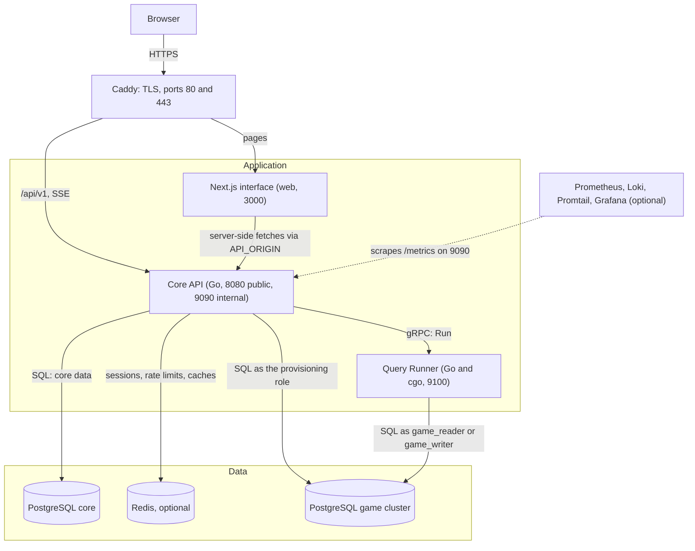

# Start here

This is the first chapter of the developer guide. It tells you what DB Contest
is, who uses it, what its words mean in the code, how the running system is put
together and where things live in the repository. The later chapters build on
the vocabulary defined here and link back to it.

## Contents

- [The product](#the-product)
- [Who uses it](#who-uses-it)
- [The glossary](#the-glossary)
- [The system at a glance](#the-system-at-a-glance)
- [The repository](#the-repository)
- [Where to go next](#where-to-go-next)

## The product

DB Contest runs university SQL olympiads in a detective format. A participant
gets the story of a crime and a database holding the evidence. They write SQL
in a browser console, answer questions from what their queries show, and in the
end name the culprit.

**A participant** signs in, joins a contest (or is added to it), and when the
contest opens works on the play screen: the story, the clock, the questions, an
SQL console with tabs and a query history, and notes. Answers are checked as
they are submitted, with the attempt limits and penalties the organiser set.
Afterwards their profile keeps the contest, its report, their queries and their
answers.

**An organiser** builds a contest: the story in Markdown, the questions and
their reference answers, and the game database, written as an SQL script,
uploaded as a dump, or described table by table. They choose who may take part,
what SQL participants may run, and how the contest is timed and scored. While it
runs they watch participants live; afterwards they read the leaderboard, the
query log and the reports.

What makes the product unusual:

- **The database is the puzzle.** Every question is answerable only by querying
  the game database that came with the story.
- **One private copy per participant.** Each registration works in its own
  PostgreSQL database, copied from the contest's template, so nothing one
  participant does reaches another.
- **Every query is parsed by PostgreSQL's own parser** (through cgo, in the
  Query Runner) and checked against the contest's SQL policy before it runs,
  under a deadline, a result budget and a disk quota. Database grants derived
  from the same policy are a second layer behind the check.
- **A contest clock.** Either everybody shares one window (`fixed` timing) or
  each participant gets their own duration from the moment they start
  (`individual` timing). One rule, the participation gate, decides whether a
  participant may act at any instant.

The [README](../../README.md) has the long version and the local setup.

## Who uses it

Authorisation has two levels ([`internal/rbac`](../../backend/internal/rbac/rbac.go)).
**Global roles** (`roles`, `user_roles`) grant installation-wide abilities.
**Contest roles** (`contest_managers`) grant power over one contest only. A
participant holds neither: their access to a contest comes from a row in
`registrations`.

| Actor | What they do | How the code knows them |
|---|---|---|
| Anonymous visitor | Sees the front page, a contest's public leaderboard and cover; signs in. | No session. The API routes that skip `Authenticate` include `/auth/login`, `GET /settings`, `GET /settings/images/{kind}`, `/version`, `/public/stats`, `/public/contests`, `/public/contests/{contestID}/cover` and `/contests/{contestID}/leaderboard`. |
| Participant | Joins contests, plays, reads their own profile and report. | Global role `student`, which holds no permission. A row in `registrations` for each contest, checked by the participation gate. |
| Contest owner | Created the contest. Everything a manager does, plus appointing and removing managers. | A global role holding `contest.create` (`organizer` or `admin`) to create; the creation writes a `contest_managers` row with role `owner`. |
| Contest manager | Edits, publishes and starts a contest, manages its participants, watches them. | A `contest_managers` row with role `manager`, granted by the owner. Any active account can be appointed; no global role is needed. A manager without `contest.create` sees no list that shows the contest: `GET /contests` gives them the participant view and sign-in lands them on `/my`, so they reach the staff screens by URL. |
| Administrator | Manages accounts, installation settings and the audit trail; acts on every contest. | Global role `admin`, which holds every permission, including `contest.admin_all`. |
| The system | Starts and finishes contests on time, keeps game databases ready, builds games, drops old databases, closes abandoned rows. | Periodic tasks in [`internal/app/background.go`](../../backend/internal/app/background.go). Its audit entries have no actor. |

Permission codes are constants in [`rbac.go`](../../backend/internal/rbac/rbac.go),
mirroring rows seeded by migrations. A contest-scoped check
(`RequireContestPermission`) looks only at the caller's contest role, or at
`contest.admin_all`; a global grant does not open somebody else's contest. Owner
and manager differ in one permission, `contest.manage` (appointing managers).
[02-use-cases.md, Permission matrix](02-use-cases.md#permission-matrix) lists
every permission and who holds it.

The Core API runs six periodic jobs (contest schedule, game pool, game build,
game reclaim, upload sweep, query-log sweep), and the deployment runs the
one-shot `migrate`, `game-prepare` and `bootstrap` jobs.
[02-use-cases.md, The system](02-use-cases.md#the-system) describes each.

## The glossary

The domain language as the code uses it. Each area is its own section so other
chapters can link to it. Where two terms are easy to mix up, the row says what
the term is not; [Pairs that are easy to confuse](#pairs-that-are-easy-to-confuse)
collects the worst of them.

### Contests and their lifecycle

| Term | Meaning | In code |
|---|---|---|
| Contest | One olympiad: its settings, schedule, languages, story, questions, staff and participants. | `contests.Contest` in [`contests.go`](../../backend/internal/contests/contests.go); table `contests` |
| Status | `draft` → `published` → `running` → `finished` → `archived`. The only step back is `published` → `draft`; a published contest can also be archived without running. | `Status*` constants, `allowedTransitions`, `Contest.CanTransitionTo` |
| Transition | A move between statuses, by an organiser (`POST /contests/{contestID}/status`, `contest.publish`) or by the scheduler. | `Service.Transition`, `contests.Scheduler` in [`schedule.go`](../../backend/internal/contests/schedule.go) |
| Content editable | Story, questions, answers, the game, languages, translations and the SQL policy may change only in `draft` and `published`. Content freezes at the start, not at publication. | `Contest.ContentEditable`, `Service.editableContest` |
| Settings editable | The contest's own fields (window, network range, enrollment) stay editable until it ends, so a running contest can be extended. Not the same as content. | `Contest.SettingsEditable` |
| Ended | `finished` or `archived`: over for everybody. One participant's time being up is a different thing (see [deadline](#the-clock)). | `Contest.Ended` |
| Publication gate | The checks a contest must pass to be published and again to start: languages, translations, story, questions, reference answers, schedule, mode-specific rules, the roster (no registered participant holding `contest.admin_all`, `staff_registered`) and cover attribution. Reports every problem at once as codes (`no_story`, `no_reference_answer`, ...). Shared by `Service.Transition` and the scheduler. | `checkPublishable` in [`schedule.go`](../../backend/internal/contests/schedule.go) (content: `CheckPublishable`, `PublishProblem` in [`publish.go`](../../backend/internal/contests/publish.go)); `GET /contests/{contestID}/publish-check` |
| Story | The narrative, in Markdown, one body per language. | `contests.Story` in [`story.go`](../../backend/internal/contests/story.go) |
| Languages, translations | A contest offers a set of languages, one of them the default; title and description are translated per language. Language codes come from the `languages` table, so a new language is data, not a migration. | `ContestLanguage`, `Translation`; [`languages.go`](../../backend/internal/contests/languages.go) |
| Contest package | A JSON export of a contest's content, reference answers included. There is no import route. A game built from an uploaded dump is not carried (`GameOmitted`). | [`export.go`](../../backend/internal/contests/export.go); `GET /contests/{contestID}/export` (`contest.edit`) |

### The clock

| Term | Meaning | In code |
|---|---|---|
| Timing | `fixed`: everybody shares one window, opened by the `running` status. `individual`: each participant gets `duration_min` from their own start, inside the contest's window. | `TimingFixed`, `TimingIndividual` |
| `starts_at`, `ends_at` | The contest's window. Under `fixed` the scheduler starts and finishes the contest by them. Under `individual` a participant may start only inside `[starts_at, ends_at)`. | `Contest.StartsAt`, `Contest.EndsAt` |
| `duration_min` | An individual participant's session length, at most a week. Set only for `individual`. | `Contest.DurationMin` |
| Clock start | Under `individual`, a participant's clock starts on their first successful read of the story, question list or schema, their first query, or their first answer, so nobody can read ahead offline. Sets `registrations.started_at`. | `queryproxy.Service.StartOnRead`, `contests.Service.Submit`, `ClockPending` in [`deadline.go`](../../backend/internal/contests/deadline.go) |
| Deadline | When one participant's window closes. `fixed`: `ends_at`. `individual`: the earlier of `started_at + duration_min` and `ends_at`. No deadline means closed, never open without limit. | `contests.Deadline` |
| Deadline grace | A few seconds (`DEADLINE_GRACE`, default 5 s) during which a request already in flight is still accepted past the deadline. Not extra time to start, and not shown to the participant. | `contests.Gate`, `Gate.closesAt` |
| Grace period | How long a finished contest's game databases are kept (`settings.grace_period_min`, installation default `GAME_INSTANCE_GRACE_MIN`, 1440 minutes). Unrelated to the deadline grace. Can be extended after the end. | `Settings.GracePeriodMin`, `Service.ExtendGrace`; `PATCH /contests/{contestID}/grace` |
| Enrollment deadline | Closes self-signup before the start, so databases can be prepared. | `Settings.EnrollmentDeadline` |
| Freeze | The leaderboard stops changing for everyone but staff `leaderboard_freeze_min` minutes before `ends_at`, and stays frozen past the finish until an organiser reveals it. | `Contest.FreezeAt`, `Contest.LeaderboardRevealedAt`; `POST /contests/{contestID}/leaderboard/reveal` |
| Events channel | A Server-Sent Events stream per participant: periodic `sync` events with the server time and their deadline, `contest_started`, and `contest_finished` when the contest is over for them. | [`events_handler.go`](../../backend/internal/api/events_handler.go); `GET /contests/{contestID}/events` |

### Questions, answers and results

| Term | Meaning | In code |
|---|---|---|
| Question mode | `multi`: several scored questions. `single`: one question carries the whole contest. | `QuestionModeMulti`, `QuestionModeSingle` |
| Question kind | `text` (free answer), `choice` (one of 2 to 50 options, submitted by option id, never by label), `final` (naming the culprit; the question winner scoring ranks on). | `KindText`, `KindChoice`, `KindFinal` in [`question.go`](../../backend/internal/contests/question.go) |
| Hidden question | `is_visible = false` leaves the question out of the participant's list entirely, identifier included. It keeps its points and reference answers, and staff see it. | `Question.IsVisible`; `contests.Reader` in [`participant_view.go`](../../backend/internal/contests/participant_view.go) |
| Reference answer | An accepted response, never sent to a participant. Several per question cover spelling variants. Matched as `exact`, `exact_ci` or `regex`. | `contests.Answer`, `Match*` constants |
| Attempt | One submitted answer to one question, numbered per registration and question. `max_attempts` caps them (nil is unlimited). A question is closed once answered correctly or out of attempts. | `contests.Submission` (`AttemptNo`) in [`submission.go`](../../backend/internal/contests/submission.go); `AttemptStats`; table `submissions` |
| Penalty | `penalty_pct`: the percent of a question's points each wrong attempt costs, fixed when the answer is written. `winner` scoring charges nothing; `icpc` scoring counts `icpc_penalty_min` minutes per wrong attempt on a solved question instead. | `Question.PenaltyPct`, `penaltyAmount`, `Contest.ICPCPenaltyMin` |
| Progression | `free`: answer in any order. `sequential`: the next question opens once the previous one is closed. Applies only in `multi` mode. | `ProgressionFree`, `ProgressionSequential`, `Contest.SequentialActive`, [`sequence.go`](../../backend/internal/contests/sequence.go) |
| Scoring | `points` (sum of `points_awarded`), `winner` (whoever first answers the final question correctly), `icpc` (questions solved, then penalty time). Settings a mode ignores stay stored. Under `icpc` a submission writes zero points, and `winner` and `icpc` write no penalty. | `ScoringPoints`, `ScoringWinner`, `ScoringICPC` |
| Nothing left to answer | Every question is solved or out of attempts, so the console stops taking queries (`nothing_left_to_answer`); the rest of the play screen stays open. Not a deadline. | `queryproxy.Service.WithAnswerable`, `postgres.NewAnswerable` |

### Taking part

| Term | Meaning | In code |
|---|---|---|
| Account | A person who can sign in. Status `active`, `blocked` or `deleted` (kept for the audit trail, restorable). | `users.User` in [`users.go`](../../backend/internal/users/users.go) |
| Registration | One account's participation in one contest; the unit the console, rate limits, workspace and game database are keyed by. Status `registered`, `active`, `finished` or `disqualified`. `Participant.ID` is the registration, not the user. | `contests.Participant` in [`enrollment.go`](../../backend/internal/contests/enrollment.go); table `registrations` |
| Enrollment | Who creates the registration, and nothing else: `open` lets a student sign themselves up (`POST /contests/{contestID}/enroll`), `invite_only` means staff add them. After that both paths are the same. | `EnrollmentOpen`, `EnrollmentInviteOnly`, `Service.Enroll` |
| Roster import | Staff adding many participants at once, by login or id, up to 1000 entries. Partial success: each unusable row comes back with a reason (`unknown_account`, `already_enrolled`, ...). | `Service.AddParticipants`; `POST /contests/{contestID}/participants` (`participant.manage`) |
| Account import | Creating accounts for a whole group with one-time passwords. A different operation from the roster import, on a different route. | `users.Service.Import`; `POST /users/import` (`users.manage`) |
| `allowed_cidrs` | Networks a participant must be on, for an on-site olympiad. Checked against the address resolved through `TRUSTED_PROXIES`; staff are never checked. A refusal is `address_not_allowed`. | `Contest.AllowedCIDRs`, `Contest.AllowsAddress` |
| Exclusion | Disqualifying keeps the record and shuts the participant out (`disqualified`). Removing deletes the registration and is refused once the participant has a record (`ErrParticipantStarted`). | `Service.DisqualifyParticipant`, `Service.RemoveParticipant` |
| Staff cannot participate | One account is never both staff and participant of the same contest, in either direction. | `ErrStaffCannotParticipate`, `ErrParticipantCannotBeStaff` |
| Participation gate | The one rule deciding what a participant may do in a contest at an instant, from contest status, registration, clock and address. The console, play reads, answers, workspace, signals, events channel, scheduler and profile all ask the same `*Gate`. | `contests.Gate`, `Gate.StandingOf` in [`standing.go`](../../backend/internal/contests/standing.go) |
| Standing | The gate's answer, computed, never stored. `MayAct` (play, console, answers), `MayWait` (hold the events channel before the start), `Over` (results may be shown), `Refusal` (why not). Not a leaderboard position. | `contests.Standing` |

The gate's refusals and their API codes, from
[`errortable.go`](../../backend/internal/api/errortable.go):

| Sentinel | Code | Meaning |
|---|---|---|
| `ErrNotAParticipant` | `not_a_participant` | Never registered or disqualified; one answer for both. |
| `ErrContestNotRunning` | `contest_not_running` | Not open now, may open later. The play screen keeps waiting. |
| `ErrContestEnded` | `contest_ended` | The contest is finished or archived, for everybody. The play screen stops for good. |
| `ErrParticipantFinished` | `contest_finished` | This registration is `finished`. |
| `ErrDeadlinePassed` | `deadline_passed` | This participant's own deadline plus grace has passed, or their individual window closed before they started. |
| `ErrAddressNotAllowed` | `address_not_allowed` | The caller is outside `allowed_cidrs`. |

### Staff

| Term | Meaning | In code |
|---|---|---|
| Staff | Everyone in a contest's `contest_managers`: its owner and managers. | `contests.Manager` in [`managers.go`](../../backend/internal/contests/managers.go) |
| Owner | The contest's creator, set at creation and never changed through the staff list. Holds `contest.manage` on top of a manager's permissions. | `rbac.RoleOwner`, `ErrOwnerImmutable` |
| Manager | Appointed by the owner to run one contest. Cannot appoint more staff. | `rbac.RoleManager`, `Service.GrantManager` |
| Global role | `student`, `organizer`, `admin`: installation-wide, held in `user_roles`. Not a contest role. | `users.User`, migration `000005_seed_roles_and_permissions` |

### The game

| Term | Meaning | In code |
|---|---|---|
| Game | A contest's database of evidence, as the organiser authored it. | `provisioning.Template` in [`template.go`](../../backend/internal/provisioning/template.go); table `game_templates` |
| Template source | How the game was authored: `editor` (a SQL script, up to 512 KiB, run as `game_author`), `file` (an uploaded dump, received in chunks), `builder` (a table builder: tables and typed columns, with rows from CSV or typed in). | `SourceEditor`, `SourceFile`, `SourceBuilder`; [`upload.go`](../../backend/internal/provisioning/upload.go), [`definition.go`](../../backend/internal/provisioning/definition.go), [`tabledata.go`](../../backend/internal/provisioning/tabledata.go), [`internal/gamefile`](../../backend/internal/gamefile/gamefile.go) |
| Template | The built database every participant's copy is made from, named `game_tpl_c<contest>`. Status `pending`, `building`, `ready`, `failed`, `dropped`. | `TemplateStatus`, `templateName` |
| Template version | Increments each time the game is replaced. Copies made from an older version are stale: dropped and remade. This is why the game can no longer be replaced once the contest runs. | `Template.Version`, `provisioning.Stale`, `ErrGameNotEditable` |
| Build | Running the source into the template database, done by the `game-build` job and bounded by `GAME_BUILD_TIMEOUT`. A failure in the organiser's own script is shown to them; any other failure is a fixed sentence. | `Games.Build`, `ScriptFailure`, `BuildFailedInternally` |
| Game instance | One participant's own database, named `game_c<contest>_u<registration>`, created with `CREATE DATABASE ... TEMPLATE`. Status `provisioning`, `ready`, `failed`, `dropped`. A request never names it: the Core API looks it up from the registration. | `provisioning.Instance` in [`provisioning.go`](../../backend/internal/provisioning/provisioning.go); table `game_instances` |
| Spare, pool | Copies made ahead of time (`game_pool_c<contest>_...`) so that giving a participant a database is a row update, not a `CREATE DATABASE` in their page load. Sized by `GAME_POOL_DEPTH`, `GAME_POOL_MAX` and the cluster's disk budget `GAME_CLUSTER_MAX_BYTES`. | `Repository.ClaimSpare`, `PoolLimits`, `provisioning.Tender` |
| Reclaim | Dropping instances and templates once the contest's grace period has passed. | `Service.Reclaim` in [`reclaim.go`](../../backend/internal/provisioning/reclaim.go) |
| Game cluster | The separate PostgreSQL server holding templates and instances (`pg-game`). Not the core database. | [`internal/gamedb`](../../backend/internal/gamedb/cluster.go) |
| Game roles | `game_reader` and `game_writer`: the roles participant SQL runs as, held only by the Query Runner. `game_author`: the role an organiser's script runs as. The provisioning role, a superuser on the game cluster, is held by the Core API for creating and dropping databases. | `gamedb.RoleReader`, `RoleWriter`, `RoleAuthor`; `cmd/gamedb` |
| Schema panel | The tree of tables and columns on the play screen: a cached description of the game, read once per template version over the provisioning connection. Browsing it costs the participant no query. | `provisioning.SchemaReader` in [`schema.go`](../../backend/internal/provisioning/schema.go); `GET /contests/{contestID}/play/schema` |

### Running SQL

| Term | Meaning | In code |
|---|---|---|
| SQL policy | A contest's answer to "what may participant SQL do": mode `read_only` (default) or `read_write`, writable tables, views and own tables in schema `work`, temporary tables, catalog reads, a disk quota ratio. One description drives both the parser check and the grants. | `sqlpolicy.Policy` in [`policy.go`](../../backend/internal/sqlpolicy/policy.go); `contests.SQLPolicy` in [`sqlpolicy.go`](../../backend/internal/contests/sqlpolicy.go); `GET`/`PUT /contests/{contestID}/sql-policy` |
| Checker | Parses a query with PostgreSQL's parser (`pg_query_go`, cgo) and refuses what the policy does not allow. Linked only into the Query Runner. | [`sqlpolicy/checker`](../../backend/internal/sqlpolicy/checker/check.go) |
| Console | The participant's SQL editor; one query is `POST /contests/{contestID}/query`. | `queryproxy.Service.Run` in [`queryproxy.go`](../../backend/internal/queryproxy/queryproxy.go), [`console_handler.go`](../../backend/internal/api/console_handler.go) |
| Query proxy | The Core API's side of a query: who is asking, whether the gate admits them, which database is theirs, the per-participant rate. It does not decide what SQL is allowed. | [`internal/queryproxy`](../../backend/internal/queryproxy/queryproxy.go) |
| Query Runner | The separate service that checks and executes one query in one participant's database, under a deadline (`QUERY_DEADLINE`), admission control (`QUERY_CONCURRENT`, `QUERY_QUEUE_DEPTH`), a rate (`QUERY_PER_MINUTE`) and a result budget (`QUERY_MAX_ROWS`, `QUERY_MAX_BYTES`). | [`internal/queryrunner`](../../backend/internal/queryrunner/runner.go), `cmd/queryrunner`; contract in [`queryrunner.proto`](../../backend/proto/queryrunner/v1/queryrunner.proto) |
| Query log, journal | Every query a participant ran, with status `running`, `ok`, `rejected`, `error` or `timeout`. The row is opened before the query runs, so a crash leaves evidence; it is written on the Core API's side. "Journal" is the code's name for the writer, "query log" for the table and the screens. | `queryrunner.Journalled` in [`journal.go`](../../backend/internal/queryrunner/journal.go); table `query_log`; `GET /contests/{contestID}/play/log` |
| Disk quota | How large a participant's database may grow, computed by the Core API from the template's size and the policy's ratio, and checked by the runner before a write. | `Policy.DiskQuotaRatio`, `RunRequest.disk_quota_bytes` |

### The participant's screen

| Term | Meaning | In code |
|---|---|---|
| Play screen | Story, questions, console, schema panel, query history, notes, clock. Frontend route `/contests/[contestId]/play`; API routes under `/contests/{contestID}/play/...`. | [`participant_handler.go`](../../backend/internal/api/participant_handler.go); `frontend/app/(participant)/contests/[contestId]/play/` |
| Workspace | A registration's notes and SQL tabs, kept on the server so a reload or another computer loses nothing. Up to 10 tabs, notes up to 20,000 characters. Not private: staff see it and its history. | `workspace.Service` in [`workspace.go`](../../backend/internal/workspace/workspace.go); `GET /contests/{contestID}/play/workspace` |
| Revision | A saved state of the notes or one tab, at most two a minute per document, which staff can open. | [`monitor/revision.go`](../../backend/internal/monitor/revision.go) |
| My contests, catalogue | `/my`: the contests a participant is enrolled in. `/open`: every contest they may see, joined or not. | `frontend/app/(participant)/my/`, `frontend/app/(participant)/open/` |

### Watching and reporting

| Term | Meaning | In code |
|---|---|---|
| Leaderboard | Who is where, as each audience may see it. State `not_started`, `live`, `frozen` or `final`. The public table, the participant's copy (their row marked) and the staff's live table are three routes over one service. Rows are named by login or full name (`leaderboard_names`). | [`internal/leaderboard`](../../backend/internal/leaderboard/leaderboard.go), `leaderboard.Decide`; `GET /contests/{contestID}/leaderboard`, `/play/leaderboard`, `/leaderboard/live` |
| Standings | The frontend's name for the leaderboard screens (`standings/` route, `standings.tsx`). Not `contests.Standing`. | `frontend/components/product/standings.tsx` |
| Monitoring | Staff watching a contest's participants: a roster with flags, a combined feed, and per participant a timeline, queries, answers, workspace and CSV. Needs `contest.monitor`. | `monitor.WatchService` in [`watch.go`](../../backend/internal/monitor/watch.go); [`monitor_handler.go`](../../backend/internal/api/monitor_handler.go); routes under `/contests/{contestID}/monitor/` |
| Signals | What is recorded about a participant beyond queries and answers. From the browser: `page_left`, `paste`. Observed by the server: `ip_changed`, `parallel_session`. Recorded with workspace writes: `tab_created`, `tab_renamed`, `tab_deleted`. A browser signal is only what the browser chose to report. | `monitor.Kind` in [`event.go`](../../backend/internal/monitor/event.go), `monitor.Tracker`, `monitor.Signals`; `POST /contests/{contestID}/play/signals` |
| Flags | Six hints on the monitoring roster: `multiple_ips`, `parallel_sessions`, `long_absence`, `answer_without_queries`, `large_paste`, `identical_queries`. Hints, not verdicts. | [`monitor/roster.go`](../../backend/internal/monitor/roster.go), [`fingerprint.go`](../../backend/internal/monitor/fingerprint.go) |
| Profile | A signed-in account's own page: totals, contests, and for each contest that is over for them the report, queries, answers and workspace. Opens only when the gate says the contest is `Over` for them. | [`internal/profile`](../../backend/internal/profile/profile.go); `GET /me/summary`, `/me/contests`, `/me/contests/{contestID}/report` |
| Report | A participant's account of one contest: their result as the leaderboard computes it (points, solved, penalty, place), their activity and each question's outcome. | [`profile/report.go`](../../backend/internal/profile/report.go) |

### The installation

| Term | Meaning | In code |
|---|---|---|
| Installation settings | What the installation calls itself and looks like (name, contact e-mail, logo, icon, favicon), changed from a screen by an administrator. Never anything the process needs to start or anything secret: those are environment variables. | [`internal/settings`](../../backend/internal/settings/settings.go); `GET`/`PUT /settings` |
| Configuration | Environment variables read once at startup and validated. | [`platform/config`](../../backend/internal/platform/config/config.go), [`runner.go`](../../backend/internal/platform/config/runner.go); `deploy/.env.example` |
| Cover | The picture above a contest: re-encoded on upload, named by its hash, stored as a file in `COVER_DIR` (not in the database), with a required attribution. Without one, the interface draws a cover. | [`internal/covers`](../../backend/internal/covers/covers.go), [`platform/filestore`](../../backend/internal/platform/filestore); `PUT /contests/{contestID}/cover` |
| Showcase, front page | The landing page's public reads: four installation totals and a few recent contests, never a draft. | [`internal/showcase`](../../backend/internal/showcase/showcase.go); `/public/stats`, `/public/contests`; `frontend/app/(public)/page.tsx` |
| Audit trail | Who did what, from where and when, written in the same transaction as the action. Append-only; secrets are stripped from payloads. Action codes such as `contest.status_change`. | [`internal/audit`](../../backend/internal/audit/audit.go), `audit.Actions()`; table `audit_log`; `GET /audit` (`audit.view`); [`docs/api/audit-actions.json`](../api/audit-actions.json) |
| Error code | Every refusal the API gives is a declared code with a message in every locale. | [`internal/api/codes.go`](../../backend/internal/api/codes.go), [`errortable.go`](../../backend/internal/api/errortable.go); [`docs/api/error-codes.json`](../api/error-codes.json); CLAUDE.md, security rule 1 |

### Pairs that are easy to confuse

| These | Differ in |
|---|---|
| `contest_ended` / `contest_finished` / `deadline_passed` | `contest_ended`: the contest is over for everybody. `contest_finished`: this one registration is finished. `deadline_passed`: this participant's own time is up while the contest may still run. `contest_finished` is also the name of an SSE event meaning "over for you", whatever the reason. |
| `contest_not_running` / `contest_ended` | Not yet (keep waiting) versus never again (stop). |
| `finished` (contest) / `finished` (registration) | The contest's status versus one participant's. |
| Deadline grace / grace period | Seconds for a request in flight versus days for keeping game databases. |
| `Standing` / standings | The gate's verdict on one participant versus the leaderboard. |
| Content editable / settings editable | Content freezes at the start; settings stay open until the end. |
| Roster import / account import | Registering existing accounts in a contest versus creating accounts. |
| Disqualify / remove | Keeps the record versus deletes a registration with nothing in it. |
| Global role / contest role | `student`, `organizer`, `admin` versus `owner`, `manager`. |
| Template / instance / spare | The built original versus one participant's copy versus a copy nobody has claimed yet. |
| Core database / game cluster | Accounts, contests, answers, logs versus the participants' game databases. |

## The system at a glance

- Services and their wiring: [`deploy/docker-compose.yml`](../../deploy/docker-compose.yml) and [`deploy/Caddyfile`](../../deploy/Caddyfile).
- The Core API is assembled in [`internal/app/app.go`](../../backend/internal/app/app.go), started by [`cmd/api`](../../backend/cmd/api/main.go).
- The Query Runner starts from [`cmd/queryrunner`](../../backend/cmd/queryrunner/main.go); the gRPC contract is [`queryrunner.proto`](../../backend/proto/queryrunner/v1/queryrunner.proto), adapted by [`internal/rpc`](../../backend/internal/rpc).
- The browser calls `/api/v1` on its own origin; the Next.js server calls the API at `API_ORIGIN` ([`frontend/lib/api/config.ts`](../../frontend/lib/api/config.ts), [`client.ts`](../../frontend/lib/api/client.ts)).

**Caddy** is the only container with ports open to the outside. It terminates
TLS, sends `/api/*` to the Core API and everything else to Next.js, and sets
`X-Forwarded-For` from the client address. The API believes forwarded headers
only from the addresses in `TRUSTED_PROXIES` (CLAUDE.md, security rule 9).

**Next.js** renders the interface and holds no data of its own: every read and
write goes to the Core API with the user's session cookie. It must never reach
a database, and `proxy.ts` only checks that a session cookie exists; the API
decides whether it is valid.

**The Core API** is a Go modular monolith. It owns accounts, sessions,
contests, the clock, answers and scoring, the audit trail, the query log,
monitoring and the leaderboard, all in the core database. It also prepares the
game cluster: it builds templates and creates and drops participant databases
through the provisioning role (`GAME_PROVISIONER_DSN`). It must never execute a
participant's SQL, hold a participant role, or link the cgo parser (`make
static-check` fails if it does). Without `GAME_PROVISIONER_DSN` the game
features are off; the console needs both it and `QUERY_RUNNER_ADDR`.

**The Query Runner** checks and executes one participant's query in that
participant's database and returns the result. It is stateless, has no core
database connection, and is the only process that holds `game_reader` and
`game_writer`. It is a separate process because the parser it links is C code
reading text an adversary chose: a crash there ends the process, and it must
not end sign-in or the clock with it. It is reachable only from the internal
network, with a shared token (`QUERY_RUNNER_TOKEN`).

**The core PostgreSQL** holds everything except game data. Its schema is the
numbered migrations in `backend/migrations`, applied by the `migrate` job
before the API starts, never by the API itself.

**The game cluster** is a second PostgreSQL server holding the templates and
one database per participant. `game-prepare` (`cmd/gamedb`) sets up its roles
and restrictions on every deploy, before the Query Runner starts.

**Redis** holds sessions, rate-limit windows and short caches. Without
`REDIS_ADDR` the API uses an in-process store, which is correct for one replica
only; a configured but unreachable Redis is a startup error.

**The observability stack** (compose profile `observability`) is optional.
Prometheus scrapes the Core API's internal listener, Promtail ships every
container's logs to Loki, and Grafana shows both. The internal listener
(`/metrics`, `/healthz`, `/readyz`) is never published through Caddy.

[ARCHITECTURE.md, section 2](../ARCHITECTURE.md#2-components-and-how-they-talk)
explains the split, and [section 5](../ARCHITECTURE.md#5-executing-student-sql-safely)
how a query is made safe.

## The repository

The code maps of each half are [backend/README.md](../../backend/README.md) and
[frontend/README.md](../../frontend/README.md); this is the top level and the
places you will open first.

| Path | What is there |
|---|---|
| `backend/` | The Go module: both services and their tools. |
| `backend/cmd/` | Entry points: `api`, `queryrunner`, `migrate`, `bootstrap`, `gamedb` (game cluster setup), `gameorphans` (manual cleanup), `testdb`, `apicontract` and `auditcontract` (generated contracts), `consoleload` (load test). |
| `backend/internal/app/` | The composition root: builds the Core API, its modules and background jobs. |
| `backend/internal/api/` | The HTTP layer: router, handlers (`*_handler.go`), error codes and the error table. |
| `backend/internal/<domain>/` | Domain packages: `auth`, `rbac`, `users`, `contests`, `leaderboard`, `monitor`, `profile`, `workspace`, `provisioning`, `queryproxy`, `sqlpolicy`, `settings`, `covers`, `showcase`, `audit`, `health`, `gamefile`. `go doc ./internal/<pkg>` says what each answers. |
| `backend/internal/queryrunner/`, `backend/internal/gamedb/` | Query execution, and the game cluster's roles and grants. |
| `backend/internal/rpc/` | The gRPC client and server around the Query Runner contract. |
| `backend/internal/postgres/` | Every repository implementation; all core SQL lives here. |
| `backend/internal/platform/` | Infrastructure that imports no domain package: config, cache, storage, httpx, logging, metrics, password, i18n, filestore, server, flight, sentineltest. |
| `backend/migrations/` | Numbered `up`/`down` SQL for the core database, embedded in the binary. |
| `backend/proto/` | The gRPC contract between the Core API and the Query Runner. |
| `frontend/app/` | Next.js routes. Route groups: `(public)` front page, sign-in, public leaderboard; `(participant)` `/my`, `/open`, the play screen; `(session)` the profile; `(account)` the password change (forced after a one-time password, or from the profile); `(admin)` the contest builder, users, settings, audit. |
| `frontend/components/` | `ui/` primitives with no domain knowledge, `product/` domain components shared by routes, `layout/` the frame. |
| `frontend/lib/` | `api/` transport and wire schemas, `auth/`, `i18n/` with the dictionaries `en`, `ru`, `ro`, `theme/`, `format/`, `design/`. |
| `frontend/styles/tokens.css` | Every colour, size, duration and radius. |
| `frontend/proxy.ts` | Route protection (Next 16's name for middleware). |
| `deploy/` | `docker-compose.yml` (images only, what a server runs), `docker-compose.dev.yml` (databases and Redis for local work), `docker-compose.build.yml` (building images), `Caddyfile`, `observability/`, `.env.example`. |
| `docs/` | `ARCHITECTURE.md`, `design/SPEC.md` (the visual system), `api/` (generated error-code and audit-action contracts), `guide/` (this guide). |
| `postman/` | A Postman collection for the API. |
| `.github/workflows/` | CI: `backend.yml`, `frontend.yml`, `image.yml`. |
| `Makefile` | Every task; `make help` lists them. |

## Where to go next

Read the guide in order:

1. **This chapter**: the product, the actors, the vocabulary.
2. [02-use-cases.md](02-use-cases.md): each actor's use cases, as diagrams.
3. [03-flows.md](03-flows.md): sequence diagrams of the key flows and the contest lifecycle.
4. [04-backend.md](04-backend.md): how the backend is structured, and recipes for a new package, endpoint or migration.
5. [05-frontend.md](05-frontend.md): how the frontend is structured, and recipes for a new page or UI string.
6. [06-testing.md](06-testing.md): how the project is tested and which checks to run.

Then keep these at hand:

- [docs/ARCHITECTURE.md](../ARCHITECTURE.md): why the system is built this way, section by section.
- [CLAUDE.md](../../CLAUDE.md): the rulebook every change is reviewed against (Go layout, security and performance rules).
- [CONTRIBUTING.md](../../CONTRIBUTING.md): branches, commits, pull requests and the checks to run.
