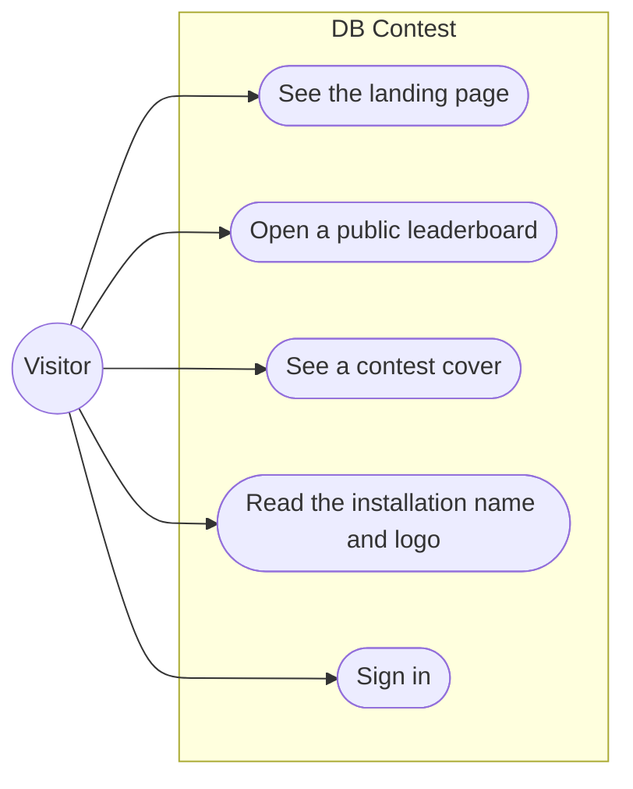
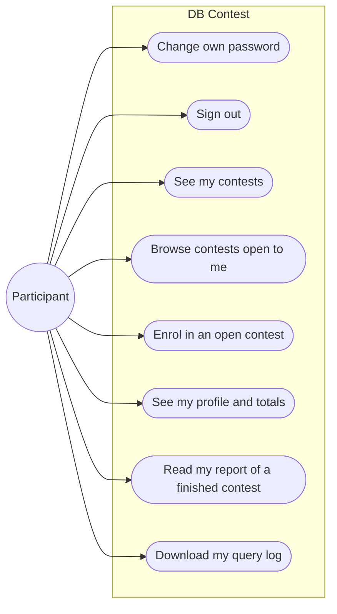
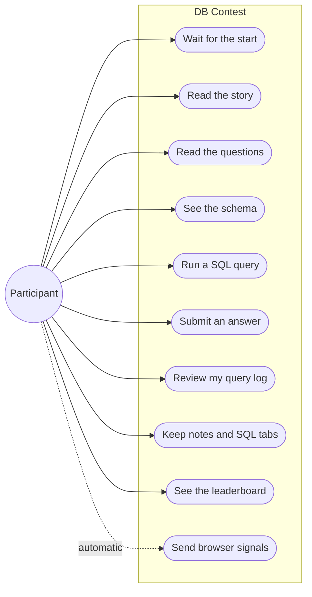
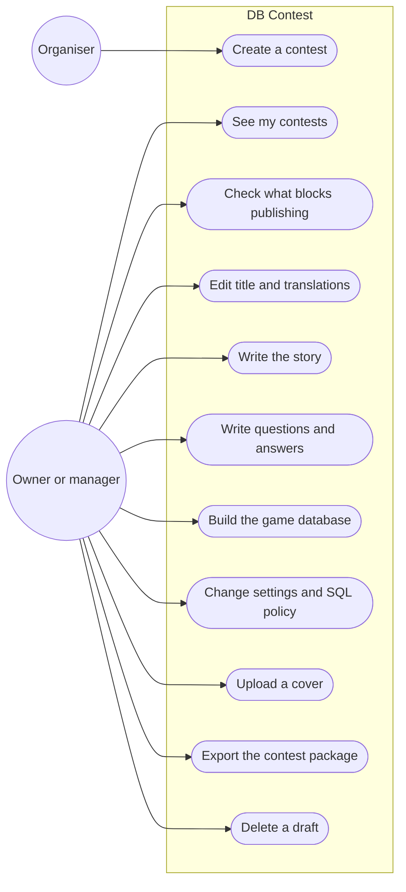
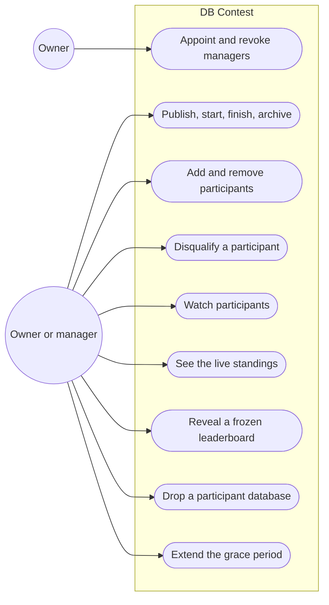
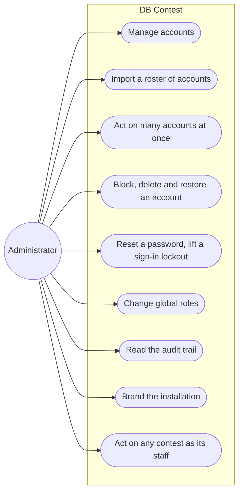
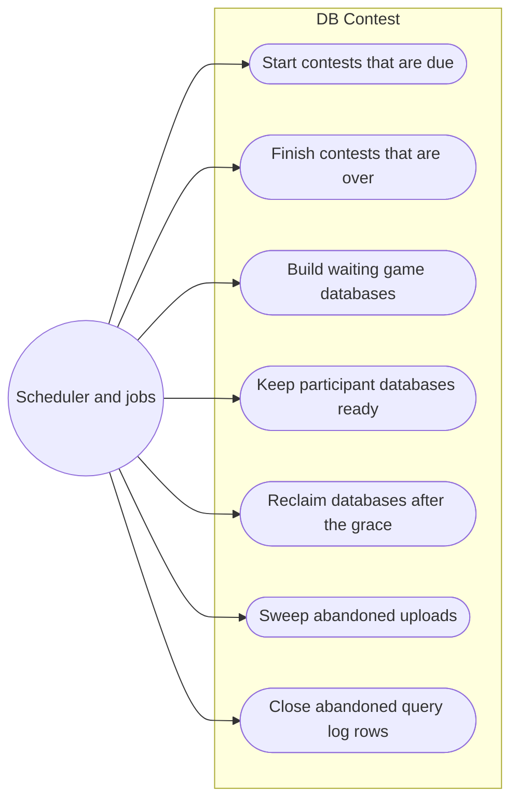

# 2. Who can do what

This chapter maps every actor of DB Contest to what they can do, the screen
they do it on, the endpoint behind the screen, the package that holds the rule,
and the permission or condition that admits them. Use it to answer "where does
this live?" before you change a behaviour, and "who else does this affect?"
after.

The domain words (contest, registration, the participation gate, grace) are
defined in the [glossary](01-overview.md#the-glossary). How a request travels
through these endpoints is drawn in [03-flows.md](03-flows.md).

## Contents

1. [Reading the tables](#reading-the-tables)
2. [The actors](#the-actors)
3. [Anonymous visitor](#anonymous-visitor)
4. [Participant: around a contest](#participant-around-a-contest)
5. [Participant: on the play screen](#participant-on-the-play-screen)
6. [Contest staff: authoring](#contest-staff-authoring)
7. [Contest staff: running a contest](#contest-staff-running-a-contest)
8. [Administrator](#administrator)
9. [The system](#the-system)
10. [Permission matrix](#permission-matrix)
11. [What a participant is refused](#what-a-participant-is-refused)

## Reading the tables

- **Screen** is the URL path of a page under
  [`frontend/app`](../../frontend/app). Parenthesised folders such as
  `(admin)` are route groups and never appear in the URL. "API only" means no
  screen calls the endpoint today.
- **API** is the method and path under `/api/v1`. The public router is built in
  [`router.go`](../../backend/internal/api/router.go), but the routes
  themselves are registered by each handler's `Mount` method in
  [`backend/internal/api`](../../backend/internal/api) (`contests_handler.go`,
  `game_handler.go`, `participant_handler.go` and so on), and the list of
  mounted handlers is assembled in
  [`internal/app/app.go`](../../backend/internal/app/app.go). Open the
  handler's `Mount` to see the middleware on a route.
- Path parameters use the chi names from the backend: `{contestID}`,
  `{questionID}`, `{userID}`, `{registrationID}`. The frontend folders spell
  the same segments `[contestId]`, `[questionId]` and so on.
- **Package** is the package under `backend/internal/` that holds the rule.
  The handler in `internal/api` only adapts HTTP to it (CLAUDE.md, Go layout
  rule 4).
- **Permission or condition**: `session` means `auth.Middleware.Authenticate`
  alone. A bare permission name on a non-contest route is a global check
  (`RequirePermission`). A permission on a `/contests/{contestID}/...` route
  is a contest-scoped check (`RequireContestPermission`). "Gate" means the
  participation gate, `contests.Gate.StandingOf` in
  [`standing.go`](../../backend/internal/contests/standing.go).

## The actors

| Actor | Who it is | How the code recognises it |
|---|---|---|
| Anonymous visitor | Anyone without a session, including someone who opens a public leaderboard link | No session cookie. The route is mounted without `Authenticate`; the frontend guard ([`lib/auth/guard.ts`](../../frontend/lib/auth/guard.ts)) lets `/`, `/login`, `/healthz` and `/contests/{contestID}/leaderboard` through |
| Participant | A signed-in account with a registration in a contest, usually holding the `student` role | A session, plus a row in `registrations` read by the gate. The `student` role holds no permission at all |
| Contest staff: owner | The account that created the contest | A row in `contest_managers` with role `owner` (`rbac.RoleOwner`) |
| Contest staff: manager | An account the owner appointed | A row in `contest_managers` with role `manager` (`rbac.RoleManager`) |
| Administrator | An account with the `admin` global role | Global permissions from `user_roles`, among them `contest.admin_all`, which passes every contest-scoped check |
| The system | The scheduler and the periodic jobs in the Core API process | Tasks started from [`internal/app`](../../backend/internal/app); its audit entries carry no actor |

One account can be several actors in different contests: an organiser who owns
the March olympiad can take part in a contest they do not staff. It cannot be
staff and participant of the same contest, and an account holding
`contest.admin_all` cannot participate anywhere (`staff_cannot_participate`).

## Anonymous visitor

- The landing page reads `showcase`; the public table reads `leaderboard`;
  both are rate-limited by address in their handlers
  (`public_handler.go`, `leaderboard_handler.go`).
- Sign-in is `auth.Service`, throttled per address and per login
  (CLAUDE.md, security rules 4 and 5).

| Use case | Screen | API | Package | Permission or condition |
|---|---|---|---|---|
| See the installation's totals and recent contests | `/` | `GET /public/stats`, `GET /public/contests` | `showcase` | None; limited per address (`public_too_often`). Drafts never appear |
| Open a contest's public leaderboard by link | `/contests/{contestID}/leaderboard` | `GET /contests/{contestID}/leaderboard` | `leaderboard` | None; a draft answers 404; limited per address (`leaderboard_too_often`) |
| See a contest cover | `/` (recent contests), the story on `/contests/{contestID}/play` | `GET /public/contests/{contestID}/cover` | `covers` | None; a draft's cover is refused |
| Read the installation's name and images | every shell | `GET /settings`, `GET /settings/images/{kind}` | `settings` | None |
| Sign in | `/login` | `POST /auth/login` | `auth` | Correct login and password; throttled (`too_many_attempts`, `sign_in_busy`) |
| Read the running version | API only | `GET /version` | `api` | None |

## Participant: around a contest

These are the things a participant does outside the play screen. Every account
can do the account actions; the rest need a registration or an open contest.

- The two lists are one endpoint, `GET /contests` with `scope=participant`;
  what a participant may see is decided by the SQL in
  [`internal/postgres/contests.go`](../../backend/internal/postgres/contests.go)
  (`contestListWhere`).
- Enrolment is `contests.Service.Enroll` in
  [`enrollment.go`](../../backend/internal/contests/enrollment.go).
- The profile opens a contest only when `Standing.Over()` is true, so results
  appear at the moment the play screen closes
  ([`profile`](../../backend/internal/profile/profile.go)).

| Use case | Screen | API | Package | Permission or condition |
|---|---|---|---|---|
| Change own password | `/password` | `POST /auth/password` | `auth` | Session; the current password is verified and throttled. While the account holds a one-time password, every route but this one, sign-out and `GET /auth/me` answers `password_change_required` |
| Sign out | account menu in every shell | `POST /auth/logout` | `auth` | Session |
| Know who I am | every shell | `GET /auth/me` | `auth` | Session; returns the global permissions the frontend routes by |
| See my contests | `/my` | `GET /contests?scope=participant&enrolled=true` | `contests` | Session; registered contests that are published, running or finished |
| Browse contests open to me | `/open` | `GET /contests?scope=participant` | `contests` | Session; adds contests with open enrolment that are published or running |
| Enrol | `/open` (the enrol button) | `POST /contests/{contestID}/enroll` | `contests` | Session; enrolment `open`; status published, or running with individual timing; before the enrolment deadline; address inside `allowed_cidrs`; not staff of the contest |
| See my profile and totals | `/profile` | `GET /me/summary`, `GET /me/contests` | `profile` | Session; rate-limited (`profile_too_often`) |
| Read my report of one contest | `/profile/contests/{contestID}` | `GET /me/contests/{contestID}/report`, `/queries`, `/answers`, `/workspace` | `profile` | Session; the contest is over for this participant, otherwise `profile_contest_not_found` |
| Download my query log after the contest | `/profile/contests/{contestID}` | `GET /me/contests/{contestID}/log.csv` | `profile` | As above; one download per registration at a time |

## Participant: on the play screen

Everything here happens on `/contests/{contestID}/play`. Every route except the
events channel and the leaderboard asks the gate whether the participant may
act now (`Standing.MayAct`). The events channel also admits a participant waiting for a
published contest to start (`Standing.MayWait`).

- Admission for the story, questions, schema, query log, workspace, signals,
  answers and the console is `queryproxy.Service.Access`, which calls the gate
  ([`queryproxy.go`](../../backend/internal/queryproxy/queryproxy.go)). The
  events channel uses `AccessForEvents`, which also admits a participant
  waiting for the start. `/play/leaderboard` asks only for a registration
  (`leaderboard.Service.ForParticipant`).
- An answer is judged by `contests.Service` in
  [`submission.go`](../../backend/internal/contests/submission.go); the final
  deadline check is the core database's clock in the same statement.
- The page itself is
  [`app/(participant)/contests/[contestId]/play/page.tsx`](../../frontend/app/(participant)/contests/[contestId]/play/page.tsx);
  how it reacts to each refusal is in `refusals.ts` beside it.

| Use case | Screen | API | Package | Permission or condition |
|---|---|---|---|---|
| Wait for the start, hear about changes | `/contests/{contestID}/play` | `GET /contests/{contestID}/events` (server-sent events) | `queryproxy` | Gate: `MayWait`; a cap on open channels per participant (`too_many_connections`) |
| Read the story | `/contests/{contestID}/play`, download at `/contests/{contestID}/play/story.md` | `GET /contests/{contestID}/play/story` | `contests` (`Reader`) | Gate: `MayAct` |
| Read the questions | `/contests/{contestID}/play` | `GET /contests/{contestID}/play/questions` | `contests` (`Reader`) | Gate: `MayAct` |
| See the game schema | `/contests/{contestID}/play` | `GET /contests/{contestID}/play/schema` | `queryproxy` | Gate: `MayAct`; the contest shows its schema, otherwise `schema_hidden`, which is also the answer when no Query Runner is deployed. The read provisions the participant's copy, so it can answer `no_game_yet` or `game_cluster_full` |
| Run a SQL query | `/contests/{contestID}/play` | `POST /contests/{contestID}/query` | `queryproxy`, then the Query Runner (`queryrunner`, `sqlpolicy`) | Gate: `MayAct`; at least one question still answerable; the contest's SQL policy; per-participant rate and one query at a time. Mounted only when both `GAME_PROVISIONER_DSN` and `QUERY_RUNNER_ADDR` are set |
| Submit an answer | `/contests/{contestID}/play` | `POST /contests/{contestID}/questions/{questionID}/answer` | `contests` | Gate: `MayAct`; the question is open and has attempts left; answers per minute are capped (`answer_too_often`) |
| Review and download my query log | `/contests/{contestID}/play` | `GET /contests/{contestID}/play/log`, `GET /contests/{contestID}/play/log.csv` | `queryproxy` (admission) | Gate: `MayAct` |
| Keep notes and SQL tabs | `/contests/{contestID}/play` | `GET .../play/workspace`, `PUT .../play/notes`, `POST .../play/tabs`, `PUT .../play/tabs/order`, `PATCH` and `DELETE .../play/tabs/{tabId}` | `workspace` | Gate: `MayAct`; saves per minute are capped (`workspace_too_often`) |
| See the leaderboard with my row marked | `/contests/{contestID}/play` | `GET /contests/{contestID}/play/leaderboard` | `leaderboard` | Session and a registration (`not_a_participant` otherwise); rate-limited per account |
| Send browser signals (leaving the page, pasting) | `/contests/{contestID}/play` (automatic) | `POST /contests/{contestID}/play/signals` | `monitor` (`Signals`) | Gate: `MayAct`; at most 50 events per batch, batches per minute capped |

`...` in this table stands for `/contests/{contestID}`.

## Contest staff: authoring

Owner and manager share everything in this section and the next, except
appointing managers. Content (story, questions, game) freezes when the contest
starts; settings stay editable while it runs, except its shape. The rules are
in `contests.Service` ([`service.go`](../../backend/internal/contests/service.go)).

- Creating a contest is the only global step: it needs `contest.create`, held
  by the `organizer` and `admin` roles, and makes the creator the owner.
- The game is authored through `provisioning.Games`
  ([`internal/provisioning`](../../backend/internal/provisioning)); its routes
  are mounted only when `GAME_PROVISIONER_DSN` is set.
- The staff workspace is
  [`app/(admin)/contests/[contestId]/`](../../frontend/app/(admin)/contests/[contestId]);
  its tabs are built in `layout.tsx`.

| Use case | Screen | API | Package | Permission or condition |
|---|---|---|---|---|
| See my contests | `/contests` | `GET /contests` | `contests` | Session. `contest.admin_all` lists every contest; `contest.create` lists the contests the caller staffs; anyone else gets the participant list. Known gap: a manager appointed from an account without `contest.create` (a `student`, say) gets the participant list here and lands on `/my` after sign-in, so neither shows the contest they run; they reach its staff screens only by URL |
| Create a contest | `/contests/new` | `POST /contests` | `contests` | `contest.create` (global) |
| See the overview and the publish check | `/contests/{contestID}` | `GET /contests/{contestID}`, `GET /contests/{contestID}/publish-check` | `contests` | `contest.view` |
| Edit title and descriptions | `/contests/{contestID}` | `PUT /contests/{contestID}/translations` | `contests` | `contest.edit`; frozen once the contest runs |
| Export the contest as a package | `/contests/{contestID}` (export menu) | `GET /contests/{contestID}/export` | `contests` | `contest.edit`, because the package carries the reference answers |
| Delete a draft | API only | `DELETE /contests/{contestID}` | `contests` | `contest.edit`; only a draft (`not_editable` otherwise) |
| Write the story | `/contests/{contestID}/story` | `GET`, `PUT /contests/{contestID}/story` | `contests` | `contest.view` to read, `contest.edit` to write |
| List, add, reorder and delete questions | `/contests/{contestID}/questions` | `GET`, `POST /contests/{contestID}/questions`; `PUT .../questions/order`; `DELETE .../questions/{questionID}` | `contests` | `contest.view` to read, `contest.edit` to write |
| Edit one question with its wording and answers | `/contests/{contestID}/questions/{questionID}` | `GET`, `PUT .../questions/{questionID}`; API only: `PATCH .../questions/{questionID}`, `PUT .../texts`, `PUT .../answers` | `contests` | `contest.view` to read, `contest.edit` to write |
| Write the game script and build it | `/contests/{contestID}/game` | `GET /game`, `GET`, `PUT /game/script`, `POST /game/build` | `provisioning` | `contest.view` to read, `contest.edit` to write; replacing the game of a live contest is refused (`game_not_editable`) |
| Upload a finished dump | `/contests/{contestID}/game` | `POST /game/uploads`, `PUT /game/uploads/{uploadID}/chunk`, `POST .../complete`, `POST .../abort`, `GET /game/uploads/current`, `GET .../window` | `provisioning`, `gamefile` | As above; needs `GAME_UPLOAD_DIR`; starting an upload is rate-limited |
| Describe tables and load their data | `/contests/{contestID}/game` | `GET`, `PUT /game/definition`; `POST /game/tables/{table}/data`, `PUT .../data/{dataID}/chunk`, `POST .../complete`, `POST .../abort`, `GET .../data/current`, `GET .../data/window`; `POST /game/tables/{table}/rows`, `DELETE .../rows/{row}` | `provisioning`, `gamefile` | As above |
| Change settings, languages and SQL policy | `/contests/{contestID}/settings` | `PATCH /contests/{contestID}`, `PUT .../languages`, `GET`, `PUT .../sql-policy` | `contests` | `contest.view` to read, `contest.edit` to write; the shape, the languages and the SQL policy freeze at the start |
| Upload or remove a cover | `/contests/{contestID}/settings` | `GET`, `PUT`, `DELETE /contests/{contestID}/cover`, `GET .../cover/file` | `covers` | `contest.view` to read, `contest.edit` to write; uploads per minute capped |

In the game rows, `/game` stands for `/contests/{contestID}/game`.

## Contest staff: running a contest

- Status moves go through `contests.Service.Transition` and the allowed steps
  in `allowedTransitions` ([`contests.go`](../../backend/internal/contests/contests.go)):
  draft to published, published back to draft or on to running or archived,
  running to finished, finished to archived. Publishing and starting run the
  publish gate (`checkPublishable` in
  [`schedule.go`](../../backend/internal/contests/schedule.go)).
- Monitoring reads go through `monitor.WatchService`; the handler is
  [`monitor_handler.go`](../../backend/internal/api/monitor_handler.go).

| Use case | Screen | API | Package | Permission or condition |
|---|---|---|---|---|
| Publish, unpublish, start, finish, archive | `/contests/{contestID}` (status actions) | `POST /contests/{contestID}/status` | `contests` | `contest.publish`; the step is allowed from the current status (`invalid_transition`); publishing and starting pass the publish gate (`not_publishable`) |
| See the staff list | `/contests/{contestID}/people` | `GET /contests/{contestID}/managers` | `contests` | `contest.view` |
| Appoint or revoke a manager | `/contests/{contestID}/people` | `PUT`, `DELETE /contests/{contestID}/managers/{userID}` | `contests` | `contest.manage`: the owner only; the owner row cannot change (`owner_immutable`); a participant cannot become staff |
| Find an account to add | `/contests/{contestID}/people` | `GET /contests/{contestID}/people/directory?q=` | `contests` | `participant.manage` |
| List and add participants | `/contests/{contestID}/people` | `GET`, `POST /contests/{contestID}/participants` | `contests` | `participant.manage`; staff, blocked and deleted accounts are skipped with a reason |
| Remove a participant | `/contests/{contestID}/people` | `DELETE /contests/{contestID}/participants/{userID}` | `contests` | `participant.manage`; only before they have a record (`participant_started`) |
| Disqualify a participant | `/contests/{contestID}/people` | `POST /contests/{contestID}/participants/{userID}/disqualify` | `contests` | `participant.manage`; keeps everything they did |
| Watch every participant | `/contests/{contestID}/monitor` | `GET .../monitor/participants`, `GET .../monitor/feed`, `GET .../monitor/export.csv` | `monitor` | `contest.monitor`; reads per minute capped (`monitor_too_often`) |
| Watch one participant | `/contests/{contestID}/monitor/{registrationID}` | `GET .../monitor/participants/{registrationID}` and its `/timeline`, `/queries`, `/answers`, `/workspace`, `/workspace/revisions/{revisionID}`, `/export.csv` | `monitor` | `contest.monitor` |
| See the live standings | `/contests/{contestID}/standings` | `GET /contests/{contestID}/leaderboard/live` | `leaderboard` | `contest.view` |
| Reveal a frozen leaderboard | `/contests/{contestID}/standings` | `POST /contests/{contestID}/leaderboard/reveal` | `leaderboard` | `contest.edit`; the contest has finished and was frozen (`leaderboard_not_revealable`) |
| List and drop participant databases | `/contests/{contestID}/databases` | `GET /contests/{contestID}/game/instances`, `DELETE .../game/instances/{database}` | `provisioning` | `contest.view` to list, `contest.edit` to drop |
| Extend the grace before databases are reclaimed | API only | `PATCH /contests/{contestID}/grace` | `contests` | `contest.edit`; only on a finished or archived contest, and only longer |

`...` in this table stands for `/contests/{contestID}`.

## Administrator

The administrator holds every global permission. Through `contest.admin_all`
they also pass every contest-scoped check, so the two staff diagrams above
apply to them on every contest.

- Account rules live in `users` (for example `last_administrator` and
  `cannot_act_on_self`); the handlers are `users_handler.go` and
  `users_bulk_handler.go`.
- The audit trail is append-only: every audited action appends to it in its
  own transaction, and `GET /audit` is the only route that reads it
  ([`internal/audit`](../../backend/internal/audit)). `GET /audit/actions`
  lists the action vocabulary.
- The first administrator is created by `cmd/bootstrap`, not by an endpoint
  (see [`backend/README.md`](../../backend/README.md#getting-in-the-first-time)).

| Use case | Screen | API | Package | Permission or condition |
|---|---|---|---|---|
| List, find and create accounts | `/users` | `GET`, `POST /users`; `GET /roles` | `users` | `users.manage` |
| Import a roster of accounts | `/users` | `POST /users/import` | `users` | `users.manage`; partial success, a skipped row carries its reason |
| Act on many accounts at once | `/users` | `POST /users/bulk/status`, `/bulk/roles`, `/bulk/password-reset` | `users` | `users.manage`; a bounded selection (`too_many_accounts`) |
| See and edit one account | `/users/{userID}` | `GET`, `PATCH /users/{userID}` | `users` | `users.manage` |
| Block, unblock, delete, restore | `/users/{userID}` | `POST /users/{userID}/block`, `/unblock`, `/delete`, `/restore` | `users` | `users.manage`; blocking and deleting need a reason; never on oneself; never the last administrator |
| Reset a password | `/users/{userID}` | `POST /users/{userID}/password-reset` | `users` | `users.manage`; the account must change it at next sign-in |
| Lift a sign-in lockout | `/users/{userID}` | `POST /users/{userID}/sign-in/unlock` | `auth` | `users.manage` |
| Change global roles | `/users/{userID}` | `PUT /users/{userID}/roles` | `users` | `users.manage`; never removes the last account able to manage accounts |
| Read the audit trail | `/audit` | `GET /audit`, `GET /audit/actions` | `audit` | `audit.view` |
| Brand the installation | `/settings` | `GET /settings/all`, `PUT /settings`, `PUT`, `DELETE /settings/images/{kind}` | `settings` | `settings.manage` |
| Act on any contest as its staff | every `/contests/{contestID}/...` staff screen | every contest-scoped route | `rbac` | `contest.admin_all` |

The links in the staff shell (`/users`, `/audit`, `/settings`) appear only
when `GET /auth/me` reports the matching permission
([`app/(admin)/layout.tsx`](../../frontend/app/(admin)/layout.tsx)). The API
enforces the same permission on its own.

## The system

The Core API runs periodic tasks next to its HTTP listeners. They are created
in [`internal/app/app.go`](../../backend/internal/app/app.go) and defined in
[`background.go`](../../backend/internal/app/background.go); each logs a
failure and runs again on the next tick.

| Use case | Task name | Every | Package | Condition |
|---|---|---|---|---|
| Start a published contest at `starts_at`, finish a running one after `ends_at` plus the deadline grace | `contest-schedule` | 15 s | `contests` (`Scheduler.Advance`) | Wins a PostgreSQL advisory lock, so one replica acts per tick. A start that fails the publish gate is skipped and recorded once in the audit trail |
| Build a game that is waiting, recover a build a dead process left | `game-build` | 5 s | `provisioning` | `GAME_PROVISIONER_DSN` set |
| Keep each live contest's pool of participant databases stocked and fresh | `game-pool` | 1 min, and early when a contest starts or a roster grows | `provisioning` | `GAME_PROVISIONER_DSN` set; stays within the cluster's disk budget |
| Drop participant databases once a finished contest's grace has passed | `game-reclaim` | 10 min | `provisioning` | `GAME_PROVISIONER_DSN` set; grace from the contest or `GAME_INSTANCE_GRACE_MIN` |
| Abort uploads idle too long, remove files no row names | `game-upload-sweep` | 10 min | `provisioning`, `gamefile` | `GAME_UPLOAD_DIR` set |
| Close query log rows a crashed process left at `running` | `query-log-sweep` | 1 min | `postgres` (query log) | Always |

## Permission matrix

Authorisation has two levels. A global role grants installation-wide
permissions through `role_permissions`. A contest role (owner or manager in
`contest_managers`) grants contest-scoped permissions for that one contest, and
those come from code, not data: `managerPermissions` and `ownerOnlyPermissions`
in [`rbac.go`](../../backend/internal/rbac/rbac.go). A contest-scoped check
ignores global grants, with one exception: `contest.admin_all` passes it
without a contest role. That permission does not stand in for a global one, so
it never grants `users.manage` or `audit.view`. The reasons are in
[ARCHITECTURE.md §7](../ARCHITECTURE.md#7-authentication-and-authorisation)
and [backend/README.md, "Two levels of authorisation"](../../backend/README.md#two-levels-of-authorisation).

The global columns are the state after the seeding migrations
[`000005`](../../backend/migrations/000005_seed_roles_and_permissions.up.sql),
[`000006`](../../backend/migrations/000006_auth_columns_and_admin_permission.up.sql),
[`000009`](../../backend/migrations/000009_installation_settings.up.sql) and
[`000033`](../../backend/migrations/000033_participant_monitoring.up.sql).
"held" means the role has the row but no route checks the permission without
a contest, so it unlocks nothing on its own.

| Permission | `student` | `organizer` | `admin` | Owner | Manager | Unlocks |
|---|---|---|---|---|---|---|
| `contest.create` | | yes | yes | | | `POST /contests` (global check); also makes `GET /contests` list the contests the caller staffs instead of the participant view |
| `contest.view` | | held | held | yes | yes | Staff reads of a contest: overview, publish check, story, questions, SQL policy, staff list, cover, game and its databases, live standings |
| `contest.edit` | | | held | yes | yes | Every content and settings write, the package export, deleting a draft, extending the grace, revealing the leaderboard, dropping a participant database |
| `contest.publish` | | | held | yes | yes | `POST /contests/{contestID}/status`: publish, unpublish, start, finish, archive |
| `contest.manage` | | | held | yes | | Appointing and revoking managers |
| `participant.manage` | | | held | yes | yes | The participant roster, disqualification, the account directory search |
| `contest.monitor` | | held | held | yes | yes | Every `/contests/{contestID}/monitor/...` read; the staff screen shows the tab only to holders |
| `reports.view` | | | held | yes | yes | No route checks it today. The frontend counts it as a staff permission when choosing where an account lands after sign-in |
| `users.manage` | | | yes | | | `/users/...` and `/roles` |
| `audit.view` | | | yes | | | `/audit` and `/audit/actions` |
| `settings.manage` | | | yes | | | `GET /settings/all` and every settings write |
| `contest.admin_all` | | | yes | | | Passes every contest-scoped check without a contest role; lists every contest; also bars its holder from participating |

The frontend never reads roles, only the permission list from `GET /auth/me`:
[`lib/auth/destination.ts`](../../frontend/lib/auth/destination.ts) sends an
account holding `contest.create`, `contest.admin_all`, `users.manage`,
`reports.view` or `audit.view` to `/contests` after sign-in and everyone else
to `/my`. A new role added as data therefore needs no frontend change.

## What a participant is refused

The gate answers one refusal at a time, in a fixed order: a disqualified or
finished registration first, then a contest that has ended, then the
participant's own time, then the address, then "not yet". The rule is
`Standing.Refusal` in
[`standing.go`](../../backend/internal/contests/standing.go); the gate itself
is described in the [glossary](01-overview.md#the-glossary) and in
[ARCHITECTURE.md §8.1](../ARCHITECTURE.md#81-the-participation-gate). The
HTTP answers are rows in
[`errortable.go`](../../backend/internal/api/errortable.go) (`standingErrors`
and `queryproxyErrors`); the sentences are in the locale dictionaries, for
example [`en.ts`](../../frontend/lib/i18n/dictionaries/en.ts). How the play
screen treats each kind is in
[`refusals.ts`](../../frontend/app/(participant)/contests/[contestId]/play/refusals.ts).

| Code | Status | When | What the participant sees |
|---|---|---|---|
| `not_a_participant` | 403 | Never registered, disqualified, or the contest does not exist. One answer for all three, so rosters cannot be probed | "You are not taking part in this contest." The play screen treats it as excluded |
| `contest_not_running` | 409 | A draft, a published contest not started, or an individual window not yet open | "The contest is not open right now. It may open later." Nothing stops for good; a published contest shows a waiting room on the events channel |
| `contest_ended` | 409 | The contest is finished or archived | "The contest has ended, so it takes nothing more." The screen closes for good; results open in the profile |
| `deadline_passed` | 409 | The participant's deadline plus the grace has passed, or under individual timing the window closed before they started. Also returned when an answer's write lands at or after the deadline by the database clock | "Your own deadline for this contest has passed." Treated as closed for this participant |
| `contest_finished` | 409 | The registration's status is `finished` | "You have finished this contest. The console is closed for you." No code path in the current backend writes that status, so this answer is declared but not reached today |
| `address_not_allowed` | 403 | The request comes from outside the contest's `allowed_cidrs`. Checked on every participant request and at enrolment, never for staff | "Access is allowed only from the university network." It lifts when the machine is back on the network |
| `nothing_left_to_answer` | 409 | Every question is answered correctly or out of attempts. Only the console refuses; the rest of the screen stays open | The console closes; story, answers and results stay |
| `no_game_yet` | 409 | The participant's database copy is not ready | A quiet "try again shortly" |
| `game_cluster_full` | 503 | The game cluster has no room for another copy | A fault the participant cannot fix; tell the organiser |
| `schema_hidden` | 403 | The contest hides its schema | The schema panel is not offered |
| `question_closed`, `question_not_open` | 409 | The question is already solved or out of attempts; or the contest answers in order and an earlier one is still open | The sentence for the code; no attempt is spent |
| `enrollment_closed`, `already_enrolled`, `staff_cannot_participate` | 409 | Refusals of `POST /contests/{contestID}/enroll` | The sentence for the code on `/open` |
| `profile_contest_not_found` | 404 | A profile read of a contest that is not over for this participant | The report is not shown yet |

Rate limits answer 429 with their own codes (`query_too_often`,
`answer_too_often`, `workspace_too_often`, `signals_too_often`) and a
`Retry-After` header. A new refusal follows CLAUDE.md, security rule 1: a
sentinel, a row in the error table, a code in
[`codes.go`](../../backend/internal/api/codes.go) and a sentence in every
locale. [04-backend.md](04-backend.md) walks through adding one.
