# 3. How the system behaves: the flows

The [overview](01-overview.md) says what the parts are. This chapter shows
them moving: what calls what, in which order, and which check stops a request
where. Each flow has a sentence or two of context, a diagram traced through
the code, the entry points to open first, and the one or two rules that
matter, linked to the reasoning in
[ARCHITECTURE.md](../ARCHITECTURE.md) or [CLAUDE.md](../../CLAUDE.md).

Terms such as *registration*, *participation gate*, *publication gate*,
*template*, *deadline grace* and *grace period* are defined in
[the glossary](01-overview.md#the-glossary). The deadline grace is seconds
for a request in flight; the grace period is how long a finished contest's
databases are kept. They are unrelated. Paths in the diagrams drop the
`/api/v1` prefix where it is obvious, and `ID` stands for a UUID.

## Contents

1. [A request through the stack](#1-a-request-through-the-stack)
2. [Sign-in, an authenticated request, sign-out](#2-sign-in-an-authenticated-request-sign-out)
3. [Joining a contest](#3-joining-a-contest)
4. [The contest lifecycle](#4-the-contest-lifecycle)
5. [Building the game database](#5-building-the-game-database)
6. [Provisioning a participant's database](#6-provisioning-a-participants-database)
7. [Running a query](#7-running-a-query)
8. [Submitting an answer](#8-submitting-an-answer)
9. [Live updates](#9-live-updates)
10. [Background work](#10-background-work)

## 1. A request through the stack

Caddy is the only service exposed to the network. It sends `/api/*` straight
to the Core API and everything else to the Next.js server. Most screens are
rendered by the Next.js server, which calls the API itself; a few browser-side
calls (the events channel, autosave, uploads, monitor polling) go to `/api`
directly.

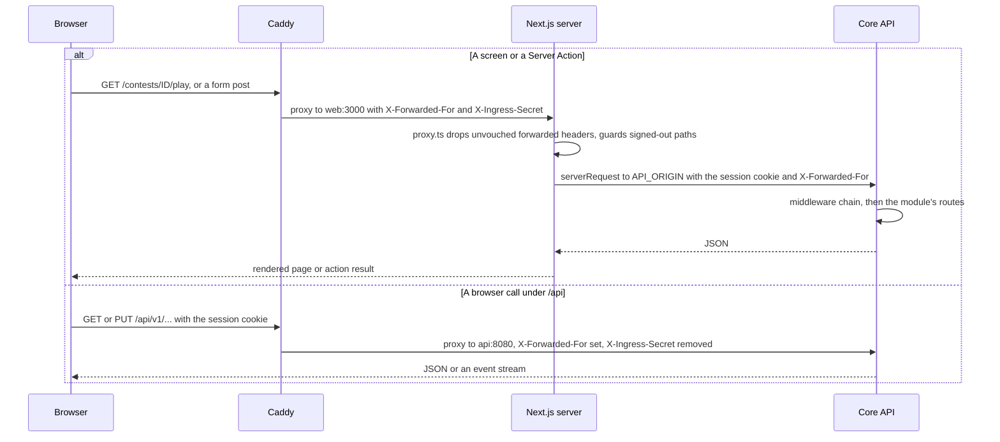

- Caddy: [deploy/Caddyfile](../../deploy/Caddyfile). Two sibling `handle`
  blocks; the `/api/*` one wins. Both overwrite `X-Forwarded-For` with the
  client address Caddy resolved.
- Next.js edge: `proxy` in [frontend/proxy.ts](../../frontend/proxy.ts) runs
  on every non-asset path. It calls `incomingRequestHeaders` and
  `guardRedirect` ([frontend/lib/auth/guard.ts](../../frontend/lib/auth/guard.ts)).
- Server-to-API calls: `serverRequest` in
  [frontend/lib/api/server.ts](../../frontend/lib/api/server.ts) adds
  `callerHeaders()` (the forwarded address, only when `X-Ingress-Secret`
  matches `INGRESS_SECRET`, see
  [frontend/lib/api/forwarded.ts](../../frontend/lib/api/forwarded.ts)) and
  `sessionHeader()` (the `dbcontest_session` cookie, passed on as a header).
- The API's routers: `NewRouter` in
  [backend/internal/api/router.go](../../backend/internal/api/router.go). Each
  feature is an `api.Module` whose `Mount` adds its routes under `/api/v1`;
  the modules are listed in [backend/internal/app/app.go](../../backend/internal/app/app.go).

The middleware chain, in the order `NewRouter` installs it:

| # | Middleware | What it does |
|---|---|---|
| 1 | `httpx.RequestID` | Reuses an incoming `X-Request-Id` only if it is a UUID, else makes one; every log line and query-log row carries it. |
| 2 | `IPResolver.Middleware` | Resolves the client address once. `X-Forwarded-For` is believed only from `TRUSTED_PROXIES` (the Caddy and web containers in compose). |
| 3 | `requestMeta` | Puts the address and user agent on the context, so every audit entry written later records them. |
| 4 | `httpx.AccessLog` | One access log line per request. |
| 5 | `metrics.Middleware` | Request metrics. |
| 6 | `httpx.SecureHeaders` | `nosniff`, `frame-ancestors 'none'`, `no-referrer`, `Cache-Control: no-store`, HSTS over TLS. |
| 7 | `httpx.Recoverer` | A panic becomes a 500; sits inside logging so the panic is still logged and counted. |
| 8 | `refuseUnstorableQuery` | 400 for a NUL byte or invalid UTF-8 in the path or query string. |
| 9 | `httpx.CheckOrigin` | Under `/api/v1` only: the cross-origin guard on writes (see [flow 2](#2-sign-in-an-authenticated-request-sign-out)). |
| 10 | Per module | `auth.Middleware.Authenticate`, then `RequirePermission` or `RequireContestPermission` where the route needs one. |

Rules that matter:

- Only `httpx.IPResolver` reads `X-Forwarded-For`; everything else asks
  `httpx.ClientIP`. The Next.js server is trusted to forward an address only
  because Caddy proves itself with `INGRESS_SECRET`
  ([CLAUDE.md, security rule 9](../../CLAUDE.md#security-and-performance-rules);
  [ARCHITECTURE.md §7.1](../ARCHITECTURE.md#71-reaching-a-contest-enrolment-and-address-restrictions)).
- The interface and the API share one hostname. The session cookie is
  `SameSite=Lax` and the API compares `Origin` with its own host, so a
  frontend on a second hostname is refused by its own backend (comment in the
  Caddyfile), unless that origin is listed in `PUBLIC_ORIGINS` (meant for a
  dev stack with the interface on :3000 and the API on :8080).

## 2. Sign-in, an authenticated request, sign-out

There is one sign-in for everybody; staff differ only in permissions. Sessions
live in the cache (Redis, or in-process memory), keyed by a digest of the
token, so a session can be withdrawn at once.

### Sign-in

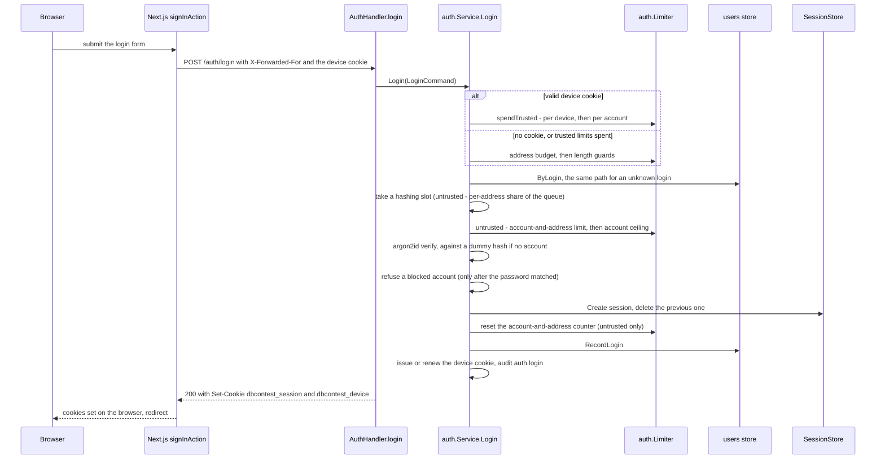

- Form and action: `signInAction` in
  [frontend/app/(public)/login/actions.ts](../../frontend/app/%28public%29/login/actions.ts)
  calls `signIn` in [frontend/lib/auth/sign-in.ts](../../frontend/lib/auth/sign-in.ts),
  which retries once on `sign_in_busy` and copies the API's `Set-Cookie` onto
  the browser's response.
- Handler: `AuthHandler.login` in
  [backend/internal/api/auth_handler.go](../../backend/internal/api/auth_handler.go)
  maps `ErrInvalidCredentials` to 401 `invalid_credentials`,
  `ErrAccountBlocked` to 403 `account_blocked`, `ErrTooManyAttempts` to 429
  `too_many_attempts` and `password.ErrBusy` to 503 `sign_in_busy`.
- Service: `Service.Login` in
  [backend/internal/auth/service.go](../../backend/internal/auth/service.go);
  its doc comment lists the steps in order. The session store is
  [backend/internal/auth/session.go](../../backend/internal/auth/session.go);
  the cookie flags (`HttpOnly`, `SameSite=Lax`, `Secure` from config) are in
  [backend/internal/auth/cookie.go](../../backend/internal/auth/cookie.go).

The rate limits, in the order an untrusted attempt spends them (all over a
15-minute fixed window):

| Order | Subject | Default limit | Spent in |
|---|---|---|---|
| 1 | Address (`ip:` plus `httpx.AddressSubject`, an IPv6 caller grouped by /64), successes included | 300 | `checkAddress` |
| 2 | Account and address | 10 | `spendAccount` |
| 3 | Account, from any address | 100 | `spendAccount` |

A successful untrusted sign-in resets the account-and-address counter (not the
account ceiling), so an owner who signs in every day is not locked out by
their own typos.

A browser holding a valid device cookie (`dbcontest_device`) is *trusted*: it
spends `spendTrusted` instead, per device (10) and per account across its
trusted browsers (20), and skips the address's share of the hashing queue.
Past those limits the attempt is not refused; it continues untrusted and pays
the three ordinary limits, so a copied cookie cannot lock the owner out. A
cookie that no longer vouches (password changed, account blocked) is found
out after the account lookup and pays the ordinary limits from there.

Rules that matter:

- The address budget is checked before anything keyed by the login, because
  the login is a string the caller invents
  ([CLAUDE.md, security rule 5](../../CLAUDE.md#security-and-performance-rules)).
- Every step runs the same way whether or not the login exists, so neither
  the answer nor its timing reveals which accounts exist
  ([ARCHITECTURE.md §7.2](../ARCHITECTURE.md#72-authentication-as-implemented)).
  Changing a password verifies the current one and is throttled too
  (`AllowPasswordChange`, CLAUDE.md security rule 4).

### An authenticated request, and sign-out

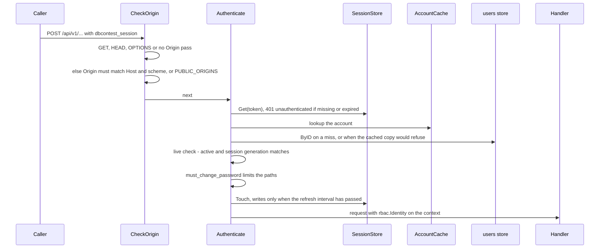

- `httpx.CheckOrigin` in
  [backend/internal/platform/httpx/csrf.go](../../backend/internal/platform/httpx/csrf.go)
  answers 403 `cross_origin`. The scheme comes from `isTLS`, which believes
  `X-Forwarded-Proto` only from a trusted proxy.
- `Middleware.Authenticate` in
  [backend/internal/auth/middleware.go](../../backend/internal/auth/middleware.go).
  A failed check answers 401 `unauthenticated` and clears the cookie; an
  account on a one-time password gets 403 `password_change_required`
  everywhere except changing it, `/auth/me` and logout.
- The session generation (`users.session_generation`) is raised by a password
  change or reset, a block or deletion, and a change of roles. Each ends every
  older session of that account on its next request.
- Sign-out: `signOutAction` in
  [frontend/components/layout/session-actions.ts](../../frontend/components/layout/session-actions.ts)
  posts `/auth/logout`; `AuthHandler.logout` calls `Service.Logout`, which
  deletes the session from the store and writes `auth.logout` to the audit
  trail; the handler and the action both clear the cookie, then the browser
  lands on `/login`.

Rules that matter:

- A Server Action's call to the API comes from the Next.js server and carries
  no `Origin`, so `CheckOrigin` lets it through; Next.js checks `Origin`
  against `Host` itself before running the action. A browser's direct write to
  `/api` carries `Origin` and is checked.
- Authentication on the common path is cache reads only (the session, the
  account's generation key and the cached account): no database query and no
  write. Extending a session is skipped unless it is due
  ([CLAUDE.md, security rule 6](../../CLAUDE.md#security-and-performance-rules)).

## 3. Joining a contest

A participant is a *registration*: one account in one contest. Contest staff
can add participants to any contest; a contest's `enrollment` decides whether
a student may also sign up themselves (`open`) or not (`invite_only`). After
that, both kinds of participant are treated the same.

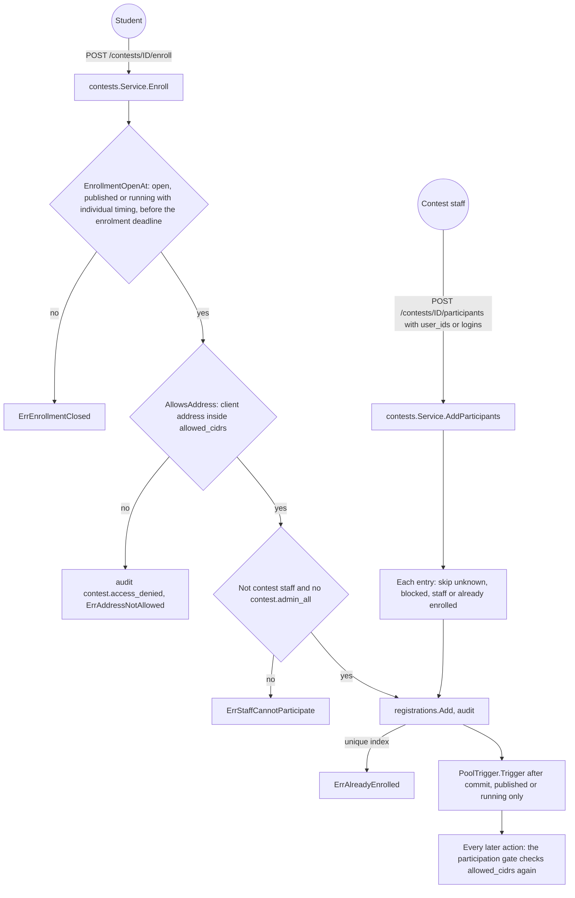

- Self-enrolment: `ContestsHandler.enroll` in
  [backend/internal/api/contest_people_handler.go](../../backend/internal/api/contest_people_handler.go)
  (route mounted in `contests_handler.go`, any signed-in account) calls
  `Service.Enroll` in
  [backend/internal/contests/enrollment.go](../../backend/internal/contests/enrollment.go).
  The frontend button posts from
  [frontend/app/(participant)/my/actions.ts](../../frontend/app/%28participant%29/my/actions.ts).
- Staff additions: `POST /contests/ID/participants` behind
  `participant.manage`, calling `Service.AddParticipants`. The people screen
  ([frontend/app/(admin)/contests/[contestId]/people/actions.ts](../../frontend/app/%28admin%29/contests/%5BcontestId%5D/people/actions.ts))
  sends `user_ids` from the picker or `logins` from a pasted list. A pasted
  list of new accounts is a separate step, `POST /users/import`, which creates
  accounts and does not enrol anybody.
- Staff additions are accepted while the contest is draft, published or
  running (`acceptsRegistrations`); self-enrolment only while
  `EnrollmentOpenAt` allows it. A staff addition wakes the pool tender only
  when somebody was added to a published or running contest; a draft waits
  for the periodic tick.

Rules that matter:

- `allowed_cidrs` binds participants on every action, not only at enrolment:
  the console, reads, answers and the events channel all go through the
  participation gate (`Gate.StandingOf`), which refuses with
  `ErrAddressNotAllowed`. Staff adding a
  participant are not subject to it
  ([ARCHITECTURE.md §7.1](../ARCHITECTURE.md#71-reaching-a-contest-enrolment-and-address-restrictions)).
  Only the enrolment refusal is written to the audit trail
  (`contest.access_denied`).
- A roster import is a partial success: only row-level reasons become
  skipped entries, anything else aborts the transaction, and one import holds
  at most 1,000 entries
  ([CLAUDE.md, security rules 2 and 8](../../CLAUDE.md#security-and-performance-rules)).
  "Already enrolled" is decided by the unique index on the write, not by a
  lookup.

## 4. The contest lifecycle

A contest's `status` is one of five values, held by the `CHECK` constraint in
[backend/migrations/000002_contests.up.sql](../../backend/migrations/000002_contests.up.sql)
and by `allowedTransitions` in
[backend/internal/contests/contests.go](../../backend/internal/contests/contests.go).

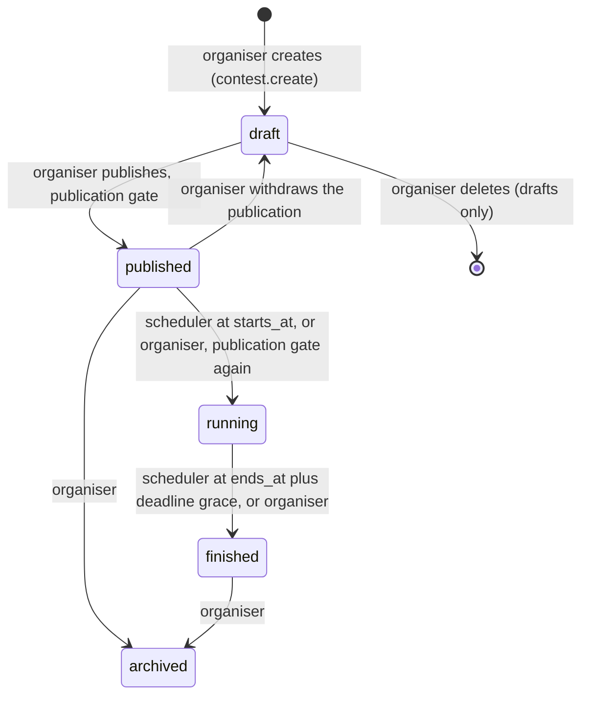

- Organiser moves: `POST /contests/ID/status`, behind `contest.publish`,
  calling `Service.Transition` in
  [backend/internal/contests/service.go](../../backend/internal/contests/service.go).
  It checks `CanTransitionTo`, runs the publication gate when the target is
  `published` or `running`, and writes the status with a compare-and-set
  (`SetStatus(from, to)`) and an audit entry in one transaction.
- Scheduler moves: `Scheduler.Advance` in
  [backend/internal/contests/schedule.go](../../backend/internal/contests/schedule.go),
  run every 15 seconds by `advanceContestSchedule` in
  [backend/internal/app/background.go](../../backend/internal/app/background.go).
  Each tick takes a transaction-scoped advisory lock, starts every published
  contest whose `starts_at` has passed by the database clock (if it passes the
  publication gate), and finishes every running contest whose `ends_at` plus
  the deadline grace has passed. A due contest the publication gate refuses
  stays published, and
  `contest.start_blocked` is audited once per distinct set of problems.
- Deleting a draft: `DELETE /contests/ID`, behind `contest.edit`, calling
  `Service.Delete`. Any other status is refused; a contest that was ever
  published can only be archived.
- After a move to `published` or `running`, the pool tender is woken
  (`PoolTrigger.Trigger`, [flow 6](#6-provisioning-a-participants-database)).
- What a status allows: story, questions and the SQL policy are editable only
  in `draft` and `published` (`ContentEditable`); the contest's own settings
  until it is `finished` (`SettingsEditable`), and extending the grace period
  even after.

The publication gate is `checkPublishable` in `schedule.go`, shared by
`Service.Transition`, `Service.CheckPublish` (`GET /contests/ID/publish-check`)
and the scheduler. It reports every problem at once; the codes are constants in
[backend/internal/contests/publish.go](../../backend/internal/contests/publish.go):

| Checks | Problem codes |
|---|---|
| At least one language, and a title in each | `no_languages`, `missing_contest_translation` |
| Both `starts_at` and `ends_at` set; the freeze starts after the start | `no_schedule`, `leaderboard_freeze_exceeds_window` |
| A story, translated into every language | `no_story`, `missing_story_translation` |
| At least one question; only one in single-question mode | `no_questions`, `single_mode_needs_one_question` |
| Each question translated, with choice labels and a reference answer | `missing_question_translation`, `missing_choice_label`, `no_reference_answer` |
| Attempt caps where guessing would otherwise win | `choice_needs_attempt_limit`, `icpc_choice_needs_attempt_limit`, `winner_final_needs_attempt_limit`, `sequential_needs_max_attempts` |
| Winner scoring: at least one final question | `winner_needs_final` |
| Sequential progression: no hidden question before the last | `sequential_hides_question` |
| No account with `contest.admin_all` registered as a participant | `staff_registered` |
| An uploaded cover carries an attribution | `cover_needs_attribution` |

The publication gate does not check that the game database is built; a contest without a
ready template opens, and its console answers that there is no game yet
(`queryproxy.ErrNoGameYet`).

Rules that matter:

- The status drives the interface; it does not guard the deadline. An answer
  is refused by the database clock in its own statement, so a late or missed
  scheduler tick never lets anyone answer late
  ([ARCHITECTURE.md §8](../ARCHITECTURE.md#8-the-contest-clock);
  [flow 8](#8-submitting-an-answer)).
- The publication gate runs again on the move to `running`, because content stays
  editable while published
  ([ARCHITECTURE.md, the publication gate](../ARCHITECTURE.md#the-publication-gate)).

## 5. Building the game database

Each contest has one *template* database on the game cluster; every
participant's database is a copy of it. The organiser describes the game in
one of three ways (`TemplateSource`): an SQL script typed into the editor, an
uploaded dump, or tables described in the table builder with CSV rows. The
HTTP request only stores the description; the build runs in a background task
of the Core API. The Query Runner takes no part in building.

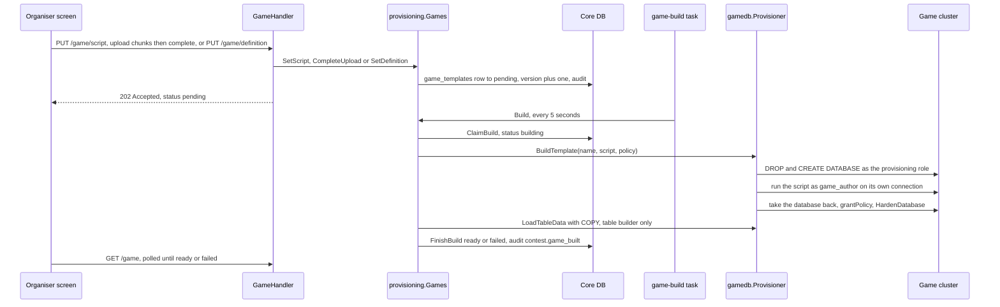

The template's own states, from `TemplateStatus` in
[backend/internal/provisioning/template.go](../../backend/internal/provisioning/template.go):

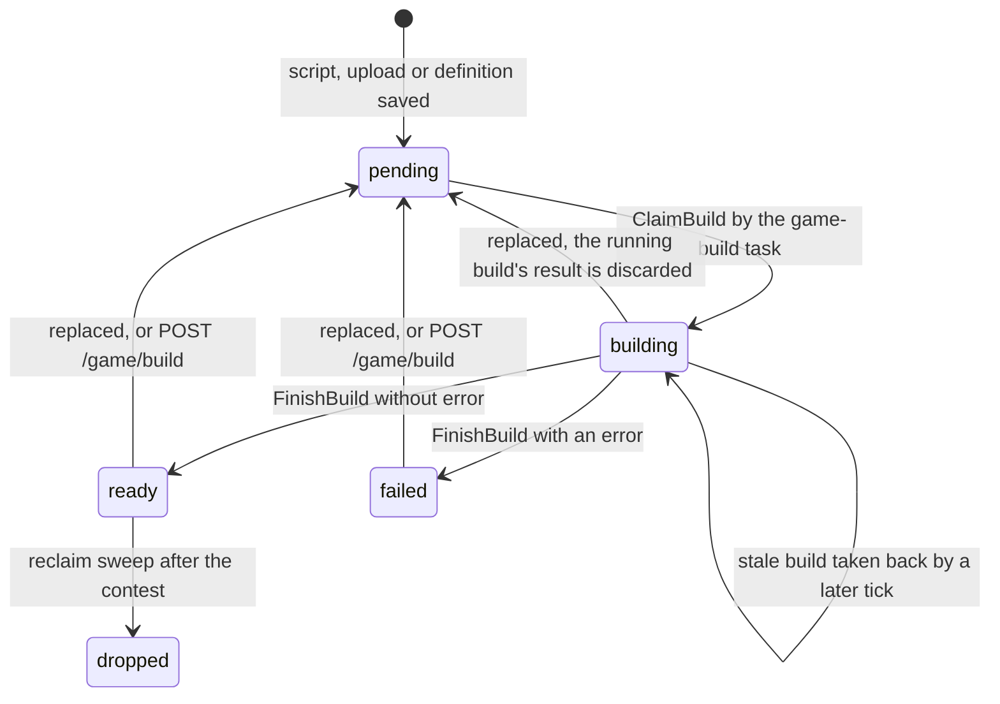

Replacing the game (`SetScript`, `CompleteUpload`, `SetDefinition`) is one
upsert to `pending` with the version raised, whatever the current state. A
build still running when it lands is not stopped, but its `FinishBuild`
matches no row (it checks the version) and its result is discarded.
`POST /game/build` is accepted only from `ready` or `failed`.

Which process does what:

| Process or package | Part in the build |
|---|---|
| `cmd/gamedb` (compose service `game-prepare`) | Runs on every deploy before the Query Runner. `gamedb.PrepareCluster` creates the roles `game_reader`, `game_writer` and `game_author`, their session defaults (`statement_timeout` 5s for participants, 0 for the author) and what they may not reach. |
| Core API, `internal/api` | `GameHandler` in [game_handler.go](../../backend/internal/api/game_handler.go): reads need `contest.view`, writes `contest.edit`. |
| Core API, `internal/provisioning` | `Games` stores the description, queues it, and runs `Build` from the `game-build` task. Replacing or rebuilding the game is refused once the contest has started (`requireEditable`, `ErrGameNotEditable`). |
| Core API, `internal/gamedb` | `Provisioner` connects with `GAME_PROVISIONER_DSN` on a maintenance pool with a 10-minute statement timeout, and runs the organiser's SQL only as `game_author` with `GAME_AUTHOR_PASSWORD`. |
| Query Runner | Nothing here; it only runs participants' queries. |

- Uploads: `BeginUpload`, `AppendChunk` and `CompleteUpload` in
  [backend/internal/provisioning/upload.go](../../backend/internal/provisioning/upload.go)
  write to `GAME_UPLOAD_DIR` (package `internal/gamefile`); the build streams
  the file statement by statement.
- The template name is `game_tpl_c` plus 12 hex characters of the contest ID
  (`templateName`). The *version* in `game_templates` rises with every
  replacement or rebuild; copies made from an older version are stale
  ([flow 6](#6-provisioning-a-participants-database)).
- A script error is shown to the organiser in PostgreSQL's words
  (`ScriptFailure`); any other failure shows the fixed
  `BuildFailedInternally` sentence and the detail goes only to the service
  log.

Rules that matter:

- The organiser's script never runs with the provisioner's privileges: the
  contest's privileges (`grantPolicy`) and catalogue revocations
  (`HardenDatabase`) are applied after the author's access is withdrawn, and
  they survive `CREATE DATABASE … TEMPLATE`
  ([ARCHITECTURE.md §4](../ARCHITECTURE.md#4-isolating-the-game-databases),
  [§4.1](../ARCHITECTURE.md#41-a-contests-sql-policy)).
- `CREATE DATABASE … TEMPLATE` outlasts the core API's 10-second statement
  timeout, so the game cluster gets its own pool
  ([CLAUDE.md, security rule 15](../../CLAUDE.md#security-and-performance-rules)).

## 6. Provisioning a participant's database

Every participant works in their own copy of the template. Copies are made
ahead of time into a pool of spares, so claiming one is a row update rather
than a `CREATE DATABASE` while a whole hall waits.

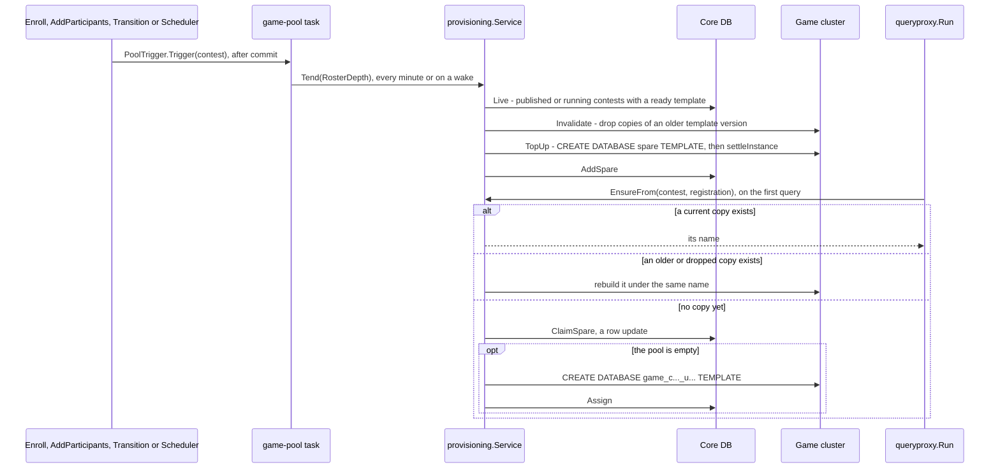

- Pool and claim: `Service.Tend`, `TopUp`, `Invalidate` and `EnsureFrom` in
  [backend/internal/provisioning/provisioning.go](../../backend/internal/provisioning/provisioning.go);
  the copy is `Provisioner.CreateInstance` in
  [backend/internal/gamedb/provisioner.go](../../backend/internal/gamedb/provisioner.go)
  (`STRATEGY` from `GAME_COPY_STRATEGY` when set). The wake-up channel is
  `provisioning.Tender` ([tender.go](../../backend/internal/provisioning/tender.go)),
  which folds a burst of triggers into one extra pass.
- Pool depth: `RosterDepth` asks for everybody on the roster without a copy
  plus `GAME_POOL_DEPTH`, capped by `GAME_POOL_MAX` copies per contest and by
  `GAME_CLUSTER_MAX_BYTES` for the whole cluster. A copy made on demand checks
  the byte budget too; past it the participant gets
  `queryproxy.ErrNoRoomForDatabase`.
- Names: a spare is `game_pool_c<contest>_<random>`, a copy made on demand
  `game_c<contest>_u<registration>` (12 hex characters each).
- The role: the Query Runner connects as `game_reader` when the contest's
  policy is `read_only` and as `game_writer` when it is `read_write`
  (`GAME_DB_DSN`, `GAME_DB_WRITER_DSN`). What each may do inside the copy was
  granted on the template; `settleInstance` adds the per-database grants a
  template does not carry.
- Quota: for a `read_write` contest, `Service.Quota` allows the template's size
  times the policy's `DiskQuotaRatio` (default 5), at least 16 MiB; the value
  travels to the Query Runner in the request.

When a copy is dropped:

| When | By |
|---|---|
| Its template version is older than the current one | `Invalidate`, on the next pool tick; or rebuilt in place on the participant's next query |
| The contest is `finished` or `archived` and its grace period has passed | The `game-reclaim` task, every 10 minutes: `Service.Reclaim` in [reclaim.go](../../backend/internal/provisioning/reclaim.go) |
| An organiser drops a broken copy | `DELETE /contests/ID/game/instances/NAME`, behind `contest.edit` |

The grace period is the contest's own `grace_period_min` setting, or
`GAME_INSTANCE_GRACE_MIN` (default 1,440 minutes), counted from the contest
row's `updated_at`, which the move to `finished` or `archived` sets, and so
does any later edit of the contest: an extended grace period runs from the
extension (`reclaimDeadline` in
[backend/internal/postgres/gameinstances.go](../../backend/internal/postgres/gameinstances.go)).
`Reclaim` uses `DropIdle`, which never forces: a database somebody is still
connected to is retried on a later tick. Once all of a contest's copies are
gone, the template is dropped too. The row stays, marked `dropped`. Databases
the sweep cannot account for are left to `cmd/gameorphans`, run by hand.

Rules that matter:

- Creating databases happens in the background and a few at a time
  (`GAME_PROVISION_WORKERS`), never in bulk at the start
  ([ARCHITECTURE.md §4.2](../ARCHITECTURE.md#42-provisioning-without-a-spike)).
- The disk quota is decided on the Core API's side and checked on the Query
  Runner's, so it crosses the gRPC contract as `disk_quota_bytes`
  ([CLAUDE.md, security rule 11](../../CLAUDE.md#security-and-performance-rules)).

## 7. Running a query

The most important flow: a participant types SQL in the play console and gets
rows back. The Core API decides *whether and where* the query runs; the Query
Runner decides *what the SQL may do, how long it runs and how much it
returns*. The two talk over gRPC on the private network.

### In the Core API

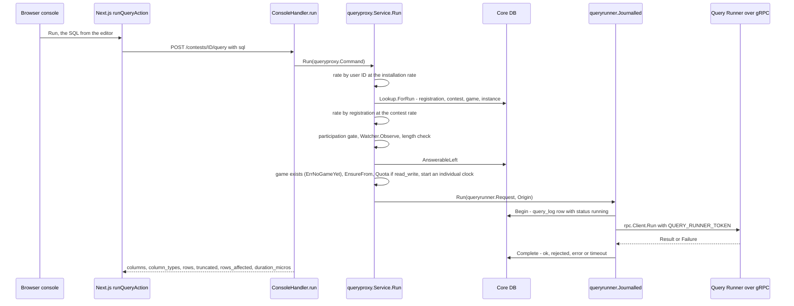

- Frontend: `runQueryAction` in
  [frontend/app/(participant)/contests/[contestId]/play/actions.ts](../../frontend/app/%28participant%29/contests/%5BcontestId%5D/play/actions.ts),
  called from `console.tsx` in the same directory.
- Handler: `ConsoleHandler.run` in
  [backend/internal/api/console_handler.go](../../backend/internal/api/console_handler.go)
  (authentication only: taking part is a registration, not a permission). It
  fills `queryproxy.Command` with the address from `httpx.ClientIP`, the
  request ID and `monitor.SessionTag` of the session. `fail` maps each
  `sqlpolicy.Refusal` and runner outcome to its own code.
- Façade: `Service.Run` in
  [backend/internal/queryproxy/queryproxy.go](../../backend/internal/queryproxy/queryproxy.go);
  its doc comment lists the checks in order. The database name always comes
  from `game_instances`, never from the request. The participation gate is
  `contests.Gate.StandingOf` in
  [backend/internal/contests/standing.go](../../backend/internal/contests/standing.go).
- Journal: `Journalled.Run` in
  [backend/internal/queryrunner/journal.go](../../backend/internal/queryrunner/journal.go)
  writes the `query_log` row before the query is sent (a crash leaves a
  `running` row for the sweeper) and closes it on a detached context.
- When the contest's policy hides the catalogue (`allow_catalog` false), a
  database error comes back as `queryproxy.ErrDatabaseDeclined`, not in
  PostgreSQL's words.
- gRPC: `rpc.Client` in [backend/internal/rpc/client.go](../../backend/internal/rpc/client.go),
  contract in [backend/proto/queryrunner/v1/queryrunner.proto](../../backend/proto/queryrunner/v1/queryrunner.proto)
  (service `QueryRunner`, method `Run`). A refusal travels as a `Failure` in
  the response, not as a gRPC error; `rpc.ErrUnreachable` means the runner did
  not answer at all.

### In the Query Runner

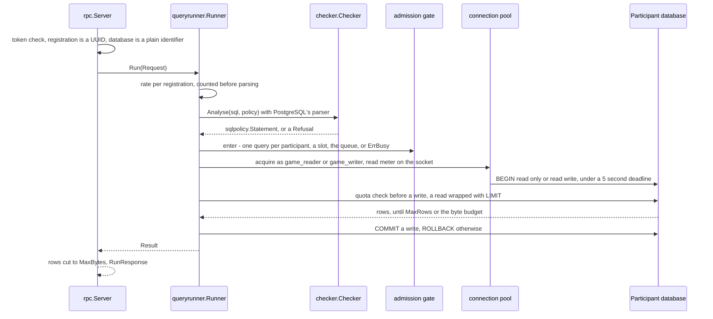

- Assembly: [backend/cmd/queryrunner/main.go](../../backend/cmd/queryrunner/main.go)
  wires `queryrunner.NewCluster`, `checker.NewChecker` and `rpc.Serve`. It is
  the only binary that links the cgo parser.
- `Runner.Run` and `execute` in
  [backend/internal/queryrunner/runner.go](../../backend/internal/queryrunner/runner.go);
  the default `Limits` are a 5-second deadline, 1,000 rows, 5 MiB, 8
  concurrent queries, a queue of 32 and 30 queries a minute.
- The parser: `Checker.Analyse` in
  [backend/internal/sqlpolicy/checker/check.go](../../backend/internal/sqlpolicy/checker/check.go)
  (`pg_query_go`), one statement only, checked against the contest's
  `sqlpolicy.Policy`. The text that runs is `Statement.Text`, cut where the
  parser said the statement ends.
- Admission: `gate.enter` in
  [backend/internal/queryrunner/admission.go](../../backend/internal/queryrunner/admission.go)
  answers `ErrAlreadyRunning` or `ErrBusy` at once rather than waiting without
  bound.
- Connections: `Cluster.connect` in
  [backend/internal/queryrunner/cluster.go](../../backend/internal/queryrunner/cluster.go)
  wraps the socket in `meteredConn`; past the budget the read fails and the
  runner answers `ErrResultTooLarge`.

Rules that matter:

- Rate limits come before the work they protect, and refusals count: the
  façade charges the user before any lookup and the registration right after
  the one lookup, before every other check, and the runner charges again
  before parsing
  ([CLAUDE.md, security rules 5 and 13](../../CLAUDE.md#security-and-performance-rules)).
  The role's `statement_timeout` is only a default a session can `SET` away;
  the runner's context deadline is the bound.
- Memory is bounded on the socket, not on decoded rows, and wrapping uses the
  parser's statement bounds
  ([CLAUDE.md, security rules 12 and 14](../../CLAUDE.md#security-and-performance-rules);
  [ARCHITECTURE.md §5](../ARCHITECTURE.md#5-executing-student-sql-safely),
  [§4.3](../ARCHITECTURE.md#43-isolating-performance-admission-control)).

## 8. Submitting an answer

A participant answers a question from the questions panel. The answer is
graded once, recorded as one attempt, and points are added to the
registration's score. The deadline is checked against the core database's
clock in the same statement that writes the attempt.

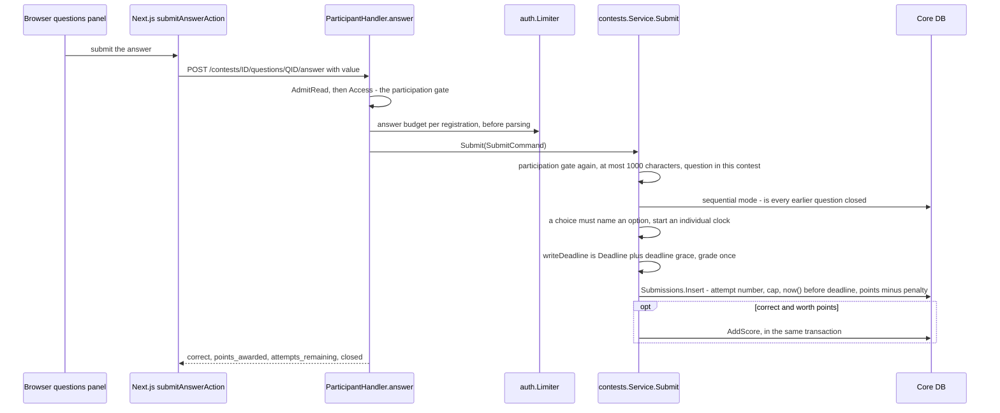

- Handler: `ParticipantHandler.answer` and `admitAnswer` in
  [backend/internal/api/participant_handler.go](../../backend/internal/api/participant_handler.go);
  the per-registration budget is `ANSWER_RATE_PER_MINUTE` over a one-minute
  window, refused with 429 `answer_too_often`.
- Service: `Service.Submit` and `submitOnce` in
  [backend/internal/contests/submission.go](../../backend/internal/contests/submission.go).
  The deadline formula is `contests.Deadline` in
  [deadline.go](../../backend/internal/contests/deadline.go): `ends_at` under
  fixed timing, the earlier of `started_at + duration_min` and `ends_at` under
  individual timing. `Gate.closesAt` adds `DEADLINE_GRACE` (default 5 s).
- The single statement: `Submissions.Insert` in
  [backend/internal/postgres/submissions.go](../../backend/internal/postgres/submissions.go)
  computes the attempt number from committed history, refuses once the
  question is answered correctly or `max_attempts` is spent
  (`ErrQuestionClosed`) or at `now() >= deadline` (`ErrDeadlinePassed`, which
  wins when both apply), and sets `points_awarded`. Two concurrent attempts
  with the same number collide on `UNIQUE (registration_id, question_id,
  attempt_no)`; `Submit` retries up to five times with jittered backoff.
- Penalties: `penaltyAmount` is `points * penalty_pct / 100` per wrong
  attempt, zero under `winner` and `icpc` scoring; `points_awarded` is floored
  at zero.

Nothing pushes a leaderboard update. The table is computed on read by
`leaderboard.Service` ([backend/internal/leaderboard/service.go](../../backend/internal/leaderboard/service.go))
from submissions up to a cutoff, cached briefly in process. `Decide` in
[leaderboard.go](../../backend/internal/leaderboard/leaderboard.go) picks the
cutoff:

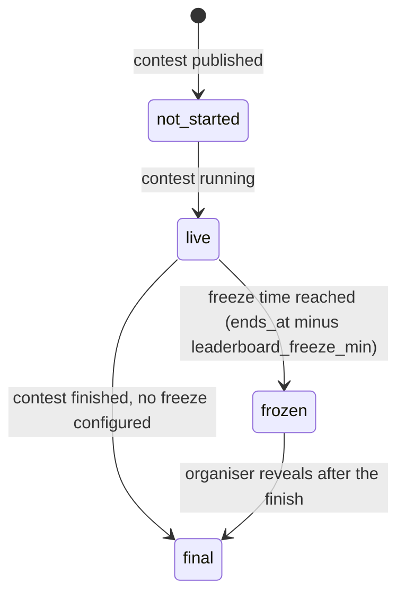

- Routes: `GET /contests/ID/leaderboard` (public),
  `GET /contests/ID/play/leaderboard` (a participant, with their own row),
  `GET /contests/ID/leaderboard/live` (staff with `contest.view`, never
  frozen), `POST /contests/ID/leaderboard/reveal` (`contest.edit`), in
  [backend/internal/api/leaderboard_handler.go](../../backend/internal/api/leaderboard_handler.go).
  A frozen table cuts off at the freeze time, so answers after it are scored
  but not shown until the reveal.

Rules that matter:

- The deadline is enforced by the database clock in the write, with the same
  deadline grace the participation gate and the scheduler use, so the three
  never disagree
  ([ARCHITECTURE.md §8](../ARCHITECTURE.md#8-the-contest-clock),
  [§8.1](../ARCHITECTURE.md#81-the-participation-gate)).
- Past admission, a refused or malformed answer still spends the answer
  budget; a request the participation gate turns away has already spent the
  read budget (`AdmitRead`). Every refusal is a declared sentinel with its own
  code
  ([CLAUDE.md, security rules 1 and 13](../../CLAUDE.md#security-and-performance-rules);
  scoring in [ARCHITECTURE.md §6.1.1](../ARCHITECTURE.md#611-how-a-contest-decides-a-result)).

## 9. Live updates

### The participant's events channel

The play screen holds one Server-Sent Events connection per contest. It keeps
the browser's clock in step with the server's and tells the screen when the
contest starts or ends for this participant. It carries nothing about anyone
else.

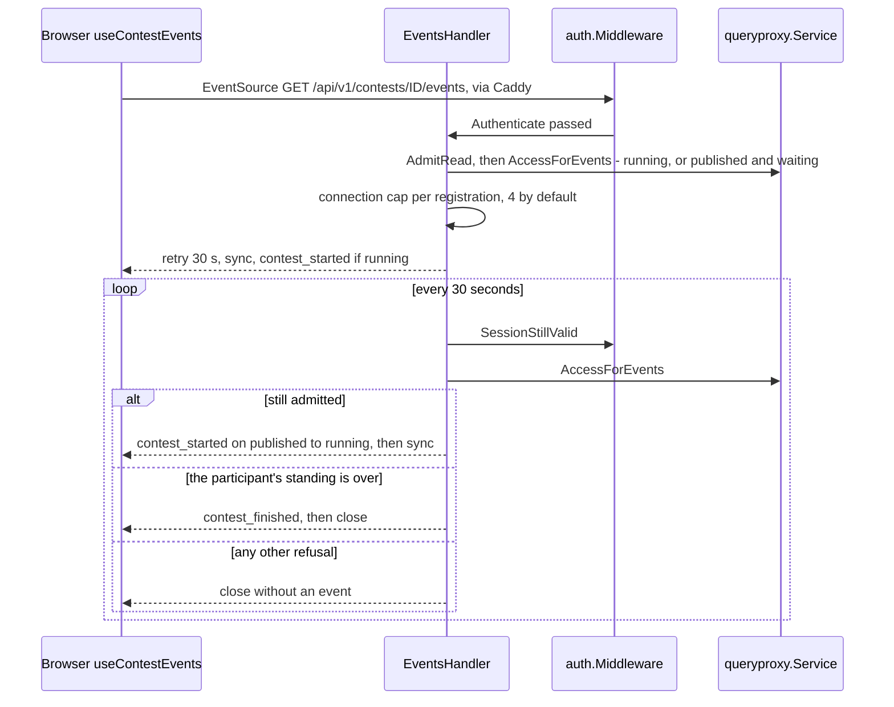

- Server: `EventsHandler.events` in
  [backend/internal/api/events_handler.go](../../backend/internal/api/events_handler.go).
  `sync` carries `server_now` and the participant's deadline without the
  deadline grace. A storage error on a tick (`queryproxy.ErrUnavailable`) is retried on
  the next tick; an invalid session ends the stream; server shutdown closes
  it.
- `contest_finished` is sent when `Standing.Over()` is true: the contest
  finished or archived, the participant's own time is up, or their
  registration is finished. A disqualified participant, a contest moved back
  to draft or an address no longer allowed close the stream silently.
- Client: `useContestEvents` in
  [frontend/app/(participant)/contests/[contestId]/play/use-contest-events.ts](../../frontend/app/%28participant%29/contests/%5BcontestId%5D/play/use-contest-events.ts).
  When the connection is refused, the hook fetches the same URL to learn the
  code; a temporary refusal is retried with backoff from 5 to 60 seconds plus
  jitter, a terminal one (excluded, wrong network) is not.

### An organiser watching

Monitoring is polling, not a push channel. The organiser's screens read the
participants table and a merged feed every five seconds while the tab is
visible.

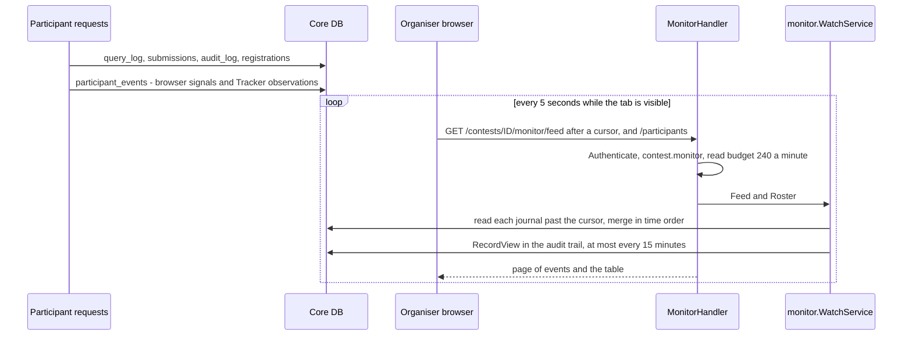

- Routes: `MonitorHandler.Mount` in
  [backend/internal/api/monitor_handler.go](../../backend/internal/api/monitor_handler.go)
  (`/contests/ID/monitor/participants`, `/feed`, and per participant
  `/participants/REG` with `/timeline`, `/queries`, `/answers`, `/workspace`,
  and CSV exports).
- Feed: [backend/internal/monitor/feed.go](../../backend/internal/monitor/feed.go)
  reads each journal as its own index range and merges them; nothing is
  copied into a feed table.
- Signals: the play screen batches browser signals (page left, paste) to
  `POST /contests/ID/play/signals` (`use-signals.ts`); the server side adds
  address changes and parallel sessions through `monitor.Tracker.Observe`,
  which `queryproxy` calls as its `Watcher` on every admitted query.
- Client: `MONITOR_POLL_MS` in
  [frontend/app/(admin)/contests/[contestId]/monitor/use-monitor.ts](../../frontend/app/%28admin%29/contests/%5BcontestId%5D/monitor/use-monitor.ts).

Rules that matter:

- A held-open stream re-checks the session and the participation gate on every tick, so it
  does not outlive a sign-out, a block or the deadline; ticks are not charged
  to the read budget, opening a connection is
  ([ARCHITECTURE.md §8](../ARCHITECTURE.md#8-the-contest-clock)).
- Watching is itself audited, and a signal is a report from the browser, not
  proof ([ARCHITECTURE.md §9.4](../ARCHITECTURE.md#94-watching-a-participant)).

## 10. Background work

`internal/app` starts its periodic jobs as goroutines (`runPeriodically` in
[backend/internal/app/background.go](../../backend/internal/app/background.go)).
There are no retries or backoff: a failed run is logged and the next tick
runs. Every API replica runs every job; the scheduler serialises itself with
an advisory lock, and a game build is claimed by one worker through its row.

| Job | Every | At start | What it does | Runs when |
|---|---|---|---|---|
| `contest-schedule` | 15 s | yes | `contests.Scheduler.Advance`: start due published contests that pass the publication gate, finish running ones past `ends_at` plus the deadline grace, audit both, wake the pool. | always |
| `query-log-sweep` | 1 min | yes | `QueryLog.SweepAbandoned`: closes `query_log` rows left `running` for over 2 minutes by a process that died. | always |
| `game-pool` | 1 min, and on a `Tender` wake | yes | `provisioning.Service.Tend`: drop stale copies, top pools up to `RosterDepth`. | `GAME_PROVISIONER_DSN` set |
| `game-build` | 5 s | yes | `provisioning.Games.Build`: build one pending template; take back a build left in `building` longer than `GAME_BUILD_TIMEOUT` plus a margin. | `GAME_PROVISIONER_DSN` set |
| `game-reclaim` | 10 min | no | `provisioning.Service.Reclaim`: drop idle participant databases past their contest's grace period, then templates with no copies left. | `GAME_PROVISIONER_DSN` set |
| `game-upload-sweep` | 10 min | no | `provisioning.Games.SweepUploads`: abort uploads idle past `GAME_UPLOAD_ABANDONED_AFTER` (default 24 h), remove files no row names. | `GAME_UPLOAD_DIR` set too |

Not periodic: `cmd/gameorphans` lists, and with `-apply` removes, databases
and cover files the product does not remove itself. It is run by hand.

Rules that matter:

- These jobs are housekeeping, not conditions for correctness. A dead
  scheduler delays the status shown, but the deadline still holds in the
  answer's write ([flow 8](#8-submitting-an-answer)).
- A job that reads a condition from storage treats an infrastructure failure
  as an error, not as a refusal: the scheduler aborts the tick rather than
  recording a database outage as a blocked start
  ([CLAUDE.md, security rule 8](../../CLAUDE.md#security-and-performance-rules)).

For how these packages are laid out and how to add one, see
[the backend chapter](04-backend.md); for the screens that start these flows,
[the frontend chapter](05-frontend.md); for how the flows are tested,
[the testing chapter](06-testing.md).
