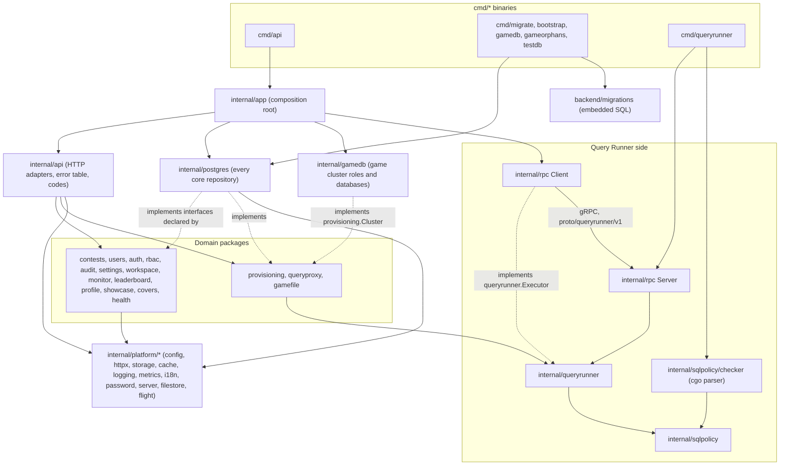

# 4. The backend

How the Go code under `backend/` is organised, for someone about to change it,
and step-by-step recipes for the changes people make most often.

This chapter is a path through the code. For the configuration table, the
endpoint list and deployment, see [backend/README.md](../../backend/README.md);
for why the system is built this way, see
[docs/ARCHITECTURE.md](../ARCHITECTURE.md). Words such as *registration*,
*participation gate* or *game template* are defined in the
[glossary](01-overview.md#the-glossary).

## Contents

1. [The shape](#1-the-shape)
2. [Anatomy of a domain package](#2-anatomy-of-a-domain-package)
3. [The life of a request](#3-the-life-of-a-request)
4. [Recipes](#4-recipes)
   - [a. Add an endpoint to an existing package](#a-add-an-endpoint-to-an-existing-package)
   - [b. Add a new domain package end to end](#b-add-a-new-domain-package-end-to-end)
   - [c. Add a migration](#c-add-a-migration)
   - [d. Add an API error code](#d-add-an-api-error-code)
   - [e. Add a permission](#e-add-a-permission)
   - [f. Add an audit action](#f-add-an-audit-action)
   - [g. Add an installation setting](#g-add-an-installation-setting)
   - [h. Change the Query Runner contract](#h-change-the-query-runner-contract)
   - [i. Add a configuration variable](#i-add-a-configuration-variable)
5. [Before you open a pull request](#5-before-you-open-a-pull-request)

## 1. The shape

The backend is one Go module (`github.com/devrdn/db-contest/backend`) that
builds two services: the **Core API** (`cmd/api`), a modular monolith that
serves `/api/v1`, and the **Query Runner** (`cmd/queryrunner`), a separate
process that checks and runs participants' SQL. A handful of one-shot
commands share the same packages.



- **`internal/app/app.go`** is the only package that imports everything: it
  opens the pools and the cache, builds each repository from
  `internal/postgres`, each service, each HTTP handler, and hands the handlers
  to `api.NewRouter` as `Deps.Modules`.
- **`internal/api`** adapts HTTP to the domain. `router.go` builds the public
  and internal routers. Each `Module` (`ContestsHandler`, `UsersHandler`, ...)
  has a `Mount` method, and a large one spreads its handlers over several
  files: `contest_content_handler.go` and `contest_people_handler.go` belong
  to `ContestsHandler`, `users_bulk_handler.go` to `UsersHandler`.
  `errortable.go` and `codes.go` decide every error answer.
- **Domain packages** sit at the top of `internal/` and declare the storage
  they need as interfaces. `internal/postgres` holds every core-database query
  and implements those interfaces; `internal/gamedb` does the same for the game
  cluster, behind `provisioning.Cluster`.
- **The Query Runner side.** `queryproxy` (in the Core API) decides whether and
  where a query runs and calls a `queryrunner.Executor`. In production that
  executor is `rpc.Client`, which speaks gRPC to `rpc.Server` inside
  `cmd/queryrunner`; the server hands the request to `queryrunner.Runner`,
  which checks the SQL with `sqlpolicy/checker` and runs it on the game
  cluster. `internal/rpc/queryrunnerv1` is the generated code for
  `backend/proto/queryrunner/v1/queryrunner.proto`.
- **`internal/platform/*`** is infrastructure. It sits beneath everything and
  imports no domain package.
- **`cmd/*`** are thin: flags, signals, exit codes. `cmd/apicontract` and
  `cmd/auditcontract` generate the two contract files under `docs/api/`.

Why the runner is a separate process, in one line: it links PostgreSQL's
parser through cgo, and a crash in C code reading attacker-chosen text must not
take sign-in and the contest clock down with it
([ARCHITECTURE §2.3](../ARCHITECTURE.md#23-query-runner-go-a-separate-service)).
Two consequences you will meet:

- **A C compiler is a prerequisite.** `internal/sqlpolicy/checker` imports
  `github.com/pganalyze/pg_query_go/v6`, a cgo package, and `go test ./...`
  compiles it. Install the Xcode Command Line Tools on macOS or `gcc` on
  Linux before `make check`. The first build compiles PostgreSQL's parser and
  takes minutes; later builds are cached.
- **The Core API's binaries build without cgo,** so nothing they import may
  reach `internal/sqlpolicy/checker`. `make static-check` fails if one does.
  `queryrunner.Validator` is an interface for that reason.

### The dependency rules

From CLAUDE.md, "Go layout conventions" (read the reasons there):

| Rule | In one line |
|---|---|
| 1 | Packages are the unit of encapsulation: name files by what is in them (`session.go`, `limiter.go`), never `model.go` / `service.go` / `repository.go` by role. |
| 2 | Behaviour lives with its data: `User.IsActive()` sits next to `User`. |
| 3 | Interfaces are declared by the consumer and kept to what it uses; domain code never imports a database driver. |
| 4 | HTTP belongs to `internal/api` and `platform/httpx`; a domain package takes a `context.Context`, never an `*http.Request`. |
| 5 | `foo.go` is tested by `foo_test.go`; cross-cutting tests go in `integration_test.go`, shared helpers in `support_test.go` or a `<pkg>test` package. |
| 6 | Every package has a doc comment saying what it answers and what it does not. |
| 7 | `internal/platform/*` imports no domain package; `internal/app` is the only place that knows them all. |

Rule 3 in practice: `auth.UserStore` (`internal/auth/session.go`) is four
methods of `users.Repository`, and `contests.UserDirectory`
(`internal/contests/service.go`) is the three that the contest service uses.
Handlers do the same: `api.SettingsStore` (`internal/api/settings_handler.go`)
names the slice of `settings.Service` the settings routes call.

## 2. Anatomy of a domain package

The worked example is `internal/contests`. It is the largest domain package,
but it is the one that shows every part: types with behaviour, a `Service`,
consumer-declared repository interfaces, sentinels listed in `Errors()`, and a
`conteststest` package whose in-memory fakes and repository contracts run
against both the fakes and PostgreSQL. Read it through one slice, the contest's
**story**, which touches every layer in a few dozen lines. (A smaller package,
`internal/workspace`, has the same shape without contracts or `Errors()`.)

Start with `go doc ./internal/contests`: the package comment says it owns what
an organiser authors and runs, decides what may change and when, and does not
decide who may call an operation (`internal/rbac`) or hold any SQL.

### The files

`internal/contests/`, one file per topic:

| File | Holds |
|---|---|
| `contests.go` | `Contest`, the lifecycle statuses and transitions, settings, `Repository`, the package's core sentinels |
| `service.go` | `Service`, `ServiceConfig` (every dependency it is built from), `NewService`, `UserDirectory`, `ErrNotEditable`, the shared helpers `editableContest` and `record` |
| `errors.go` | `Errors()`: every sentinel that reaches the HTTP layer |
| `story.go` | `Story` and `Story.Body`, `StoryRepository`, `ErrStoryNotFound`, `Service.Story` and `Service.SetStory` |
| `question.go` | `Question`, `Answer`, their validation and matching, `QuestionRepository` |
| `publish.go` | the content checks of the publication gate: `CheckPublishable`, `PublishProblem`, `NotPublishableError` |
| `enrollment.go` | `Participant`, `RegistrationRepository`, enrolment and roster import, `PoolTrigger` |
| `managers.go` | contest staff: `Manager`, `ManagerRepository`, granting and revoking |
| `standing.go` | the participation gate: `Gate`, `Gate.StandingOf`, `Standing` |
| `submission.go` | submitting an answer: `Submit`, `SubmissionRepository` |
| `schedule.go` | the background `Scheduler` that starts and finishes contests, `ScheduleRepository` |
| `sqlpolicy.go` | a contest's stored `SQLPolicy` and `PolicyStore` |
| `participant_view.go` | `Reader`: what a participant may see of a running contest |
| `export.go`, `directory.go`, `languages.go`, `deadline.go`, `attempts.go`, `sequence.go` | the contest package export, the people picker, the language catalogue, deadlines, attempt counts, the sequential-order gate |

Each file with behaviour has its `_test.go` beside it, in the external package
`contests_test`, so the tests use only what is exported. The interface-only
`attempts.go` and `sequence.go` are covered by their contracts in
`conteststest`. Two more test files: `errors_test.go`
runs `sentineltest.AssertListed`, and `integration_test.go` proves that every
mutating operation writes its audit entry inside its transaction.

`internal/contests/conteststest/`, test support another package can import:

| File | Holds |
|---|---|
| `stores.go` | in-memory implementations of the repositories (`Contests`, `Stories`, `Questions`, ...) and an audit `Sink` |
| `fixture.go` | `NewFixture()`: the real `contests.Service` built over the fakes, with a fixed clock (`FixtureNow`), and the fake `UnitOfWork` |
| `schedule.go` | the in-memory `Schedule`, a `contests.ScheduleRepository` over the `Contests` store |
| `*_contract.go` | one contract per repository, such as `StoryRepositoryContract`: what every implementation must do |
| `stores_test.go`, `schedule_test.go` | run the contracts against the fakes |

Outside the package, the same slice continues:

| File | Role |
|---|---|
| `internal/postgres/stories.go` | `Stories`, the SQL implementation, with `var _ contests.StoryRepository = (*Stories)(nil)` |
| `internal/postgres/stories_test.go` | runs `StoryRepositoryContract` against PostgreSQL |
| `internal/api/contest_content_handler.go` | `story` and `setStory` handlers, `StoryResponse` |
| `internal/api/contests_handler.go` | `ContestsHandler.Mount` (the routes) and `fail` |
| `internal/api/errortable.go` | `contestsErrors`, one row per sentinel |
| `internal/app/app.go` | `contests.NewService(contests.ServiceConfig{Stories: postgres.NewStories(pool), ...})` |

### How the pieces meet

The interface is declared where it is used, in `story.go`:

```go
type StoryRepository interface {
	ByContest(ctx context.Context, contestID uuid.UUID) (Story, error)
	Save(ctx context.Context, contestID uuid.UUID, bodies map[string]string) (Story, error)
	Delete(ctx context.Context, contestID uuid.UUID) error
}
```

The contract is one function that takes a way to prepare a fresh target, so
the fake and the real store run the same cases. The PostgreSQL side, in full:

```go
func TestStoriesHonoursTheRepositoryContract(t *testing.T) {
	conteststest.StoryRepositoryContract(t, func(t *testing.T, run func(context.Context, conteststest.StoryTarget)) {
		withTx(t, func(ctx context.Context) {
			author := makeUser(t, ctx, "author-story")
			now := txNow(t, ctx)
			repo := NewStories(testPool)
			run(ctx, conteststest.StoryTarget{
				Repo:       repo,
				Text:       repo,
				NewContest: func() uuid.UUID { return makeContest(t, ctx, author.ID) },
				Now:        func() time.Time { return now },
			})
		})
	})
}
```

What this buys: service tests run in microseconds against the fakes, and the
fakes cannot drift from production, because any behaviour the contract
describes is checked on both.

Two conventions you will see in every service method that writes:

- **One transaction for the change and its audit entry.** `SetStory` calls
  `s.uow.Do(ctx, func(ctx) error { ...Save...; return s.record(...) })`.
  Repositories pick the ambient transaction up through
  `storage.QuerierFrom(ctx, pool)`, so the service never sees a transaction
  object (`internal/platform/storage/tx.go`).
- **Errors are sentinels**, returned as they are or wrapped with `%w`, never a
  bare `errors.New` inside a method (CLAUDE.md, security rule 1).

## 3. The life of a request

Follow `PUT /api/v1/contests/{contestID}/story` from the socket to the JSON
answer. The cross-service view, with the browser and Caddy, is in
[03-flows.md](03-flows.md).

1. **Router middleware** (`api.NewRouter`, `internal/api/router.go`), in this
   order: `httpx.RequestID`, the client-address resolver
   (`httpx.IPResolver.Middleware`, which trusts only `TRUSTED_PROXIES`),
   `requestMeta` (puts the address and user agent in the context for the audit
   trail), `httpx.AccessLog`, `metrics.Middleware`, `httpx.SecureHeaders`,
   `httpx.Recoverer`, and `refuseUnstorableQuery`.
2. **`/api/v1`** adds `httpx.CheckOrigin`, the CSRF guard for cookie-borne
   sessions, then mounts every module in `Deps.Modules`.
3. **The module's routes.** `ContestsHandler.Mount` puts
   `h.mw.Authenticate` on all of `/contests`, and this route sits in the group
   guarded by `h.mw.RequireContestPermission(rbac.PermissionContestEdit)`.
4. **Authentication** (`auth.Middleware.Authenticate`,
   `internal/auth/middleware.go`): the session cookie is looked up in the
   `SessionStore`, the account is read (from the account cache, or
   `auth.UserStore.ByID`), a blocked account or an old session generation is
   refused, and an `rbac.Identity` goes into the context. Failure: 401
   `unauthenticated`. An account with a one-time password gets 403
   `password_change_required` everywhere except `/auth/password`,
   `/auth/logout` and `/auth/me`.
5. **Authorisation** (`RequireContestPermission`): `{contestID}` is parsed
   (400 `invalid_contest_id`), then `rbac.Authorizer.Authorize` passes a holder
   of `contest.admin_all`, or asks the caller's role in this contest (owner or
   manager). Failure: 403 `forbidden`.
6. **The handler** (`ContestsHandler.setStory`,
   `internal/api/contest_content_handler.go`) reads the path with
   `contestIDFrom`, the body with `decodeBody` (400 `invalid_request`), the
   caller with `auth.IdentityFrom`, and calls the service. It never serialises
   a domain type; it answers with a DTO (`StoryResponse`).
7. **The service** (`contests.Service.SetStory`) checks the contest is still
   editable (`ErrNotEditable`) and the languages exist
   (`ErrUnknownLanguage`), then saves the story and records
   `audit.ActionContestStoryChange` in one unit of work.
8. **The repository** (`postgres.Stories.Save`) runs its SQL through
   `storage.QuerierFrom(ctx, r.pool)`, inside the transaction the service
   opened.
9. **An error** goes to `h.fail` (`internal/api/contests_handler.go`), which
   tries `contestUserErrors`, then the publication gate's detailed answer, then the
   `contestsErrors` table in `internal/api/errortable.go`. A matched row writes
   its status and declared code; an unmatched error is logged and answered 500
   `internal_error`. Handlers whose errors no other handler shares keep a
   `switch` of their own instead (`ParticipantHandler.failWorkspace` in
   `internal/api/participant_workspace.go`).
10. **The answer** is `httpx.JSON(w, r, http.StatusOK, ...)`. Every error, from
    any layer, has one shape (`internal/platform/httpx/response.go`):

    ```json
    { "error": { "code": "not_editable", "message": "...", "request_id": "..." } }
    ```

    The `code` is the contract; the English `message` is for logs and client
    authors, and the interface shows its own translation of the code
    ([05-frontend.md](05-frontend.md#from-an-api-error-code-to-a-sentence)).

## 4. Recipes

Each recipe names the files to touch and the command that checks the step.
Before starting, look at how an existing feature did the same thing:
`git log --oneline -- <file>` and `git show <commit>` on the result. Where
one commit shows a recipe from start to finish, the recipe names it.

To see a change working, not only its tests: `make migrate-up`, `make run`,
then send the request from the Postman collection in `postman/`. See
[backend/README.md, Running locally](../../backend/README.md#running-locally).

Paths below are relative to `backend/` unless they start with `frontend/`,
`deploy/` or `docs/`.

### a. Add an endpoint to an existing package

Example: a new operation on a contest's story.

1. **Service method.** Add it to the file named for its topic
   (`internal/contests/story.go`). Validate input, bound every string and list
   it accepts with a named constant (CLAUDE.md, security rule 2), and return
   declared sentinels. A write goes through `s.uow.Do` with its audit entry
   inside. If the method needs no new query, check it now with `make test`;
   otherwise its check comes after step 2.
2. **Storage, if the method needs a new query.**
   1. Add the method to the consumer's interface (`StoryRepository` in
      `story.go`).
   2. Implement it in the fake, `internal/contests/conteststest/stores.go`.
   3. Add cases to the contract, `conteststest/stories_contract.go`.
   4. Implement it in `internal/postgres/stories.go`, through
      `storage.QuerierFrom`. A search pattern goes through `escapeLike`
      (`internal/postgres/like.go`); a new filter on a list lands with the
      index that serves it, as a migration ([recipe c](#c-add-a-migration)).
   5. `internal/postgres/stories_test.go` already runs the contract, so it now
      covers the new cases. Check: `make test` (fakes), then `make test-db`
      (PostgreSQL).
3. **Handler.** Add a method on `ContestsHandler` in
   `internal/api/contest_content_handler.go`: path parameters through
   `contestIDFrom`, the body through `decodeBody`, the caller through
   `auth.IdentityFrom`, a response DTO, and `h.fail(w, r, err)` on error.
4. **Route.** Register it in `ContestsHandler.Mount`
   (`internal/api/contests_handler.go`), inside the group whose permission it
   needs (`contest.view` to read, `contest.edit` to change content, and so on).
5. **Errors.** A sentinel the table already answers needs nothing. A new one
   follows [recipe d](#d-add-an-api-error-code).
6. **Tests.**
   - Service: `internal/contests/story_test.go`, on `conteststest.NewFixture()`.
   - Handler: `internal/api/contest_content_handler_test.go`, on
     `newContestFixture(t, ...)`, asserting the status and the code
     (`errorCode(t, rec)`) of each refusal, and a caller without the permission.
7. **Around it.** Add the request to the Postman collection in `postman/`. The
   interface side is [05-frontend.md, recipes](05-frontend.md#7-recipes).

Check the whole change: `make check`, plus `make test-db` if SQL changed.

### b. Add a new domain package end to end

Call it `internal/widgets`, with one entity, its storage and its routes.

The contest-cover feature is a compact real example: `6a2af11a` (the domain
package), `f9b1d503` (migration and repository), `e59b57d5` (routes, codes,
wiring, translations). It is not complete. It has no `Errors()` list or error
table (`CoverHandler.fail` answers in its own switch), no `<pkg>test` package
or contract, no audit action and no Postman request, and its configuration
variable came separately (`bb8af828`).

1. **Domain.** Create `internal/widgets/widgets.go`:
   - a package comment saying what it answers and what it does not (Go layout
     rule 6);
   - the types, with their behaviour as methods;
   - bounds on every field and list as constants (security rule 2);
   - sentinels (`var ErrNotFound = errors.New(...)`);
   - `Repository`, declared here, with only the methods the service calls;
   - `Service` and `NewService(repo Repository, ...)`. A service that writes
     takes an `*audit.Recorder` and a `storage.UnitOfWork`, as
     `settings.NewService` does.

   Split into more files (`widget.go`, `limits.go`) only when one grows.
2. **Test support.** Create `internal/widgets/widgetstest/`:
   - `repository.go`: an in-memory `Repository`, with
     `var _ widgets.Repository = (*Repository)(nil)`;
   - if storage behaviour matters (ordering, uniqueness, not-found), a
     contract `repository_contract.go` with
     `func RepositoryContract(t *testing.T, each func(t *testing.T, run func(context.Context, Target)))`,
     modelled on `conteststest/stories_contract.go`, and a test in
     `widgetstest` that runs it against the fake.
3. **Service tests.** `internal/widgets/widgets_test.go`, package
   `widgets_test`, against the fake. Check: `make test`.
4. **Migration.** `migrations/0000NN_widgets.up.sql` and `.down.sql`, with
   `SET lock_timeout` at the top of the up file
   ([recipe c](#c-add-a-migration) has a `CREATE TABLE` example). Check:
   `make test` (the file rules), then `make migrate-up`.
5. **Repository.** `internal/postgres/widgets.go`: a `Widgets` type with
   `NewWidgets(pool *pgxpool.Pool)`, the interface assertion, and every query
   through `storage.QuerierFrom(ctx, r.pool)`. Translate driver errors to the
   domain's sentinels: `pgx.ErrNoRows` to `ErrNotFound`; `missingParent` in
   `internal/postgres/pgerrors.go` for a foreign-key violation, and the
   `uniqueViolation` SQLSTATE beside it for a unique one (as `users.go`
   does).
   Test it in `internal/postgres/widgets_test.go`, running the contract inside
   `withTx`. Check: `make test-db`.
6. **Handler.** `internal/api/widgets_handler.go`:
   - a `WidgetsHandler` struct and `NewWidgetsHandler(...)`; if it needs only
     part of the service, declare that part as an interface here;
   - `Mount(r chi.Router)` with `r.Route("/widgets", ...)`,
     `h.mw.Authenticate`, and `h.mw.RequirePermission(...)` or
     `h.mw.RequireContestPermission(...)` on each group;
   - request and response DTOs;
   - a `fail` method.
7. **Errors.** Decide who answers each sentinel (CLAUDE.md, security rule 1):
   - **Only this handler:** a `switch` in `WidgetsHandler.fail`, with a handler
     test asserting each 4xx.
   - **More than one handler:**
     1. Add `Errors()` to the package.
     2. Add `internal/widgets/errors_test.go` calling
        `sentineltest.AssertListed(t, ".")`.
     3. Add a `widgetsErrors` table to `internal/api/errortable.go`.
     4. Add a `TestEveryWidgetsErrorHasItsAnswer` with literal expected
        answers to `internal/api/errortable_test.go`.

   Either way, each new code is declared in `internal/api/codes.go`, then
   `make api-contract`, then a message in every locale
   ([recipe d](#d-add-an-api-error-code)).
8. **Wiring.** In `internal/app/app.go`, build the repository and the service
   and append the handler to `modules`:

   ```go
   modules = append(modules, api.NewWidgetsHandler(
       widgets.NewService(postgres.NewWidgets(pool), auditRecorder, storage.NewUnitOfWork(pool)),
       authMiddleware, log))
   ```

   A new external dependency (a directory, a second pool) also gets a
   readiness checker in `Deps.Checkers`.
9. **Permission and audit**, if the package needs them:
   [recipe e](#e-add-a-permission), [recipe f](#f-add-an-audit-action).
10. **Handler tests.** `internal/api/widgets_handler_test.go`: build the
    handler over the fake, mount it on a `chi.NewRouter()`, and send requests
    with a session cookie. `newSettingsFixture`
    (`internal/api/settings_handler_test.go`) and `newCoverFixture`
    (`internal/api/cover_handler_test.go`) are small models to copy.
11. **Interface.** The API module, page and strings:
    [05-frontend.md, recipes](05-frontend.md#7-recipes).

Check, in this order: `make api-contract` (and `make audit-contract` if you
added actions), because `make test` fails while a generated contract is
stale; then `make check`, `make test-db` and `make front-check`. Commit the
regenerated `docs/api/*.json`. Last, `go doc ./internal/widgets` should read
as an orientation.

### c. Add a migration

1. **Name it.** The next six-digit version, a snake-case title, both
   directions: `migrations/000040_widgets.up.sql` and
   `migrations/000040_widgets.down.sql`. Versions are sequential and unique.
2. **Write the up file.** Start with a comment saying what the change is for.
   From version 34 on, `migrations/migrations_test.go` holds every up file to
   a lock convention:
   - every file sets a lock timeout (`SET lock_timeout = '5s';`, as `000038`
     does), however many statements it has. `cmd/migrate` sends a file as one
     string, so its statements run as one transaction and hold their locks
     until it commits;
   - the one exception is `CREATE INDEX CONCURRENTLY`, which cannot run in a
     transaction. It is the only statement in its file, with no lock timeout
     (see `000036`).

   The test looks for the text `CONCURRENTLY` and `SET lock_timeout` in the
   file, comments included, so keep the word `CONCURRENTLY` out of the
   comments of any other migration. A new table:

   ```sql
   -- What a widget is, and why it is a table of its own.
   SET lock_timeout = '5s';

   CREATE TABLE widgets (
       id         uuid PRIMARY KEY DEFAULT gen_random_uuid(),
       contest_id uuid NOT NULL REFERENCES contests ON DELETE CASCADE,
       name       text NOT NULL,
       created_at timestamptz NOT NULL DEFAULT now()
   );
   ```

   A `text` column has no length limit in the schema; its bound lives in the
   domain (CLAUDE.md, security rule 2).
3. **Write the down file** so that it undoes the up file and nothing more:
   drop what was created (`DROP ... IF EXISTS`), delete what was seeded
   (`000009` and `000033` show a permission and its grants removed). The test
   does not check down files, but recent ones set the same lock timeout
   (`000038`, `000039`).
4. **How it ships.** `migrations/embed.go` embeds every `*.sql` file
   (`//go:embed *.sql`), so the image carries the schema its code expects.
   `cmd/migrate` applies them (golang-migrate) as a separate step, never on
   API start-up.
5. **Apply and roll back locally:** `make migrate-up`, `make migrate-version`,
   `make migrate-down`. Check the file rules with `make test`.
6. **Test it on a real database.** `make test-db` drops the test database,
   recreates it, and migrates it from zero with the same `cmd/migrate`, so
   every repository test runs on the new schema. A migration whose down file
   matters (seeded rows, grants) gets a round trip in
   `cmd/migrate/main_test.go`, modelled on
   `TestTheMonitoringMigrationRollsBackAndForward`, which runs on a scratch
   database of its own.
7. After a schema change, `make restore-check FILE=...` on a recent dump shows
   backups still load. See
   [backend/README.md, Migrations](../../backend/README.md#migrations).

A real one to read: `6386238d` adds `000039` (one column and a backfill, with
its lock timeout and its down file) together with the repository code and
tests that use it.

### d. Add an API error code

1. **The sentinel.** Declare it in the domain package
   (`var ErrWidgetLocked = errors.New("...")`). Callers wrap it with `%w`; the
   table matches with `errors.Is`.
2. **Who answers it.**
   - A package with `Errors()` (`contests`, `users`, `monitor`, `queryproxy`):
     add the sentinel to `Errors()`; `sentineltest.AssertListed` in the
     package's `errors_test.go` (or `users_test.go`, `queryproxy_test.go`)
     fails until you do. If it never reaches a client, name it as internal
     there with the reason.
   - One handler only: a `case errors.Is(err, ...)` in that handler's `fail`.
3. **The code.** Declare it in `internal/api/codes.go`:

   ```go
   codeWidgetLocked = httpx.NewCode("widget_locked",
       "The widget is locked while its contest runs. Sent for ...")
   ```

   The value is lower snake case; the meaning is for client authors and goes
   into the published catalogue. Reuse an existing code when the meaning is the
   same (many malformed inputs answer `invalid_request`). `httpx.NewCode`
   panics at start-up on a code declared twice with different meanings.
4. **The answer.** Add a row to the package's table in
   `internal/api/errortable.go`
   (`{err: widgets.ErrWidgetLocked, status: http.StatusConflict, code: codeWidgetLocked}`),
   with `message`, `logAs` or `retryAfter` when needed. The status convention
   in `contestsErrors`: 404 for what is not there, 400 for a request that could
   never be right, 409 for one that is right but not now, 422 for one that is
   understood and cannot be met. A handler that must answer differently
   derives a table with `table.with(...)`, as `contestUserErrors` and
   `profileMonitorErrors` do.
5. **The contract.** `make api-contract` regenerates
   `docs/api/error-codes.json`. Commit it. From step 3 on,
   `TestTheCommittedContractIsCurrent` in `cmd/apicontract` fails `make test`
   until this has run.
6. **The test.** Add the literal expected answer to
   `TestEvery<Pkg>ErrorHasItsAnswer` in `internal/api/errortable_test.go`, or a
   handler test asserting status and code. Check: `make test`.
7. **The messages.** Add the code to the `errors` block of
   `frontend/lib/i18n/dictionaries/en.ts`, `ro.ts` and `ru.ts`. Check:
   `make front-check` (its `npm run error-codes` step lists every code a
   locale is missing, and every code no longer returned).

A real one to read: `73ddd726` splits `contest_ended` from
`contest_not_running`. It touches `contests/errors.go`, `codes.go`,
`errortable.go`, `errortable_test.go`, `docs/api/error-codes.json` and the
three dictionaries, along with the code and tests that needed the new
answer.

### e. Add a permission

Permissions come in two kinds, and they are granted differently:

- **Installation-wide** (`users.manage`, `settings.manage`): held through a
  global role, loaded with the account into `rbac.Identity`, and checked by
  `RequirePermission`.
- **Contest-scoped** (`contest.edit`, `contest.monitor`): checked by
  `RequireContestPermission` against the caller's role in that contest
  (`owner` or `manager`), decided in code by `internal/rbac/rbac.go`. A global
  grant does not unlock a contest; only `contest.admin_all` lifts the scope.

Steps:

1. **The constant.** Add `PermissionWidgetsManage = "widgets.manage"` to
   `internal/rbac/rbac.go`.
2. **Contest-scoped only:** add it to `managerPermissions` (owners and
   managers) or `ownerOnlyPermissions` (owners only). Test it in
   `internal/rbac/rbac_test.go`.
3. **The migration** ([recipe c](#c-add-a-migration)) inserts the row and
   grants it:

   ```sql
   SET lock_timeout = '5s';

   INSERT INTO permissions (code, name) VALUES
       ('widgets.manage', 'Manage widgets');

   INSERT INTO role_permissions (role_id, permission_id)
   SELECT r.id, p.id
   FROM roles r
   JOIN permissions p ON p.code = 'widgets.manage'
   WHERE r.code = 'admin';
   ```

   Grant `admin` explicitly: migration `000005` gave admin every permission
   that existed then, and nothing grants later ones automatically. The seeded
   roles are `student`, `organizer` and `admin`. The down file deletes the
   `role_permissions` rows, then the `permissions` row. Examples: `000009`
   (installation-wide) and `000033` (granted to every role holding
   `contest.view`); both predate the lock convention, so they have no
   `SET lock_timeout`, which a new file needs.

   Nothing compares the Go constant with the row, and handler tests grant the
   fake account the constant itself, so a typo in the migration passes every
   test and shows up as a 403. Copy the string from the constant into the
   migration, and after `make migrate-up` sign in as an administrator and call
   the route once.
4. **Gate the routes** in the handler's `Mount` with
   `h.mw.RequirePermission(rbac.PermissionWidgetsManage)` or
   `h.mw.RequireContestPermission(...)`. For a response that only tells the
   interface what to offer, use `h.mw.MayOnContest` (see
   `ContestsHandler.byID`).
5. **Test the refusal:** a handler test where the caller lacks it and gets 403
   (`TestCreatingAContestNeedsThePermission`); asserting the code `forbidden`
   as well costs one line.
6. **Interface:** a menu entry that depends on it uses `may("...")`
   (`frontend/app/(admin)/layout.tsx`). See
   [05-frontend.md](05-frontend.md#how-access-is-enforced).

Check: `make test`, `make test-db`. The model is described in
[backend/README.md, Two levels of authorisation](../../backend/README.md#two-levels-of-authorisation).

### f. Add an audit action

1. **The code.** Add a constant to `internal/audit/audit.go`
   (`ActionWidgetCreate = "widget.create"`) and add it to the `actions` list
   below the constants. `TestEveryActionIsListed` reads the source and fails
   until both are there.
2. **Record it** in the service, inside the unit of work that makes the change:
   `recorder.Record(ctx, audit.Entry{ActorID: ..., Action: audit.ActionWidgetCreate, Entity: "widget", EntityID: ..., Payload: ...})`.
   The request's address and user agent arrive from the context; passwords and
   tokens in the payload are redacted at any depth. A refusal worth recording
   (such as `contest.access_denied`) is recorded without a transaction.
3. **The contract.** `make audit-contract` regenerates
   `docs/api/audit-actions.json`. Commit it. From step 1 on,
   `cmd/auditcontract`'s test fails `make test` until this has run.
4. **Test it:** assert the entry in the service test (the contest fixture
   exposes its sink as `Fixture.Audit`). For `contests`, add the operation to
   `TestEveryChangeIsRecordedInsideItsTransaction` in
   `internal/contests/integration_test.go`. Check: `make test`.
5. **The translation.** Add the action under `audit.actions` in
   `frontend/lib/i18n/dictionaries/en.ts`, `ro.ts` and `ru.ts`.
   `frontend/lib/i18n/dictionary.test.ts` checks every action in the contract
   against every locale. Check: `make front-check`.

A real one to read: `21bea78e` adds `contest.monitor_view` and
`contest.monitor_export`, from the constants to the translations, with the
Postman request. One file it touches,
`frontend/lib/api/audit-terms.ts`, no longer exists; the dictionaries are now
the only frontend step.

What the trail records and why:
[ARCHITECTURE §9.2](../ARCHITECTURE.md#92-what-the-audit-trail-records).

### g. Add an installation setting

An installation setting is something an administrator changes from a screen
(the installation's name, its contact address). What the process needs to
start, or anything secret, is a configuration variable instead
([recipe i](#i-add-a-configuration-variable)).

1. **The key.** Add a constant to the `Keys` block in
   `internal/settings/settings.go` (`KeyFooter = "installation.footer"`).
2. **The definition.** Add a `Definition` to `Catalogue`: its `Key`, its
   `Fallback`, whether it is `Public` (readable without a session; an allow-list, so leave
   it false unless the sign-in screen needs it), and a `Validate` function.
   The existing validators (`required`, `optionalEmail`, `anything`) bound the
   value at `maxValueLength`.
3. **No migration.** Values are rows in the `settings` table keyed by the
   string; `Service.Save` refuses a key that is not in the catalogue and
   records `settings.change` with what moved.
4. **Test** the rule in `internal/settings/service_test.go`
   (`TestOnlyTheSettingsMarkedPublicLeaveWithoutASession` is the pattern for a
   public one). Check: `make test`.
5. **Interface:**
   - the key in `frontend/lib/api/settings-terms.ts` (`SETTING_KEYS`);
   - the field in `settingsSchema` (`frontend/lib/api/settings.ts`);
   - the input in `frontend/app/(admin)/settings/settings-form.tsx`;
   - the value in `saveSettingsAction`
     (`frontend/app/(admin)/settings/actions.ts`), which builds the saved
     values key by key, so a field missing there shows in the form and is
     never sent;
   - its labels in every dictionary.

   Check: `make front-check`.

Background: [ARCHITECTURE §10.1](../ARCHITECTURE.md#101-installation-settings).

### h. Change the Query Runner contract

The contract is `proto/queryrunner/v1/queryrunner.proto`; the generated Go is
committed in `internal/rpc/queryrunnerv1/`, so a checkout builds without
`protoc`.

1. **Edit the `.proto`.** Add a field with a new number; never reuse or
   renumber one. Fields mirror the Go types (`queryrunner.Request`,
   `sqlpolicy.Policy`) and are named the same.
2. **Regenerate:** `make proto`. It needs `protoc`, `protoc-gen-go` and
   `protoc-gen-go-grpc` on the `PATH`; the header of
   `internal/rpc/queryrunnerv1/queryrunner.pb.go` names the versions the
   committed code was made with. Commit the regenerated files.
3. **Map both directions** in `internal/rpc`: `Client.Run` (`client.go`) builds
   the `pb.RunRequest` from a `queryrunner.Request` and reads the result back;
   `Server.Run` (`server.go`) does the reverse; policies and failures are
   converted in `failure.go` (`policyProto` / `policyFrom`, `failureFor` /
   `errorFor`). The file uses `edition = "2023"`, so fields have explicit
   presence: the client sets a scalar through `ptr(...)`, and the server reads
   it with its `Get...` method.
4. **Trace the value end to end** (CLAUDE.md, security rule 11): from where it
   is decided in the Core API (usually `internal/queryproxy`), through
   `queryrunner.Request`, the proto, and the server, to where
   `queryrunner.Runner` applies it. `DiskQuotaBytes` is the worked example.
5. **Tests.**
   - A field of `Policy` or `Failure`: extend the round trip in
     `internal/rpc/failure_test.go` (`TestThePolicyCrossesWholeInBothDirections`).
   - A field of `RunRequest` or `Result`: it is mapped inside `Client.Run` and
     `Server.Run`, so prove it through the real wire in
     `internal/rpc/integration_test.go`, modelled on
     `TestTheDiskQuotaCrossesTheWire`. It needs the game cluster:
     `make test-game`.
6. **Check the generated code is current:** `make proto-check`. It skips
   without `protoc`, and neither `make check` nor CI runs it, so run it
   yourself whenever the `.proto` changed.

Why the runner is separate and what it enforces:
[ARCHITECTURE §5](../ARCHITECTURE.md#5-executing-student-sql-safely).

### i. Add a configuration variable

1. **The field.** Add it to `config.Config` in
   `internal/platform/config/config.go`, with a comment saying what it is and
   its bounds. Variables of the Query Runner go to `config.Runner` in
   `runner.go` instead.
2. **Read and validate it** in `Load()` with the helpers there
   (`envOrDefault`, `requiredEnv`, `intEnv`, `int64Env`, `boolEnv`,
   `durationEnv`). Refuse a value out of range with an error that names the
   variable, so a bad deployment fails at boot. A secret's value never
   appears in an error. A new secret calls
   `RefusePlaceholder(env, "NAME", value)` itself, which refuses the
   `change-me` placeholder outside development; nothing applies it
   automatically.
3. **Test it** in `internal/platform/config/config_test.go` with `t.Setenv`
   (`TestExportConcurrencyIsCheckedAgainstThePoolItIsAShareOf`).
4. **Pass it on** in `internal/app/app.go` (`cfg.YourField`). A domain package
   receives a plain value or option; it never imports `config`.
5. **Deployment files.**
   - `deploy/.env.example`: the variable with a comment.
   - `deploy/docker-compose.yml`: the `api` (or `queryrunner`) service's
     `environment`, as `NAME: ${NAME:-default}`.
   - The `run` target in the `Makefile`, if the API run on the host needs it.
6. **Document it** in the table in
   [backend/README.md, Configuration](../../backend/README.md#configuration).

Check: `make test`.

A real one to read: `bb8af828` adds `COVER_DIR`. It touches `config.go`,
`config_test.go`, `app.go`, `deploy/.env.example`, `deploy/docker-compose.yml`,
the `Makefile` and `backend/README.md`, which is this recipe step for step
(along with the backup changes the volume needed).

## 5. Before you open a pull request

The security and performance rules in CLAUDE.md that a change most often
breaks without noticing (by number; the reasons are there):

| Rule | Check |
|---|---|
| 1 | Every error you return to a handler is a declared sentinel with a declared answer and a message in every locale. |
| 2 | Every new string field and every list a request carries has a bound in the domain. |
| 3 | A `LIKE`/`ILIKE` pattern built from user text goes through `escapeLike`. |
| 4, 5 | Anything that verifies a password uses `auth.Limiter`; the bounded key (the address) is checked before the unbounded one (the login). |
| 6 | No write on a hot path (middleware, every request) unless something observable changes. |
| 7 | A new filter on a list endpoint lands with the index that serves it, in the same change. |
| 8 | A partial-success import classifies errors: only row-level sentinels become "skipped". |
| 9 | Client addresses come from `httpx.ClientIP`; rate-limit keys from `httpx.ClientSubject` or `httpx.AddressSubject`. |
| 10 | A role- or transport-dependent guarantee is tested as that role, across that transport. |
| 11 | A value that drives a check crosses every proto, DTO and repository between where it is decided and where it is applied. |

And from the layout conventions: no new file named by role, a doc comment on
any new package, tests mirroring their source file.

Commands, roughly in the order you need them:

| Command | Runs |
|---|---|
| `make check` | `gofmt -w`, `go vet`, the `static-check` that the API builds without cgo, and `go test ./...` (database tests skip) |
| `make test-db` | the repository tests against a freshly migrated test database (`make dev-up` first) |
| `make test-game` | the game cluster tests against a recreated `pg-game-test` |
| `make test-game-build` | the cross-cluster tests (`TestAScriptSavedInTheCoreDatabase...` in `internal/provisioning`) |
| `make api-contract`, `make audit-contract` | regenerate `docs/api/*.json` after changing codes or actions |
| `make proto-check` | after changing the `.proto` |
| `make front-check` | lint, contrast, type-scale, error-codes, typecheck, tests, build: CI's interface job except `npm run smoke`. Run it when codes, actions or strings changed |
| `make test-all` | format and tidy checks, vet, race-enabled tests, build, `govulncheck`, `gosec` |

What each kind of test is for, and what CI runs, is in
[06-testing.md](06-testing.md). The workflow (branches, commit messages, the
pull request description) is in [CONTRIBUTING.md](../../CONTRIBUTING.md).
