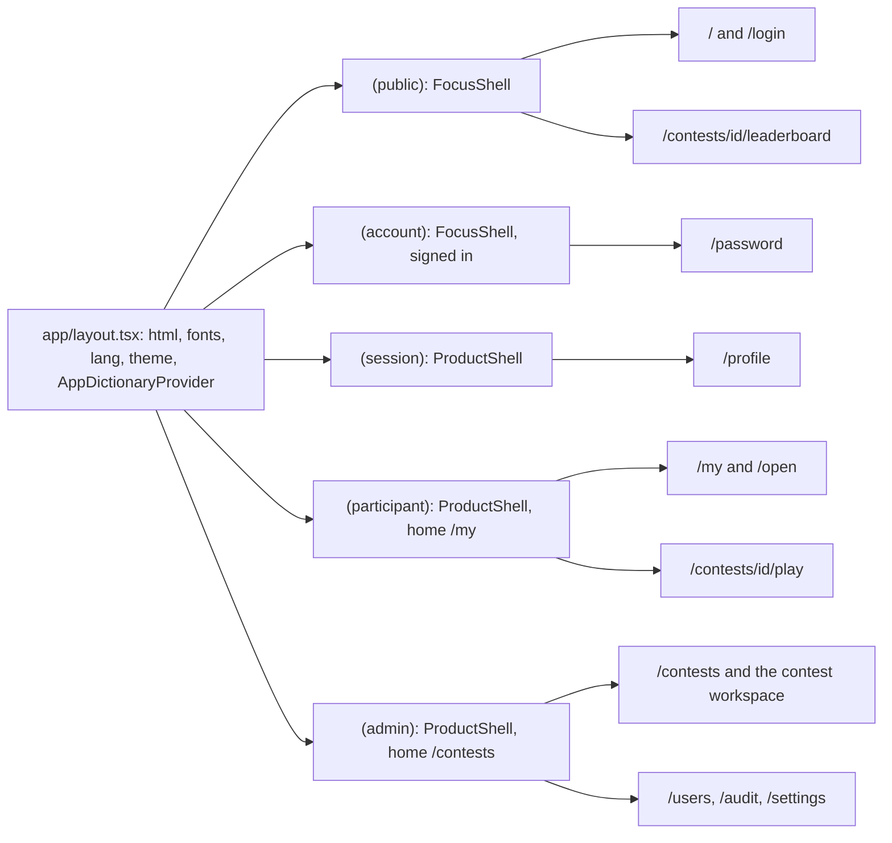
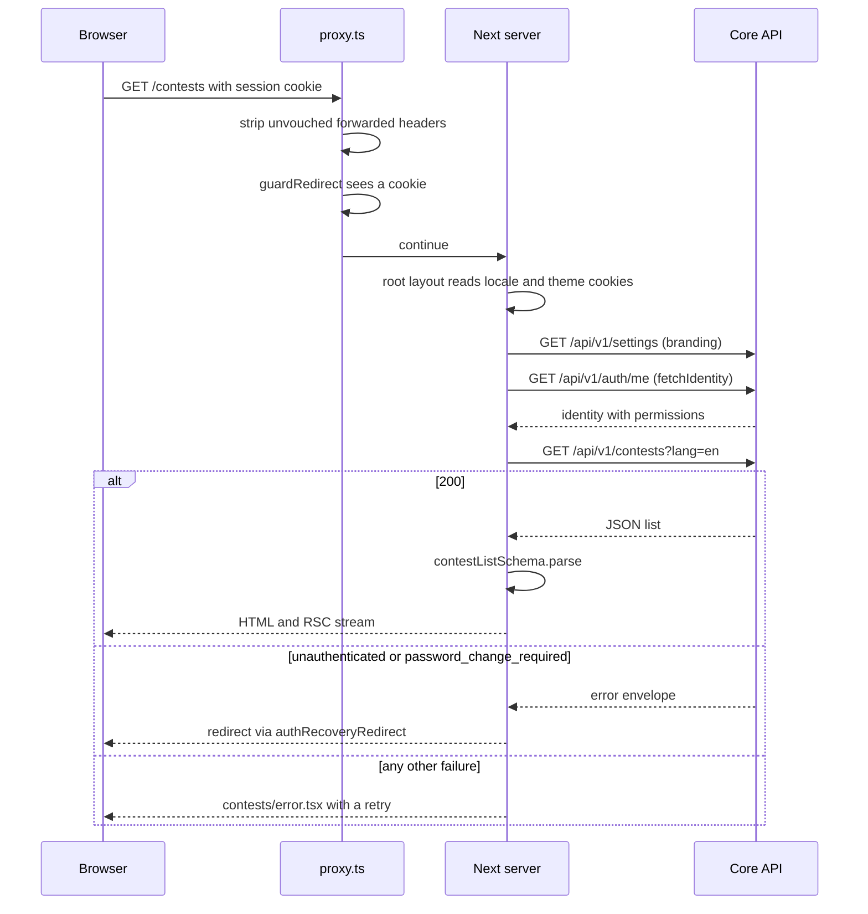
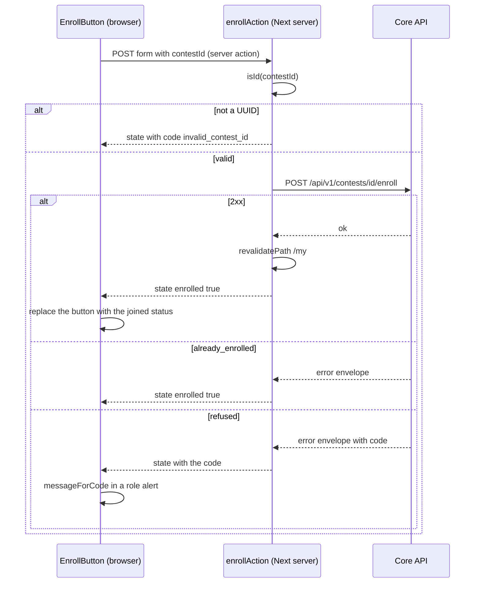
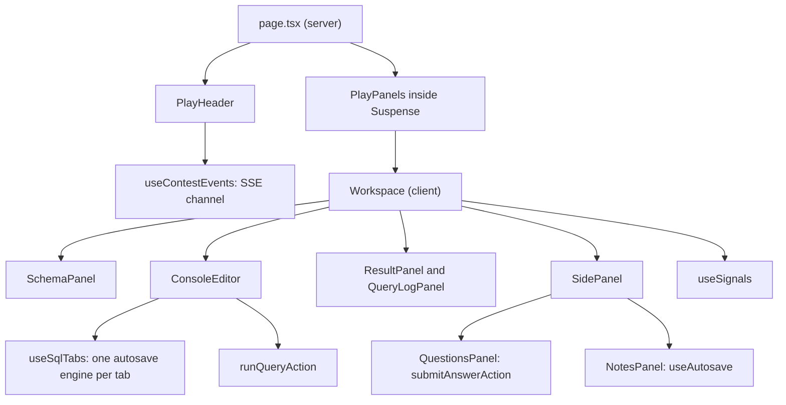

# 5. The frontend

This chapter is for a developer about to change the interface in `frontend/`.
It explains how the app is shaped, how a page gets its data and sends its
changes, where text and error messages come from, how the design system is
enforced, and how the play screen fits together. It ends with recipes.

The code map is [`frontend/README.md`](../../frontend/README.md). Read its
sections "The map", "Which direction things point" and "Where does a new thing
go?" first. This chapter builds on them and does not repeat them. Domain words
such as *registration*, *game instance* or *play screen* are defined in the
[glossary](01-overview.md#the-glossary).

The stack is Next.js 16 (App Router), React 19, Tailwind v4, TypeScript and
zod. Next.js 16 differs from older versions you may know: middleware is now
called **proxy** (`proxy.ts`), and route types such as `PageProps` are
generated. When you are unsure how a Next mechanism behaves, read the docs
that ship with the installed version in `frontend/node_modules/next/dist/docs/`
(see [`frontend/AGENTS.md`](../../frontend/AGENTS.md)).

## Contents

1. [The shape of the app](#1-the-shape-of-the-app)
2. [How a page gets its data](#2-how-a-page-gets-its-data)
3. [How a change is sent: server actions](#3-how-a-change-is-sent-server-actions)
4. [Text, languages and error messages](#4-text-languages-and-error-messages)
5. [The design system in practice](#5-the-design-system-in-practice)
6. [The play screen](#6-the-play-screen)
7. [Recipes](#7-recipes)
8. [Testing](#8-testing)
9. [Gotchas](#9-gotchas)

## 1. The shape of the app

### Route groups

Everything under `frontend/app/` is a route. A folder in parentheses is a
**route group**: it does not appear in the URL, but it gives every page inside
it the same layout. The app has five groups, one per audience.

| Group | Who it serves | Routes | Shell |
|---|---|---|---|
| `(public)` | anyone, signed in or not | `/`, `/login`, `/contests/[contestId]/leaderboard` | `FocusShell` |
| `(account)` | a signed-in account that must change its one-time password | `/password` | `FocusShell` with `signedIn` |
| `(session)` | any signed-in account, participant or staff | `/profile`, `/profile/contests/[contestId]` | `ProductShell`, no navigation |
| `(participant)` | participants | `/my`, `/open`, `/contests/[contestId]/play` | `ProductShell`, home is `/my` |
| `(admin)` | contest authors and administrators | `/contests`, `/contests/new`, `/contests/[contestId]/…`, `/users`, `/users/[userId]`, `/audit`, `/settings` | `ProductShell`, home is `/contests` |

Two routes are Route Handlers rather than pages: `/healthz`, the container's
liveness probe, outside every group
([`app/healthz/route.ts`](../../frontend/app/healthz/route.ts)), and the play
screen's Markdown download inside the participant group
(`app/(participant)/contests/[contestId]/play/story.md/route.ts`).

Note that `/contests/[contestId]/…` exists in three groups: the staff
contest screens under `(admin)`, the play screen under `(participant)` and the public
table under `(public)`. Pick the group by audience, not by URL.

- The root layout is [`app/layout.tsx`](../../frontend/app/layout.tsx). It
  resolves the locale, the dictionary and the theme from cookies before the
  first byte, so there is no flash of the wrong theme or language.
- Each group's layout is its `layout.tsx`:
  [`(public)`](../../frontend/app/(public)/layout.tsx),
  [`(account)`](../../frontend/app/(account)/layout.tsx),
  [`(session)`](../../frontend/app/(session)/layout.tsx),
  [`(participant)`](../../frontend/app/(participant)/layout.tsx),
  [`(admin)`](../../frontend/app/(admin)/layout.tsx).
- The shells live in `components/layout/`: `focus-shell.tsx` (a bare frame for
  signing in) and `product-shell.tsx` (app bar, navigation, account chip).
- Each group has its own `not-found.tsx`, so a 404 inside a group keeps one
  header instead of stacking a second.

The `(admin)` layout builds its navigation from the permissions `/auth/me`
returns: `/users` appears only with `users.manage`, `/audit` with
`audit.view`, `/settings` with `settings.manage`. A role that gains a
permission as data gets the link with no code change.

### How access is enforced

Three layers, from the edge inward:

1. **`proxy.ts`** ([`frontend/proxy.ts`](../../frontend/proxy.ts)) runs on
   every request except static assets. Next 16 runs proxy on Node. It first
   removes forwarded-address headers the reverse proxy did not vouch for
   (section 2 explains why). Then, for any path not under `/api/`, it calls
   `guardRedirect` from [`lib/auth/guard.ts`](../../frontend/lib/auth/guard.ts).
2. **`guardRedirect`** decides from the path and whether the
   `dbcontest_session` cookie exists. The cookie is httpOnly and opaque here,
   so this check knows only that a cookie is present, not whether it is
   valid. Paths reachable without a cookie are listed in `guard.ts`:
   `PUBLIC_PATHS` (`/` and `/login`), `PUBLIC_EXACT` (`/healthz`) and
   `PUBLIC_PATTERNS` (a contest's leaderboard). Everything else redirects to
   `/login?next=<path and query>`.
3. **The Core API** decides everything else. A page that reads the API and
   gets `unauthenticated` (a stale cookie) or `password_change_required`
   passes the error to `authRecoveryRedirect` (same file), which redirects to
   sign-in or to `/password`. `forbidden` is not redirected: the account is
   signed in, and signing in again would not help. Screens that load one
   contest answer `forbidden` as not found (see `loadContest` in
   `app/(admin)/contests/[contestId]/contest.ts`).

The server-side identity check is `fetchIdentity()` in
[`lib/auth/session.ts`](../../frontend/lib/auth/session.ts). It calls
`GET /api/v1/auth/me` with the session cookie and is wrapped in React's
`cache()`, so the layouts and the page of one request share a single round
trip. It returns `null` when there is no cookie or the API answers 401, and
throws `IdentityUnavailableError` on
any other failure, so an API restart does not look like a sign-out. Layouts
that only decorate (`(admin)`, `(participant)`) swallow that error; the
`(session)` layout redirects to sign-in on `null`.

The frontend never decides what an account may do. It hides links the account
cannot use, and the API refuses what it may not do.

## 2. How a page gets its data

### Server components call the API through `lib/api`

Pages are Server Components by default. They read the Core API on the server
and pass plain values to Client Components. The transport lives in
[`lib/api/`](../../frontend/lib/api/):

| File | Role |
|---|---|
| [`client.ts`](../../frontend/lib/api/client.ts) | `request(path, options)`: the framework-free transport. Prefixes `/api/v1`, serialises `body` as JSON, returns `undefined` for 204, and turns any failing response into an `ApiError` with `code`, `status`, `requestId`, and optional `subject`, `position` and `retryAfterSeconds`. A non-JSON failure (a gateway's HTML page) becomes code `unreachable`. |
| [`server.ts`](../../frontend/lib/api/server.ts) | `serverRequest(path, options)`: `request` with the API's private origin (`apiOrigin()`), the forwarded headers and the session cookie added. Use it from Server Components, server actions and Route Handlers. |
| [`caller.ts`](../../frontend/lib/api/caller.ts) | `callerHeaders()`: binds `forwardedHeaders` to the current Next request. |
| [`forwarded.ts`](../../frontend/lib/api/forwarded.ts) | Decides which client headers may be passed on to the API. |
| [`config.ts`](../../frontend/lib/api/config.ts) | `apiOrigin()` reads `API_ORIGIN` (falls back to `http://localhost:8080` only outside production) and `ingressSecret()` reads `INGRESS_SECRET`. |
| `ids.ts` | `isId(value)`: whether a value is a UUID and safe to put into a request path. |
| `<area>.ts` | zod schemas for one area of the API (`contests.ts`, `play.ts`, `workspace.ts`, …) and, in some modules, the functions that call it. |
| `<area>-terms.ts` | Constants and small helpers from the same area, with no zod. |

**Why `forwarded.ts` exists.** Every request the API sees comes from the Next
server, so without help the API's login throttle, a contest's network
restriction and the audit trail would all see the Next server's address. The
Next server therefore passes `X-Forwarded-For` (and the user agent) on, but
only when the request carries the `x-ingress-secret` header that Caddy adds
with the shared `INGRESS_SECRET`. Without that proof the address is the
browser's own claim and is dropped. `proxy.ts` strips unvouched forwarded
headers on every path, including `/api/*`, which the `next.config.ts`
rewrite forwards to the API when no reverse proxy is in front. The trust rule
on the API side is CLAUDE.md, security rule 9.

**Why responses are parsed with zod.** Each area module declares a schema that
parses the API's snake_case JSON and transforms it to camelCase once. A
changed contract fails at the boundary with a field name instead of
surfacing as `undefined` three components later. `contestSummarySchema` in
[`contests.ts`](../../frontend/lib/api/contests.ts) is a typical one.

**Why `*-terms.ts` files exist.** A schema module calls `z.object()` when it
loads, so a bundler cannot drop it. A Client Component that imports one
constant array from `contests.ts` would ship all of zod (about 280 KB) to the
browser. The vocabulary (enum arrays, tone maps, page sizes) lives in
`contests-terms.ts`, `content-terms.ts`, `querylog-terms.ts` and the like; the
schema modules import from there, so each term is defined once. The reason is
written down in [`content-terms.ts`](../../frontend/lib/api/content-terms.ts).

### A server-rendered page, traced

The contest register at `/contests`
([`app/(admin)/contests/page.tsx`](../../frontend/app/(admin)/contests/page.tsx))
is a typical read.

- `proxy.ts` and `lib/auth/guard.ts` run first. Without a cookie the browser
  would be redirected to `/login?next=%2Fcontests` here.
- `app/(admin)/layout.tsx` reads branding (`lib/api/branding.ts`) and the
  identity in one `Promise.all`; the identity decides the navigation links.
  The diagram draws the two reads one after the other for readability.
- The page calls `serverRequest` from `lib/api/server.ts`, which adds
  `callerHeaders()` and `sessionHeader()` to the request.
- On failure the page's `.catch` calls `authRecoveryRedirect`; anything else
  is rethrown and lands in
  [`app/(admin)/contests/error.tsx`](../../frontend/app/(admin)/contests/error.tsx).
  In production Next reduces a Server Component error to a digest, so the
  error boundary cannot see the API code. Handle the codes that matter in the
  page, before rethrowing.
- The page asks for contest text in the interface language (`lang=<locale>`),
  so a page never mixes two languages.

### Browser-side reads and writes

Most data flows through the Next server. A few calls go from the browser
straight to the API, same-origin through `/api/v1` (Caddy in production, the
`next.config.ts` rewrite otherwise), using `request(path, { credentials:
"same-origin" })` from `client.ts`:

- the play screen's autosave of notes and SQL tabs and its browser signals
  (`lib/api/workspace.ts`), because the last save must leave as a `keepalive`
  fetch while the page closes, which a server action cannot do;
- the live monitoring reads (`lib/api/monitor.ts`) and the profile's query
  pages (`lib/api/profile.ts`);
- the game database's chunked upload
  (`app/(admin)/contests/[contestId]/game/game-upload.tsx`), streamed from the
  file as a `rawBody` `Blob` without passing through the Next server;
- the play screen's Server-Sent Events channel (section 6).

There are no `NEXT_PUBLIC_` variables. The browser never needs the API's
address, because the API shares the page's origin.

## 3. How a change is sent: server actions

A mutation is a **server action**: an `async` function in a file marked
`"use server"`, conventionally the route's own `actions.ts`. A Client
Component binds it to a `<form>` with React's `useActionState`. The action
runs on the Next server, calls the API with `serverRequest`, and returns a
small state object, usually `{ code?: string }`. It never returns the API's
English message.

Patterns an action must follow:

- **Validate ids before they reach a path.** Form fields are forgeable, and
  `fetch` resolves `..`, so `/contests/${id}/enroll` could address a different
  endpoint. Use `isId` from `lib/api/ids.ts`. Every action file that builds a
  path from an id does this except the play screen's
  (`app/(participant)/contests/[contestId]/play/actions.ts`), whose actions put
  `contestId` and `questionId` into the path unchecked today. That is a known
  gap; do not copy it.
- **Return a code, not text.** `failureCode(error)` from `client.ts` gives the
  API's code, or `unreachable` when the API never answered.
- **Revalidate what changed** with `revalidatePath`, then return, or
  `redirect()` to the next screen. `redirect()` throws, so keep it outside any
  `try`/`catch`.
- **The form shows the sentence.** The Client Component maps the code with
  `messageForCode(state.code, dict.errors)` and renders it in a
  `role="alert"` element.

### A form submitted through a server action, traced

Joining a contest from the participant's register: the button is
[`app/(participant)/my/enroll-button.tsx`](../../frontend/app/(participant)/my/enroll-button.tsx),
the action is
[`app/(participant)/my/actions.ts`](../../frontend/app/(participant)/my/actions.ts).

- `useActionState(enrollAction, {})` gives the button its `state`, the bound
  `formAction` and `pending`, which disables the button while the request is
  in flight.
- `enrollAction` treats `already_enrolled` as success, without revalidating:
  a double click or a stale list both mean the account got what it asked for.
- The API decides the contest's own rules (closed enrolment, deadline,
  network). The action cannot check the network itself: only the trusted
  proxy knows the address that counts.
- A submission made before hydration is queued and sent once the page
  hydrates (Next docs, `07-mutating-data.md`, on forms in Client Components).

The Next client dispatches server actions one at a time (see
`node_modules/next/dist/docs/01-app/01-getting-started/07-mutating-data.md`).
That is why the play screen's autosave bypasses them: an autosave queued behind
a running query would wait for it.

## 4. Text, languages and error messages

### The dictionaries

Every user-visible string lives in a dictionary in
[`lib/i18n/dictionaries/`](../../frontend/lib/i18n/dictionaries/): `en.ts`,
`ro.ts` and `ru.ts`. The locales are declared in
[`lib/i18n/config.ts`](../../frontend/lib/i18n/config.ts) (`LOCALES`,
`DEFAULT_LOCALE = "en"`).

`en.ts` is the source. Its shape, widened to plain strings, is the exported
`Dictionary` type, and `ro.ts` and `ru.ts` end with `satisfies Dictionary`. A
key added to `en.ts` and missing from another locale is a type error.
`lib/i18n/dictionary.test.ts` also checks that every locale carries every key,
and that audit actions, publish-gate problems and login-failure reasons have
a translation everywhere.

The rule: **user-visible text lives only in the dictionaries, in every
locale.** Components take a `dict` (or a slice of one) as a prop and hold no
strings of their own. A URL may select a sentence (the sign-in page's
`?changed=1`) but never supply text. The repository's language rule is
CLAUDE.md, general rule 3: code is English, interface text exists in every
locale.

### How a string is looked up

The language comes from one place, the `dbcontest_locale` cookie. There is no
`Accept-Language` negotiation and no locale in the URL; an unknown value reads
as `en` (`lib/i18n/locale.ts`). The language switcher posts to the
`chooseLocale` server action in `components/layout/locale-actions.ts`, which
sets the cookie and revalidates the layout.

- **On the server**, call `activeLocale()` and `activeDictionary()` from
  [`lib/i18n/server.ts`](../../frontend/lib/i18n/server.ts). The dictionary is
  loaded on demand per locale (`lib/i18n/dictionary.ts`), so a page ships only
  its own language. Pass what the component needs as a prop.
- **On the client**, prefer the prop. A client boundary that cannot receive
  props, chiefly `error.tsx`, reads a **dictionary scope** from context:
  `AppDictionary.use()`, `ParticipantDictionary.use()`,
  `SessionDictionary.use()` or `AdminDictionary.use()` from
  [`lib/i18n/client.tsx`](../../frontend/lib/i18n/client.tsx). Each group's
  layout provides its scope.

A scope carries only some sections of the dictionary, listed in
[`lib/i18n/scopes.ts`](../../frontend/lib/i18n/scopes.ts): `APP_SECTIONS` is
`screens`, `PARTICIPANT_SECTIONS` is `participant`, `SESSION_SECTIONS` is
`profile` and `participant`, `ADMIN_SECTIONS` is `contests`, `accounts`,
`audit` and `settings`. Everything handed to a Client Component is serialised
into the page payload, and the whole dictionary was about half of the play
route's payload. Reading a section the scope does not carry does not compile.
The play screen narrows further with its own `PlayDictionary` (section 6).

Placeholders are plain tokens replaced at the call site, for example
`t.startsAt.replace("{time}", startsAt)`.

### From an API error code to a sentence

The API answers a failure with a machine code (`error.code`) and an English
message for developers. The interface shows only its own sentence for the
code:

1. `request()` turns the response into an `ApiError` carrying `code`.
2. The page or action passes the code on (an action returns `{ code }`).
3. The component calls `messageForCode(code, dict.errors)` from
   [`lib/i18n/errors.ts`](../../frontend/lib/i18n/errors.ts). It looks the code
   up in the dictionary's `errors` section and falls back to
   `errors.fallback` for a code this build does not know.

The API publishes its codes as data in
[`docs/api/error-codes.json`](../../docs/api/error-codes.json), generated from
the Go declarations by `make api-contract`. `npm run error-codes`
([`scripts/error-codes.mjs`](../../frontend/scripts/error-codes.mjs)) compares
that file with the `errors` section of every dictionary. It fails on a code
the API returns and a locale lacks (`missing`), and on a code a locale still
translates that the API no longer returns (`unused`). Three codes are invented
by the frontend and exempt: `fallback`, `unreachable` and `password_mismatch`.
How a code is declared on the Go side is in [04-backend.md](04-backend.md)
and CLAUDE.md, security rule 1.

## 5. The design system in practice

The visual specification is [`docs/design/SPEC.md`](../../docs/design/SPEC.md).
This section covers how the code holds to it.

**Tokens.** [`styles/tokens.css`](../../frontend/styles/tokens.css) is the
only place a colour, a control size (`--control-h`), a duration or a radius is
written. The light theme is on `:root`. The dark theme redefines the semantic
tokens twice: under `:root[data-theme="dark"]` (the visitor chose dark) and
under `prefers-color-scheme: dark` (the visitor follows the system).
[`app/globals.css`](../../frontend/app/globals.css) imports the tokens and maps
them to Tailwind utilities in its `@theme` blocks. The type scale (the size,
line height, tracking and weight of each step) is written there, in `@theme`,
not in `tokens.css`. `globals.css` also erases Tailwind's stock `--text-*`,
`--radius-*` and `--tracking-*` scales, so only the project's steps exist
(`text-display`, `text-h2`, `text-body`, `text-small`, `text-label`,
`text-data`, …). There are no `dark:` utilities: switching theme swaps
variables.

**Three component folders.**

| Folder | What goes there | Examples |
|---|---|---|
| `components/ui/` | Primitives with no domain knowledge. Classes are merged with `cn()` from `lib/utils.ts`; variants are declared with `class-variance-authority` where a primitive has them (`button.tsx`, `tag.tsx`). Sizes come from `--control-h`, colours from tokens. | `button.tsx`, `input.tsx`, `field.tsx`, `tag.tsx`, `tabs.tsx`, `dialog.tsx`, `combobox.tsx` |
| `components/product/` | Domain components used by more than one route. | `state-view.tsx`, `standings.tsx`, `code-editor.tsx`, `query-row.tsx`, `export-menu.tsx` |
| `components/layout/` | The frame the whole app wears. | `band.tsx`, `app-bar.tsx`, `product-shell.tsx`, `focus-shell.tsx`, `language-switcher.tsx`, `theme-toggle.tsx` |

`StateView` (`components/product/state-view.tsx`) is the shared renderer for
the spec's states: `empty`, `empty-filtered`, `error-recoverable`,
`error-terminal` and `blocked`. Its type makes the rules hold: a filtered
empty state requires a reset link, a recoverable error requires a retry.

**ESLint design-system rules.** [`eslint.config.mjs`](../../frontend/eslint.config.mjs)
adds one `no-restricted-syntax` rule with three patterns, checked in string
literals and template literals:

- no arbitrary colour (`bg-[#…]`, `text-[rgb(…)]` and the like);
- no arbitrary type (`text-[…]`, `tracking-[…]`, `leading-[…]`);
- no `font-bold`, `font-extrabold` or `font-black`: the system has no weight
  700, and `font-semibold` is the ceiling.

**The checks behind them.**

| Command | What it proves |
|---|---|
| `npm run lint` | the three rules above, plus Next's own lint set |
| `npm run contrast` | every token pair listed in `scripts/contrast.mjs` meets its WCAG threshold (4.5:1 for text, 3:1 for control edges), in both themes |
| `npm run type-scale` | every `text-*` class names a real type step or colour; an unknown step would otherwise emit no CSS and fail silently |
| `lib/design/tokens.test.ts` (in `npm test`) | every colour class used in `app/` and `components/` exists in `globals.css` |

## 6. The play screen

`app/(participant)/contests/[contestId]/play/` is the participant's olympiad
screen and the most involved area of the frontend. Hundreds of participants
open it in the same minute, so much of its code is about payload size, request
budgets and surviving a closed tab.

### The parts

| File | What it is |
|---|---|
| `page.tsx` | Server Component. Finds the contest in the participant's enrolled listing, shows a waiting room for `published`, "not available" for other non-running statuses, and for `running` reads story, questions, query log, schema and workspace in parallel (`Promise.allSettled`). |
| `dictionary.ts` | `PlayDictionary`: the `participant`, `errors` and `leaderboard` sections only. |
| `play-header.tsx` | Title, clock and panel toggles. The only place that opens the events channel. Rendered outside `<Suspense>` so it streams before the slow reads. |
| `workspace.tsx` | The full-screen grid: schema panel, console, bottom panel (Result and Query log tabs), side panel. Here "workspace" names the screen's layout; the server-side *workspace* in the glossary is the participant's notes and SQL tabs. |
| `console.tsx` | The SQL editor (`components/product/code-editor.tsx`, CodeMirror), the SQL tab strip and the Run button, bound to `runQueryAction`. |
| `sql-tabs.tsx`, `use-sql-tabs.ts` | The tab strip (draws only) and its state: which tabs exist, which is open, one autosave engine per tab. |
| `result-panel.tsx`, `row-detail.tsx` | The last query's result or refusal; one row opened in full. |
| `query-log-panel.tsx` | Every statement this participant ran, paged by `QUERY_LOG_PAGE_SIZE`. |
| `side-panel.tsx` | Tabs for story, questions, notes and leaderboard; the story's Markdown and print exports. |
| `questions-panel.tsx` | The questions (rendered to HTML on the server) and one answer form each, bound to `submitAnswerAction`. |
| `notes-panel.tsx` | One self-saving notes field. |
| `schema-panel.tsx` | Tables, columns, types and foreign keys. Absent when the organiser hides the schema. |
| `panel-toggles.tsx`, `pane-splitter.tsx` | Collapsible panels with keyboard shortcuts; draggable, remembered pane sizes. |
| `use-autosave.ts` | The autosave engine for notes and SQL tabs. |
| `use-contest-events.ts` | The Server-Sent Events channel and the corrected clock. |
| `use-signals.ts` | Page-left and paste signals reported to the organiser. |
| `refusals.ts` | What each refusal code means for this screen. |
| `content-loaded.tsx` | Tells the header, across the Suspense boundary, whether the workspace or a refusal rendered. |
| `actions.ts` | Server actions: run a query, submit an answer, refresh questions, page the query log, read the standings. |
| `story.md/route.ts` | Route Handler: the story as a Markdown download. |
| `print-view.tsx`, `story-cover.tsx`, `skeleton.tsx`, `reload-link.tsx`, `loading.tsx` | Print copy, cover picture, loading skeleton, rate-limit reload button. |

The deeper rationale is in docs/ARCHITECTURE.md: the workspace in
[§6.4](../ARCHITECTURE.md#64-a-participants-workspace-notes-and-sql-tabs), the
clock in [§8](../ARCHITECTURE.md#8-the-contest-clock), signals and monitoring
in [§9.4](../ARCHITECTURE.md#94-watching-a-participant).

### Queries and answers go through server actions

`runQueryAction` and `submitAnswerAction` in `actions.ts` return a
discriminated union (`idle`, `answer` or `refused` with `code`, `subject`,
`requestId` and, for a syntax error, `position`). A union keeps stale rows from
being shown next to a refusal. The editor's form stays mounted outside every
tab; the result goes to `ResultPanel` through the workspace.

### Autosave

Notes and SQL tabs save without a button. The browser writes directly to the
API (`saveNotes`, `updateTab` in `lib/api/workspace.ts`), not through server
actions. `AutosaveEngine` in `use-autosave.ts`:

- saves 1.5 s after the last edit, and at least every 10 s while typing;
- saves at once when the editor loses focus, and as a `keepalive` request
  when the tab is hidden, on `pagehide` and on unmount;
- never sends text equal to what the server last confirmed, and keeps at most
  one request in flight per document;
- retries network and 5xx failures with backoff, waits out a 429's
  `Retry-After`, does not retry a 4xx until the text changes, and stops for
  good when the contest has closed for the participant;
- keeps unconfirmed text as a draft in `localStorage`, keyed by account,
  contest and document. Lab machines are shared, so `purgeForeignDrafts`
  removes other accounts' drafts when the screen mounts.

### The events channel

`useContestEvents` opens one `EventSource` to
`/api/v1/contests/{id}/events` and listens for `sync`, `contest_started` and
`contest_finished`. `sync` carries the server's time and the participant's
deadline, from which the clock is corrected; the browser clock is never
trusted on its own. The waiting room reloads into the workspace on
`contest_started`.

A non-200 response closes an `EventSource` for good, which would freeze the
clock silently. The hook then probes the same URL with `fetch` to learn the
refusal code, shows it, and reconnects after a delay that doubles from 5 s to
a 60 s ceiling, plus up to 50% random spread. It does not reconnect after a
refusal that cannot clear on a timer (`excluded` or `elsewhere`). Every reconnect spends the request
budget the channel shares with the SQL console, which is why the backoff
never stays at its floor.

### Refusals

[`refusals.ts`](../../frontend/app/(participant)/contests/[contestId]/play/refusals.ts)
maps a refusal code to what it means for this screen, so every part (the
page, autosave, signals, the channel) reads the same meaning and decides its
own reaction.

| Kind | Meaning | Codes |
|---|---|---|
| `closed` | over for this participant, nothing is accepted again | `contest_finished`, `contest_ended`, `deadline_passed` |
| `dormant` | not open now, may open later | `contest_not_running` |
| `excluded` | not taking part | `not_a_participant` |
| `elsewhere` | outside the contest's network | `address_not_allowed` |
| `passing` | lifts by itself shortly | `query_too_often`, `query_busy`, `query_already_running`, `no_game_yet`, `answer_too_often`, `attempt_conflict` |
| `fault` | our failure; with a code the dictionary has no sentence for, the only case that shows a request reference (`showsReference`) | `internal_error`, `query_service_down`, `game_cluster_full`, `unreachable` |
| `refused` | every other code; the dictionary sentence says what to change | (unlisted) |

`page.tsx` uses it to decide whether a refusal takes the whole screen
(`takesTheScreen`). `refusals.test.ts` checks that every code named here is one
the API declares.

## 7. Recipes

Each recipe ends with the check that proves it. Run `make front-check` from
the repository root before opening a pull request; it runs everything CI runs
except the smoke test.

### Add a page

Modelled on `/contests` (`app/(admin)/contests/page.tsx`).

1. Choose the group by audience (section 1) and create
   `frontend/app/(<group>)/<segment>/page.tsx`. The group's layout gives it
   the shell.
2. Make it an `async` Server Component typed with the generated
   `PageProps<"/<segment>">` (no import needed). Export `generateMetadata` that
   reads the title from `activeDictionary()`.
3. Read data with `serverRequest` and parse it with the area's schema. In the
   `.catch`, call `authRecoveryRedirect(error, here)` and `redirect` when it
   returns a target; rethrow anything else. A rethrown `forbidden` reaches the
   error boundary, whose retry cannot succeed; when the page is about one
   resource, answer it with `notFound()` as `loadContest` does.
4. Pass `dict` and plain values to Client Components. Add strings as in
   "Add a UI string".
5. Add `loading.tsx` if the wait is visible, and `error.tsx` (a Client
   Component reading the group's dictionary scope and rendering `StateView`
   with `error-recoverable`) if the section's failure differs from the root's.
   Only `(admin)`, `(participant)` and `(session)` provide a scope of their
   own; in `(public)` and `(account)` use `AppDictionary` (section `screens`).
   If the boundary's strings are in a section the scope does not list, add the
   section to that scope in `lib/i18n/scopes.ts`.
6. If the page needs no session, add its path to `PUBLIC_PATHS`,
   `PUBLIC_EXACT` or `PUBLIC_PATTERNS` in `lib/auth/guard.ts`, with a case in
   `lib/auth/guard.test.ts`. Placing it in `(public)` alone is not enough: the
   guard decides by path, not by group.
7. For a staff page with a navigation entry, add it to `destinations` in
   `app/(admin)/layout.tsx`, gated on the permission the API checks.

Check: `npm run typecheck` (it generates `PageProps` for the new route
first), `npm test`, then `make front` and open the page signed out and signed
in. Then `make front-check`.

### Add an API module with its schema and tests

Modelled on `lib/api/play.ts` and `lib/api/play.test.ts`.

1. Create `frontend/lib/api/<area>.ts`. Declare each response as a
   `z.object` of the wire's snake_case fields with a `.transform` to
   camelCase, and export `type X = z.infer<typeof xSchema>`.
2. Mirror server-side limits as named constants with a comment naming the Go
   constant (see `NOTES_MAX_CHARS` in `workspace.ts`).
3. Put enum arrays and constants a Client Component needs into
   `<area>-terms.ts`, and import them into the schema module.
4. Call it from a page or action as `xSchema.parse(await serverRequest(path))`.
   For a browser-side call, wrap `request(path, { ...options, credentials:
   "same-origin" })` as `workspace.ts` does. A browser wrapper in a schema
   module puts zod in that route's bundle. That is acceptable where the route
   already ships it (the play screen does, as `workspace.ts` notes); otherwise
   keep the wrapper in a module without zod.
5. Write `lib/api/<area>.test.ts`: parse a realistic payload and assert the
   camelCase result; assert how optional and nullable fields read (see
   "reads an omitted attempt count as no limit, not as zero" in
   `play.test.ts`).

Check: `npm test -- lib/api/<area>` and `npm run typecheck`, then
`make front-check`.

### Add a UI string in every locale

1. Add the key to the right section of
   `frontend/lib/i18n/dictionaries/en.ts`. Name form text `hint` (stays under
   the field) or `help` (behind a "?"), as the comment at the top of `en.ts`
   explains.
2. Add the same key to `ro.ts` and `ru.ts` with real translations.
3. Read it as `dict.<section>.<key>` from the prop. If a client boundary reads
   it from a scope, make sure the section is in that scope's list in
   `lib/i18n/scopes.ts`. On the play screen, add the section to both the
   `PlayDictionary` type and the `playDictionary()` function in
   `play/dictionary.ts`.

Check: `npm run typecheck` fails until all three locales have the key;
`npm test` runs `lib/i18n/dictionary.test.ts`. Then `make front-check`.

### Add the message for a new API error code

1. The backend declares the code (see [04-backend.md](04-backend.md)) and
   regenerates the contract with `make api-contract`, which rewrites
   `docs/api/error-codes.json`.
2. Run `npm run error-codes` in `frontend/`. It lists the code as `missing`
   in each locale.
3. Add the code to the `errors` section of `en.ts`, `ro.ts` and `ru.ts`. The
   sentence says what happened and, where it can, what to do next.
4. If the play screen should treat it as more than an ordinary refusal, add it
   to `KINDS` in `play/refusals.ts`, and a row in the `refusalKind` table in
   `refusals.test.ts`.
5. If one form handles the code specially (as `sign-in-form.tsx` does for
   `sign_in_busy`), add a component test that asserts the rendered sentence.

Check: `npm run error-codes` prints that every code has a message in all
three locales; `npm test` covers `refusals.test.ts`. Then `make front-check`.

### Add a server action with a form

Modelled on `app/(participant)/my/actions.ts` and `enroll-button.tsx`, with
tests like `app/(admin)/contests/[contestId]/people/actions.test.ts`.

1. In the route folder, create or extend `actions.ts` starting with
   `"use server"`. Export a state type (`{ code?: string; … }`) and an
   `async function xAction(previous: XState, form: FormData): Promise<XState>`.
2. Read fields from `form`. Validate every id with `isId` and every enum with
   `enumFromForm` (from `lib/api/contests.ts`) before building a path or body.
   A local refusal returns a code the API already declares
   (`invalid_contest_id`, `invalid_user_id`, … in `docs/api/error-codes.json`).
   A code only the frontend uses must also be added to `CLIENT_ONLY` in
   `scripts/error-codes.mjs`: untranslated it shows the fallback sentence, and
   translated it is reported as `unused`.
3. Call `serverRequest`. On failure return `{ code: failureCode(error) }`. On
   success call `revalidatePath` for what changed, then return or
   `redirect()` outside any `try`/`catch`.
4. In a `"use client"` component, call
   `useActionState<XState, FormData>(xAction, {})`, render
   `<form action={formAction}>`, disable the submit button while `pending`, and
   show `messageForCode(state.code, dict.errors)` in a `role="alert"` element.
5. Test the action in `actions.test.ts` with `vi.mock("@/lib/api/server")`
   and `vi.mock("next/cache")`, plus `next/navigation` if it redirects and
   `@/lib/i18n/server` if it reads the locale (both import Next's request
   APIs). Assert the request it sends, the code it returns, and that an
   invalid id never reaches the server.
6. Test the component in its own `<component>.test.tsx` with
   `vi.mock("./actions")`, since the real action imports `next/headers` (see
   `sign-in-form.test.tsx`).

Check: `npm test` for both tests, `npm run error-codes` if a new code
appeared, then submit the form in `make front`. Then `make front-check`.

### Add a reusable UI component

Modelled on `components/ui/button.tsx` and `button.test.tsx`.

1. Decide the folder: no domain knowledge goes to `components/ui/`, domain
   knowledge used by two routes to `components/product/`, app chrome to
   `components/layout/`. A component one route uses stays in that route's
   folder.
2. Merge classes with `cn()` from `lib/utils.ts`, and declare variants with
   `cva` when the component has them. Take colours from token utilities (`bg-panel`, `text-ink-2`,
   `border-edge`), sizes from `--control-h`, type from the scale. Take text as
   props, never as literals.
3. If you need a new colour, add it to `styles/tokens.css` in `:root` and in
   both dark blocks, map it in the `@theme` block of `app/globals.css`, and
   add its pairs to `PAIRS` in `scripts/contrast.mjs`.
4. If you need a new type step, add it to the `@theme` block of
   `app/globals.css` and to the `font-size` list in `cn()` in `lib/utils.ts`.
   Without the second edit tailwind-merge reads the step as a colour and drops
   it beside a colour class, and no check catches that.
5. Write `<name>.test.tsx` beside it with Testing Library, querying by role
   and accessible name.

Check: `npm run lint`, `npm run type-scale`, `npm run contrast` (when a token
changed) and `npm test`. Then `make front-check`.

## 8. Testing

Tests use **Vitest** with **jsdom** and **Testing Library**
([`vitest.config.mts`](../../frontend/vitest.config.mts),
[`vitest.setup.ts`](../../frontend/vitest.setup.ts)). A test sits beside its
source: `foo.tsx` is tested by `foo.test.tsx`. The include list covers
`app/`, `lib/`, `components/`, `scripts/`, `proxy.test.ts` and
`next.config.test.ts`. Vitest globals are off, so import `describe`, `test`
and `expect` from `vitest`.

| Command | What it runs |
|---|---|
| `npm test` | every test once (`vitest run`) |
| `npm run test:watch` | Vitest in watch mode |
| `make front-check` | lint, contrast, type-scale, error-codes, typecheck, tests and build, as CI does |
| `npm run smoke` | serves the production build and requests `/login`; CI runs it after the build |

Common patterns: component tests load a real dictionary with
`getDictionary("en")` and assert the dictionary's sentence, not a literal;
server actions and `next/*` modules are replaced with `vi.mock` and
`vi.hoisted`. The full picture, including the backend, is in
[06-testing.md](06-testing.md).

## 9. Gotchas

These add to "Things worth knowing before changing them" in
[`frontend/README.md`](../../frontend/README.md).

- **`npm run typecheck` runs `next typegen` first.** `PageProps` and
  `LayoutProps` are generated into `.next/types`. A bare `tsc --noEmit` passes
  on a built tree and fails on a fresh checkout.
- **A group is not an access rule.** `proxy.ts` and `lib/auth/guard.ts` decide
  by path. A new page that must work signed out needs its path in `guard.ts`.
- **A Server Component cannot call a function exported from a `"use client"`
  module.** It gets a client reference and throws at render time. That is why
  `lib/i18n/scopes.ts` is not a client module and why `client.tsx` exports its
  providers at top level. jsdom does not enforce the boundary.
  `lib/i18n/scopes.test.ts` pins it for the dictionary scopes, and
  `npm run smoke` catches it on `/login` only. Open any other page you touched
  in `make front` (or `make front-start`) to see it. `make front-check` does
  not run smoke.
- **Every prop of a Client Component is serialised into the payload.** Pass a
  dictionary slice, not the whole `Dictionary`, where the payload matters (the
  play screen).
- **Importing a schema module into a Client Component ships zod.** Import
  constants from the `*-terms.ts` file instead.
- **The production error boundary sees only a digest.** Branch on the API code
  in the page or action, before the error reaches `error.tsx`.
- **`scripts/error-codes.mjs` reads the dictionary as text.** It reads every
  key indented by exactly four spaces after the first `errors:` in each file.
  Keep `errors` the only key with that name, the last section of the
  dictionary, and flat.
- **Removing a code on the Go side fails the check too.** The script reports
  translations the API no longer returns as `unused`; delete them from all
  three locales.
- **Format dates with `lib/format/datetime.ts`.** It formats in a fixed
  installation time zone (`DEFAULT_TIME_ZONE`), so a Server Component in a UTC
  container and the browser that hydrates it agree.
- **The environment has more than `API_ORIGIN`.** The Next server also reads
  `INGRESS_SECRET` (a production server refuses to start without a usable one,
  [`scripts/start.mjs`](../../frontend/scripts/start.mjs)) and `COOKIE_SECURE`
  (`lib/auth/cookie-policy.ts`). `make front-start` sets
  `COOKIE_SECURE=false` and `ALLOW_MISSING_INGRESS_SECRET=true` for you,
  because it serves over plain http with no Caddy in front.
